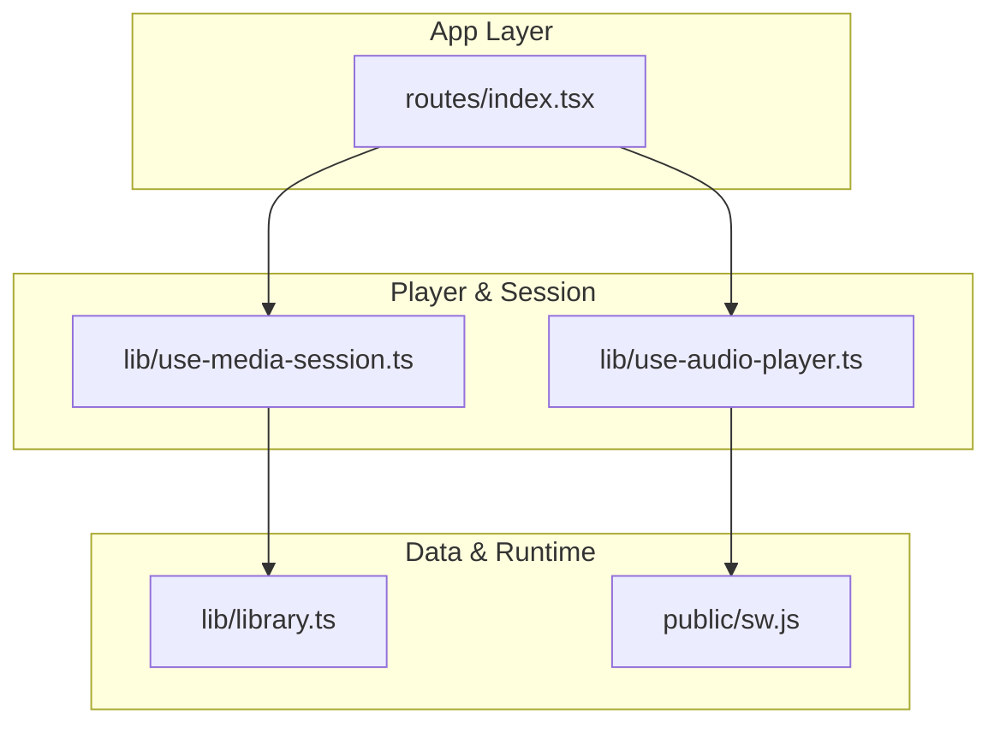
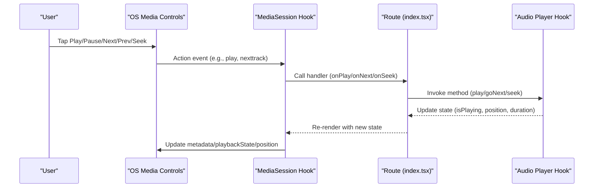
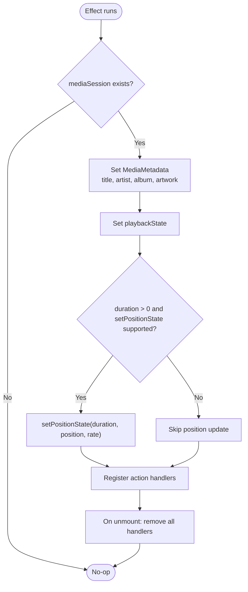
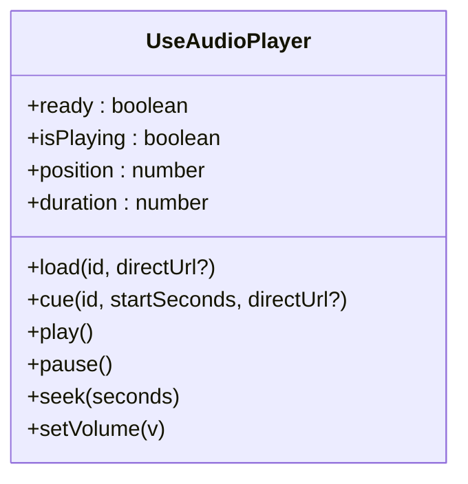
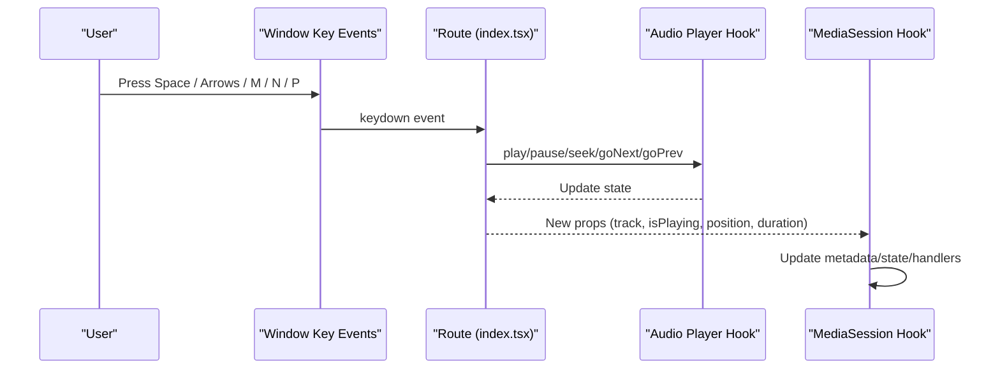
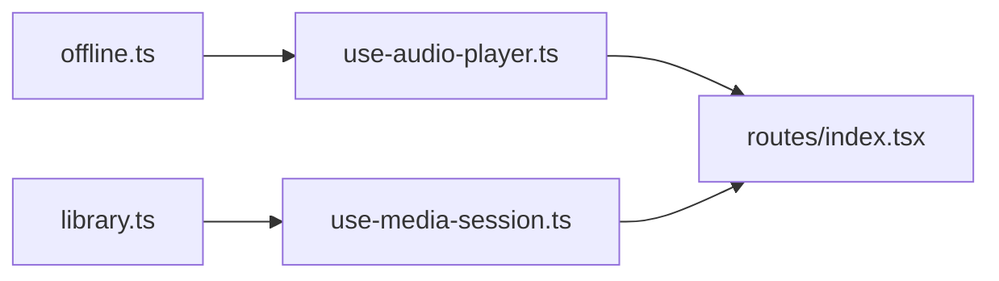

# Media Session Integration

<cite>
**Referenced Files in This Document**
- [use-media-session.ts](file://src/lib/use-media-session.ts)
- [use-audio-player.ts](file://src/lib/use-audio-player.ts)
- [index.tsx](file://src/routes/index.tsx)
- [library.ts](file://src/lib/library.ts)
- [sw.js](file://public/sw.js)
</cite>

## Table of Contents
1. [Introduction](#introduction)
2. [Project Structure](#project-structure)
3. [Core Components](#core-components)
4. [Architecture Overview](#architecture-overview)
5. [Detailed Component Analysis](#detailed-component-analysis)
6. [Dependency Analysis](#dependency-analysis)
7. [Performance Considerations](#performance-considerations)
8. [Troubleshooting Guide](#troubleshooting-guide)
9. [Conclusion](#conclusion)

## Introduction
This document explains the media session integration that provides system-level audio controls and notifications for the application. It covers how metadata is registered, how action handlers are wired to system controls (play, pause, next, previous, seek), and how playback state and position are synchronized with the operating system’s media interface. It also outlines platform considerations for desktop browsers and mobile devices, event handling for system media keys and lock screen controls, accessibility aspects, battery optimization techniques, and background playback behavior. Finally, it includes troubleshooting guidance and debugging tips for common issues.

## Project Structure
The media session integration spans a small set of focused modules:
- A React hook that binds the browser’s MediaSession API to application state and actions.
- An audio player hook that manages HTMLAudioElement lifecycle, streaming, seeking, and offline playback.
- The main route component that wires the player and media session together and exposes keyboard shortcuts.
- Supporting utilities for library data types and service worker caching strategy.

**Diagram sources**
- [index.tsx:66-915](file://src/routes/index.tsx#L66-L915)
- [use-audio-player.ts:1-220](file://src/lib/use-audio-player.ts#L1-L220)
- [use-media-session.ts:1-82](file://src/lib/use-media-session.ts#L1-L82)
- [library.ts:1-20](file://src/lib/library.ts#L1-L20)
- [sw.js:35-84](file://public/sw.js#L35-L84)

**Section sources**
- [index.tsx:66-915](file://src/routes/index.tsx#L66-L915)
- [use-audio-player.ts:1-220](file://src/lib/use-audio-player.ts#L1-L220)
- [use-media-session.ts:1-82](file://src/lib/use-media-session.ts#L1-L82)
- [library.ts:1-20](file://src/lib/library.ts#L1-L20)
- [sw.js:35-84](file://public/sw.js#L35-L84)

## Core Components
- Media Session Hook: Registers metadata, sets playback state, updates position, and wires action handlers for play/pause/next/previous/seek.
- Audio Player Hook: Manages an HTMLAudioElement, handles streaming via a same-origin proxy, supports offline playback from IndexedDB blobs, and exposes play/pause/seek/volume APIs.
- Route Integration: Connects the player and media session, maps system actions to player methods, and provides keyboard shortcuts.

Key responsibilities:
- Metadata registration: title, artist, album, artwork.
- Action handlers: play, pause, stop, nexttrack, previoustrack, seekbackward, seekforward, seekto.
- State synchronization: playbackState and setPositionState.
- Cleanup: removing action handlers on unmount.

**Section sources**
- [use-media-session.ts:13-80](file://src/lib/use-media-session.ts#L13-L80)
- [use-audio-player.ts:16-212](file://src/lib/use-audio-player.ts#L16-L212)
- [index.tsx:905-915](file://src/routes/index.tsx#L905-L915)

## Architecture Overview
The integration follows a clear separation of concerns:
- The route component owns UI state and orchestrates high-level flows (load track, toggle play, go next/prev).
- The audio player hook encapsulates media playback details and exposes a stable API.
- The media session hook bridges OS/system controls to the player by registering handlers and keeping metadata/state in sync.

**Diagram sources**
- [use-media-session.ts:20-80](file://src/lib/use-media-session.ts#L20-L80)
- [index.tsx:905-915](file://src/routes/index.tsx#L905-L915)
- [use-audio-player.ts:174-194](file://src/lib/use-audio-player.ts#L174-L194)

## Detailed Component Analysis

### Media Session Hook
Responsibilities:
- Register MediaMetadata with title, artist, album, and artwork entries at multiple sizes.
- Set playbackState to playing or paused based on current state.
- Update position and duration using setPositionState when available.
- Wire action handlers for standard media actions and cleanup on unmount.

Implementation highlights:
- Guarded access to navigator.mediaSession to avoid errors in unsupported environments.
- Defensive try/catch around setActionHandler and setPositionState calls.
- Seek actions use seekOffset defaults when not provided by the platform.

**Diagram sources**
- [use-media-session.ts:20-80](file://src/lib/use-media-session.ts#L20-L80)

**Section sources**
- [use-media-session.ts:13-80](file://src/lib/use-media-session.ts#L13-L80)

### Audio Player Hook
Responsibilities:
- Manage a single HTMLAudioElement instance across the app lifecycle.
- Stream audio via a same-origin proxy endpoint; support direct URLs when available.
- Support offline playback using downloaded blobs stored in IndexedDB.
- Expose load, cue, play, pause, seek, setVolume, and derived state (isPlaying, position, duration).

Key behaviors:
- Auto-start flag to respect user gesture policies.
- Event listeners for play/pause/timeupdate/durationchange/loadedmetadata/ended/error.
- Robust cleanup: pause, remove src, load, and revoke object URLs.

**Diagram sources**
- [use-audio-player.ts:16-212](file://src/lib/use-audio-player.ts#L16-L212)

**Section sources**
- [use-audio-player.ts:16-212](file://src/lib/use-audio-player.ts#L16-L212)

### Route Integration
Responsibilities:
- Create media handlers that map MediaSession actions to player methods.
- Initialize the media session hook with current track and player state.
- Provide keyboard shortcuts for quick control (space to play/pause, arrows to seek, volume, mute, next/prev).

Integration points:
- Media handlers: onPlay, onPause, onNext, onPrev, onSeek.
- Keyboard event listener prevents default and invokes player methods.

**Diagram sources**
- [index.tsx:917-955](file://src/routes/index.tsx#L917-L955)
- [index.tsx:905-915](file://src/routes/index.tsx#L905-L915)
- [use-audio-player.ts:174-194](file://src/lib/use-audio-player.ts#L174-L194)

**Section sources**
- [index.tsx:905-955](file://src/routes/index.tsx#L905-L955)

## Dependency Analysis
- use-media-session depends on:
  - Track type from library.ts for metadata fields.
  - Platform APIs: navigator.mediaSession, MediaMetadata, MediaSessionAction, MediaSessionActionHandler.
- use-audio-player depends on:
  - Offline utilities for blob retrieval and storage.
  - Same-origin stream endpoints for network playback.
- Route integrates both hooks and provides the orchestration layer.

**Diagram sources**
- [library.ts:1-20](file://src/lib/library.ts#L1-L20)
- [use-media-session.ts:1-2](file://src/lib/use-media-session.ts#L1-L2)
- [use-audio-player.ts:1-3](file://src/lib/use-audio-player.ts#L1-L3)
- [index.tsx:66-915](file://src/routes/index.tsx#L66-L915)

**Section sources**
- [library.ts:1-20](file://src/lib/library.ts#L1-L20)
- [use-media-session.ts:1-2](file://src/lib/use-media-session.ts#L1-L2)
- [use-audio-player.ts:1-3](file://src/lib/use-audio-player.ts#L1-L3)
- [index.tsx:66-915](file://src/routes/index.tsx#L66-L915)

## Performance Considerations
- Avoid unnecessary re-renders: The media session effect depends on track, isPlaying, position, duration, and handlers. Ensure these values change only when needed to minimize re-registration of action handlers.
- Efficient metadata updates: Artwork uses multiple sizes; ensure thumbnails are appropriately sized to reduce bandwidth and memory usage.
- Position updates: setPositionState is guarded and wrapped in try/catch to prevent performance penalties or errors on unsupported platforms.
- Background playback: The audio player maintains playback when the app is backgrounded or the screen is locked by relying on native audio capabilities and avoiding heavy UI work during playback.
- Service worker strategy: Audio streams bypass caching to avoid bloating storage quotas; this keeps performance predictable and preserves space for app shell and API responses.

[No sources needed since this section provides general guidance]

## Troubleshooting Guide
Common issues and debugging steps:
- MediaSession not available:
  - Symptom: System controls do not appear or do nothing.
  - Cause: Browser does not support MediaSession.
  - Debug: Check for navigator.mediaSession presence before use.
  - Reference: Guarded check in the media session hook.

- Action handlers fail to register:
  - Symptom: Tapping system controls has no effect.
  - Cause: setActionHandler throws or is unsupported.
  - Debug: Inspect console warnings for setActionHandler failures.
  - Reference: Try/catch wrapper around action handler registration.

- Position not updating in system UI:
  - Symptom: Lock screen or notification shows stale time.
  - Cause: setPositionState not supported or fails.
  - Debug: Check for warnings about setPositionState failures.
  - Reference: Conditional update and error logging.

- Playback blocked by autoplay policy:
  - Symptom: Audio does not start automatically.
  - Cause: Browser requires user gesture to play.
  - Debug: Observe warnings for failed play() calls and prompt user to tap play.
  - Reference: Error handling around play() in the audio player.

- Offline playback not working:
  - Symptom: Cannot play downloaded tracks.
  - Cause: Blob retrieval fails or object URL not created.
  - Debug: Check console warnings for offline playback failures.
  - Reference: Offline playback path and error handling.

- Notifications not appearing:
  - Symptom: No system notifications for new releases.
  - Cause: Permission not granted or feature unavailable.
  - Debug: Verify Notification permission and availability.
  - Reference: Notification creation and permission checks.

Platform-specific notes:
- Desktop browsers:
  - MediaSession typically integrates with OS media center and keyboard shortcuts.
  - Ensure action handlers are registered after user interaction if required by the browser.

- Mobile devices:
  - Lock screen controls and notification center rely on MediaSession metadata and state.
  - Artwork should include multiple sizes for optimal display on various screens.

- iOS Safari:
  - Autoplay restrictions may require explicit user gestures to start playback.
  - Some MediaSession features may be limited; verify behavior on device.

- Android Chrome:
  - MediaSession is well-supported; ensure metadata and position updates are accurate.
  - Background playback works with proper audio element configuration.

Accessibility:
- Keyboard shortcuts provide alternative control paths for users who cannot use touch or system media keys.
- Ensure focus management and ARIA attributes in UI components complement system controls.

Battery optimization:
- Avoid polling or heavy work during playback; rely on native events (timeupdate, durationchange).
- Use preload="auto" judiciously and prefer streaming over large downloads unless explicitly requested.

Background playback requirements:
- Maintain a valid audio source and avoid pausing unnecessarily when the app is backgrounded.
- Keep MediaSession state synchronized so the OS can manage playback correctly.

**Section sources**
- [use-media-session.ts:20-80](file://src/lib/use-media-session.ts#L20-L80)
- [use-audio-player.ts:115-120](file://src/lib/use-audio-player.ts#L115-L120)
- [use-audio-player.ts:124-137](file://src/lib/use-audio-player.ts#L124-L137)
- [index.tsx:336-360](file://src/routes/index.tsx#L336-L360)
- [sw.js:41-50](file://public/sw.js#L41-L50)

## Conclusion
The media session integration provides a robust bridge between the application’s audio playback and system-level controls. By registering metadata, synchronizing playback state and position, and wiring action handlers, it delivers a consistent experience across desktop browsers and mobile devices. The design emphasizes defensive programming, efficient updates, and compatibility with platform constraints such as autoplay policies and background playback. With careful attention to metadata quality, error handling, and accessibility, the integration ensures reliable system-level audio controls and notifications.