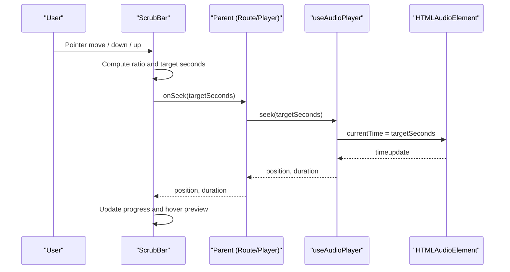
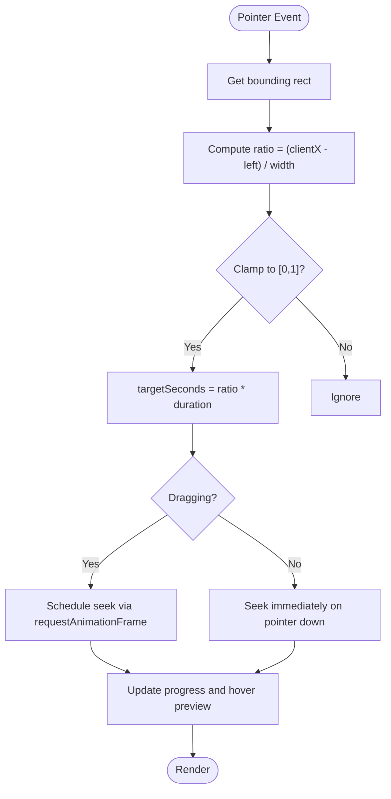
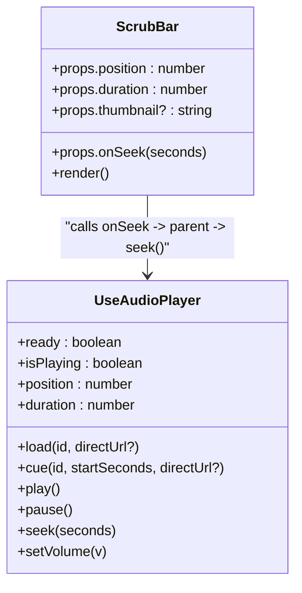
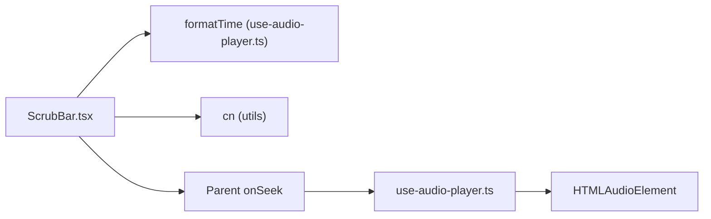

# Scrub Bar Component

<cite>
**Referenced Files in This Document**
- [ScrubBar.tsx](file://src/components/music/ScrubBar.tsx)
- [use-audio-player.ts](file://src/lib/use-audio-player.ts)
- [FullScreenPlayer.tsx](file://src/components/music/ui/FullScreenPlayer.tsx)
- [index.tsx](file://src/routes/index.tsx)
</cite>

## Table of Contents
1. [Introduction](#introduction)
2. [Project Structure](#project-structure)
3. [Core Components](#core-components)
4. [Architecture Overview](#architecture-overview)
5. [Detailed Component Analysis](#detailed-component-analysis)
6. [Dependency Analysis](#dependency-analysis)
7. [Performance Considerations](#performance-considerations)
8. [Troubleshooting Guide](#troubleshooting-guide)
9. [Conclusion](#conclusion)

## Introduction
This document provides detailed documentation for the ScrubBar component, which enables precise track navigation and seeking within the music application. It covers the interactive timeline interface including drag-to-seek, click-to-jump, keyboard navigation, and pointer-based interactions that work across desktop and mobile devices. It also explains how the component integrates with the audio player hook to provide real-time position updates and user-initiated seeking operations, along with implementation details for smooth scrubbing, debounced seeking via requestAnimationFrame, and accurate time formatting. Cross-browser compatibility considerations, touch event handling, and responsive design are addressed throughout.

## Project Structure
The ScrubBar is a focused UI component responsible for rendering an accessible seek bar with hover preview and keyboard support. It consumes playback state from the audio player hook and delegates actual seeking to a callback provided by the parent (typically the route or player container). The full-screen player demonstrates an alternative progress control that uses similar principles but without the hover thumbnail feature.

```mermaid
graph TB
A["Route (index.tsx)"] --> B["Audio Player Hook (use-audio-player.ts)"]
B --> C["HTMLAudioElement"]
A --> D["ScrubBar.tsx"]
D --> |onSeek(seconds)| A
A --> |seek(seconds)| B
B --> |position/duration| A
A --> |position/duration| D
```

**Diagram sources**
- [index.tsx:542-575](file://src/routes/index.tsx#L542-L575)
- [use-audio-player.ts:42-85](file://src/lib/use-audio-player.ts#L42-L85)
- [use-audio-player.ts:189-194](file://src/lib/use-audio-player.ts#L189-L194)
- [ScrubBar.tsx:14-45](file://src/components/music/ScrubBar.tsx#L14-L45)

**Section sources**
- [ScrubBar.tsx:1-145](file://src/components/music/ScrubBar.tsx#L1-L145)
- [use-audio-player.ts:1-221](file://src/lib/use-audio-player.ts#L1-L221)
- [FullScreenPlayer.tsx:64-76](file://src/components/music/ui/FullScreenPlayer.tsx#L64-L76)
- [index.tsx:542-575](file://src/routes/index.tsx#L542-L575)

## Core Components
- ScrubBar: Renders an accessible seek bar with hover preview, pointer interactions, and keyboard navigation. It calculates percentage progress from position and duration, shows a floating timestamp preview with optional thumbnail, and throttles seeking during drag using requestAnimationFrame.
- useAudioPlayer: Provides playback state (isPlaying, position, duration), methods to load/cue/play/pause/seek, and a formatTime utility used by ScrubBar for consistent time display.
- FullScreenPlayer: Demonstrates a click-to-jump progress bar and time labels using the same formatTime utility; it does not include the hover thumbnail feature but illustrates integration patterns.

Key responsibilities:
- ScrubBar: UI-only; computes ratios, manages hover/drag state, handles keyboard seeking, and calls onSeek with computed seconds.
- useAudioPlayer: Manages HTMLAudioElement lifecycle, emits time updates, exposes seek, and formats time.

**Section sources**
- [ScrubBar.tsx:14-45](file://src/components/music/ScrubBar.tsx#L14-L45)
- [use-audio-player.ts:37-51](file://src/lib/use-audio-player.ts#L37-L51)
- [use-audio-player.ts:189-194](file://src/lib/use-audio-player.ts#L189-L194)
- [use-audio-player.ts:215-220](file://src/lib/use-audio-player.ts#L215-L220)
- [FullScreenPlayer.tsx:64-76](file://src/components/music/ui/FullScreenPlayer.tsx#L64-L76)

## Architecture Overview
The ScrubBar integrates with the audio player through a unidirectional data flow:
- The route or player container holds the audio player instance and exposes onSeek to ScrubBar.
- ScrubBar converts pointer coordinates into a ratio and then into seconds, invoking onSeek.
- The parent calls the audio player’s seek method to update the underlying HTMLAudioElement.
- Real-time position updates flow back to the UI via the audio player’s timeupdate events, updating ScrubBar’s progress visualization.



**Diagram sources**
- [ScrubBar.tsx:24-45](file://src/components/music/ScrubBar.tsx#L24-L45)
- [use-audio-player.ts:42-51](file://src/lib/use-audio-player.ts#L42-L51)
- [use-audio-player.ts:189-194](file://src/lib/use-audio-player.ts#L189-L194)

## Detailed Component Analysis

### ScrubBar Component
ScrubBar renders an accessible slider-like element with:
- Hover preview: Shows a floating tooltip with a thumbnail (optional) and formatted time based on cursor position.
- Drag-to-seek: While dragging, seeks are throttled to one per animation frame to avoid excessive API calls and maintain smooth UI.
- Click-to-jump: On pointer down, immediately seeks to the clicked position.
- Keyboard navigation: Arrow keys step by 5 seconds (or 10 seconds with Shift), Home jumps to start, End jumps to end.
- Accessibility: Uses role="slider", aria attributes for min/max/value/text, and focus management via tabIndex.

Implementation highlights:
- Ratio calculation: Converts clientX to a normalized ratio using bounding rectangle dimensions.
- Throttling: Uses requestAnimationFrame to schedule at most one seek per frame while dragging.
- Time formatting: Delegates to formatTime for consistent display.



**Diagram sources**
- [ScrubBar.tsx:24-45](file://src/components/music/ScrubBar.tsx#L24-L45)
- [ScrubBar.tsx:76-141](file://src/components/music/ScrubBar.tsx#L76-L141)

**Section sources**
- [ScrubBar.tsx:14-45](file://src/components/music/ScrubBar.tsx#L14-L45)
- [ScrubBar.tsx:47-74](file://src/components/music/ScrubBar.tsx#L47-L74)
- [ScrubBar.tsx:76-141](file://src/components/music/ScrubBar.tsx#L76-L141)

### Audio Player Hook Integration
The useAudioPlayer hook:
- Maintains an HTMLAudioElement instance and listens to play, pause, timeupdate, durationchange, loadedmetadata, ended, and error events.
- Exposes position and duration state updated on time-related events.
- Provides a seek method that safely sets currentTime within bounds.
- Offers formatTime for consistent time display used by ScrubBar.

Integration points:
- Parent passes onSeek to ScrubBar; ScrubBar calls onSeek with computed seconds.
- Parent invokes player.seek to apply the new position.
- Real-time updates propagate back to ScrubBar via position/duration props.



**Diagram sources**
- [use-audio-player.ts:37-51](file://src/lib/use-audio-player.ts#L37-L51)
- [use-audio-player.ts:189-194](file://src/lib/use-audio-player.ts#L189-L194)
- [ScrubBar.tsx:14-45](file://src/components/music/ScrubBar.tsx#L14-L45)

**Section sources**
- [use-audio-player.ts:42-85](file://src/lib/use-audio-player.ts#L42-L85)
- [use-audio-player.ts:189-194](file://src/lib/use-audio-player.ts#L189-L194)
- [use-audio-player.ts:215-220](file://src/lib/use-audio-player.ts#L215-L220)

### Progress Visualization and Time Formatting
- Progress visualization: ScrubBar displays a gradient-filled bar whose width equals (position / duration) * 100%, capped at 100%. A small indicator dot appears at the current position on hover.
- Hover preview: A floating tooltip shows the album thumbnail (if provided) and the formatted time under the cursor.
- Time formatting: formatTime returns minutes:seconds with zero-padded seconds, ensuring consistent display across components.

Note: Buffered content display is not implemented in ScrubBar. If needed, buffering can be added by computing buffered ranges from the underlying audio element in the parent and passing buffer percentages to ScrubBar as a prop.

**Section sources**
- [ScrubBar.tsx:22-28](file://src/components/music/ScrubBar.tsx#L22-L28)
- [ScrubBar.tsx:96-113](file://src/components/music/ScrubBar.tsx#L96-L113)
- [use-audio-player.ts:215-220](file://src/lib/use-audio-player.ts#L215-L220)

### Interaction Details
- Drag-to-seek: During pointer move while dragging, seeks are throttled to once per animation frame to ensure smooth performance and prevent excessive updates.
- Click-to-jump: On pointer down, the component immediately seeks to the clicked position.
- Keyboard navigation: Supports arrow keys for stepping, Home/End for jumping to boundaries, and Shift+Arrow for larger steps.
- Touch gesture support: Pointer events handle both mouse and touch uniformly; no separate touch handlers are required.

**Section sources**
- [ScrubBar.tsx:30-45](file://src/components/music/ScrubBar.tsx#L30-L45)
- [ScrubBar.tsx:47-74](file://src/components/music/ScrubBar.tsx#L47-L74)
- [ScrubBar.tsx:76-94](file://src/components/music/ScrubBar.tsx#L76-L94)

### Cross-Browser Compatibility and Responsive Design
- Cross-browser seeking: The seek operation relies on setting currentTime on HTMLAudioElement, which is widely supported. The audio player ensures duration is finite before seeking to avoid undefined behavior.
- Touch events: Using pointer events ensures consistent behavior across mouse and touch devices without needing separate touch listeners.
- Responsive design: The ScrubBar uses relative widths and flexible layout classes to adapt to different screen sizes. The full-screen player demonstrates responsive typography and spacing adjustments.

**Section sources**
- [use-audio-player.ts:189-194](file://src/lib/use-audio-player.ts#L189-L194)
- [ScrubBar.tsx:76-141](file://src/components/music/ScrubBar.tsx#L76-L141)
- [FullScreenPlayer.tsx:95-182](file://src/components/music/ui/FullScreenPlayer.tsx#L95-L182)

## Dependency Analysis
ScrubBar depends on:
- formatTime from use-audio-player for consistent time display.
- Utility functions for class name merging (cn) for styling.
- Parent-provided onSeek callback to perform actual seeking.

The audio player hook depends on:
- HTMLAudioElement APIs for playback and seeking.
- Optional offline blob playback via getBlob.
- Stream proxy endpoints for network playback.



**Diagram sources**
- [ScrubBar.tsx:1-3](file://src/components/music/ScrubBar.tsx#L1-L3)
- [use-audio-player.ts:215-220](file://src/lib/use-audio-player.ts#L215-L220)
- [use-audio-player.ts:189-194](file://src/lib/use-audio-player.ts#L189-L194)

**Section sources**
- [ScrubBar.tsx:1-3](file://src/components/music/ScrubBar.tsx#L1-L3)
- [use-audio-player.ts:215-220](file://src/lib/use-audio-player.ts#L215-L220)

## Performance Considerations
- Debounced seeking: ScrubBar uses requestAnimationFrame to throttle seeking during drag, reducing re-renders and media engine churn.
- Efficient updates: Position and duration updates are driven by timeupdate events, minimizing unnecessary computations.
- Memory management: The audio player cleans up event listeners and revokes object URLs on unmount to prevent leaks.

Recommendations:
- Avoid frequent re-renders by keeping ScrubBar state minimal and relying on props for position/duration.
- If adding buffered range visualization, compute buffered percentages sparingly and debounce updates similarly.

[No sources needed since this section provides general guidance]

## Troubleshooting Guide
Common issues and resolutions:
- Seeking does nothing: Ensure duration is finite before seeking; the audio player guards against invalid durations.
- Seek not updating UI: Verify that position/duration are being passed to ScrubBar and that timeupdate events are firing.
- Hover preview not showing: Confirm that duration > 0 and that pointer events are attached to the container.
- Keyboard navigation not working: Ensure the ScrubBar has focus (tabIndex=0) and that keydown events are handled.

Operational notes:
- Errors in playback trigger an error handler; consider surfacing messages to users.
- Offline playback falls back to network if blobs are unavailable; verify stream endpoints and CORS settings.

**Section sources**
- [use-audio-player.ts:56-67](file://src/lib/use-audio-player.ts#L56-L67)
- [use-audio-player.ts:189-194](file://src/lib/use-audio-player.ts#L189-L194)
- [ScrubBar.tsx:47-74](file://src/components/music/ScrubBar.tsx#L47-L74)

## Conclusion
The ScrubBar component provides a robust, accessible, and performant timeline interface for precise track navigation. It integrates seamlessly with the audio player hook to deliver real-time position updates and supports multiple interaction modes including drag-to-seek, click-to-jump, and keyboard navigation. Its design leverages pointer events for cross-device compatibility and requestAnimationFrame for smooth scrubbing. While buffered content visualization is not included, the architecture allows easy extension. Overall, ScrubBar offers a solid foundation for high-quality audio seeking experiences across platforms.

[No sources needed since this section summarizes without analyzing specific files]