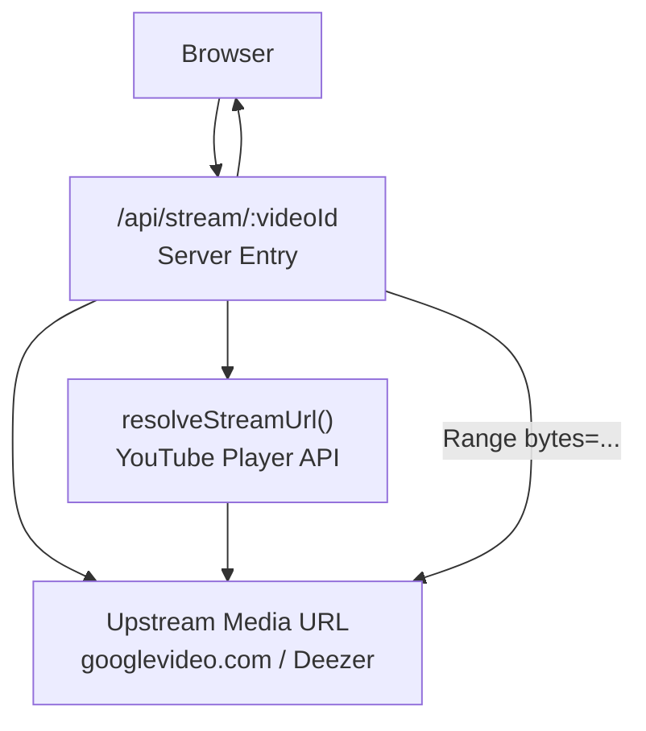
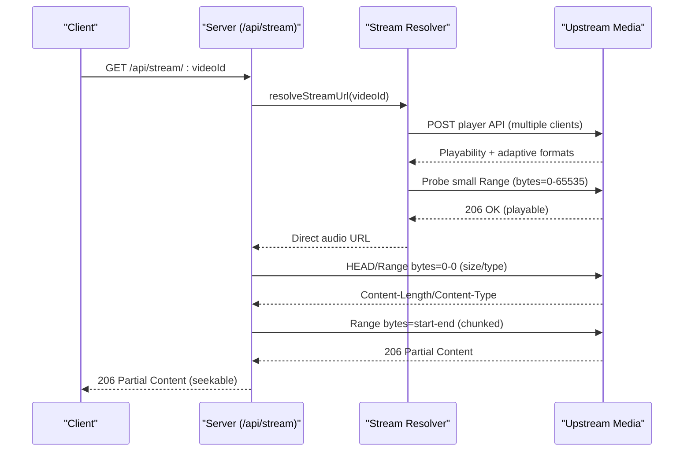
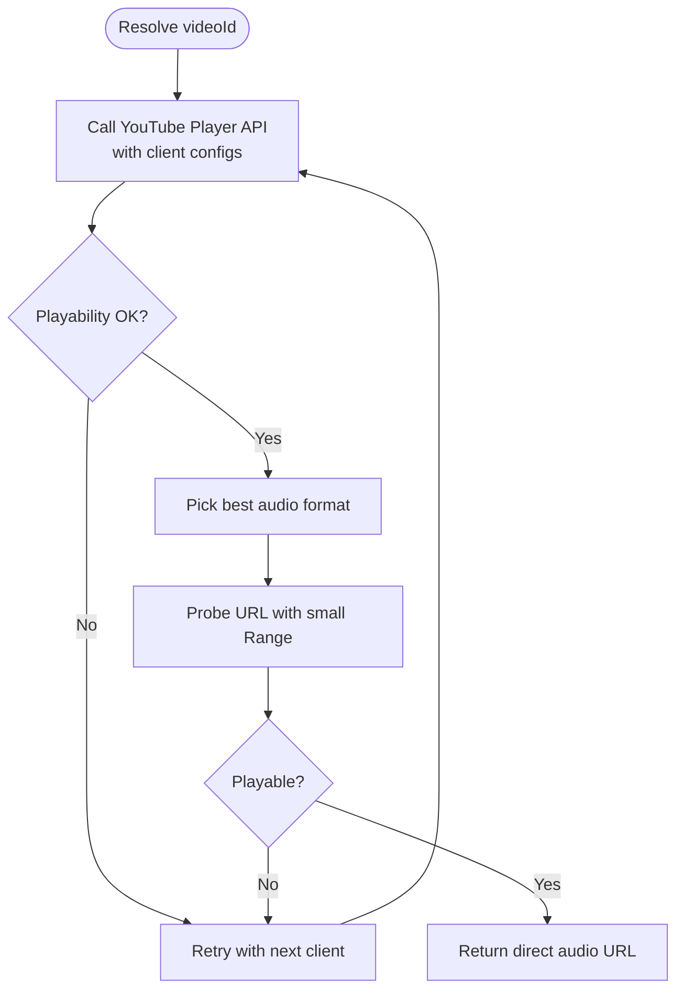
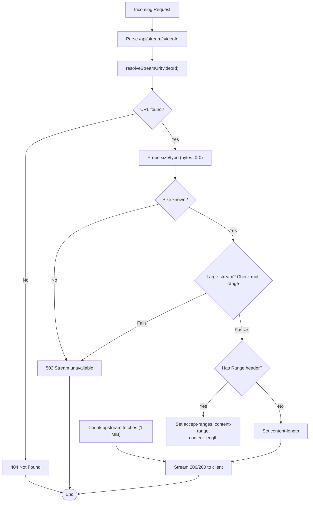
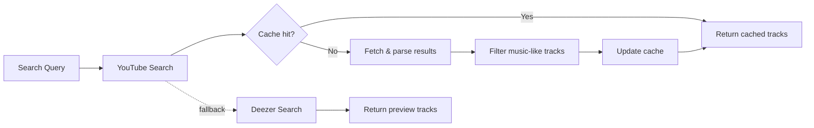
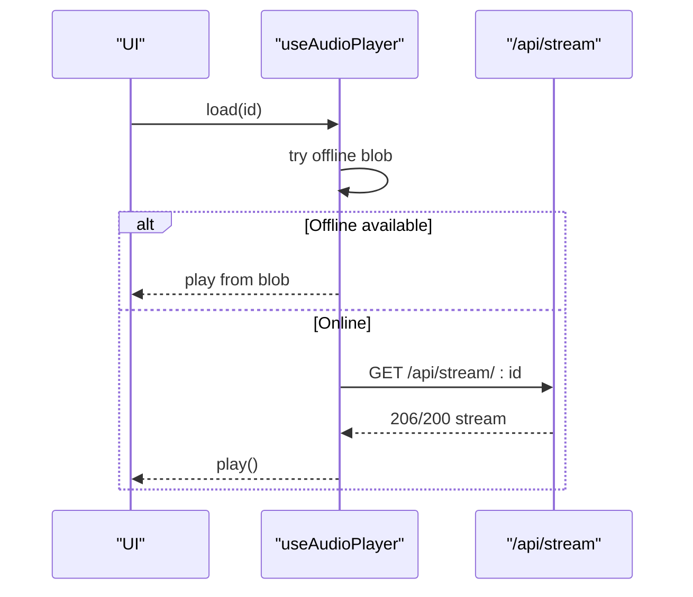
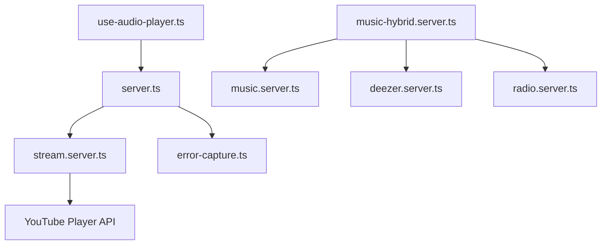

# Stream Proxy Server

<cite>
**Referenced Files in This Document**
- [server.ts](file://src/server.ts)
- [stream.server.ts](file://src/lib/stream.server.ts)
- [music.functions.ts](file://src/lib/music.functions.ts)
- [use-audio-player.ts](file://src/lib/use-audio-player.ts)
- [music-hybrid.server.ts](file://src/lib/music-hybrid.server.ts)
- [deezer.server.ts](file://src/lib/deezer.server.ts)
- [radio.server.ts](file://src/lib/radio.server.ts)
- [error-capture.ts](file://src/lib/error-capture.ts)
</cite>

## Table of Contents
1. [Introduction](#introduction)
2. [Project Structure](#project-structure)
3. [Core Components](#core-components)
4. [Architecture Overview](#architecture-overview)
5. [Detailed Component Analysis](#detailed-component-analysis)
6. [Dependency Analysis](#dependency-analysis)
7. [Performance Considerations](#performance-considerations)
8. [Security Considerations](#security-considerations)
9. [Client-Side Usage Patterns](#client-side-usage-patterns)
10. [Troubleshooting Guide](#troubleshooting-guide)
11. [Conclusion](#conclusion)

## Introduction
This document explains the server-side stream proxy that resolves direct audio URLs (primarily from YouTube) and serves bounded, seekable audio ranges to the browser. The proxy solves two common problems:
- CORS restrictions: Direct media URLs from external platforms often lack CORS headers, preventing browsers from fetching them directly.
- Throttling and ad-blocking: Some upstream providers throttle or block large/open-ended range requests; the proxy breaks streams into small, bounded chunks and honors Range requests for seeking.

The system also integrates with search and recommendation services, supports fallback sources (e.g., Deezer previews), and provides a robust client-side audio player hook that uses the proxy transparently.

## Project Structure
At a high level:
- Server entrypoint handles streaming requests under /api/stream/:videoId and proxies bounded byte ranges to upstream media servers.
- Stream resolution module queries platform APIs to obtain playable audio URLs and validates them before use.
- Music search and hybrid logic provide track discovery and source selection.
- Client-side audio player hook consumes the proxy endpoint seamlessly.

**Diagram sources**
- [server.ts:48-179](file://src/server.ts#L48-L179)
- [stream.server.ts:47-122](file://src/lib/stream.server.ts#L47-L122)

**Section sources**
- [server.ts:1-199](file://src/server.ts#L1-L199)
- [stream.server.ts:1-123](file://src/lib/stream.server.ts#L1-L123)

## Core Components
- Stream resolver: Resolves direct audio URLs from YouTube using internal player endpoints, selects best audio-only formats, and probes URLs to ensure they are not throttled.
- Stream proxy: Serves same-origin audio by honoring Range requests, chunking upstream responses to avoid throttling, and setting correct headers for playback and downloads.
- Search and hybrid modules: Provide track discovery via YouTube and Deezer, with fallback strategies to ensure playable content.
- Client audio player hook: Uses the proxy endpoint transparently, supports offline playback, and surfaces errors to the UI.

**Section sources**
- [stream.server.ts:14-122](file://src/lib/stream.server.ts#L14-L122)
- [server.ts:48-179](file://src/server.ts#L48-L179)
- [music-hybrid.server.ts:1-98](file://src/lib/music-hybrid.server.ts#L1-L98)
- [use-audio-player.ts:1-187](file://src/lib/use-audio-player.ts#L1-L187)

## Architecture Overview
The request flow is designed for reliability and performance:
- Client requests /api/stream/:videoId.
- Server resolves a playable upstream URL via the stream resolver.
- Server probes file size and type, checks for capped streams, then streams requested byte ranges in bounded chunks.
- Client’s <audio> element seeks and plays seamlessly due to Range support.

**Diagram sources**
- [server.ts:102-179](file://src/server.ts#L102-L179)
- [stream.server.ts:47-122](file://src/lib/stream.server.ts#L47-L122)

## Detailed Component Analysis

### Stream Resolution (YouTube)
- Uses YouTube’s internal player endpoint with multiple client configs to improve success rates.
- Filters for audio-only adaptive formats, preferring higher quality when available.
- Probes each candidate URL with a small Range request to confirm it is not throttled.
- Retries across clients and attempts with backoff to handle flakiness.

**Diagram sources**
- [stream.server.ts:47-122](file://src/lib/stream.server.ts#L47-L122)

**Section sources**
- [stream.server.ts:14-122](file://src/lib/stream.server.ts#L14-L122)

### Stream Proxy (Same-Origin Range Streaming)
- Accepts requests under /api/stream/:videoId.
- Resolves upstream URL via the resolver.
- Probes file size and MIME type with a minimal Range request.
- Detects capped streams (limited to first ~1 MiB on some nodes) and fails fast to avoid truncated playback/downloads.
- Honors Range requests, computes start/end, sets appropriate headers, and streams data in bounded chunks to avoid upstream throttling.

**Diagram sources**
- [server.ts:102-179](file://src/server.ts#L102-L179)

**Section sources**
- [server.ts:48-179](file://src/server.ts#L48-L179)

### Search and Hybrid Sources
- YouTube search scrapes results with filters to prioritize music tracks and excludes non-music content.
- Results are cached in-memory with TTL to reduce repeated network calls.
- Hybrid strategy prefers YouTube full tracks; if unavailable, falls back to Deezer 30-second previews.
- Radio functionality leverages YouTube’s built-in radio engine to find similar tracks.

**Diagram sources**
- [music.server.ts:52-75](file://src/lib/music.server.ts#L52-L75)
- [music.server.ts:182-248](file://src/lib/music.server.ts#L182-L248)
- [deezer.server.ts:39-74](file://src/lib/deezer.server.ts#L39-L74)
- [music-hybrid.server.ts:22-49](file://src/lib/music-hybrid.server.ts#L22-L49)

**Section sources**
- [music.server.ts:52-75](file://src/lib/music.server.ts#L52-L75)
- [music.server.ts:182-248](file://src/lib/music.server.ts#L182-L248)
- [deezer.server.ts:39-74](file://src/lib/deezer.server.ts#L39-L74)
- [music-hybrid.server.ts:22-49](file://src/lib/music-hybrid.server.ts#L22-L49)

### Client-Side Audio Player Hook
- Builds proxy URLs for streaming and supports direct URLs for non-proxy sources.
- Prefers offline playback when available; otherwise streams via the proxy.
- Handles autoplay policies and exposes error callbacks for user feedback.

**Diagram sources**
- [use-audio-player.ts:103-172](file://src/lib/use-audio-player.ts#L103-L172)

**Section sources**
- [use-audio-player.ts:1-187](file://src/lib/use-audio-player.ts#L1-L187)

## Dependency Analysis
- Server entrypoint depends on stream resolver and error handling utilities.
- Stream resolver depends on YouTube’s internal player API and performs probing to validate URLs.
- Hybrid search composes YouTube and Deezer modules; radio module depends on YouTube’s next endpoint.
- Client hook depends on the server’s /api/stream endpoint and optional offline storage.

**Diagram sources**
- [server.ts:1-199](file://src/server.ts#L1-L199)
- [stream.server.ts:47-122](file://src/lib/stream.server.ts#L47-L122)
- [music-hybrid.server.ts:22-98](file://src/lib/music-hybrid.server.ts#L22-L98)
- [music.server.ts:182-248](file://src/lib/music.server.ts#L182-L248)
- [deezer.server.ts:39-74](file://src/lib/deezer.server.ts#L39-L74)
- [radio.server.ts:25-95](file://src/lib/radio.server.ts#L25-L95)
- [use-audio-player.ts:103-172](file://src/lib/use-audio-player.ts#L103-L172)

**Section sources**
- [server.ts:1-199](file://src/server.ts#L1-L199)
- [stream.server.ts:1-123](file://src/lib/stream.server.ts#L1-L123)
- [music-hybrid.server.ts:1-98](file://src/lib/music-hybrid.server.ts#L1-L98)
- [music.server.ts:1-248](file://src/lib/music.server.ts#L1-L248)
- [deezer.server.ts:1-97](file://src/lib/deezer.server.ts#L1-L97)
- [radio.server.ts:1-95](file://src/lib/radio.server.ts#L1-L95)
- [use-audio-player.ts:1-187](file://src/lib/use-audio-player.ts#L1-L187)

## Performance Considerations
- Bounded chunk streaming: Upstream requests are split into 1 MiB chunks to avoid throttling and to keep memory usage low during long streams.
- Range request optimization: The proxy honors Range requests so clients can seek without re-downloading entire files.
- Minimal probing: File size and type are determined with a tiny Range request to set accurate headers for progress bars and downloads.
- In-memory caching: Search results are cached with TTL to reduce redundant network calls and parsing overhead.
- Fallback strategies: Hybrid search ensures playable content even when primary sources fail, reducing retry storms.

[No sources needed since this section provides general guidance]

## Security Considerations
- Input validation: Video IDs are validated at the server function layer before being passed to the resolver.
- URL sanitization: The proxy only accepts well-formed paths under /api/stream/:videoId and decodes the ID safely.
- Request filtering: Only Range requests within the known file bounds are honored; invalid ranges return appropriate status codes.
- Error handling: Errors are captured and normalized to prevent leaking internals to clients.

**Section sources**
- [music.functions.ts:613-626](file://src/lib/music.functions.ts#L613-L626)
- [server.ts:102-179](file://src/server.ts#L102-L179)
- [error-capture.ts:1-71](file://src/lib/error-capture.ts#L1-L71)

## Client-Side Usage Patterns
- Use the provided audio player hook to load tracks by ID; it will automatically call the proxy endpoint.
- For direct URLs (e.g., Deezer previews), pass them explicitly to bypass the proxy.
- Implement error callbacks to inform users when playback cannot start or is blocked.
- Prefer cue() for resuming playback at a specific time without auto-playing.

Examples of patterns:
- Load and play: call the hook’s load method with a track ID.
- Resume playback: call cue with the track ID and start position.
- Offline playback: rely on the hook’s built-in offline blob support; if unavailable, fall back to online streaming.

**Section sources**
- [use-audio-player.ts:103-172](file://src/lib/use-audio-player.ts#L103-L172)
- [music-hybrid.server.ts:87-98](file://src/lib/music-hybrid.server.ts#L87-L98)

## Troubleshooting Guide
Common issues and resolutions:
- “Stream not found” (404): Indicates the resolver could not find a playable URL for the given video ID. Check availability and region restrictions.
- “Stream unavailable” (502): The upstream stream is capped or unreachable; the proxy detected a limitation and failed fast to avoid truncated playback.
- Playback blocked: Browser autoplay policy may require user interaction; ensure play() is triggered after user gestures.
- Seeking stalls: Ensure Range requests are honored; verify the proxy returns proper content-range and content-length headers.

Error capture and logging:
- Errors are captured and expanded with stack traces and cause chains for better diagnostics.
- SSR errors swallowed by frameworks are normalized to readable HTML error pages.

**Section sources**
- [server.ts:181-199](file://src/server.ts#L181-L199)
- [error-capture.ts:1-71](file://src/lib/error-capture.ts#L1-L71)

## Conclusion
The stream proxy provides a reliable, efficient way to serve direct audio streams from platforms like YouTube while bypassing CORS and throttling constraints. It combines robust stream resolution, careful upstream probing, bounded chunk streaming, and comprehensive error handling to deliver a seamless playback experience. Integrated search and hybrid strategies ensure playable content, and the client-side hook simplifies usage while supporting offline playback and robust error handling.

[No sources needed since this section summarizes without analyzing specific files]