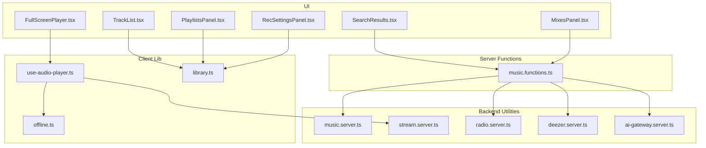
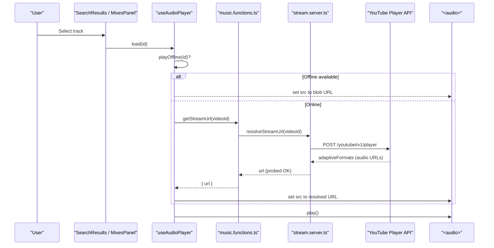
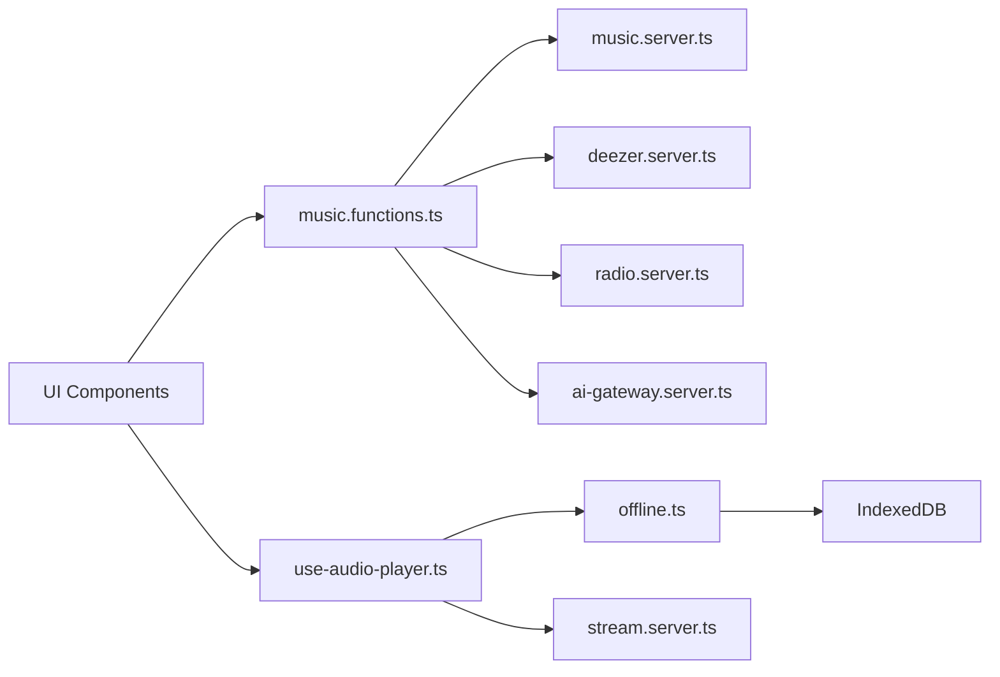

# Core Features

<cite>
**Referenced Files in This Document**
- [README.md](file://README.md)
- [package.json](file://package.json)
- [use-audio-player.ts](file://src/lib/use-audio-player.ts)
- [offline.ts](file://src/lib/offline.ts)
- [library.ts](file://src/lib/library.ts)
- [music.functions.ts](file://src/lib/music.functions.ts)
- [music.server.ts](file://src/lib/music.server.ts)
- [stream.server.ts](file://src/lib/stream.server.ts)
- [ai-gateway.server.ts](file://src/lib/ai-gateway.server.ts)
- [radio.server.ts](file://src/lib/radio.server.ts)
- [deezer.server.ts](file://src/lib/deezer.server.ts)
- [SearchResults.tsx](file://src/components/music/ui/SearchResults.tsx)
- [FullScreenPlayer.tsx](file://src/components/music/ui/FullScreenPlayer.tsx)
- [TrackList.tsx](file://src/components/music/TrackList.tsx)
- [PlaylistsPanel.tsx](file://src/components/music/PlaylistsPanel.tsx)
- [MixesPanel.tsx](file://src/components/music/MixesPanel.tsx)
- [RecSettingsPanel.tsx](file://src/components/music/RecSettingsPanel.tsx)
</cite>

## Table of Contents
1. Introduction
2. Project Structure
3. Core Components
4. Architecture Overview
5. Detailed Component Analysis
6. Dependency Analysis
7. Performance Considerations
8. Troubleshooting Guide
9. Conclusion

## Introduction
This document explains the core features of the YouTube Music Companion application: music discovery and search, audio playback with background support, library management (likes, dislikes, playlists), offline downloads via IndexedDB, and an AI-powered recommendation engine. It covers implementation approaches, key algorithms, user interactions, integration points, data models, state management, performance considerations, and common workflows and edge cases.

The project is a React-based app built on TanStack Start with server functions for backend logic, Supabase for optional cloud sync, and a streaming proxy to resolve ad-free audio URLs from YouTube. It also integrates Deezer previews as a fallback source and uses an AI gateway for personalized recommendations and mixes.

**Section sources**
- [README.md:1-25](file://README.md#L1-L25)
- [package.json:14-70](file://package.json#L14-L70)

## Project Structure
High-level organization:
- UI components under src/components/music and src/components/ui
- Domain logic and integrations under src/lib
- Server functions and scraping utilities for YouTube, Deezer, radio, and streaming resolution
- Library state and persistence via localStorage and Supabase

**Diagram sources**
- [SearchResults.tsx:1-249](file://src/components/music/ui/SearchResults.tsx#L1-L249)
- [FullScreenPlayer.tsx:1-231](file://src/components/music/ui/FullScreenPlayer.tsx#L1-L231)
- [TrackList.tsx:1-249](file://src/components/music/TrackList.tsx#L1-L249)
- [PlaylistsPanel.tsx:1-314](file://src/components/music/PlaylistsPanel.tsx#L1-L314)
- [MixesPanel.tsx:1-239](file://src/components/music/MixesPanel.tsx#L1-L239)
- [RecSettingsPanel.tsx:1-251](file://src/components/music/RecSettingsPanel.tsx#L1-L251)
- [use-audio-player.ts:1-221](file://src/lib/use-audio-player.ts#L1-L221)
- [offline.ts:1-162](file://src/lib/offline.ts#L1-L162)
- [library.ts:1-636](file://src/lib/library.ts#L1-L636)
- [music.functions.ts:1-627](file://src/lib/music.functions.ts#L1-L627)
- [music.server.ts:1-214](file://src/lib/music.server.ts#L1-L214)
- [stream.server.ts:1-123](file://src/lib/stream.server.ts#L1-L123)
- [radio.server.ts:1-95](file://src/lib/radio.server.ts#L1-L95)
- [deezer.server.ts:1-97](file://src/lib/deezer.server.ts#L1-L97)
- [ai-gateway.server.ts:1-10](file://src/lib/ai-gateway.server.ts#L1-L10)

**Section sources**
- [package.json:1-92](file://package.json#L1-L92)

## Core Components
- Audio player hook: HTML5 <audio>-backed player that supports background playback, seeking, volume control, and offline playback via IndexedDB blobs.
- Offline storage: IndexedDB store for downloaded tracks with progress tracking and size reporting.
- Library state: Local-first state for likes, dislikes, history, playlists, settings, and stats; optional sync to Supabase when signed in.
- Discovery and search: Server functions to search YouTube and Deezer, build mixes, get radio tracks, and fetch new drops.
- Streaming resolver: Server-side resolution of direct audio URLs from YouTube’s internal API with retry and probing.
- AI recommendations: Prompt-driven generation of recommendations and mixes using an AI gateway provider.

Key data models:
- Track: id, title, artist, duration, thumbnail, optional previewUrl and source, optional reason.
- Playlist: id, name, tracks, createdAt.
- RecSettings: moods, genres, languages, podcastTopics, injectInterval, notifyNewDrops, discovery, energy, instrumentalOnly.
- Stats: per-track plays, skips, completions, lastAt.

State management strategies:
- Client state via React hooks and local storage keys for persistence.
- Debounced upsert to Supabase for cross-device sync when authenticated.
- IndexedDB for large binary assets (audio blobs).

Performance considerations:
- Debounced writes to avoid spamming storage or network.
- Deduplication and limits on lists (e.g., top 200 items).
- Parallel batched queries for mix building and new releases.
- Probing stream URLs before use to avoid throttled links.

**Section sources**
- [use-audio-player.ts:1-221](file://src/lib/use-audio-player.ts#L1-L221)
- [offline.ts:1-162](file://src/lib/offline.ts#L1-L162)
- [library.ts:1-636](file://src/lib/library.ts#L1-L636)
- [music.functions.ts:1-627](file://src/lib/music.functions.ts#L1-L627)
- [stream.server.ts:1-123](file://src/lib/stream.server.ts#L1-L123)
- [ai-gateway.server.ts:1-10](file://src/lib/ai-gateway.server.ts#L1-L10)

## Architecture Overview
End-to-end flow for playing a track:
- User selects a track in SearchResults or MixesPanel.
- The app calls the audio player hook to load/cue/play.
- If available, offline blob is used; otherwise, a server function resolves a direct stream URL via the streaming resolver.
- Playback continues in background using native <audio>.

**Diagram sources**
- [SearchResults.tsx:1-249](file://src/components/music/ui/SearchResults.tsx#L1-L249)
- [MixesPanel.tsx:1-239](file://src/components/music/MixesPanel.tsx#L1-L239)
- [use-audio-player.ts:1-221](file://src/lib/use-audio-player.ts#L1-L221)
- [music.functions.ts:613-627](file://src/lib/music.functions.ts#L613-L627)
- [stream.server.ts:108-123](file://src/lib/stream.server.ts#L108-L123)

**Section sources**
- [use-audio-player.ts:103-172](file://src/lib/use-audio-player.ts#L103-L172)
- [music.functions.ts:613-627](file://src/lib/music.functions.ts#L613-L627)
- [stream.server.ts:47-123](file://src/lib/stream.server.ts#L47-L123)

## Detailed Component Analysis

### Music Discovery and Search
- Search: Server function validates input and delegates to YouTube scraper or Deezer search. Results include metadata suitable for playback.
- Suggestions: Autocomplete suggestions fetched from YouTube suggest service.
- Filtering and sorting are handled in UI for demo purposes; production would push filtering to server.

Implementation highlights:
- YouTube search scrapes results page, filters non-music content by title/duration heuristics, and returns normalized Track objects.
- Deezer search provides 30-second previews with direct MP3 URLs as a fallback.

User interaction patterns:
- Type query → see suggestions → select result → play or add to playlist/queue.
- Filter/sort UI toggles for quick refinement.

Edge cases:
- Network errors return empty arrays with safe messages.
- Non-music content filtered out by heuristics.

**Section sources**
- [music.functions.ts:8-44](file://src/lib/music.functions.ts#L8-L44)
- [music.server.ts:139-214](file://src/lib/music.server.ts#L139-L214)
- [deezer.server.ts:39-97](file://src/lib/deezer.server.ts#L39-L97)
- [SearchResults.tsx:1-249](file://src/components/music/ui/SearchResults.tsx#L1-L249)

### Audio Player with Background Playback
- HTML5 <audio> element managed by a custom hook.
- Supports autoplay cueing, seeking, volume control, and error handling.
- Prefers offline playback if a blob exists; otherwise streams via server-resolved URL.
- Keeps playback alive when app is backgrounded or screen locked.

Key behaviors:
- Auto-start flag controlled by wantPlayRef to comply with browser policies.
- Error handler notifies user and can be extended to auto-skip restricted songs.
- Cleanup revokes object URLs and detaches listeners.

User interaction patterns:
- Play/Pause, Seek, Volume, Next/Previous via FullScreenPlayer and other controls.
- Resume position across sessions via saved playback state.

Edge cases:
- Browser blocks autoplay without user gesture; hook warns and waits for user action.
- Stream URLs may be throttled; server probes before returning.

**Section sources**
- [use-audio-player.ts:1-221](file://src/lib/use-audio-player.ts#L1-L221)
- [FullScreenPlayer.tsx:1-231](file://src/components/music/ui/FullScreenPlayer.tsx#L1-L231)
- [stream.server.ts:92-123](file://src/lib/stream.server.ts#L92-L123)

### Library Management (Likes, Dislikes, Playlists)
- Local-first storage with keys for likes, dislikes, history, playlists, settings, and stats.
- Optional Supabase sync merges device and cloud data, debouncing writes.
- Playlist operations: create, rename, delete, add/remove/move/reorder tracks.
- Behavioral stats: tracks plays, skips, completions to power Replay Mix and negative signals.

Algorithms:
- mergeById deduplicates and caps list sizes.
- replayMix scores tracks by plays/completions minus skips within a time window.
- topArtists aggregates engagement and boosts liked artists.
- skippedLabels identifies repeated skips for avoidance.

User interaction patterns:
- Like/dislike tracks from TrackList or FullScreenPlayer.
- Manage playlists via PlaylistsPanel with drag-and-drop reorder and bulk actions.

Edge cases:
- Storage full or blocked silently ignored.
- Sync only occurs after hydration and sign-in.

**Section sources**
- [library.ts:105-165](file://src/lib/library.ts#L105-L165)
- [library.ts:237-340](file://src/lib/library.ts#L237-L340)
- [library.ts:343-547](file://src/lib/library.ts#L343-L547)
- [library.ts:582-636](file://src/lib/library.ts#L582-L636)
- [TrackList.tsx:1-249](file://src/components/music/TrackList.tsx#L1-L249)
- [PlaylistsPanel.tsx:1-314](file://src/components/music/PlaylistsPanel.tsx#L1-L314)

### Offline Download System (IndexedDB)
- Stores downloaded tracks as Blobs keyed by track id.
- Provides save, get, list, remove, clear, total size, and download with progress.
- Uses server stream endpoint to fetch bytes and stores them locally for offline playback.

Algorithm overview:
- Streams response body chunk-by-chunk, accumulates into merged Blob, then persists.
- Progress callback updates UI during download.

User interaction patterns:
- Download button per track; shows spinner while downloading, checkmark when complete.
- Remove offline copy option.

Edge cases:
- IndexedDB unavailable returns null/error gracefully.
- Large files require sufficient storage; errors are caught and surfaced.

**Section sources**
- [offline.ts:1-162](file://src/lib/offline.ts#L1-L162)
- [use-audio-player.ts:123-140](file://src/lib/use-audio-player.ts#L123-L140)
- [TrackList.tsx:158-181](file://src/components/music/TrackList.tsx#L158-L181)

### AI-Powered Recommendation Engine
- Server function builds prompts from user taste signals: liked songs, recent history, sequence of actions, skipped tracks, disliked tracks, mood, and tuning brief.
- Calls AI gateway to generate JSON array of recommended tracks with reasons.
- Resolves each suggestion back to YouTube tracks via search to attach playable metadata.
- Mix endpoints: Discover Mix (new artists matching profile), New Release Mix (latest drops from listened artists), Mood Picks (curated searches), Radio Tracks (YouTube RD playlist), and Local Picks (no-AI fallback balancing comfort, similar artists, and forgotten hits).

Data inputs:
- Liked, recent, sequence, skipped, disliked sets.
- Settings brief generated from RecSettings (moods, genres, languages, discovery, energy, instrumental-only).

User interaction patterns:
- Tune preferences in RecSettingsPanel and apply to refresh For You feed.
- Rebuild mixes to refresh recommendations.

Edge cases:
- Rate limiting or credit exhaustion returns friendly errors.
- Malformed AI responses handled safely.

**Section sources**
- [music.functions.ts:47-137](file://src/lib/music.functions.ts#L47-L137)
- [music.functions.ts:140-245](file://src/lib/music.functions.ts#L140-L245)
- [music.functions.ts:248-307](file://src/lib/music.functions.ts#L248-L307)
- [music.functions.ts:310-369](file://src/lib/music.functions.ts#L310-L369)
- [music.functions.ts:372-458](file://src/lib/music.functions.ts#L372-L458)
- [music.functions.ts:461-559](file://src/lib/music.functions.ts#L461-L559)
- [music.functions.ts:562-610](file://src/lib/music.functions.ts#L562-L610)
- [ai-gateway.server.ts:1-10](file://src/lib/ai-gateway.server.ts#L1-L10)
- [RecSettingsPanel.tsx:1-251](file://src/components/music/RecSettingsPanel.tsx#L1-L251)
- [MixesPanel.tsx:1-239](file://src/components/music/MixesPanel.tsx#L1-L239)

### Radio and Podcasts
- Radio: Uses YouTube’s “RD” playlist endpoint to get similar tracks based on current song.
- Podcasts: Builds fresh episodes and trending shows based on topics, languages, and favorite artists.

User interaction patterns:
- Start radio from a track to queue similar songs.
- Explore podcasts tab to listen to audio-only episodes.

Edge cases:
- Network failures return empty arrays; UI handles loading states.

**Section sources**
- [radio.server.ts:1-95](file://src/lib/radio.server.ts#L1-L95)
- [music.functions.ts:461-559](file://src/lib/music.functions.ts#L461-L559)

## Dependency Analysis
Core dependencies and relationships:
- UI components depend on hooks and panels for state and actions.
- Server functions orchestrate external services (YouTube, Deezer, AI gateway) and expose clean APIs to the client.
- Streaming resolver abstracts YouTube’s internal API and ensures playable URLs.
- Offline module depends on IndexedDB and server stream endpoint.

**Diagram sources**
- [music.functions.ts:1-627](file://src/lib/music.functions.ts#L1-L627)
- [music.server.ts:1-214](file://src/lib/music.server.ts#L1-L214)
- [deezer.server.ts:1-97](file://src/lib/deezer.server.ts#L1-L97)
- [radio.server.ts:1-95](file://src/lib/radio.server.ts#L1-L95)
- [ai-gateway.server.ts:1-10](file://src/lib/ai-gateway.server.ts#L1-L10)
- [use-audio-player.ts:1-221](file://src/lib/use-audio-player.ts#L1-L221)
- [offline.ts:1-162](file://src/lib/offline.ts#L1-L162)
- [stream.server.ts:1-123](file://src/lib/stream.server.ts#L1-L123)

**Section sources**
- [package.json:14-70](file://package.json#L14-L70)

## Performance Considerations
- Debounced writes to localStorage and Supabase reduce I/O overhead.
- Batched parallel queries for mix building and new releases improve responsiveness.
- Deduplication and capped list sizes prevent memory bloat.
- Probing stream URLs avoids wasted playback attempts on throttled links.
- Offline playback eliminates network latency and works without connectivity.
- Heuristic filtering reduces irrelevant results early in the pipeline.

[No sources needed since this section provides general guidance]

## Troubleshooting Guide
Common issues and resolutions:
- Playback blocked by browser policy: Ensure user gesture initiates play; hook warns and waits for resume.
- Track unavailable or restricted: Error message shown; manual skip recommended.
- AI rate limit or credits exhausted: Friendly error returned; retry later or configure credits.
- IndexedDB unavailable: Offline playback disabled; fall back to streaming.
- Network errors during search/download: Empty results or error messages; retry operation.

Operational tips:
- Check environment variables for AI gateway key.
- Verify streaming endpoint availability and probe success.
- Clear downloads if storage is constrained.

**Section sources**
- [use-audio-player.ts:56-67](file://src/lib/use-audio-player.ts#L56-L67)
- [music.functions.ts:61-62](file://src/lib/music.functions.ts#L61-L62)
- [music.functions.ts:105-111](file://src/lib/music.functions.ts#L105-L111)
- [music.functions.ts:183-185](file://src/lib/music.functions.ts#L183-L185)
- [offline.ts:24-38](file://src/lib/offline.ts#L24-L38)

## Conclusion
The YouTube Music Companion combines robust discovery, seamless playback, rich library management, reliable offline access, and intelligent recommendations into a cohesive experience. Its architecture separates concerns between UI, client hooks, server functions, and backend utilities, enabling scalable feature growth and resilient behavior under real-world conditions. Users benefit from personalized mixes, background playback, and persistent libraries that follow them across devices when signed in.

[No sources needed since this section summarizes without analyzing specific files]