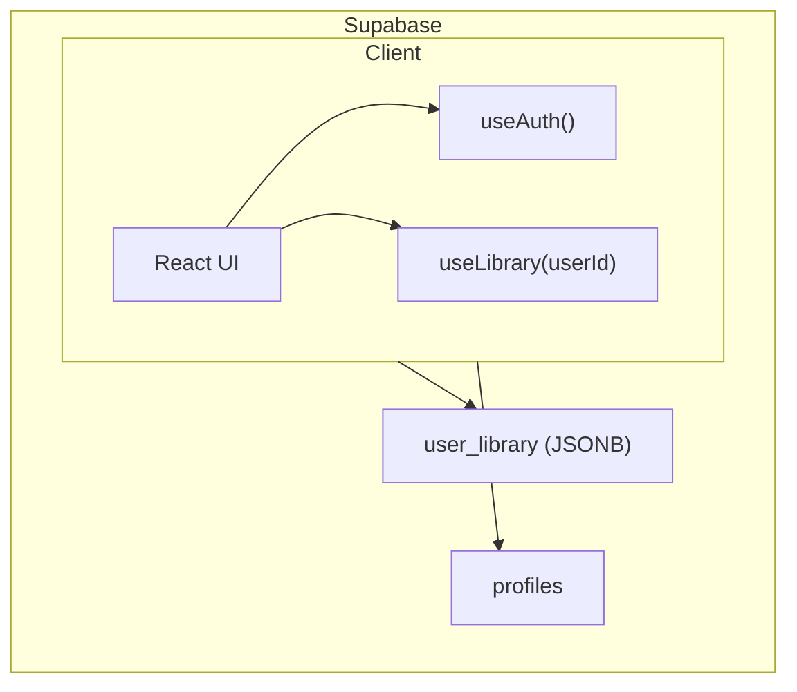
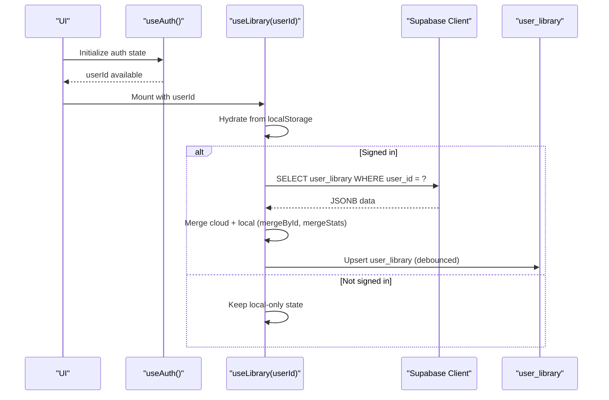
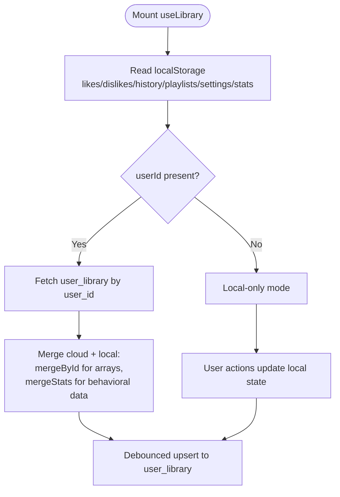
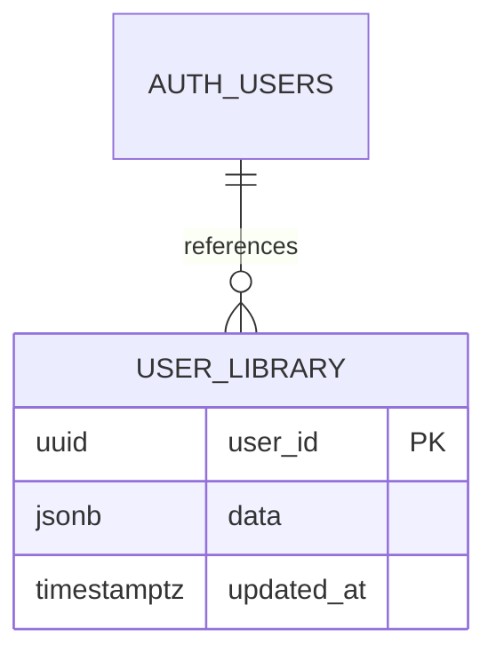
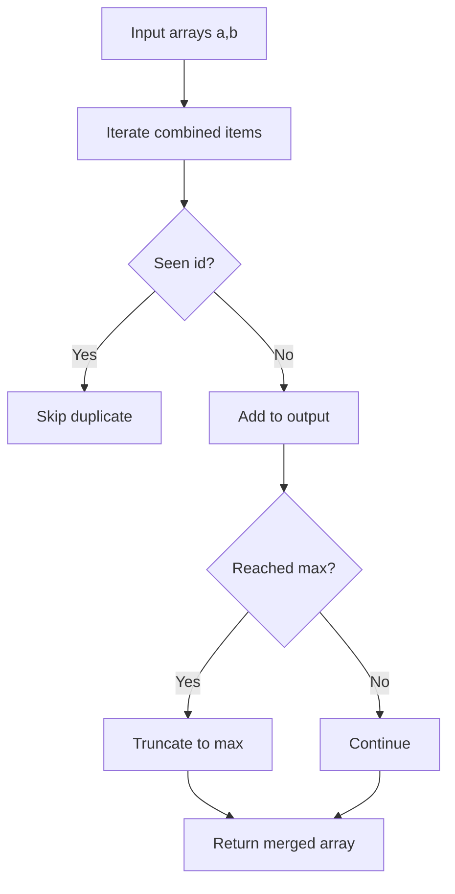
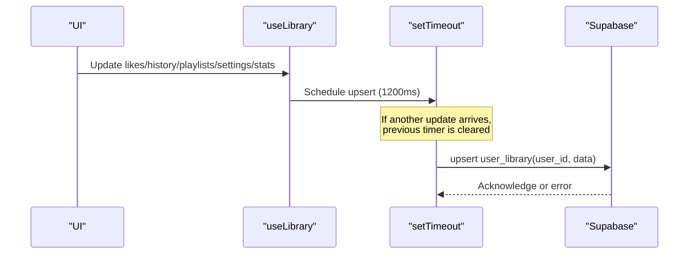
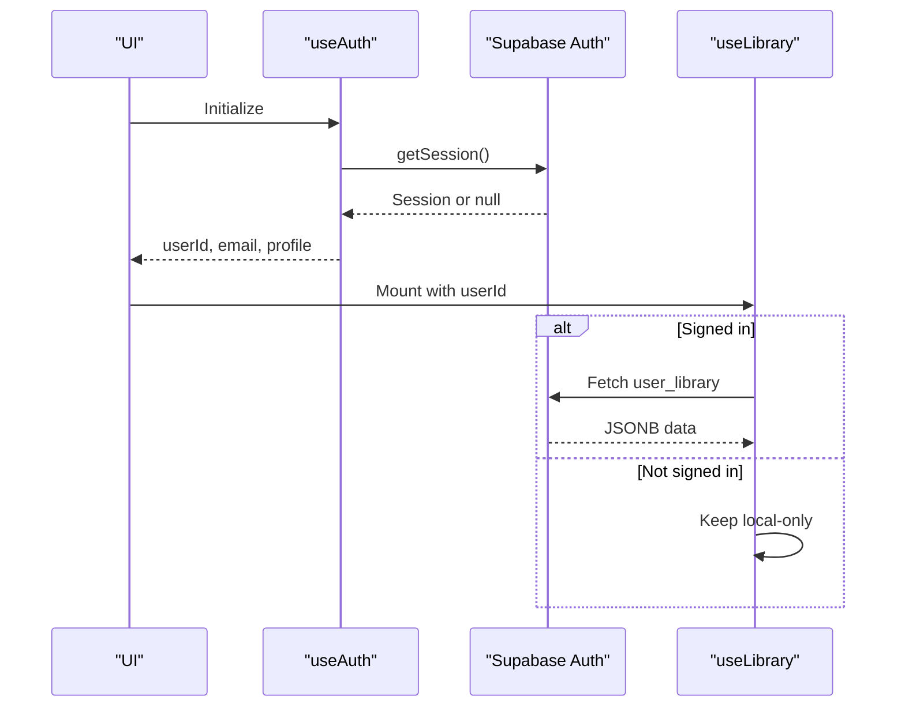
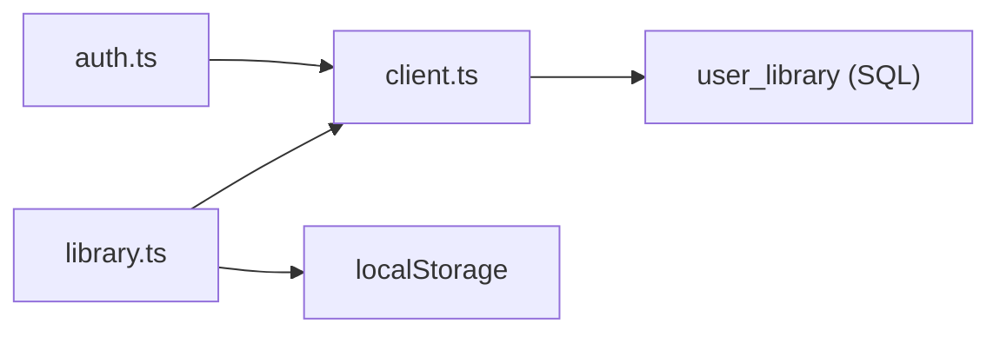

# Cloud Synchronization

<cite>
**Referenced Files in This Document**
- [library.ts](file://src/lib/library.ts)
- [client.ts](file://src/integrations/supabase/client.ts)
- [auth-attacher.ts](file://src/integrations/supabase/auth-attacher.ts)
- [auth.ts](file://src/lib/auth.ts)
- [20260808085443_8253f78c-652e-4cb4-8772-8818ce90215c.sql](file://supabase/migrations/20260808085443_8253f78c-652e-4cb4-8772-8818ce90215c.sql)
- [offline.ts](file://src/lib/offline.ts)
</cite>

## Table of Contents
1. [Introduction](#introduction)
2. [Project Structure](#project-structure)
3. [Core Components](#core-components)
4. [Architecture Overview](#architecture-overview)
5. [Detailed Component Analysis](#detailed-component-analysis)
6. [Dependency Analysis](#dependency-analysis)
7. [Performance Considerations](#performance-considerations)
8. [Troubleshooting Guide](#troubleshooting-guide)
9. [Conclusion](#conclusion)

## Introduction
This document explains the cloud synchronization system that provides cross-device continuity for a music application. It focuses on how the useLibrary hook manages local and cloud data states, integrates with Supabase to store user_library documents, and applies merge strategies to reconcile differences between devices. It also covers debounced syncing, authentication integration, and troubleshooting guidance for sync conflicts and network issues.

## Project Structure
The synchronization system spans several modules:
- Library state and sync logic live in the library module.
- Supabase client configuration is centralized in the integrations layer.
- Authentication context drives when and how sync occurs.
- Database schema defines where user_library is persisted.
- Offline utilities provide local storage for media, complementing cloud sync for metadata.

**Diagram sources**
- [library.ts:242-349](file://src/lib/library.ts#L242-L349)
- [client.ts:30-67](file://src/integrations/supabase/client.ts#L30-L67)
- [auth.ts:12-68](file://src/lib/auth.ts#L12-L68)
- [20260808085443_8253f78c-652e-4cb4-8772-8818ce90215c.sql:20-32](file://supabase/migrations/20260808085443_8253f78c-652e-4cb4-8772-8818ce90215c.sql#L20-L32)

**Section sources**
- [library.ts:242-349](file://src/lib/library.ts#L242-L349)
- [client.ts:30-67](file://src/integrations/supabase/client.ts#L30-L67)
- [auth.ts:12-68](file://src/lib/auth.ts#L12-L68)
- [20260808085443_8253f78c-652e-4cb4-8772-8818ce90215c.sql:20-32](file://supabase/migrations/20260808085443_8253f78c-652e-4cb4-8772-8818ce90215c.sql#L20-L32)

## Core Components
- useLibrary hook: Manages local-first state for likes, dislikes, history, playlists, settings, and stats; pulls from and pushes to Supabase when signed in.
- Supabase client: Provides authenticated access to user_library and profiles tables with environment-based configuration.
- Authentication hooks: Track session state and profile data, enabling conditional sync behavior based on userId.
- Database schema: Defines user_library with JSONB payload and row-level security policies.

Key responsibilities:
- Local persistence via localStorage for immediate responsiveness.
- Cloud persistence via Supabase upserts for cross-device consistency.
- Merge algorithms to combine local and cloud datasets without losing recent activity.
- Debounced writes to reduce API calls during rapid interactions.

**Section sources**
- [library.ts:242-557](file://src/lib/library.ts#L242-L557)
- [client.ts:30-67](file://src/integrations/supabase/client.ts#L30-L67)
- [auth.ts:12-68](file://src/lib/auth.ts#L12-L68)
- [20260808085443_8253f78c-652e-4cb4-8772-8818ce90215c.sql:20-32](file://supabase/migrations/20260808085443_8253f78c-652e-4cb4-8772-8818ce90215c.sql#L20-L32)

## Architecture Overview
The system follows a local-first architecture with eventual consistency to the cloud:
- On app load, local state is hydrated from localStorage.
- When a user signs in, the hook fetches the user_library document and merges it into local state using mergeById and mergeStats.
- User actions update local state immediately and trigger debounced writes to Supabase.
- Row-level security ensures users can only read/write their own records.

**Diagram sources**
- [library.ts:242-349](file://src/lib/library.ts#L242-L349)
- [client.ts:30-67](file://src/integrations/supabase/client.ts#L30-L67)
- [auth.ts:12-68](file://src/lib/auth.ts#L12-L68)
- [20260808085443_8253f78c-652e-4cb4-8772-8818ce90215c.sql:20-32](file://supabase/migrations/20260808085443_8253f78c-652e-4cb4-8772-8818ce90215c.sql#L20-L32)

## Detailed Component Analysis

### useLibrary Hook: Local and Cloud State Management
- Hydration: Reads local likes, dislikes, history, playlists, settings, and stats from localStorage on mount.
- Pull phase: Once hydrated and if userId is present, fetches the user_library document once per sign-in and merges it into local state.
- Push phase: Debounces writes to Supabase whenever any library field changes, ensuring efficient batching.
- Behavioral tracking: Updates stats for plays, skips, and completions, persisting locally and syncing later.

**Diagram sources**
- [library.ts:242-349](file://src/lib/library.ts#L242-L349)

**Section sources**
- [library.ts:242-349](file://src/lib/library.ts#L242-L349)

### Supabase Integration: Storing user_library Documents
- Schema: user_library stores a JSONB data column containing likes, dislikes, history, playlists, settings, and stats.
- Security: Row-level policies restrict access to the current user’s record.
- Client: Environment variables configure URL and publishable key; fetch wrapper handles modern API keys.

**Diagram sources**
- [20260808085443_8253f78c-652e-4cb4-8772-8818ce90215c.sql:20-32](file://supabase/migrations/20260808085443_8253f78c-652e-4cb4-8772-8818ce90215c.sql#L20-L32)

**Section sources**
- [client.ts:30-67](file://src/integrations/supabase/client.ts#L30-L67)
- [20260808085443_8253f78c-652e-4cb4-8772-8818ce90215c.sql:20-32](file://supabase/migrations/20260808085443_8253f78c-652e-4cb4-8772-8818ce90215c.sql#L20-L32)

### Merge Algorithms: Arrays and Behavioral Data
- mergeById: Deduplicates arrays by id while preserving order and applying a max length cap. Used for likes, dislikes, history, and playlists.
- mergeStats: Merges behavioral counters per track by taking the maximum of plays, skips, completions, and lastAt timestamps.

**Diagram sources**
- [library.ts:227-236](file://src/lib/library.ts#L227-L236)

**Section sources**
- [library.ts:209-236](file://src/lib/library.ts#L209-L236)

### Debounced Sync Mechanism
- The hook schedules a delayed write after each change to the library fields.
- The timer is cleared on unmount or when dependencies change, preventing redundant or stale writes.
- History is truncated before upload to limit payload size.

**Diagram sources**
- [library.ts:321-349](file://src/lib/library.ts#L321-L349)

**Section sources**
- [library.ts:321-349](file://src/lib/library.ts#L321-L349)

### Authentication Flow Integration and User Context
- useAuth tracks session changes and loads profile data when userId is available.
- useLibrary conditionally syncs based on userId presence and hydration status.
- Server-side middleware attaches bearer tokens for RPCs when needed.

**Diagram sources**
- [auth.ts:12-68](file://src/lib/auth.ts#L12-L68)
- [library.ts:242-349](file://src/lib/library.ts#L242-L349)
- [auth-attacher.ts:1-16](file://src/integrations/supabase/auth-attacher.ts#L1-L16)

**Section sources**
- [auth.ts:12-68](file://src/lib/auth.ts#L12-L68)
- [auth-attacher.ts:1-16](file://src/integrations/supabase/auth-attacher.ts#L1-L16)
- [library.ts:242-349](file://src/lib/library.ts#L242-L349)

## Dependency Analysis
- useLibrary depends on:
  - Supabase client for reading/writing user_library.
  - Local storage helpers for immediate persistence.
  - Authentication state to gate cloud operations.
- Supabase client depends on environment variables and uses a custom fetch wrapper to handle API key formats.
- Database schema enforces RLS policies to ensure data isolation per user.

**Diagram sources**
- [library.ts:242-349](file://src/lib/library.ts#L242-L349)
- [client.ts:30-67](file://src/integrations/supabase/client.ts#L30-L67)
- [auth.ts:12-68](file://src/lib/auth.ts#L12-L68)
- [20260808085443_8253f78c-652e-4cb4-8772-8818ce90215c.sql:20-32](file://supabase/migrations/20260808085443_8253f78c-652e-4cb4-8772-8818ce90215c.sql#L20-L32)

**Section sources**
- [library.ts:242-349](file://src/lib/library.ts#L242-L349)
- [client.ts:30-67](file://src/integrations/supabase/client.ts#L30-L67)
- [auth.ts:12-68](file://src/lib/auth.ts#L12-L68)
- [20260808085443_8253f78c-652e-4cb4-8772-8818ce90215c.sql:20-32](file://supabase/migrations/20260808085443_8253f78c-652e-4cb4-8772-8818ce90215c.sql#L20-L32)

## Performance Considerations
- Debounce interval reduces network churn during rapid interactions like liking multiple tracks.
- Array merges cap sizes to prevent oversized payloads and maintain performance.
- Stats merging uses max aggregation to avoid unnecessary increments and preserve recency.
- Lazy imports of Supabase client minimize initial bundle size and startup time.

[No sources needed since this section provides general guidance]

## Troubleshooting Guide
Common issues and resolutions:
- Missing environment variables: Ensure SUPABASE_URL and SUPABASE_PUBLISHABLE_KEY are set; the client throws an error if they are missing.
- Network errors during sync: The hook logs warnings when upsert fails; verify connectivity and retry later.
- Storage quota issues: Offline downloads check storage estimates and warn when space is low; clear unused downloads if necessary.
- Sync conflicts: mergeById preserves first-seen order and deduplicates by id; mergeStats takes the maximum counters and latest timestamp to resolve conflicts deterministically.
- Authentication gating: If userId is null, cloud sync is disabled; confirm session state and re-authenticate if needed.

**Section sources**
- [client.ts:30-67](file://src/integrations/supabase/client.ts#L30-L67)
- [library.ts:321-349](file://src/lib/library.ts#L321-L349)
- [offline.ts:58-141](file://src/lib/offline.ts#L58-L141)

## Conclusion
The synchronization system combines local-first responsiveness with reliable cloud persistence through Supabase. The useLibrary hook orchestrates hydration, merging, and debounced writes, while mergeById and mergeStats ensure consistent reconciliation across devices. Authentication context gates cloud operations, and robust error handling plus offline support improve resilience. This design delivers seamless cross-device continuity for user libraries and behavioral data.