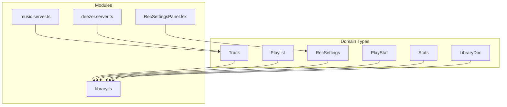
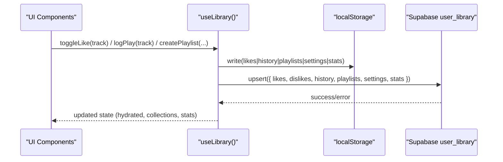
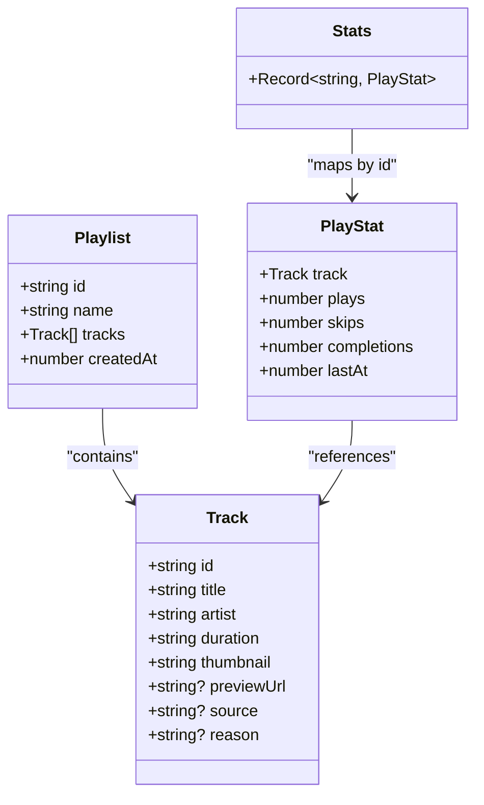
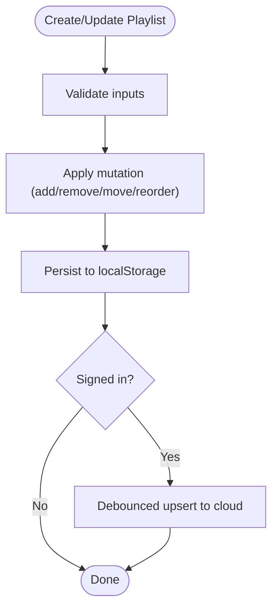
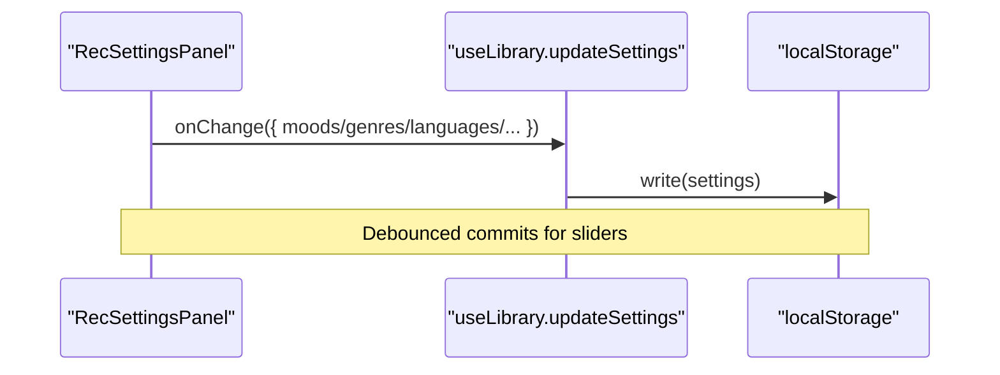
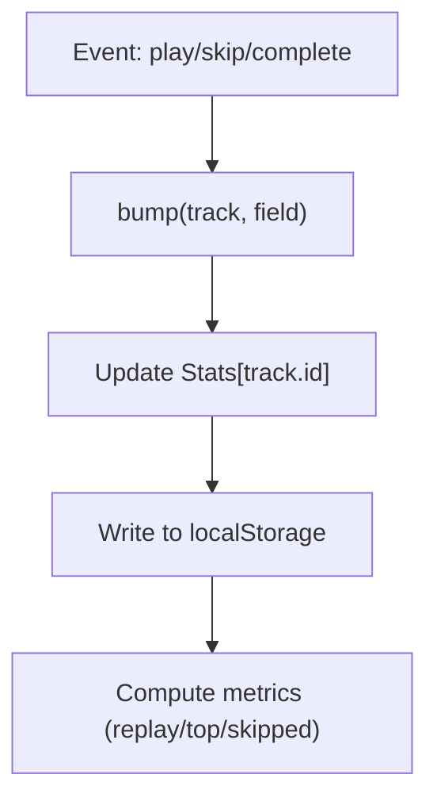
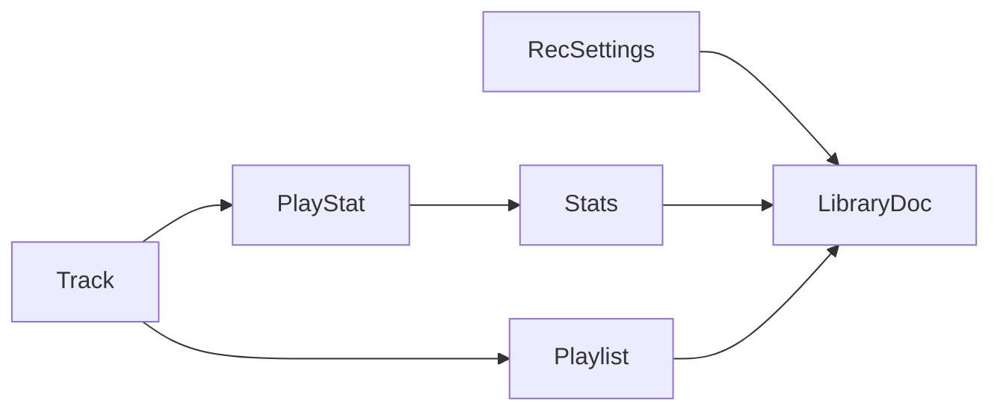

# Data Models & Types

<cite>
**Referenced Files in This Document**
- [library.ts](file://src/lib/library.ts)
- [music.server.ts](file://src/lib/music.server.ts)
- [deezer.server.ts](file://src/lib/deezer.server.ts)
- [RecSettingsPanel.tsx](file://src/components/music/RecSettingsPanel.tsx)
</cite>

## Table of Contents
1. [Introduction](#introduction)
2. [Project Structure](#project-structure)
3. [Core Components](#core-components)
4. [Architecture Overview](#architecture-overview)
5. [Detailed Component Analysis](#detailed-component-analysis)
6. [Dependency Analysis](#dependency-analysis)
7. [Performance Considerations](#performance-considerations)
8. [Troubleshooting Guide](#troubleshooting-guide)
9. [Conclusion](#conclusion)

## Introduction
This document describes the core data models that power the library management system for music and recommendations. It focuses on the Track interface, Playlist structure, LibraryDoc container, RecSettings model, and PlayStat/Stats types used to capture user behavior. It also explains how these entities relate to each other and provides usage examples grounded in the codebase.

## Project Structure
The data models are primarily defined in the library module and reused across server utilities and UI components:
- Core domain types (Track, Playlist, RecSettings, PlayStat, Stats, LibraryDoc) live in the library module.
- A parallel Track type exists in the server module for API boundaries.
- The Deezer integration maps external results into the shared Track shape.
- The recommendation settings panel consumes RecSettings constants and defaults.

**Diagram sources**
- [library.ts:3-21](file://src/lib/library.ts#L3-L21)
- [library.ts:68-121](file://src/lib/library.ts#L68-L121)
- [library.ts:200-207](file://src/lib/library.ts#L200-L207)
- [music.server.ts:1-13](file://src/lib/music.server.ts#L1-L13)
- [deezer.server.ts:9-73](file://src/lib/deezer.server.ts#L9-L73)
- [RecSettingsPanel.tsx:6-7](file://src/components/music/RecSettingsPanel.tsx#L6-L7)

**Section sources**
- [library.ts:3-21](file://src/lib/library.ts#L3-L21)
- [library.ts:68-121](file://src/lib/library.ts#L68-L121)
- [library.ts:200-207](file://src/lib/library.ts#L200-L207)
- [music.server.ts:1-13](file://src/lib/music.server.ts#L1-L13)
- [deezer.server.ts:9-73](file://src/lib/deezer.server.ts#L9-L73)
- [RecSettingsPanel.tsx:6-7](file://src/components/music/RecSettingsPanel.tsx#L6-L7)

## Core Components
This section documents each core data model with its properties, purpose, and relationships.

### Track
A normalized representation of a playable track from any source.

- Properties
  - id: string — unique identifier for the track
  - title: string — track title
  - artist: string — artist name
  - duration: string — human-readable duration
  - thumbnail: string — URL to cover art or preview image
  - previewUrl?: string — optional direct audio URL (e.g., Deezer preview) that bypasses the stream proxy
  - source?: "youtube" | "deezer" — indicates the provider; default is YouTube
  - reason?: string — optional AI recommendation reason shown in the feed

- Usage notes
  - Used throughout the app to represent a single song regardless of origin.
  - Optional fields enable flexible playback paths and richer metadata.

- Example usage patterns
  - Create a playlist entry by pushing a Track object into a Playlist.tracks array.
  - Log play/skip/completion events using the Track.id as the key in Stats.
  - Render a card using title, artist, and thumbnail; optionally show previewUrl if present.

**Section sources**
- [library.ts:3-14](file://src/lib/library.ts#L3-L14)
- [music.server.ts:1-13](file://src/lib/music.server.ts#L1-L13)
- [deezer.server.ts:63-73](file://src/lib/deezer.server.ts#L63-L73)

### Playlist
A named collection of tracks with creation time.

- Properties
  - id: string — unique playlist identifier
  - name: string — display name
  - tracks: Track[] — ordered list of tracks
  - createdAt: number — Unix timestamp when created

- Usage notes
  - Tracks within a playlist are deduplicated by id when adding.
  - Playlists can be renamed, reordered, and merged between devices via sync.

- Example usage patterns
  - Create a new playlist with an initial set of tracks.
  - Add/remove tracks by id while preserving order and avoiding duplicates.
  - Move selected tracks between playlists without duplication.

**Section sources**
- [library.ts:16-21](file://src/lib/library.ts#L16-L21)
- [library.ts:430-460](file://src/lib/library.ts#L430-L460)
- [library.ts:482-500](file://src/lib/library.ts#L482-L500)

### LibraryDoc
The main document representing a user’s library state. It aggregates likes, dislikes, history, playlists, settings, and stats.

- Properties
  - likes: Track[] — liked songs
  - dislikes: Track[] — disliked songs
  - history: Track[] — recent listening history
  - playlists: Playlist[] — user-created playlists
  - settings: RecSettings — recommendation preferences
  - stats?: Stats — optional behavioral statistics per track

- Usage notes
  - Synchronizes local state to the cloud account when signed in.
  - Merges remote and local lists by id to avoid duplicates and cap sizes.

- Example usage patterns
  - Persist the entire LibraryDoc to the database on changes (debounced).
  - Merge incoming remote doc with local state on sign-in.

**Section sources**
- [library.ts:200-207](file://src/lib/library.ts#L200-L207)
- [library.ts:262-313](file://src/lib/library.ts#L262-L313)
- [library.ts:321-349](file://src/lib/library.ts#L321-L349)

### RecSettings
User preferences that guide recommendations and discovery.

- Properties
  - moods: Record<string, number> — weighting per mood (0–100)
  - genres: string[] — preferred genres
  - languages: string[] — preferred languages
  - podcastTopics: string[] — topics for podcast mixes
  - injectInterval: number — insert fresh releases every N songs (0 = off)
  - notifyNewDrops: boolean — browser notifications for favorite artist drops
  - discovery: number — balance between familiar hits and deep cuts (0–100)
  - energy: number — target energy level (0–100)
  - instrumentalOnly: boolean — restrict to instrumental tracks

- Defaults and constants
  - Default values provide balanced starting points.
  - Enumerated sets include MOODS, GENRES, LANGUAGES, PODCAST_TOPICS.

- Example usage patterns
  - Update moods via sliders and commit on release to reduce writes.
  - Toggle genre/language/topic selections to refine recommendations.
  - Convert settings to a natural-language brief for AI prompts.

**Section sources**
- [library.ts:68-103](file://src/lib/library.ts#L68-L103)
- [library.ts:80-91](file://src/lib/library.ts#L80-L91)
- [RecSettingsPanel.tsx:17-61](file://src/components/music/RecSettingsPanel.tsx#L17-L61)
- [library.ts:563-588](file://src/lib/library.ts#L563-L588)

### PlayStat and Stats
Behavioral signals per track to inform recommendations and analytics.

- PlayStat
  - track: Track — reference to the track
  - plays: number — count of plays
  - skips: number — count of skips
  - completions: number — count of full listens
  - lastAt: number — timestamp of last interaction

- Stats
  - Record<string, PlayStat> — keyed by track id

- Usage notes
  - Incremented via logPlay, logSkip, logComplete.
  - Used to compute replay mixes, top artists, and skipped labels.

- Example usage patterns
  - On play: increment plays and update lastAt.
  - On skip: increment skips.
  - On completion: increment completions.
  - Compute “replay mix” by scoring plays and completions minus skips.

**Section sources**
- [library.ts:112-121](file://src/lib/library.ts#L112-L121)
- [library.ts:384-411](file://src/lib/library.ts#L384-L411)
- [library.ts:592-603](file://src/lib/library.ts#L592-L603)
- [library.ts:605-630](file://src/lib/library.ts#L605-L630)

## Architecture Overview
The data models form a cohesive layer that persists locally and synchronizes to the cloud when authenticated.

**Diagram sources**
- [library.ts:242-349](file://src/lib/library.ts#L242-L349)

## Detailed Component Analysis

### Track Model Deep Dive
- Purpose: Normalize tracks from multiple providers (YouTube, Deezer) into a single shape.
- Key behaviors:
  - Optional previewUrl allows direct playback for certain providers.
  - source field indicates provider for routing logic.
  - reason supports AI-driven explanations in the feed.

- Relationships:
  - Referenced by Playlist.tracks.
  - Referenced by PlayStat.track.
  - Aggregated in LibraryDoc.likes/dislikes/history.

**Diagram sources**
- [library.ts:3-21](file://src/lib/library.ts#L3-L21)
- [library.ts:112-121](file://src/lib/library.ts#L112-L121)

**Section sources**
- [library.ts:3-21](file://src/lib/library.ts#L3-L21)
- [music.server.ts:1-13](file://src/lib/music.server.ts#L1-L13)
- [deezer.server.ts:63-73](file://src/lib/deezer.server.ts#L63-L73)

### Playlist Management Flow
- Creation: generate id, set createdAt, persist to localStorage and cloud.
- Mutation: add/remove/move/reorder tracks with deduplication by id.
- Sync: merge remote and local playlists on sign-in.

**Diagram sources**
- [library.ts:422-515](file://src/lib/library.ts#L422-L515)
- [library.ts:262-313](file://src/lib/library.ts#L262-L313)

**Section sources**
- [library.ts:422-515](file://src/lib/library.ts#L422-L515)
- [library.ts:262-313](file://src/lib/library.ts#L262-L313)

### Recommendation Settings (RecSettings)
- Controls moods, genres, languages, podcast topics, injection cadence, notifications, discovery vs familiarity, energy, and instrumental-only mode.
- UI binds sliders and toggles to patch settings and apply changes.

**Diagram sources**
- [RecSettingsPanel.tsx:17-61](file://src/components/music/RecSettingsPanel.tsx#L17-L61)
- [library.ts:517-528](file://src/lib/library.ts#L517-L528)

**Section sources**
- [library.ts:68-103](file://src/lib/library.ts#L68-L103)
- [RecSettingsPanel.tsx:17-61](file://src/components/music/RecSettingsPanel.tsx#L17-L61)

### Behavioral Tracking (PlayStat/Stats)
- Events:
  - logPlay: increments plays, updates lastAt, adds to history.
  - logSkip: increments skips.
  - logComplete: increments completions.
- Analytics:
  - replayMix: scores tracks by plays/completions minus skips within a time window.
  - topArtists: ranks artists by combined play signals and likes.
  - skippedLabels: identifies frequently skipped tracks.

**Diagram sources**
- [library.ts:384-411](file://src/lib/library.ts#L384-L411)
- [library.ts:592-630](file://src/lib/library.ts#L592-L630)

**Section sources**
- [library.ts:384-411](file://src/lib/library.ts#L384-L411)
- [library.ts:592-630](file://src/lib/library.ts#L592-L630)

## Dependency Analysis
- Track is the central entity referenced by Playlist, PlayStat, and aggregated in LibraryDoc.
- RecSettings drives recommendation logic and is persisted alongside LibraryDoc.
- Stats depends on Track ids to aggregate behavior.
- Server-side Track type mirrors client Track for consistent payloads.

**Diagram sources**
- [library.ts:3-21](file://src/lib/library.ts#L3-L21)
- [library.ts:68-121](file://src/lib/library.ts#L68-L121)
- [library.ts:200-207](file://src/lib/library.ts#L200-L207)

**Section sources**
- [library.ts:3-21](file://src/lib/library.ts#L3-L21)
- [library.ts:68-121](file://src/lib/library.ts#L68-L121)
- [library.ts:200-207](file://src/lib/library.ts#L200-L207)

## Performance Considerations
- Local-first persistence reduces network calls; cloud sync is debounced to avoid spamming on rapid interactions.
- Lists are capped (e.g., history and likes limited to a maximum size) to control storage and memory.
- Stats merging uses max counters to reconcile conflicts during multi-device sync.
- Search results are cached server-side to reduce repeated network requests.

[No sources needed since this section provides general guidance]

## Troubleshooting Guide
- If recommendations feel off:
  - Verify RecSettings moods weights and genres/languages selections.
  - Ensure enough play/skip/completion events have been recorded to build meaningful Stats.
- If sync fails:
  - Check network connectivity and authentication status.
  - Review console warnings for sync errors and retry after resolving issues.
- If playback does not start:
  - Confirm Track has either a valid stream endpoint or a direct previewUrl.
  - For Deezer-sourced tracks, ensure previewUrl is present.

**Section sources**
- [library.ts:321-349](file://src/lib/library.ts#L321-L349)
- [library.ts:592-630](file://src/lib/library.ts#L592-L630)
- [deezer.server.ts:63-73](file://src/lib/deezer.server.ts#L63-L73)

## Conclusion
The data models in this library management system are designed for flexibility and performance. Track normalizes media from different sources, Playlist organizes collections, RecSettings personalizes recommendations, and PlayStat/Stats captures behavior to drive insights and future picks. LibraryDoc ties everything together for local-first storage and seamless cloud synchronization. Together, these models enable a responsive, personalized music experience.