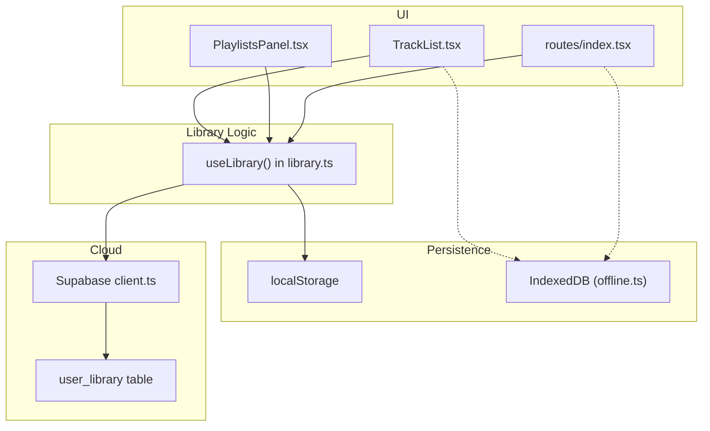
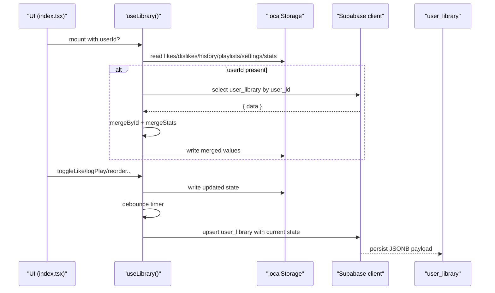
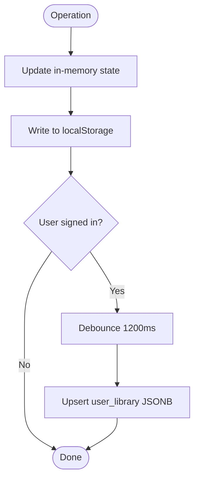
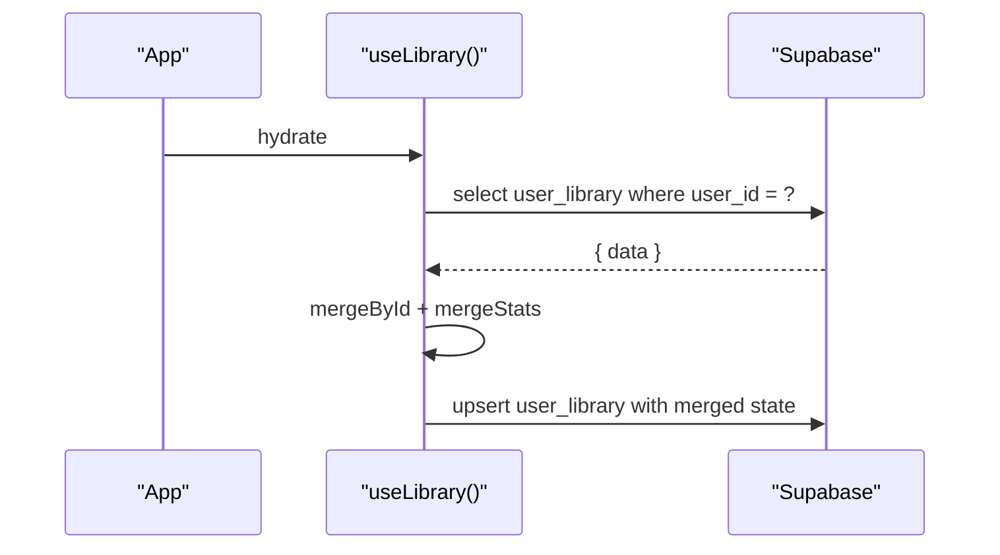
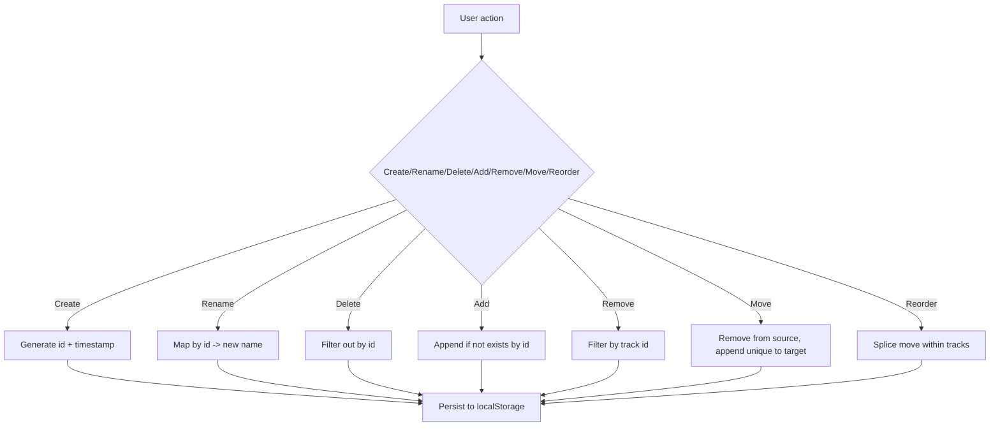
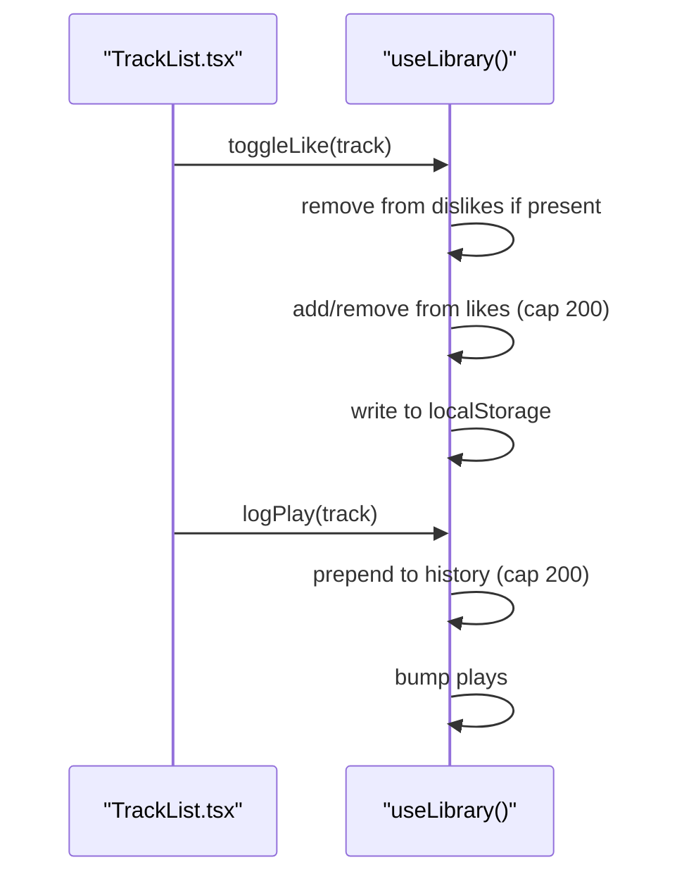
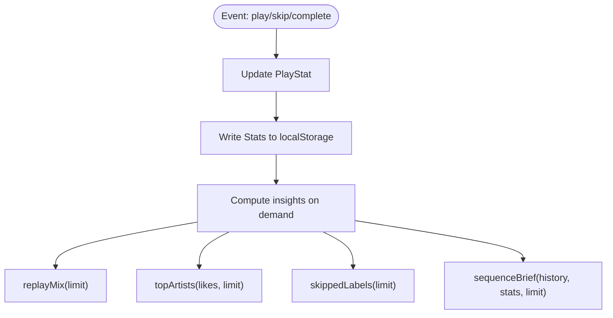
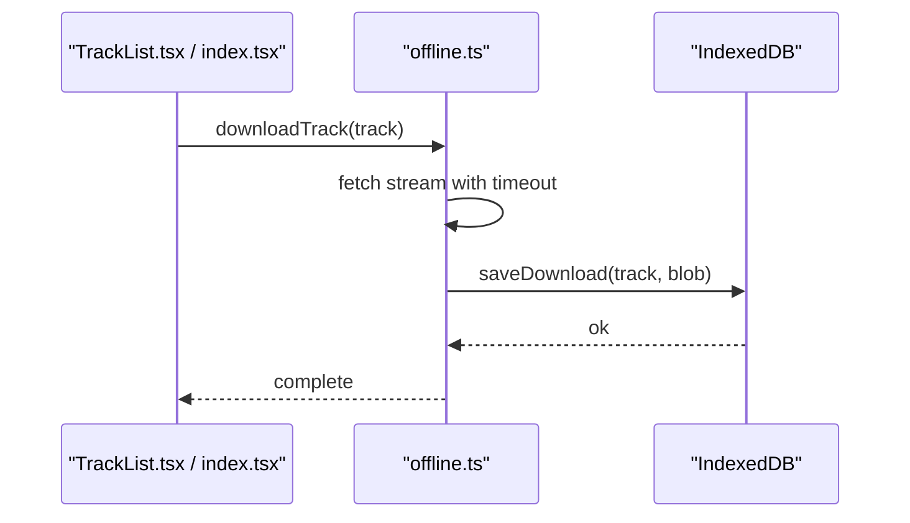
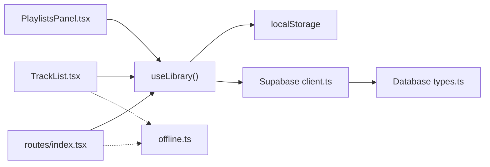

# Library Management

<cite>
**Referenced Files in This Document**
- [library.ts](file://src/lib/library.ts)
- [client.ts](file://src/integrations/supabase/client.ts)
- [types.ts](file://src/integrations/supabase/types.ts)
- [20260808085443_8253f78c-652e-4cb4-8772-8818ce90215c.sql](file://supabase/migrations/20260808085443_8253f78c-652e-4cb4-8772-8818ce90215c.sql)
- [20260808085506_fb5fd43f-6504-4c96-8335-2aeac753c924.sql](file://supabase/migrations/20260808085506_fb5fd43f-6504-4c96-8335-2aeac753c924.sql)
- [index.tsx](file://src/routes/index.tsx)
- [TrackList.tsx](file://src/components/music/TrackList.tsx)
- [PlaylistsPanel.tsx](file://src/components/music/PlaylistsPanel.tsx)
- [offline.ts](file://src/lib/offline.ts)
</cite>

## Table of Contents
1. Introduction
2. Project Structure
3. Core Components
4. Architecture Overview
5. Detailed Component Analysis
6. Dependency Analysis
7. Performance Considerations
8. Troubleshooting Guide
9. Conclusion

## Introduction
This document explains the library management system that powers local-first music preferences, playlists, and listening history with optional cloud synchronization for cross-device continuity. It covers data models (LibraryDoc, Track, DownloadInfo), the local storage strategy, Supabase-backed sync, playlist creation and management, statistics tracking, and performance considerations for large libraries.

## Project Structure
The library logic is implemented as a React hook that manages state in memory and persists it to localStorage. When a user is authenticated, the hook pulls their cloud-stored library from Supabase and merges it with local data. Changes are debounced and pushed back to the cloud. UI components consume the hook to render tracks, manage playlists, and interact with downloads.

**Diagram sources**
- [library.ts:242-349](file://src/lib/library.ts#L242-L349)
- [client.ts:30-69](file://src/integrations/supabase/client.ts#L30-L69)
- [20260808085443_8253f78c-652e-4cb4-8772-8818ce90215c.sql:20-32](file://supabase/migrations/20260808085443_8253f78c-652e-4cb4-8772-8818ce90215c.sql#L20-L32)
- [TrackList.tsx:158-241](file://src/components/music/TrackList.tsx#L158-L241)
- [PlaylistsPanel.tsx:61-310](file://src/components/music/PlaylistsPanel.tsx#L61-L310)
- [offline.ts:58-141](file://src/lib/offline.ts#L58-L141)

**Section sources**
- [library.ts:105-147](file://src/lib/library.ts#L105-L147)
- [client.ts:30-69](file://src/integrations/supabase/client.ts#L30-L69)
- [20260808085443_8253f78c-652e-4cb4-8772-8818ce90215c.sql:20-32](file://supabase/migrations/20260808085443_8253f78c-652e-4cb4-8772-8818ce90215c.sql#L20-L32)

## Core Components
- useLibrary(): A React hook that:
  - Initializes state from localStorage
  - Pulls and merges cloud data when userId changes
  - Debounces writes to Supabase
  - Exposes operations for likes/dislikes, history, playlists, settings, and stats
- Data models:
  - Track: identifies a playable item with metadata
  - Playlist: named collection of tracks with creation timestamp
  - LibraryDoc: the canonical shape synced to Supabase
  - PlayStat and Stats: behavioral counters per track
  - DownloadInfo: offline download metadata
- Offline storage:
  - IndexedDB-based download manager with save/list/remove/clear utilities

Key responsibilities:
- Local-first persistence via localStorage keys for likes, dislikes, history, playlists, settings, stats
- Cloud sync via Supabase user_library JSONB column
- Playlist CRUD and reordering
- Behavioral statistics and derived insights

**Section sources**
- [library.ts:3-21](file://src/lib/library.ts#L3-L21)
- [library.ts:112-121](file://src/lib/library.ts#L112-L121)
- [library.ts:200-207](file://src/lib/library.ts#L200-L207)
- [offline.ts:97-101](file://src/lib/offline.ts#L97-L101)

## Architecture Overview
The system follows a local-first architecture:
- All user interactions update in-memory state and immediately persist to localStorage
- On sign-in, the app fetches the user’s cloud library and merges it into local state using id-based deduplication and limits
- Changes are debounced and upserted to the cloud; on next login or device, the latest merged state is pulled down

**Diagram sources**
- [library.ts:251-313](file://src/lib/library.ts#L251-L313)
- [library.ts:321-349](file://src/lib/library.ts#L321-L349)
- [client.ts:30-69](file://src/integrations/supabase/client.ts#L30-L69)
- [20260808085443_8253f78c-652e-4cb4-8772-8818ce90215c.sql:20-32](file://supabase/migrations/20260808085443_8253f78c-652e-4cb4-8772-8818ce90215c.sql#L20-L32)

## Detailed Component Analysis

### Data Models
- Track: unique identifier, title, artist, duration, thumbnail, optional previewUrl and source provider
- Playlist: unique id, name, ordered tracks array, createdAt timestamp
- LibraryDoc: top-level container for likes, dislikes, history, playlists, settings, and optional stats
- PlayStat and Stats: per-track behavioral counters (plays, skips, completions) and last interaction time
- DownloadInfo: offline metadata including track reference, size, and savedAt timestamp

Complexity notes:
- Lists are capped at bounded sizes during merge and sync to control memory and payload size
- Stats merging uses max aggregation to avoid overwriting newer counts with older ones

**Section sources**
- [library.ts:3-21](file://src/lib/library.ts#L3-L21)
- [library.ts:112-121](file://src/lib/library.ts#L112-L121)
- [library.ts:200-207](file://src/lib/library.ts#L200-L207)
- [offline.ts:97-101](file://src/lib/offline.ts#L97-L101)

### Local Storage and Persistence Strategy
- Keys:
  - Likes, Dislikes, History, Playlists, Settings, Stats, Playback, Episode Positions
- Read/write helpers handle errors gracefully and log warnings
- Playback and episode positions enable resume across sessions

**Diagram sources**
- [library.ts:125-147](file://src/lib/library.ts#L125-L147)
- [library.ts:321-349](file://src/lib/library.ts#L321-L349)

**Section sources**
- [library.ts:105-147](file://src/lib/library.ts#L105-L147)
- [library.ts:157-197](file://src/lib/library.ts#L157-L197)

### Cloud Synchronization with Supabase
- Schema:
  - user_library: user_id (PK), data (JSONB), updated_at
  - Row-level security policies restrict access to the current user
- Sync behavior:
  - On hydration, if userId exists, fetch and merge cloud data into local state
  - Debounced upsert pushes local state to cloud
  - Merging rules:
    - Arrays: id-based deduplication with a cap
    - Stats: field-wise max to preserve higher counts and latest timestamps

**Diagram sources**
- [library.ts:262-313](file://src/lib/library.ts#L262-L313)
- [library.ts:321-349](file://src/lib/library.ts#L321-L349)
- [20260808085443_8253f78c-652e-4cb4-8772-8818ce90215c.sql:20-32](file://supabase/migrations/20260808085443_8253f78c-652e-4cb4-8772-8818ce90215c.sql#L20-L32)

**Section sources**
- [client.ts:30-69](file://src/integrations/supabase/client.ts#L30-L69)
- [types.ts:41-58](file://src/integrations/supabase/types.ts#L41-L58)
- [20260808085443_8253f78c-652e-4cb4-8772-8818ce90215c.sql:20-32](file://supabase/migrations/20260808085443_8253f78c-652e-4cb4-8772-8818ce90215c.sql#L20-L32)

### Playlist Creation and Management
- Create: generate unique id, set createdAt, prepend to list
- Rename/Delete: update or filter playlists
- Add/Remove/Multi-remove: ensure no duplicate tracks by id
- Move between playlists: remove from source and append non-duplicates to target
- Reorder: drag-and-drop updates order within a playlist

**Diagram sources**
- [library.ts:422-515](file://src/lib/library.ts#L422-L515)
- [PlaylistsPanel.tsx:61-310](file://src/components/music/PlaylistsPanel.tsx#L61-L310)

**Section sources**
- [library.ts:422-515](file://src/lib/library.ts#L422-L515)
- [PlaylistsPanel.tsx:61-310](file://src/components/music/PlaylistsPanel.tsx#L61-L310)

### Track Organization and Interaction
- Like/Dislike toggles maintain separate lists and enforce caps
- History logs plays while removing duplicates to keep ordering meaningful
- Behavioral stats bump plays/skips/completions and update lastAt timestamps

**Diagram sources**
- [library.ts:353-411](file://src/lib/library.ts#L353-L411)
- [TrackList.tsx:183-206](file://src/components/music/TrackList.tsx#L183-L206)

**Section sources**
- [library.ts:353-411](file://src/lib/library.ts#L353-L411)
- [TrackList.tsx:183-206](file://src/components/music/TrackList.tsx#L183-L206)

### Statistics Tracking and Insights
- Stats accumulate per track: plays, skips, completions, lastAt
- Derived utilities:
  - Replay mix: recent high-engagement tracks
  - Top artists: weighted by plays/completions minus skips plus likes
  - Skipped labels: strong negative signals
  - Sequence brief: recent actions summarized

**Diagram sources**
- [library.ts:384-411](file://src/lib/library.ts#L384-L411)
- [library.ts:592-645](file://src/lib/library.ts#L592-L645)

**Section sources**
- [library.ts:384-411](file://src/lib/library.ts#L384-L411)
- [library.ts:592-645](file://src/lib/library.ts#L592-L645)

### Offline Downloads and DownloadInfo
- DownloadInfo describes an offline asset: track, size, savedAt
- IndexedDB stores audio blobs keyed by track id
- Utilities support saving, listing, removing, clearing, and total size calculation
- Download flow streams content through a proxy endpoint and persists the blob

**Diagram sources**
- [offline.ts:58-141](file://src/lib/offline.ts#L58-L141)
- [offline.ts:149-200](file://src/lib/offline.ts#L149-L200)
- [TrackList.tsx:158-181](file://src/components/music/TrackList.tsx#L158-L181)
- [index.tsx:683-714](file://src/routes/index.tsx#L683-L714)

**Section sources**
- [offline.ts:97-141](file://src/lib/offline.ts#L97-L141)
- [offline.ts:149-200](file://src/lib/offline.ts#L149-L200)
- [TrackList.tsx:158-181](file://src/components/music/TrackList.tsx#L158-L181)
- [index.tsx:683-714](file://src/routes/index.tsx#L683-L714)

## Dependency Analysis
- UI depends on useLibrary for state and operations
- useLibrary depends on:
  - localStorage for immediate persistence
  - Supabase client for cloud sync
  - Types for database schema
- Offline module is independent and used by UI for downloads

**Diagram sources**
- [library.ts:242-349](file://src/lib/library.ts#L242-L349)
- [client.ts:30-69](file://src/integrations/supabase/client.ts#L30-L69)
- [types.ts:41-58](file://src/integrations/supabase/types.ts#L41-L58)
- [offline.ts:58-141](file://src/lib/offline.ts#L58-L141)

**Section sources**
- [library.ts:242-349](file://src/lib/library.ts#L242-L349)
- [client.ts:30-69](file://src/integrations/supabase/client.ts#L30-L69)
- [types.ts:41-58](file://src/integrations/supabase/types.ts#L41-L58)

## Performance Considerations
- List capping:
  - Likes, dislikes, history capped at 200 items to prevent unbounded growth
  - History slice limited to 100 when syncing to reduce payload size
- Merge strategies:
  - Id-based deduplication avoids duplicates and preserves order
  - Stats merging uses max aggregation to retain the most recent/higher values
- Debounced sync:
  - 1200ms delay reduces network churn during rapid interactions
- Storage quotas:
  - Offline downloads check storage estimates and warn when low
  - IndexedDB operations wrapped in transactions with error handling
- Large libraries:
  - Keep only necessary fields in synced payloads
  - Use capped arrays and selective sync to minimize bandwidth and memory

[No sources needed since this section provides general guidance]

## Troubleshooting Guide
Common issues and resolutions:
- Sync failures:
  - Check console warnings for “Library sync failed” messages
  - Verify environment variables for Supabase URL and key
  - Ensure RLS policies allow authenticated users to read/write user_library
- Missing environment variables:
  - The Supabase client throws an error if required env vars are absent
- Storage quota exceeded:
  - Offline downloads may fail due to insufficient space; clear downloads or free space
- Corrupted localStorage:
  - Read/write helpers catch exceptions and return fallbacks; consider clearing affected keys

**Section sources**
- [library.ts:125-147](file://src/lib/library.ts#L125-L147)
- [library.ts:321-349](file://src/lib/library.ts#L321-L349)
- [client.ts:30-69](file://src/integrations/supabase/client.ts#L30-L69)
- [offline.ts:58-141](file://src/lib/offline.ts#L58-L141)

## Conclusion
The library management system provides a robust local-first experience with seamless cloud synchronization. It supports rich features like likes/dislikes, playlists, history, behavioral statistics, and offline downloads. The design balances responsiveness with reliability through careful merging, debouncing, and bounded data structures. For large libraries, the built-in caps and efficient sync patterns help maintain performance and stability.