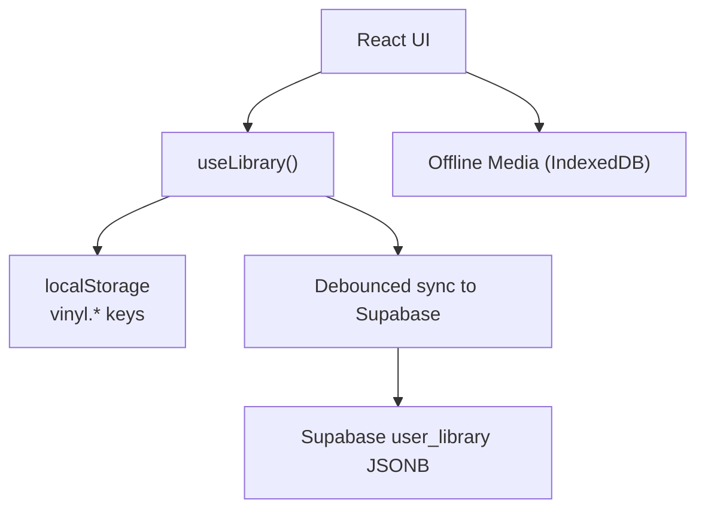
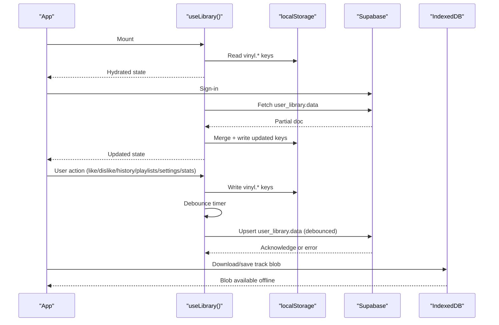
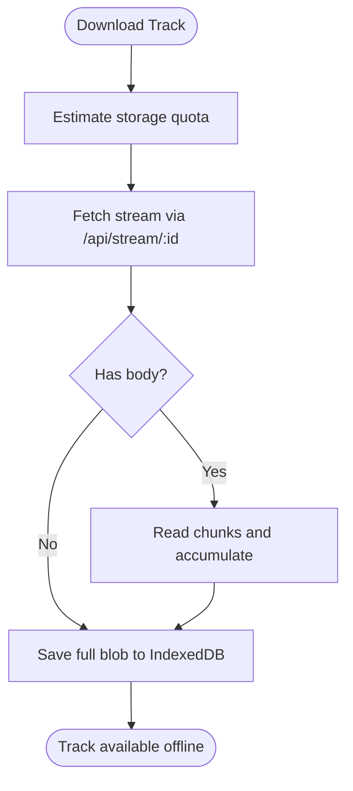
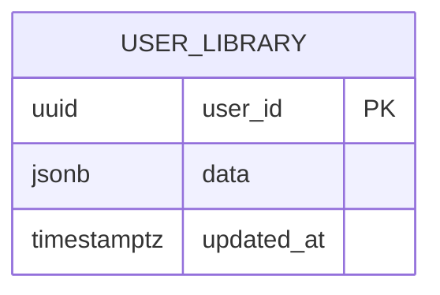
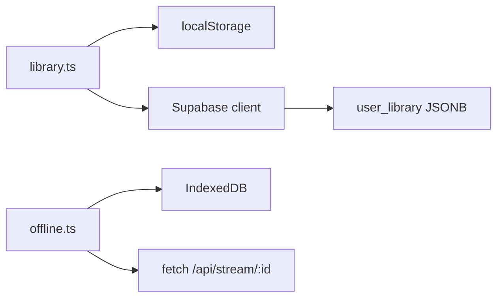

# Local Storage & Persistence

<cite>
**Referenced Files in This Document**
- [library.ts](file://src/lib/library.ts)
- [offline.ts](file://src/lib/offline.ts)
- [client.ts](file://src/integrations/supabase/client.ts)
- [20260808085443_8253f78c-652e-4cb4-8772-8818ce90215c.sql](file://supabase/migrations/20260808085443_8253f78c-652e-4cb4-8772-8818ce90215c.sql)
</cite>

## Table of Contents
1. [Introduction](#introduction)
2. [Project Structure](#project-structure)
3. [Core Components](#core-components)
4. [Architecture Overview](#architecture-overview)
5. [Detailed Component Analysis](#detailed-component-analysis)
6. [Dependency Analysis](#dependency-analysis)
7. [Performance Considerations](#performance-considerations)
8. [Troubleshooting Guide](#troubleshooting-guide)
9. [Conclusion](#conclusion)

## Introduction
This document explains the local-first storage architecture used by the library system to persist user data such as likes, dislikes, history, playlists, settings, and statistics. It covers how localStorage is used for durable client-side state, the read/write utilities with error handling, naming conventions using vinyl.* prefixes, hydration on app startup, debounced synchronization to cloud storage when available, storage limits, data migration strategies, and conflict resolution during sync operations.

## Project Structure
The persistence layer spans three main areas:
- Client-side state and localStorage persistence via a React hook and utility functions
- Offline media storage via IndexedDB for downloaded tracks
- Cloud synchronization via Supabase when the user is signed in

**Diagram sources**
- [library.ts:125-143](file://src/lib/library.ts#L125-L143)
- [library.ts:242-349](file://src/lib/library.ts#L242-L349)
- [offline.ts:58-147](file://src/lib/offline.ts#L58-L147)
- [client.ts:30-55](file://src/integrations/supabase/client.ts#L30-L55)
- [20260808085443_8253f78c-652e-4cb4-8772-8818ce90215c.sql:20-32](file://supabase/migrations/20260808085443_8253f78c-652e-4cb4-8772-8818ce90215c.sql#L20-L32)

**Section sources**
- [library.ts:125-143](file://src/lib/library.ts#L125-L143)
- [library.ts:242-349](file://src/lib/library.ts#L242-L349)
- [offline.ts:58-147](file://src/lib/offline.ts#L58-L147)
- [client.ts:30-55](file://src/integrations/supabase/client.ts#L30-L55)
- [20260808085443_8253f78c-652e-4cb4-8772-8818ce90215c.sql:20-32](file://supabase/migrations/20260808085443_8253f78c-652e-4cb4-8772-8818ce90215c.sql#L20-L32)

## Core Components
- Local storage read/write utilities:
  - A generic read function that safely reads from localStorage with fallbacks and error logging
  - A write function that serializes values and handles quota or serialization errors gracefully
- Vinyl key constants:
  - Each data category uses a versioned vinyl.* prefix for clear separation and future migrations
- useLibrary hook:
  - Hydrates state from localStorage on mount
  - Merges server data into local state on sign-in
  - Debounces writes back to the server
  - Exposes actions to mutate likes, dislikes, history, playlists, settings, and stats
- Offline media storage:
  - IndexedDB-backed store for audio blobs with quota checks and helpers

**Section sources**
- [library.ts:125-143](file://src/lib/library.ts#L125-L143)
- [library.ts:105-110](file://src/lib/library.ts#L105-L110)
- [library.ts:242-349](file://src/lib/library.ts#L242-L349)
- [offline.ts:58-147](file://src/lib/offline.ts#L58-L147)

## Architecture Overview
The system follows a local-first pattern:
- All user interactions update local state immediately and persist to localStorage
- When a user is authenticated, the app pulls their cloud profile once and merges it into local state
- Subsequent changes are debounced and pushed back to the cloud
- Large media assets are stored offline in IndexedDB to enable playback without network

**Diagram sources**
- [library.ts:251-349](file://src/lib/library.ts#L251-L349)
- [offline.ts:149-200](file://src/lib/offline.ts#L149-L200)
- [client.ts:30-55](file://src/integrations/supabase/client.ts#L30-L55)
- [20260808085443_8253f78c-652e-4cb4-8772-8818ce90215c.sql:20-32](file://supabase/migrations/20260808085443_8253f78c-652e-4cb4-8772-8818ce90215c.sql#L20-L32)

## Detailed Component Analysis

### localStorage Read/Write Utilities
- read(key, fallback):
  - Safely retrieves JSON from localStorage
  - Returns fallback if missing or parse fails
  - Logs warnings on errors
- write(key, value):
  - Serializes and stores JSON
  - Catches and logs errors (e.g., quota exceeded)
  - No-op in non-browser environments

These utilities centralize error handling and ensure consistent behavior across all vinyl.* keys.

**Section sources**
- [library.ts:125-143](file://src/lib/library.ts#L125-L143)

### Vinyl Key Naming Conventions
Versioned keys isolate data categories and allow safe schema evolution:
- vinyl.likes.v1
- vinyl.dislikes.v1
- vinyl.history.v1
- vinyl.playlists.v1
- vinyl.recsettings.v1
- vinyl.stats.v1
- vinyl.playback.v1
- vinyl.episodePositions.v1

Using version suffixes enables future migrations without breaking older stored formats.

**Section sources**
- [library.ts:105-110](file://src/lib/library.ts#L105-L110)
- [library.ts:149-169](file://src/lib/library.ts#L149-L169)

### Hydration on App Startup
- On mount, the hook reads all vinyl.* keys and initializes state
- Settings are merged with defaults to ensure new fields exist
- After hydration, the hook signals readiness so other components can render with accurate state

**Section sources**
- [library.ts:251-259](file://src/lib/library.ts#L251-L259)

### Cloud Sync: Pull and Push
- Pull:
  - Once per sign-in, fetches user_library.data from Supabase
  - Merges arrays by id with a cap to prevent unbounded growth
  - Merges stats by taking max counters and last timestamps
  - Writes merged results back to localStorage
- Push:
  - Debounced effect watches state changes and upserts user_library.data
  - History is truncated before upload to reduce payload size
  - Errors are logged but do not block UI

Conflict resolution strategy:
- Arrays (likes, dislikes, history, playlists) are merged by unique id with a maximum length to avoid excessive storage usage
- Stats are merged by taking the maximum of counters and last timestamp to preserve latest activity
- Settings are merged by spreading defaults then overlaying server values

**Section sources**
- [library.ts:262-313](file://src/lib/library.ts#L262-L313)
- [library.ts:321-349](file://src/lib/library.ts#L321-L349)
- [library.ts:209-236](file://src/lib/library.ts#L209-L236)

### Data Mutations and Persistence
- Likes/Dislikes:
  - Toggle-like removes from dislikes and adds/removes from likes; both persisted immediately
  - Toggle-dislike removes from likes and adds/removes from dislikes; both persisted immediately
- History:
  - New plays are prepended and deduplicated; capped at a fixed size
- Playlists:
  - Create/rename/delete/add/remove/reorder/move operations update state and persist
- Settings:
  - Update merges patches; reset restores defaults; both persisted
- Stats:
  - Plays/skips/completions increment counters and update lastAt; persisted

All mutations call the centralized write utility to ensure consistent error handling.

**Section sources**
- [library.ts:353-528](file://src/lib/library.ts#L353-L528)

### Offline Media Storage (IndexedDB)
- Tracks are downloaded through a proxy endpoint and saved as blobs in an object store
- Quota estimation warns when storage is running low
- Helpers support saving, retrieving, listing, removing, clearing, and computing total size
- Streaming download supports progress callbacks and timeouts

**Diagram sources**
- [offline.ts:58-83](file://src/lib/offline.ts#L58-L83)
- [offline.ts:149-200](file://src/lib/offline.ts#L149-L200)

**Section sources**
- [offline.ts:58-147](file://src/lib/offline.ts#L58-L147)
- [offline.ts:149-200](file://src/lib/offline.ts#L149-L200)

### Cloud Schema and Access Control
- user_library table stores a JSONB data field per user_id
- Row-level security policies restrict access to the current user’s row
- Triggers update timestamps automatically

**Diagram sources**
- [20260808085443_8253f78c-652e-4cb4-8772-8818ce90215c.sql:20-32](file://supabase/migrations/20260808085443_8253f78c-652e-4cb4-8772-8818ce90215c.sql#L20-L32)

**Section sources**
- [20260808085443_8253f78c-652e-4cb4-8772-8818ce90215c.sql:20-32](file://supabase/migrations/20260808085443_8253f78c-652e-4cb4-8772-8818ce90215c.sql#L20-L32)

## Dependency Analysis
- useLibrary depends on:
  - localStorage via read/write utilities
  - Supabase client for pull/push when userId is present
- Offline media storage depends on:
  - IndexedDB API
  - Network fetch for streaming downloads
- Supabase client configuration:
  - Uses environment variables for URL and publishable key
  - Persists auth session in localStorage

**Diagram sources**
- [library.ts:242-349](file://src/lib/library.ts#L242-L349)
- [offline.ts:58-147](file://src/lib/offline.ts#L58-L147)
- [client.ts:30-55](file://src/integrations/supabase/client.ts#L30-L55)
- [20260808085443_8253f78c-652e-4cb4-8772-8818ce90215c.sql:20-32](file://supabase/migrations/20260808085443_8253f78c-652e-4cb4-8772-8818ce90215c.sql#L20-L32)

**Section sources**
- [library.ts:242-349](file://src/lib/library.ts#L242-L349)
- [offline.ts:58-147](file://src/lib/offline.ts#L58-L147)
- [client.ts:30-55](file://src/integrations/supabase/client.ts#L30-L55)
- [20260808085443_8253f78c-652e-4cb4-8772-8818ce90215c.sql:20-32](file://supabase/migrations/20260808085443_8253f78c-652e-4cb4-8772-8818ce90215c.sql#L20-L32)

## Performance Considerations
- Debounced sync reduces network calls during rapid user interactions
- Array sizes are capped to prevent localStorage bloat and large payloads
- History is truncated before uploading to keep payloads small
- Stats merging preserves only necessary counters and timestamps
- Offline downloads stream data and warn on low storage to avoid filling quotas

[No sources needed since this section provides general guidance]

## Troubleshooting Guide
Common issues and where they are handled:
- localStorage read failures:
  - The read utility catches exceptions and returns a fallback, logging a warning
- localStorage write failures:
  - The write utility catches exceptions (e.g., quota exceeded), logs a warning, and continues
- Sync failures:
  - Errors from Supabase upsert are logged; UI remains functional
- Offline media retrieval:
  - getBlob returns null on errors; callers should handle absence gracefully
- Storage quota warnings:
  - Before saving blobs, the code estimates remaining quota and warns when low

Operational tips:
- If sync appears stuck, verify the user is signed in and the debounced timer has fired
- If localStorage seems corrupted, clearing relevant vinyl.* keys will rehydrate from defaults and server data on next sign-in
- For offline playback issues, check IndexedDB availability and quota warnings

**Section sources**
- [library.ts:125-143](file://src/lib/library.ts#L125-L143)
- [library.ts:321-349](file://src/lib/library.ts#L321-L349)
- [offline.ts:85-95](file://src/lib/offline.ts#L85-L95)
- [offline.ts:58-72](file://src/lib/offline.ts#L58-L72)

## Conclusion
The library system implements a robust local-first architecture:
- Immediate, persistent updates via localStorage with versioned vinyl.* keys
- Safe read/write utilities with graceful error handling
- Seamless hydration and merge-on-sign-in with cloud data
- Debounced push to maintain consistency across devices
- Offline media storage for uninterrupted playback
- Built-in safeguards against storage limits and conflicts

This design ensures responsiveness, resilience, and cross-device continuity while keeping the user experience smooth even under poor connectivity.