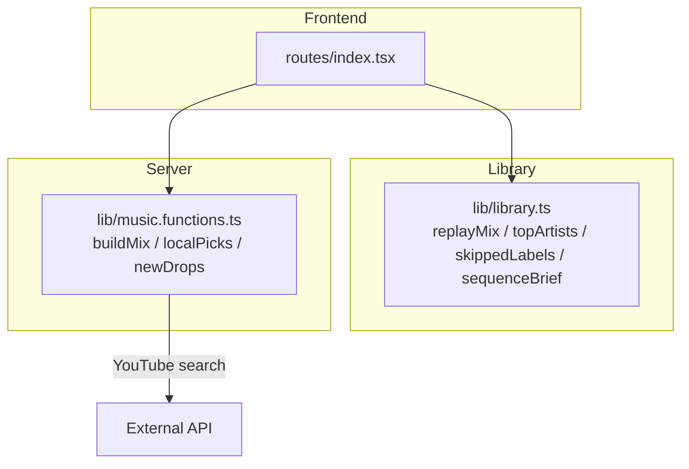
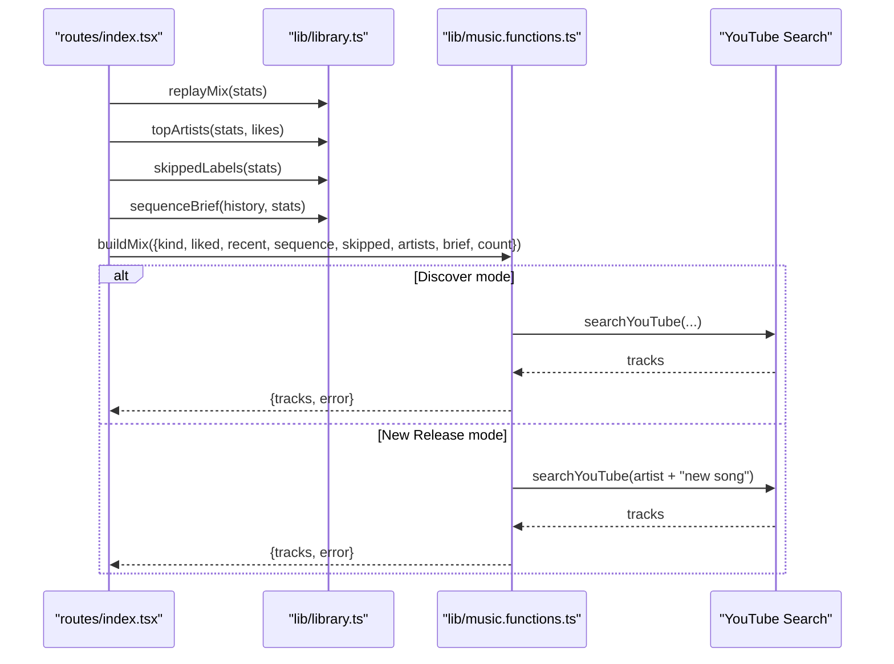
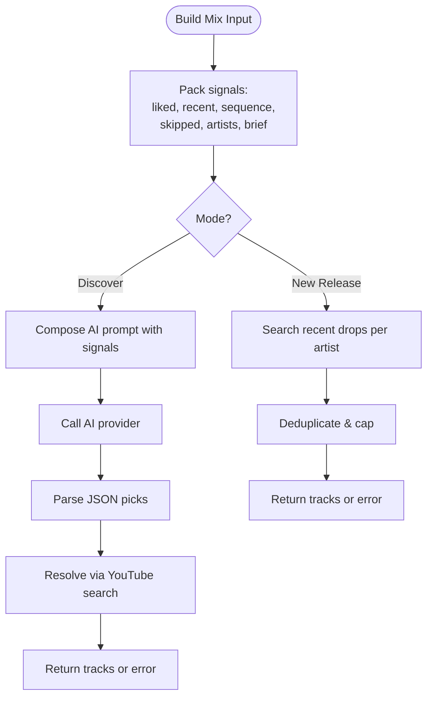
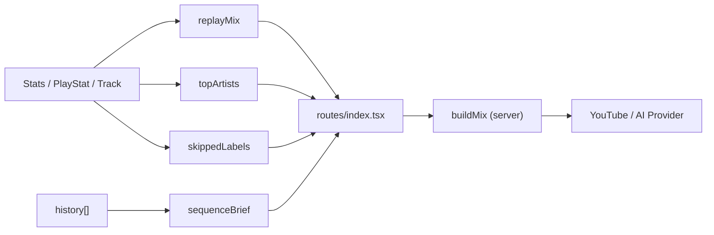

# Recommendation Data Processing

<cite>
**Referenced Files in This Document**
- [library.ts](file://src/lib/library.ts)
- [index.tsx](file://src/routes/index.tsx)
- [music.functions.ts](file://src/lib/music.functions.ts)
</cite>

## Table of Contents
1. [Introduction](#introduction)
2. [Project Structure](#project-structure)
3. [Core Components](#core-components)
4. [Architecture Overview](#architecture-overview)
5. [Detailed Component Analysis](#detailed-component-analysis)
6. [Dependency Analysis](#dependency-analysis)
7. [Performance Considerations](#performance-considerations)
8. [Troubleshooting Guide](#troubleshooting-guide)
9. [Conclusion](#conclusion)
10. [Appendices](#appendices)

## Introduction
This document explains the recommendation data processing functions that transform raw user behavior into actionable insights for music suggestions. It focuses on:
- replayMix: identifies frequently played tracks over recent weeks
- topArtists: ranks artists by plays, completions, and likes
- skippedLabels: identifies tracks users consistently skip
- sequenceBrief: generates human-readable summaries of listening history

It also shows how these functions feed the AI recommendation engine to produce personalized mixes and fallback recommendations when AI is unavailable.

## Project Structure
The recommendation pipeline spans three main areas:
- Behavioral analytics functions live in a shared library module
- The UI route composes these analytics and calls server-side mix builders
- Server-side functions build prompts or perform local discovery using the processed signals

**Diagram sources**
- [index.tsx:247-325](file://src/routes/index.tsx#L247-L325)
- [library.ts:590-646](file://src/lib/library.ts#L590-L646)
- [music.functions.ts:140-245](file://src/lib/music.functions.ts#L140-L245)

**Section sources**
- [index.tsx:247-325](file://src/routes/index.tsx#L247-L325)
- [library.ts:590-646](file://src/lib/library.ts#L590-L646)
- [music.functions.ts:140-245](file://src/lib/music.functions.ts#L140-L245)

## Core Components
- replayMix(stats, limit): Returns recently repeated tracks based on plays, completions, skips, and recency.
- topArtists(stats, likes, limit): Ranks artists by weighted engagement plus explicit likes.
- skippedLabels(stats, limit): Lists track labels for tracks with strong skip signals.
- sequenceBrief(history, stats, limit): Produces a concise, ordered summary of recent actions per track.

These functions are pure transformations over persisted behavioral data (stats, likes, history). They are consumed by both UI logic and server-side mix builders.

**Section sources**
- [library.ts:590-646](file://src/lib/library.ts#L590-L646)

## Architecture Overview
The system converts behavioral signals into structured inputs for recommendation engines:

**Diagram sources**
- [index.tsx:247-325](file://src/routes/index.tsx#L247-L325)
- [music.functions.ts:140-245](file://src/lib/music.functions.ts#L140-L245)

## Detailed Component Analysis

### replayMix
Purpose:
- Identify tracks the user has been replaying recently.
- Score tracks using plays, completions, and skips; prioritize recent activity.

Algorithm highlights:
- Filters to tracks played within a fixed recent window.
- Requires combined engagement threshold (plays + completions > 1).
- Scores tracks with weighted contributions from plays, completions, and negative weight for skips.
- Sorts by score then recency; returns top N track objects.

Output format:
- Array of Track objects representing the most-repeated recent tracks.

Usage:
- Used directly in the UI to render a “Replay Mix” without AI.

**Section sources**
- [library.ts:590-603](file://src/lib/library.ts#L590-L603)
- [index.tsx:247-249](file://src/routes/index.tsx#L247-L249)

### topArtists
Purpose:
- Rank artists by actual listening behavior and explicit preferences.

Algorithm highlights:
- Aggregates per-artist scores from stats: adds plays and completions (weighted), subtracts skips.
- Boosts artist scores for each like associated with that artist.
- Filters out non-positive scores and sorts descending.
- Returns top N artist names.

Output format:
- Array of artist name strings.

Usage:
- Feeds AI mix builder and local fallback to tailor discovery and new release queries.

**Section sources**
- [library.ts:605-621](file://src/lib/library.ts#L605-L621)
- [index.tsx:251-263](file://src/routes/index.tsx#L251-L263)
- [index.tsx:271-296](file://src/routes/index.tsx#L271-L296)

### skippedLabels
Purpose:
- Surface tracks that users consistently skip to avoid similar sounds in future recommendations.

Algorithm highlights:
- Filters tracks where skips meet a minimum threshold and exceed completions.
- Sorts by skip count descending.
- Maps to human-readable track labels.

Output format:
- Array of track label strings.

Usage:
- Included in the prompt payload to steer the AI away from disliked sonic profiles.

**Section sources**
- [library.ts:623-630](file://src/lib/library.ts#L623-L630)
- [index.tsx:298-309](file://src/routes/index.tsx#L298-L309)

### sequenceBrief
Purpose:
- Create a compact, ordered narrative of recent listening sessions with the action taken per track.

Algorithm highlights:
- Iterates through recent history up to a limit.
- For each track, determines action: played, skipped, or replayed (with count).
- Produces readable strings combining track label and action.

Output format:
- Array of short strings describing each recent action.

Usage:
- Passed to the AI mix builder to preserve sequential context (order matters).

**Section sources**
- [library.ts:632-645](file://src/lib/library.ts#L632-L645)
- [index.tsx:298-309](file://src/routes/index.tsx#L298-L309)

### Integration with the AI Recommendation Engine
Behavioral signals are packaged into a structured input for the server-side mix builder:
- liked: recent favorites (labels)
- recent: recent listens (labels)
- sequence: ordered session summary (strings)
- skipped: repeatedly skipped tracks (labels)
- artists: top artists (names)
- brief: tuning preferences (string)
- kind and count: control discovery vs new releases

The server function:
- For “discover”: builds a prompt using all signals and calls an AI provider to generate candidate picks, then resolves them via YouTube search.
- For “newrelease”: searches for recent drops from top artists.
- Falls back to local discovery if AI is unavailable or returns no results.

**Diagram sources**
- [music.functions.ts:140-245](file://src/lib/music.functions.ts#L140-L245)
- [index.tsx:298-325](file://src/routes/index.tsx#L298-L325)

**Section sources**
- [music.functions.ts:140-245](file://src/lib/music.functions.ts#L140-L245)
- [index.tsx:298-325](file://src/routes/index.tsx#L298-L325)

## Dependency Analysis
- Library functions depend only on typed behavioral data structures (Track, PlayStat, Stats).
- The UI composes these functions and passes their outputs to server functions.
- Server functions depend on external search capabilities and optional AI providers.

**Diagram sources**
- [library.ts:112-121](file://src/lib/library.ts#L112-L121)
- [library.ts:590-646](file://src/lib/library.ts#L590-L646)
- [index.tsx:247-325](file://src/routes/index.tsx#L247-L325)
- [music.functions.ts:140-245](file://src/lib/music.functions.ts#L140-L245)

**Section sources**
- [library.ts:112-121](file://src/lib/library.ts#L112-L121)
- [library.ts:590-646](file://src/lib/library.ts#L590-L646)
- [index.tsx:247-325](file://src/routes/index.tsx#L247-L325)
- [music.functions.ts:140-245](file://src/lib/music.functions.ts#L140-L245)

## Performance Considerations
- All four functions operate on in-memory arrays/maps derived from localStorage-backed state; they are O(n) over stats/history with minimal overhead.
- Limits (default parameters) prevent excessive computation and payload sizes when passing to the server.
- Sorting and filtering are straightforward and suitable for typical user histories.
- For very large histories, consider trimming history earlier in the pipeline before calling sequenceBrief.

[No sources needed since this section provides general guidance]

## Troubleshooting Guide
Common issues and resolutions:
- Empty or stale Replay Mix:
  - Ensure plays/completions are being bumped on play events and that lastAt updates.
  - Verify the recent time window includes expected activity.
- Top Artists not reflecting likes:
  - Confirm likes are persisted and passed to topArtists.
  - Check that artist fields exist on liked tracks.
- Skipped Labels missing:
  - Skips must exceed completions and meet the minimum threshold.
  - Validate skip logging is triggered on early exits.
- Sequence Brief not showing replays:
  - Ensure stats include plays > 1 for the track to show replay counts.
- AI mix errors:
  - If AI is not configured or rate-limited, the UI falls back to local discovery.
  - Inspect error messages returned by the server function for configuration or quota issues.

**Section sources**
- [index.tsx:298-325](file://src/routes/index.tsx#L298-L325)
- [music.functions.ts:183-218](file://src/lib/music.functions.ts#L183-L218)

## Conclusion
The recommendation data processing functions convert granular user behavior into clear signals that power both immediate features (Replay Mix) and advanced personalization (AI-driven Discover/New Release mixes). By standardizing these signals—recent repeats, top artists, skipped content, and sequential history—the system ensures consistent, high-quality recommendations even when AI is unavailable.

[No sources needed since this section summarizes without analyzing specific files]

## Appendices

### Output Formats and Usage Examples
- replayMix(stats, limit):
  - Returns: Track[]
  - Example usage: Render a “Replay Mix” list in the UI without AI.
  - Reference: [library.ts:590-603](file://src/lib/library.ts#L590-L603)

- topArtists(stats, likes, limit):
  - Returns: string[]
  - Example usage: Provide artist context to AI/local discovery for tailored picks.
  - Reference: [library.ts:605-621](file://src/lib/library.ts#L605-L621)

- skippedLabels(stats, limit):
  - Returns: string[]
  - Example usage: Include in mix prompts to avoid disliked sounds.
  - Reference: [library.ts:623-630](file://src/lib/library.ts#L623-L630)

- sequenceBrief(history, stats, limit):
  - Returns: string[]
  - Example usage: Pass ordered session context to AI for better sequencing.
  - Reference: [library.ts:632-645](file://src/lib/library.ts#L632-L645)

- Server mix builder input (for developers integrating custom analytics):
  - Fields: kind, liked[], recent[], sequence[], skipped[], artists[], brief?, count?
  - Reference: [music.functions.ts:140-149](file://src/lib/music.functions.ts#L140-L149)

- How the UI composes these signals:
  - Reference: [index.tsx:298-309](file://src/routes/index.tsx#L298-L309)