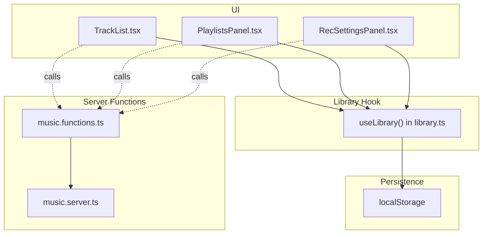
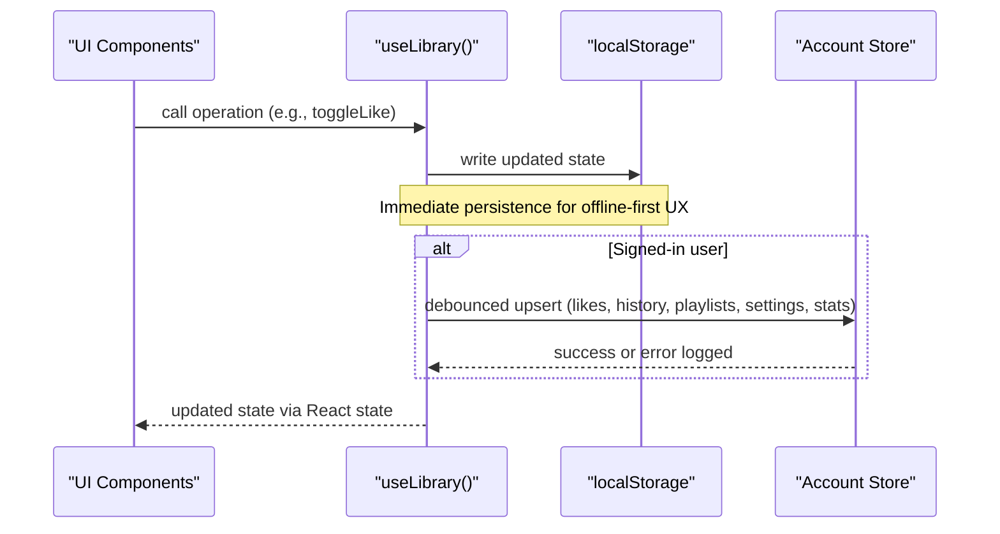
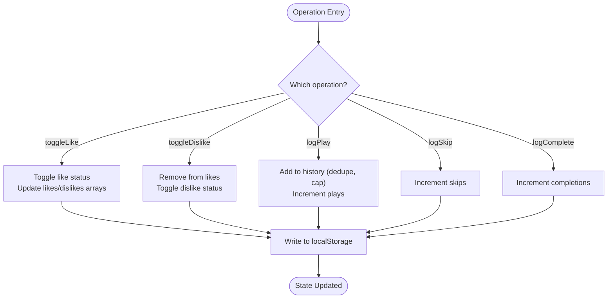
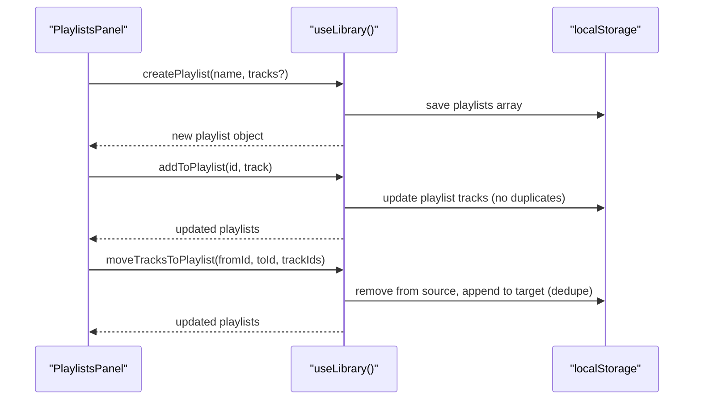
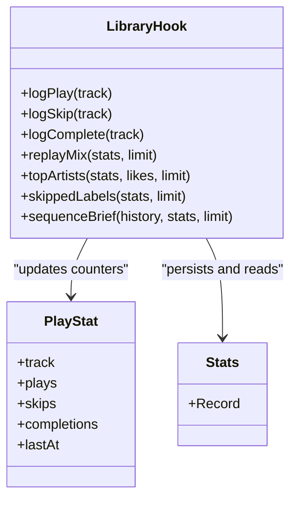
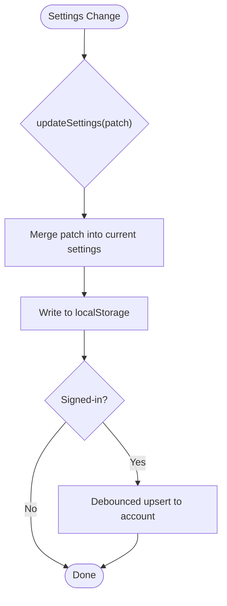
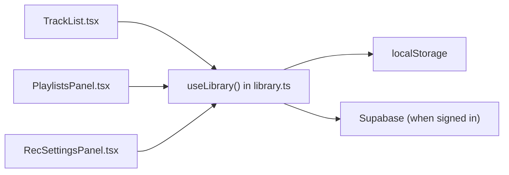

# User Interactions & Operations

<cite>
**Referenced Files in This Document**
- [library.ts](file://src/lib/library.ts)
- [music.functions.ts](file://src/lib/music.functions.ts)
- [music.server.ts](file://src/lib/music.server.ts)
- [PlaylistsPanel.tsx](file://src/components/music/PlaylistsPanel.tsx)
- [TrackList.tsx](file://src/components/music/TrackList.tsx)
- [RecSettingsPanel.tsx](file://src/components/music/RecSettingsPanel.tsx)
</cite>

## Table of Contents
1. Introduction
2. Project Structure
3. Core Components
4. Architecture Overview
5. Detailed Component Analysis
6. Dependency Analysis
7. Performance Considerations
8. Troubleshooting Guide
9. Conclusion

## Introduction
This document explains the user interaction operations exposed by the library system for managing tracks, playlists, statistics, and settings. It covers:
- Track management: toggleLike, toggleDislike, logPlay, logSkip, logComplete
- Playlist management: createPlaylist, renamePlaylist, deletePlaylist, addToPlaylist, removeFromPlaylist, moveTracksToPlaylist
- Statistical tracking: how plays, skips, completions are recorded and used
- Settings management: updateSettings, resetSettings
- Common workflows: creating playlists, managing favorites, organizing collections
- Performance considerations for large libraries and batch operations

## Project Structure
The library system is implemented as a React hook that manages local state and persists data to localStorage. UI components consume this hook to render interactive lists and panels. Server functions provide search, recommendations, and streaming capabilities but do not directly implement the core user operations documented here.

**Diagram sources**
- [library.ts:242-557](file://src/lib/library.ts#L242-L557)
- [TrackList.tsx:45-64](file://src/components/music/TrackList.tsx#L45-L64)
- [PlaylistsPanel.tsx:31-44](file://src/components/music/PlaylistsPanel.tsx#L31-L44)
- [RecSettingsPanel.tsx:17-15](file://src/components/music/RecSettingsPanel.tsx#L17-L15)
- [music.functions.ts:8-21](file://src/lib/music.functions.ts#L8-L21)
- [music.server.ts:182-247](file://src/lib/music.server.ts#L182-L247)

**Section sources**
- [library.ts:242-557](file://src/lib/library.ts#L242-L557)
- [music.functions.ts:8-21](file://src/lib/music.functions.ts#L8-L21)
- [music.server.ts:182-247](file://src/lib/music.server.ts#L182-L247)

## Core Components
- useLibrary(): Central hook providing all user operations for tracks, playlists, stats, and settings. It hydrates from localStorage, merges with cloud data when signed in, and debounces writes back to the account.
- TrackList: Renders track rows with actions like play, like/dislike, add to playlist, and queue.
- PlaylistsPanel: Manages playlist creation, renaming, deletion, adding/removing/moving/reordering tracks, and bulk operations.
- RecSettingsPanel: Adjusts recommendation preferences (moods, genres, languages, topics, discovery, energy, instrumental-only, notifications, inject interval).

Key responsibilities:
- Track interactions: toggleLike, toggleDislike, logPlay, logSkip, logComplete
- Playlist CRUD and organization: createPlaylist, renamePlaylist, deletePlaylist, addToPlaylist, removeFromPlaylist, removeManyFromPlaylist, moveTracksToPlaylist, reorderPlaylist
- Stats: bump per-track counters for plays, skips, completions; utilities to derive insights
- Settings: updateSettings, resetSettings

**Section sources**
- [library.ts:353-557](file://src/lib/library.ts#L353-L557)
- [TrackList.tsx:183-241](file://src/components/music/TrackList.tsx#L183-L241)
- [PlaylistsPanel.tsx:61-307](file://src/components/music/PlaylistsPanel.tsx#L61-L307)
- [RecSettingsPanel.tsx:64-280](file://src/components/music/RecSettingsPanel.tsx#L64-L280)

## Architecture Overview
User interactions flow through UI components into the library hook, which updates local state and persists changes to localStorage. When a user is signed in, the hook also syncs data to the account store with debounced upserts.

**Diagram sources**
- [library.ts:251-349](file://src/lib/library.ts#L251-L349)
- [library.ts:353-557](file://src/lib/library.ts#L353-L557)

## Detailed Component Analysis

### Track Management Operations
- toggleLike(track): Adds or removes a track from likes; if disliked, removes from dislikes first. Keeps up to a capped list size.
- toggleDislike(track): Removes from likes and adds to dislikes; caps dislike list size.
- logPlay(track): Adds track to history (deduplicated, capped), increments plays counter.
- logSkip(track): Increments skips counter.
- logComplete(track): Increments completions counter.

These operations persist immediately to localStorage and are later synced to the account store when signed in.

**Diagram sources**
- [library.ts:353-411](file://src/lib/library.ts#L353-L411)

**Section sources**
- [library.ts:353-411](file://src/lib/library.ts#L353-L411)

### Playlist Management Features
- createPlaylist(name, tracks?): Creates a new playlist with unique id and timestamp.
- renamePlaylist(id, name): Updates playlist name.
- deletePlaylist(id): Removes playlist by id.
- addToPlaylist(id, track): Adds a track if not already present.
- removeFromPlaylist(id, trackId): Removes a specific track by id.
- removeManyFromPlaylist(id, trackIds): Batch removal of multiple tracks.
- moveTracksToPlaylist(fromId, toId, trackIds): Moves selected tracks from one playlist to another without duplicates.
- reorderPlaylist(id, from, to): Reorders a single track within a playlist.

The PlaylistsPanel provides UI for these operations including selection, bulk actions, drag-and-drop reordering, and moving between playlists.

**Diagram sources**
- [library.ts:422-515](file://src/lib/library.ts#L422-L515)
- [PlaylistsPanel.tsx:61-307](file://src/components/music/PlaylistsPanel.tsx#L61-L307)

**Section sources**
- [library.ts:422-515](file://src/lib/library.ts#L422-L515)
- [PlaylistsPanel.tsx:61-307](file://src/components/music/PlaylistsPanel.tsx#L61-L307)

### Statistical Tracking System
- bump(track, field): Increments plays, skips, or completions for a track and records lastAt timestamp.
- logPlay: Also updates history and increments plays.
- logSkip/logComplete: Update respective counters.
- Utilities:
  - replayMix(stats, limit): Tracks with repeated plays/completions recently.
  - topArtists(stats, likes, limit): Artists ranked by behavior and likes.
  - skippedLabels(stats, limit): Labels of frequently skipped tracks.
  - sequenceBrief(history, stats, limit): Human-readable recent listening summary.

Stats are persisted to localStorage and merged/synced with the account store when signed in.

**Diagram sources**
- [library.ts:112-121](file://src/lib/library.ts#L112-L121)
- [library.ts:384-411](file://src/lib/library.ts#L384-L411)
- [library.ts:592-645](file://src/lib/library.ts#L592-L645)

**Section sources**
- [library.ts:384-411](file://src/lib/library.ts#L384-L411)
- [library.ts:592-645](file://src/lib/library.ts#L592-L645)

### Settings Management Functions
- updateSettings(patch): Merges provided fields into current settings and persists.
- resetSettings(): Restores default settings and persists defaults.

The RecSettingsPanel exposes controls for moods, genres, languages, podcast topics, discovery level, energy, instrumental-only mode, notification preference, and fresh release injection interval. Changes are debounced at the UI layer and committed to settings on value commit or explicit apply.

**Diagram sources**
- [library.ts:517-528](file://src/lib/library.ts#L517-L528)
- [library.ts:321-349](file://src/lib/library.ts#L321-L349)
- [RecSettingsPanel.tsx:17-280](file://src/components/music/RecSettingsPanel.tsx#L17-L280)

**Section sources**
- [library.ts:517-528](file://src/lib/library.ts#L517-L528)
- [RecSettingsPanel.tsx:17-280](file://src/components/music/RecSettingsPanel.tsx#L17-L280)

### Common User Workflows
- Creating playlists:
  - Use PlaylistsPanel form to enter a name and submit to create a playlist.
  - Add tracks via TrackList dropdown “Add to playlist” or create a new playlist from there.
- Managing favorites:
  - Toggle like/dislike via TrackList buttons.
  - View liked tracks separately in your library view.
- Organizing music collections:
  - Move tracks between playlists using bulk selection and “Move to…” in PlaylistsPanel.
  - Reorder tracks via drag-and-drop handles.
  - Remove many tracks at once using bulk delete.

**Section sources**
- [PlaylistsPanel.tsx:61-307](file://src/components/music/PlaylistsPanel.tsx#L61-L307)
- [TrackList.tsx:183-241](file://src/components/music/TrackList.tsx#L183-L241)
- [library.ts:422-515](file://src/lib/library.ts#L422-L515)

## Dependency Analysis
- UI components depend on the library hook for all stateful operations.
- The hook depends on localStorage for persistence and optionally on Supabase for account sync when signed in.
- Server functions are separate from the core user operations documented here; they power search, recommendations, and streaming.

**Diagram sources**
- [library.ts:242-349](file://src/lib/library.ts#L242-L349)
- [TrackList.tsx:45-64](file://src/components/music/TrackList.tsx#L45-L64)
- [PlaylistsPanel.tsx:31-44](file://src/components/music/PlaylistsPanel.tsx#L31-L44)
- [RecSettingsPanel.tsx:17-15](file://src/components/music/RecSettingsPanel.tsx#L17-L15)

**Section sources**
- [library.ts:242-349](file://src/lib/library.ts#L242-L349)

## Performance Considerations
- List caps: Likes, dislikes, and history are capped (e.g., 200 items) to prevent unbounded growth in memory and storage.
- Debounced sync: Account sync is throttled (e.g., ~1200ms) to avoid excessive network requests during rapid interactions.
- Batch operations:
  - removeManyFromPlaylist supports removing multiple tracks efficiently.
  - moveTracksToPlaylist moves multiple tracks while avoiding duplicates.
- Local-first persistence: All changes are written to localStorage immediately for responsiveness; syncing happens asynchronously.
- Search caching: Server-side search results are cached briefly to reduce redundant network calls (not part of core user ops but relevant for overall performance).

Recommendations:
- Prefer batch operations (removeManyFromPlaylist, moveTracksToPlaylist) for large-scale reorganization.
- Avoid frequent small updates to settings; group changes where possible.
- Monitor localStorage quota warnings and consider pruning history or stats if needed.

[No sources needed since this section provides general guidance]

## Troubleshooting Guide
- Sync failures: If account sync fails, errors are logged; local data remains intact due to localStorage.
- Storage issues: Write failures to localStorage are caught and logged; check browser storage quotas.
- Recommendations unavailable: If AI services are down or credits exhausted, server functions return appropriate errors; local operations remain unaffected.

**Section sources**
- [library.ts:321-349](file://src/lib/library.ts#L321-L349)
- [music.functions.ts:58-137](file://src/lib/music.functions.ts#L58-L137)

## Conclusion
The library system provides a comprehensive set of user interaction operations for managing tracks, playlists, statistics, and settings. It is designed to be responsive and resilient, with immediate local persistence and optional cloud synchronization. Batch operations and caps help maintain performance even with large libraries. Users can create and organize playlists, manage favorites, and tune recommendations effectively through intuitive UI components backed by robust hooks and utilities.

[No sources needed since this section summarizes without analyzing specific files]