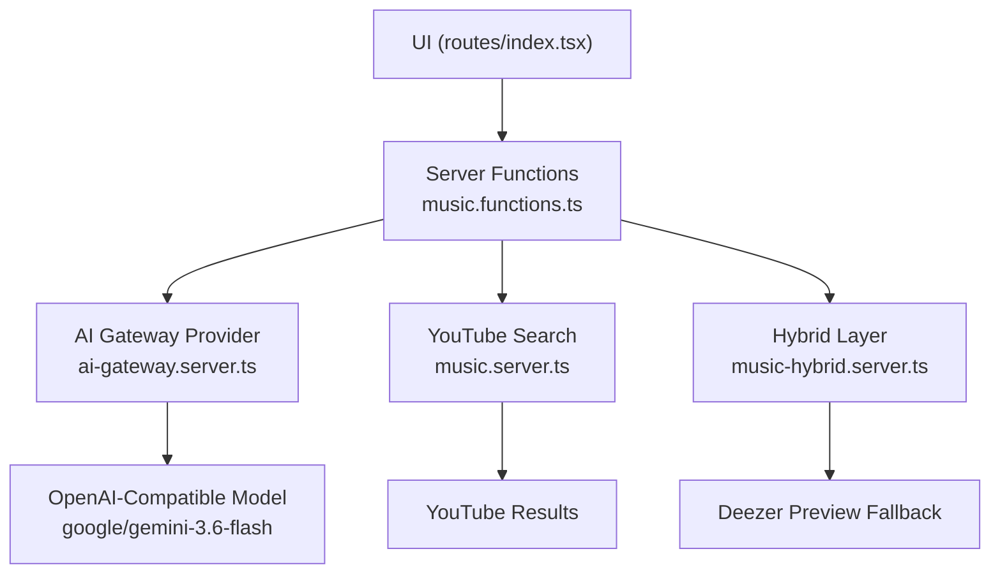
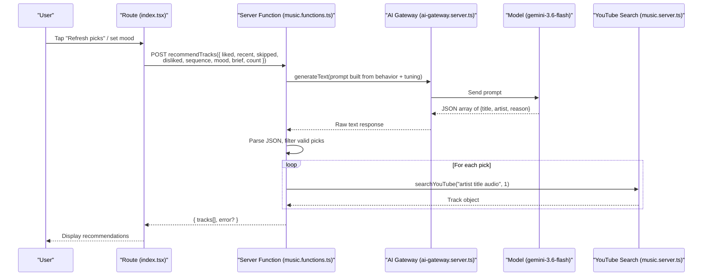
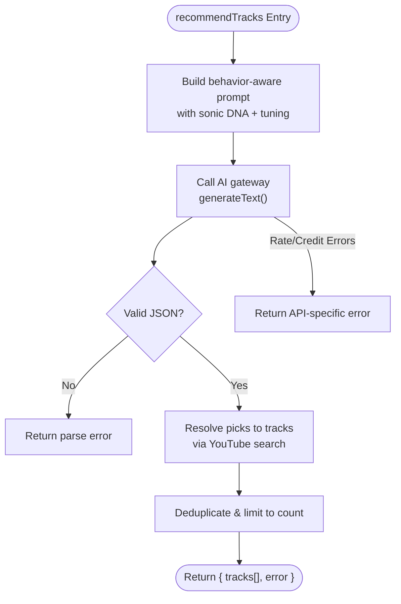
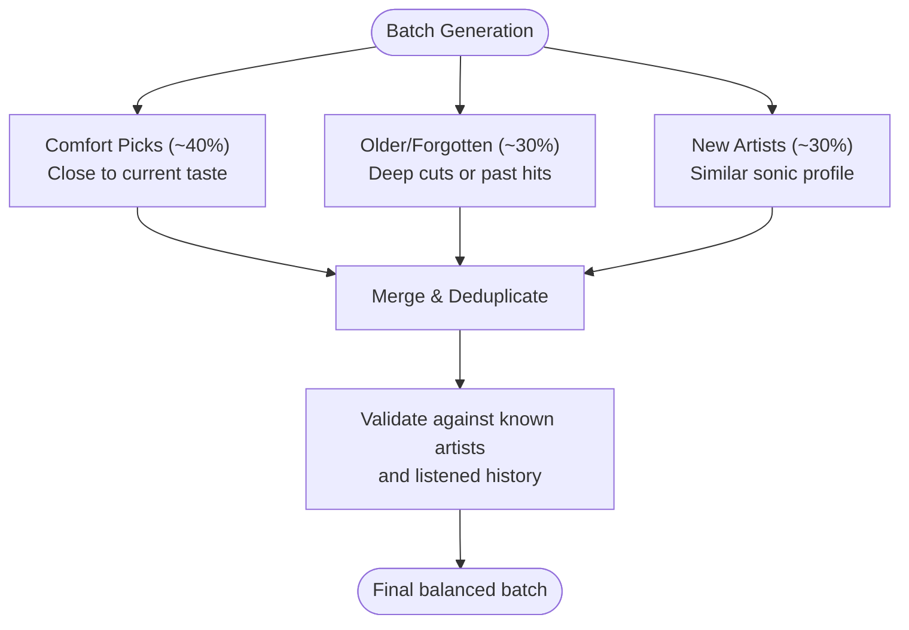
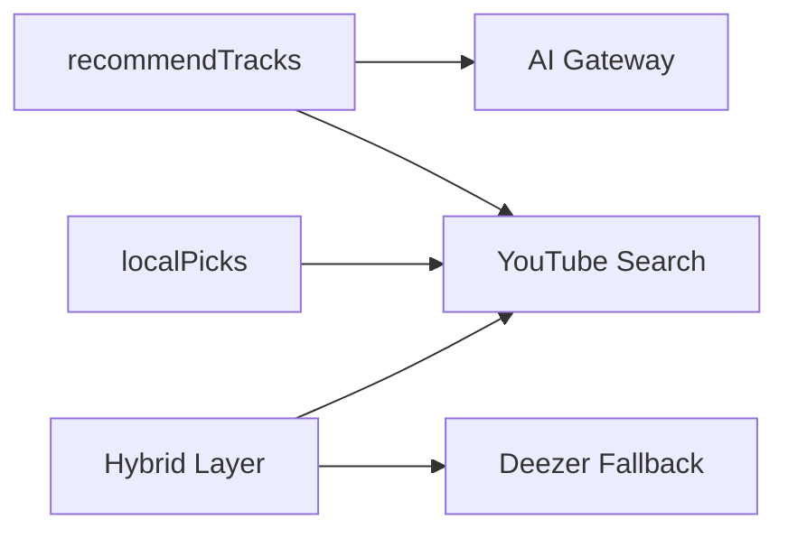

# AI-Powered Recommendations

<cite>
**Referenced Files in This Document**
- [music.functions.ts](file://src/lib/music.functions.ts)
- [ai-gateway.server.ts](file://src/lib/ai-gateway.server.ts)
- [music.server.ts](file://src/lib/music.server.ts)
- [music-hybrid.server.ts](file://src/lib/music-hybrid.server.ts)
- [index.tsx](file://src/routes/index.tsx)
- [RecSettingsPanel.tsx](file://src/components/music/RecSettingsPanel.tsx)
</cite>

## Table of Contents
1. [Introduction](#introduction)
2. [Project Structure](#project-structure)
3. [Core Components](#core-components)
4. [Architecture Overview](#architecture-overview)
5. [Detailed Component Analysis](#detailed-component-analysis)
6. [Dependency Analysis](#dependency-analysis)
7. [Performance Considerations](#performance-considerations)
8. [Troubleshooting Guide](#troubleshooting-guide)
9. [Conclusion](#conclusion)
10. [Appendices](#appendices)

## Introduction
This document explains the AI-powered recommendation engine that generates personalized track suggestions using an OpenAI-compatible model via a hosted AI gateway. It focuses on:
- The recommendTracks function that analyzes user behavior (liked songs, recent plays, skips, dislikes, and session sequences) to produce tailored picks.
- Prompt engineering that maps “sonic DNA” including tempo, pitch/key feel, instrumentation, vocal texture, and energy.
- The balance algorithm that targets roughly 40% comfort picks, 30% older or forgotten favorites, and 30% new artists while avoiding repetition and maintaining taste consistency.
- Configuration options exposed through the UI and how they shape recommendations.
- Error handling for API rate limits and credits, plus integration with the AI gateway provider.
- Fallback strategies when AI is unavailable.

## Project Structure
The recommendation system spans server functions, an AI gateway wrapper, YouTube search utilities, and UI controls:
- Server-side logic for recommendations, mixes, and local fallbacks lives in music.functions.ts.
- The AI gateway provider is configured in ai-gateway.server.ts.
- YouTube search and filtering are implemented in music.server.ts.
- A hybrid search layer provides resilience by falling back to Deezer previews if needed.
- The UI composes user signals and invokes the recommendation endpoints.



**Diagram sources**
- [music.functions.ts:58-137](file://src/lib/music.functions.ts#L58-L137)
- [ai-gateway.server.ts:1-10](file://src/lib/ai-gateway.server.ts#L1-L10)
- [music.server.ts:182-247](file://src/lib/music.server.ts#L182-L247)
- [music-hybrid.server.ts:22-49](file://src/lib/music-hybrid.server.ts#L22-L49)

**Section sources**
- [music.functions.ts:58-137](file://src/lib/music.functions.ts#L58-L137)
- [ai-gateway.server.ts:1-10](file://src/lib/ai-gateway.server.ts#L1-L10)
- [music.server.ts:182-247](file://src/lib/music.server.ts#L182-L247)
- [music-hybrid.server.ts:22-49](file://src/lib/music-hybrid.server.ts#L22-L49)
- [index.tsx:612-650](file://src/routes/index.tsx#L612-L650)

## Core Components
- recommendTracks: Builds a behavior-aware prompt, calls the AI gateway, parses JSON picks, resolves tracks via YouTube, and returns enriched results with reasons.
- buildMix: Similar flow focused on discovering new artists close to the listener’s sonic profile.
- localPicks: Deterministic, no-AI fallback mirroring the same balance strategy using curated YouTube queries.
- AI gateway provider: Wraps an OpenAI-compatible client pointing to a hosted gateway with a custom header for authentication.
- YouTube search: Scrapes YouTube results with music-only filters, duration checks, and caching.

Key behaviors:
- Input validation via Zod schemas ensures safe payloads.
- Environment-based configuration for the AI key.
- Robust error handling for rate limits and credit exhaustion.
- Deduplication and enrichment of AI-suggested picks into playable tracks.

**Section sources**
- [music.functions.ts:47-137](file://src/lib/music.functions.ts#L47-L137)
- [music.functions.ts:156-245](file://src/lib/music.functions.ts#L156-L245)
- [music.functions.ts:324-369](file://src/lib/music.functions.ts#L324-L369)
- [ai-gateway.server.ts:1-10](file://src/lib/ai-gateway.server.ts#L1-L10)
- [music.server.ts:182-247](file://src/lib/music.server.ts#L182-L247)

## Architecture Overview
The end-to-end flow from UI to final tracks:



**Diagram sources**
- [index.tsx:612-650](file://src/routes/index.tsx#L612-L650)
- [music.functions.ts:58-137](file://src/lib/music.functions.ts#L58-L137)
- [ai-gateway.server.ts:1-10](file://src/lib/ai-gateway.server.ts#L1-L10)
- [music.server.ts:182-247](file://src/lib/music.server.ts#L182-L247)

## Detailed Component Analysis

### recommendTracks: Behavior-driven personalization
- Inputs: liked, recent, disliked, sequence, skipped, mood, brief, count.
- Prompt construction:
  - Maps “sonic DNA”: tempo, pitch/key feel, instrumentation, vocal texture, energy.
  - Incorporates behavioral signals: order of plays, replays, skips, dislikes.
  - Applies tuning preferences from UI (moods, genres, languages, energy, discovery).
  - Enforces non-repetition and off-profile avoidance.
- Balance algorithm:
  - Targets roughly 40% comfort picks aligned with current taste.
  - 30% older or forgotten favorites likely not heard in years.
  - 30% completely new artists closely matching the sonic profile.
  - Explicit instruction to avoid repetition and jarring shifts.
- Execution:
  - Calls the AI gateway with the constructed prompt.
  - Parses JSON array of suggested titles/artists/reasons.
  - Resolves each suggestion to a playable track via YouTube search.
  - Returns enriched tracks with reasons; handles errors gracefully.



**Diagram sources**
- [music.functions.ts:58-137](file://src/lib/music.functions.ts#L58-L137)

**Section sources**
- [music.functions.ts:58-137](file://src/lib/music.functions.ts#L58-L137)

### Prompt Engineering: Sonic DNA and Behavioral Signals
- Sonic DNA dimensions:
  - Tempo: pace and rhythm cues inferred from listening patterns and explicit moods.
  - Pitch/key feel: tonal characteristics derived from liked and recent tracks.
  - Instrumentation: dominant instruments and production styles.
  - Vocal texture: presence, style, and timbre of vocals.
  - Energy: overall intensity mapped from energy slider and mood weights.
- Behavioral context:
  - Sequence: ordered history of what was played, replayed, or skipped.
  - Skips/dislikes: negative signals to steer away from certain sounds.
  - Brief tuning: concise preferences from the Tune panel.
- Constraints:
  - Do not repeat already-listened tracks.
  - Maintain taste consistency; avoid jarring off-profile selections.
  - Respect language and genre filters when provided.

**Section sources**
- [music.functions.ts:70-92](file://src/lib/music.functions.ts#L70-L92)
- [music.functions.ts:189-205](file://src/lib/music.functions.ts#L189-L205)

### Balance Algorithm: Comfort, Nostalgia, Discovery
- Target distribution:
  - ~40% comfort picks: align tightly with current taste.
  - ~30% older/forgotten favorites: deep cuts or past hits the user may have missed.
  - ~30% new artists: fresh acts that sound strikingly similar to their sonic profile.
- Repetition avoidance:
  - Explicit instructions to avoid repeating previously listed songs.
  - Deduplication at the server level before returning results.
- Taste consistency:
  - Off-profile and jarring suggestions are discouraged in the prompt.
  - Local fallback mirrors the same balance using deterministic queries when AI is unavailable.



**Diagram sources**
- [music.functions.ts:86-92](file://src/lib/music.functions.ts#L86-L92)
- [music.functions.ts:317-369](file://src/lib/music.functions.ts#L317-L369)

**Section sources**
- [music.functions.ts:86-92](file://src/lib/music.functions.ts#L86-L92)
- [music.functions.ts:317-369](file://src/lib/music.functions.ts#L317-L369)

### AI Gateway Integration
- Provider setup:
  - Uses an OpenAI-compatible client configured to call a hosted gateway endpoint.
  - Passes a custom header containing the API key for authentication.
- Model selection:
  - Calls a specific model identifier through the gateway.
- Error mapping:
  - Detects HTTP 429 (rate limiting) and 402/credit-related messages to return friendly errors.
  - Catches parsing failures and network issues with clear messages.

```mermaid
classDiagram
class AiGatewayProvider {
+createAiGatewayProvider(apiKey)
}
class GenerateText {
+generateText({ model, prompt })
}
class YouTubeSearch {
+searchYouTube(query, limit, musicOnly, upload)
}
AiGatewayProvider --> GenerateText : "wraps"
GenerateText --> YouTubeSearch : "used downstream to resolve picks"
```

**Diagram sources**
- [ai-gateway.server.ts:1-10](file://src/lib/ai-gateway.server.ts#L1-L10)
- [music.functions.ts:97-111](file://src/lib/music.functions.ts#L97-L111)
- [music.server.ts:182-247](file://src/lib/music.server.ts#L182-L247)

**Section sources**
- [ai-gateway.server.ts:1-10](file://src/lib/ai-gateway.server.ts#L1-L10)
- [music.functions.ts:97-111](file://src/lib/music.functions.ts#L97-L111)

### UI Configuration and Tuning
- Mood weighting: Sliders adjust emphasis per mood, shaping the prompt’s energy and vibe.
- Genres and languages: Toggles constrain the search space and influence query generation.
- Discovery vs familiarity: Slider biases toward deeper exploration or more familiar content.
- Energy control: Adjusts intensity expectations in the prompt.
- Instrumental only: Filters out vocal-heavy content when enabled.
- Fresh releases injection: Interval-based insertion of new drops into queues.

These settings are serialized into a “brief” string and passed to the AI prompt to refine sonic DNA and constraints.

**Section sources**
- [RecSettingsPanel.tsx:17-284](file://src/components/music/RecSettingsPanel.tsx#L17-L284)
- [index.tsx:612-650](file://src/routes/index.tsx#L612-L650)

### Fallback Strategy: localPicks
When AI is unavailable or misconfigured, the system uses a deterministic fallback that mirrors the same balance:
- Comfort picks: top hits from known artists.
- Similar artists: queries for acts sounding like top favorites.
- Older/forgotten: trending and classic hits to fill gaps.
- Up Next mode: starts from current artist and widens to similar acts.

This ensures continuous functionality without AI dependencies.

**Section sources**
- [music.functions.ts:317-369](file://src/lib/music.functions.ts#L317-L369)

## Dependency Analysis
- recommendTracks depends on:
  - AI gateway provider for model inference.
  - YouTube search for resolving AI suggestions to playable tracks.
  - UI route for assembling inputs and handling loading states.
- localPicks depends on:
  - YouTube search with curated queries to emulate the balance strategy.
- Hybrid layer:
  - Provides resilience by falling back to Deezer previews when YouTube fails or returns insufficient results.



**Diagram sources**
- [music.functions.ts:58-137](file://src/lib/music.functions.ts#L58-L137)
- [music.functions.ts:317-369](file://src/lib/music.functions.ts#L317-L369)
- [music-hybrid.server.ts:22-49](file://src/lib/music-hybrid.server.ts#L22-L49)

**Section sources**
- [music.functions.ts:58-137](file://src/lib/music.functions.ts#L58-L137)
- [music.functions.ts:317-369](file://src/lib/music.functions.ts#L317-L369)
- [music-hybrid.server.ts:22-49](file://src/lib/music-hybrid.server.ts#L22-L49)

## Performance Considerations
- Prompt size management:
  - Liked and recent lists are truncated to prevent oversized prompts.
  - Sequence and other arrays are bounded to keep requests efficient.
- Parallel resolution:
  - AI suggestions are resolved concurrently via Promise.all to minimize latency.
- Caching:
  - YouTube search results are cached with TTL to reduce repeated scraping.
- Deduplication:
  - In-memory sets ensure unique tracks across batches.
- Fallback efficiency:
  - localPicks uses targeted queries to quickly assemble balanced mixes without AI overhead.

[No sources needed since this section provides general guidance]

## Troubleshooting Guide
Common issues and resolutions:
- Missing AI key:
  - Symptom: “AI is not configured yet.”
  - Resolution: Set the environment variable for the gateway API key.
- Rate limiting:
  - Symptom: “Too many requests — try again shortly.”
  - Resolution: Retry after a delay; consider reducing request frequency.
- Credits exhausted:
  - Symptom: “AI credits are exhausted — add credits to keep generating picks.”
  - Resolution: Top up credits in the gateway account.
- Parsing errors:
  - Symptom: “Could not read the recommendations.”
  - Resolution: Retry; check model output format compliance.
- YouTube search failures:
  - Symptom: Empty results or network errors.
  - Resolution: Use hybrid fallback which attempts Deezer previews; verify connectivity.

**Section sources**
- [music.functions.ts:61-137](file://src/lib/music.functions.ts#L61-L137)
- [music.functions.ts:183-245](file://src/lib/music.functions.ts#L183-L245)
- [music-hybrid.server.ts:22-49](file://src/lib/music-hybrid.server.ts#L22-L49)

## Conclusion
The recommendation engine combines behavior analysis, sonic DNA mapping, and a carefully tuned balance algorithm to deliver personalized, diverse, and consistent music suggestions. It integrates seamlessly with an OpenAI-compatible model via a hosted gateway, includes robust error handling for API constraints, and offers a resilient fallback path when AI is unavailable. The UI exposes intuitive tuning controls that directly influence the AI prompt, enabling users to tailor recommendations to their evolving tastes.

[No sources needed since this section summarizes without analyzing specific files]

## Appendices

### Configuration Options Summary
- Environment:
  - LOVABLE_API_KEY: Required for AI features.
- UI Settings:
  - Moods: Weight sliders per mood.
  - Genres: Toggle preferred genres.
  - Languages: Filter by language(s).
  - Discovery: Bias toward deeper exploration.
  - Energy: Control intensity.
  - Instrumental Only: Exclude vocal-heavy tracks.
  - Notify New Drops: Browser notifications for favorite artists’ releases.
  - Fresh Releases Injection: Interval-based insertion of new tracks.

**Section sources**
- [RecSettingsPanel.tsx:17-284](file://src/components/music/RecSettingsPanel.tsx#L17-L284)
- [music.functions.ts:47-56](file://src/lib/music.functions.ts#L47-L56)