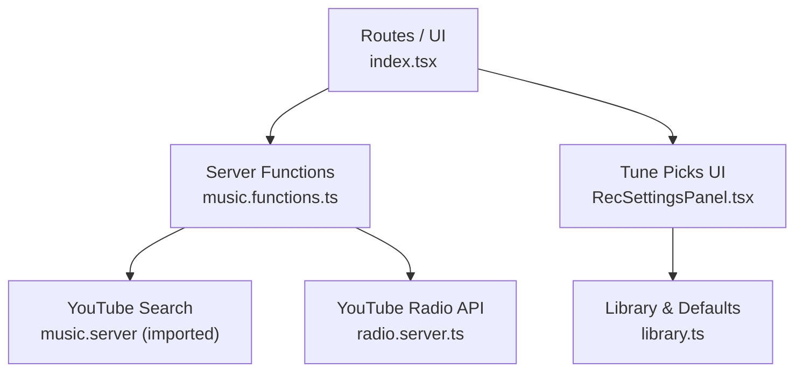
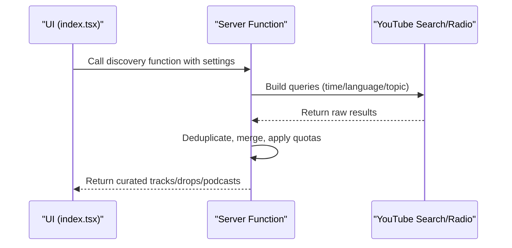
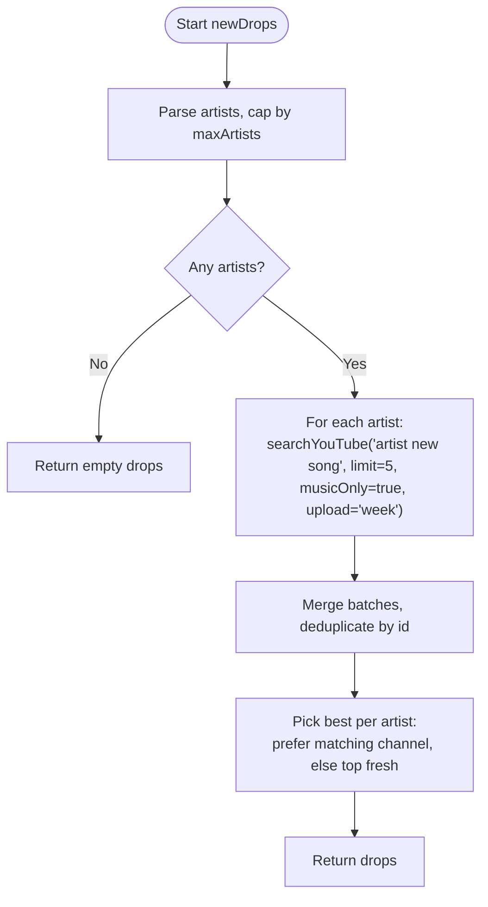
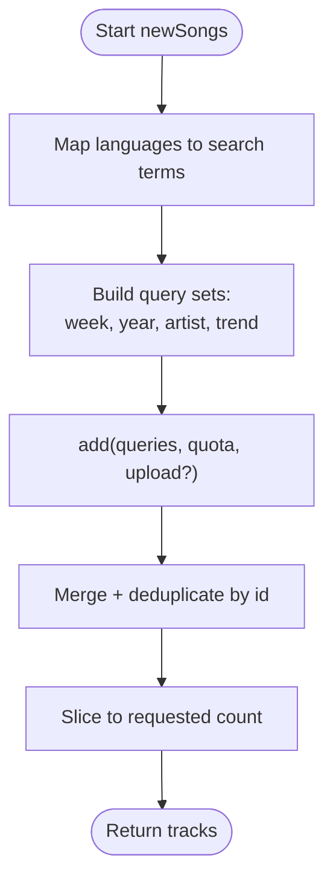
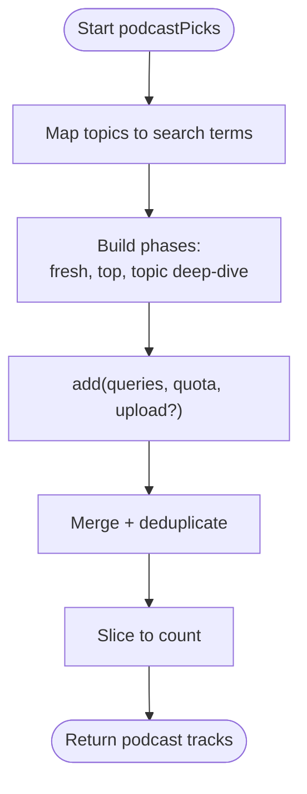
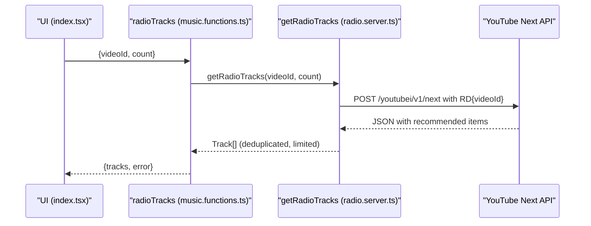
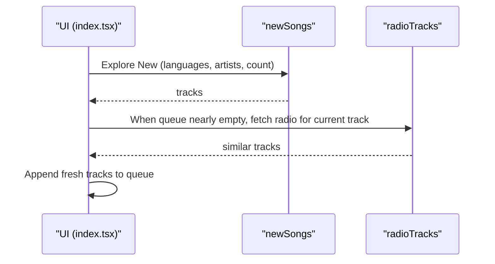
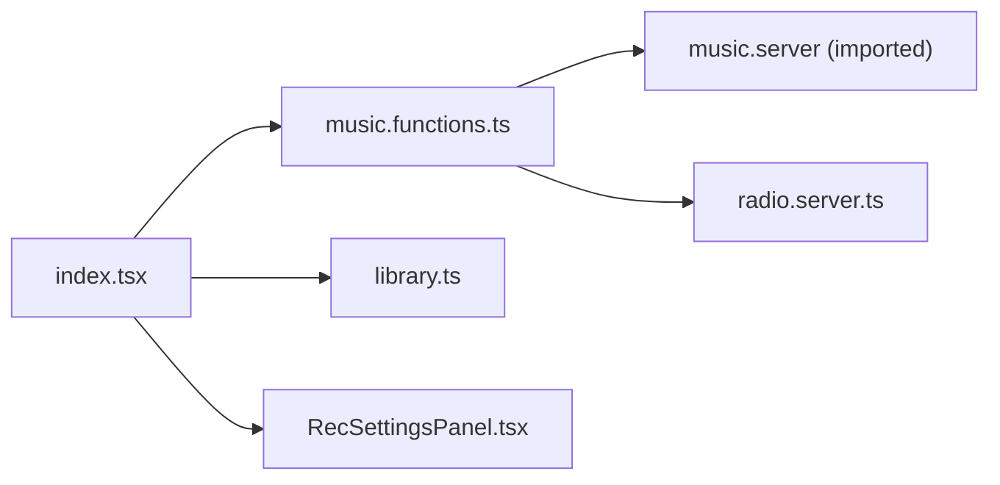

# Content Discovery & Trending

<cite>
**Referenced Files in This Document**
- [music.functions.ts](file://src/lib/music.functions.ts)
- [radio.server.ts](file://src/lib/radio.server.ts)
- [index.tsx](file://src/routes/index.tsx)
- [RecSettingsPanel.tsx](file://src/components/music/RecSettingsPanel.tsx)
- [library.ts](file://src/lib/library.ts)
</cite>

## Table of Contents
1. [Introduction](#introduction)
2. [Project Structure](#project-structure)
3. [Core Components](#core-components)
4. [Architecture Overview](#architecture-overview)
5. [Detailed Component Analysis](#detailed-component-analysis)
6. [Dependency Analysis](#dependency-analysis)
7. [Performance Considerations](#performance-considerations)
8. [Troubleshooting Guide](#troubleshooting-guide)
9. [Conclusion](#conclusion)
10. [Appendices](#appendices)

## Introduction
This document explains the content discovery features that power fresh releases, trending tracks, podcast recommendations, and radio-style suggestions. It focuses on:
- newDrops: finds recent releases from followed artists using time-bounded YouTube searches.
- newSongs: discovers genuinely fresh tracks across languages and regions with language preferences.
- podcastPicks: generates podcast suggestions based on topics, languages, and favorite artists.
- radioTracks: leverages YouTube’s recommendation engine to build a song radio around a seed track.

It also includes examples of discovery queries, language mappings, topic configurations, and performance optimizations for batch processing.

## Project Structure
The discovery features are implemented as server functions that call into YouTube search or recommendation endpoints. The UI composes these functions to build mixes, podcasts, and Up Next queues.

**Diagram sources**
- [index.tsx:265-301](file://src/routes/index.tsx#L265-L301)
- [music.functions.ts:257-307](file://src/lib/music.functions.ts#L257-L307)
- [music.functions.ts:398-458](file://src/lib/music.functions.ts#L398-L458)
- [music.functions.ts:491-559](file://src/lib/music.functions.ts#L491-L559)
- [music.functions.ts:571-580](file://src/lib/music.functions.ts#L571-L580)
- [radio.server.ts:25-94](file://src/lib/radio.server.ts#L25-L94)
- [RecSettingsPanel.tsx:131-183](file://src/components/music/RecSettingsPanel.tsx#L131-L183)
- [library.ts:38-66](file://src/lib/library.ts#L38-L66)

**Section sources**
- [index.tsx:265-301](file://src/routes/index.tsx#L265-L301)
- [music.functions.ts:257-307](file://src/lib/music.functions.ts#L257-L307)
- [music.functions.ts:398-458](file://src/lib/music.functions.ts#L398-L458)
- [music.functions.ts:491-559](file://src/lib/music.functions.ts#L491-L559)
- [music.functions.ts:571-580](file://src/lib/music.functions.ts#L571-L580)
- [radio.server.ts:25-94](file://src/lib/radio.server.ts#L25-L94)
- [RecSettingsPanel.tsx:131-183](file://src/components/music/RecSettingsPanel.tsx#L131-L183)
- [library.ts:38-66](file://src/lib/library.ts#L38-L66)

## Core Components
- newDrops: Server function that returns fresh drops from the listener’s artists by searching YouTube with a “this week” filter.
- newSongs: Server function that builds a mix of this week’s new songs, latest of the year, artist-specific new releases, and trending tracks, with optional language focus.
- podcastPicks: Server function that curates podcast episodes based on topics, languages, favorite artists, and trending shows.
- radioTracks: Server function that calls YouTube’s recommendation endpoint to get similar tracks for a seed video.

These components share common patterns:
- Input validation via Zod schemas.
- Batched, deduplicated result merging.
- Optional time filters (“today”, “week”) for freshness.
- Language/topic mapping to YouTube-friendly search terms.

**Section sources**
- [music.functions.ts:248-307](file://src/lib/music.functions.ts#L248-L307)
- [music.functions.ts:372-458](file://src/lib/music.functions.ts#L372-L458)
- [music.functions.ts:461-559](file://src/lib/music.functions.ts#L461-L559)
- [music.functions.ts:562-580](file://src/lib/music.functions.ts#L562-L580)

## Architecture Overview
The discovery pipeline is driven by user settings and library signals (top artists, languages, topics). The UI triggers server functions that perform targeted YouTube searches or use YouTube’s built-in radio engine. Results are merged, deduplicated, and returned to the client for display or queue injection.

**Diagram sources**
- [index.tsx:265-301](file://src/routes/index.tsx#L265-L301)
- [music.functions.ts:398-458](file://src/lib/music.functions.ts#L398-L458)
- [music.functions.ts:491-559](file://src/lib/music.functions.ts#L491-L559)
- [music.functions.ts:571-580](file://src/lib/music.functions.ts#L571-L580)
- [radio.server.ts:25-94](file://src/lib/radio.server.ts#L25-L94)

## Detailed Component Analysis

### newDrops: Fresh Releases from Followed Artists
Purpose:
- Surface “just dropped” tracks from the listener’s top artists within the last week.

How it works:
- Accepts an array of artist names and an optional maxArtists cap.
- For each artist, runs a YouTube search with a “week” upload filter using a query like “artist new song”.
- Selects one best match per artist, preferring results where the channel matches the artist name; otherwise takes the top fresh result.
- Deduplicates by video id and returns a compact list of drops.

Key behaviors:
- Time-bound freshness via upload filter.
- Per-artist selection ensures diversity across followed artists.
- Graceful error handling per artist (empty arrays on failure).

**Diagram sources**
- [music.functions.ts:248-307](file://src/lib/music.functions.ts#L248-L307)

**Section sources**
- [music.functions.ts:248-307](file://src/lib/music.functions.ts#L248-L307)

### newSongs: Genuinely Fresh Tracks Across Languages and Regions
Purpose:
- Discover fresh music this week, latest of the year, new drops from the listener’s artists, and trending tracks. Supports language preferences.

How it works:
- Builds query sets based on language preferences mapped to YouTube-friendly terms.
- Runs three phases:
  - Week queries: “new <language> songs” with “week” upload filter.
  - Year queries: “latest <language> songs <year>”.
  - Artist queries: “<artist> new song <year>”.
  - Trend queries: “trending <language> songs” or “trending songs this week”.
- Uses a shared add() helper to run queries in batches, allocate quotas per query, and merge results while deduplicating by id.

Language mapping:
- Maps UI language labels to search terms used in YouTube queries.

**Diagram sources**
- [music.functions.ts:372-458](file://src/lib/music.functions.ts#L372-L458)

**Section sources**
- [music.functions.ts:372-458](file://src/lib/music.functions.ts#L372-L458)

### podcastPicks: Podcast Suggestions by Topics, Languages, and Favorite Artists
Purpose:
- Curate podcast episodes based on selected topics, languages, favorite artists, and trending shows.

How it works:
- Maps UI topics to YouTube-friendly search terms.
- Builds three phases:
  - Fresh episodes: “<topic> podcast new episodes” or language-based equivalents, with “week” upload filter.
  - Top shows: “top/best <topic> podcasts” or language-focused top lists.
  - Topic deep dive: “<topic> podcast episodes” or “best <language> podcasts”.
- Adds artist-specific podcast queries for favorite artists.
- Merges and deduplicates results, returning up to the requested count.

Topic mapping:
- Maps UI topic labels to search terms used in YouTube queries.

**Diagram sources**
- [music.functions.ts:461-559](file://src/lib/music.functions.ts#L461-L559)

**Section sources**
- [music.functions.ts:461-559](file://src/lib/music.functions.ts#L461-L559)

### radioTracks: Song Radio via YouTube’s Recommendation Engine
Purpose:
- Generate a radio-like playlist of tracks similar to a seed track using YouTube’s built-in recommendation system.

How it works:
- Calls YouTube’s next endpoint with a “RD” playlist derived from the seed videoId.
- Parses the response to extract recommended videos, filtering out duplicates and non-video items.
- Returns a list of tracks with title, artist, duration, and thumbnail.

**Diagram sources**
- [music.functions.ts:562-580](file://src/lib/music.functions.ts#L562-L580)
- [radio.server.ts:25-94](file://src/lib/radio.server.ts#L25-L94)

**Section sources**
- [music.functions.ts:562-580](file://src/lib/music.functions.ts#L562-L580)
- [radio.server.ts:25-94](file://src/lib/radio.server.ts#L25-L94)

### UI Integration and Fresh Injection
- The UI composes these server functions to build mixes, podcasts, and Up Next queues.
- It can inject a fresh release into the playing queue at intervals configured by the user.
- It auto-fills the queue with radio tracks when nearing the end of the current queue.

**Diagram sources**
- [index.tsx:265-301](file://src/routes/index.tsx#L265-L301)
- [index.tsx:419-433](file://src/routes/index.tsx#L419-L433)
- [index.tsx:442-476](file://src/routes/index.tsx#L442-L476)

**Section sources**
- [index.tsx:265-301](file://src/routes/index.tsx#L265-L301)
- [index.tsx:419-433](file://src/routes/index.tsx#L419-L433)
- [index.tsx:442-476](file://src/routes/index.tsx#L442-L476)

## Dependency Analysis
- Discovery server functions depend on:
  - YouTube search via an imported module (music.server).
  - YouTube radio via radio.server.ts.
- UI depends on:
  - Server functions exposed through createServerFn.
  - User settings and library utilities for top artists, languages, and topics.

**Diagram sources**
- [index.tsx:265-301](file://src/routes/index.tsx#L265-L301)
- [music.functions.ts:257-307](file://src/lib/music.functions.ts#L257-L307)
- [music.functions.ts:398-458](file://src/lib/music.functions.ts#L398-L458)
- [music.functions.ts:491-559](file://src/lib/music.functions.ts#L491-L559)
- [music.functions.ts:571-580](file://src/lib/music.functions.ts#L571-L580)
- [radio.server.ts:25-94](file://src/lib/radio.server.ts#L25-L94)
- [library.ts:38-66](file://src/lib/library.ts#L38-L66)
- [RecSettingsPanel.tsx:131-183](file://src/components/music/RecSettingsPanel.tsx#L131-L183)

**Section sources**
- [music.functions.ts:257-307](file://src/lib/music.functions.ts#L257-L307)
- [music.functions.ts:398-458](file://src/lib/music.functions.ts#L398-L458)
- [music.functions.ts:491-559](file://src/lib/music.functions.ts#L491-L559)
- [music.functions.ts:571-580](file://src/lib/music.functions.ts#L571-L580)
- [radio.server.ts:25-94](file://src/lib/radio.server.ts#L25-L94)
- [index.tsx:265-301](file://src/routes/index.tsx#L265-L301)
- [library.ts:38-66](file://src/lib/library.ts#L38-L66)
- [RecSettingsPanel.tsx:131-183](file://src/components/music/RecSettingsPanel.tsx#L131-L183)

## Performance Considerations
- Batched queries:
  - newSongs and podcastPicks compute per-query quotas and distribute results across multiple queries to balance freshness and variety.
  - The add() helper caps total output size early to avoid unnecessary work.
- Parallelism:
  - newDrops uses parallel requests per artist to reduce latency.
- Deduplication:
  - All discovery functions maintain a seen set keyed by video id to prevent duplicates across batches.
- Upload filters:
  - Using “week” or “today” filters narrows results to recent content, improving relevance and reducing post-processing.
- Limits:
  - Inputs are capped (e.g., max artists, languages, topics) to control request volume and response size.
- Error resilience:
  - Individual queries catch errors and continue; final responses include empty arrays rather than failing the whole operation.

[No sources needed since this section provides general guidance]

## Troubleshooting Guide
Common issues and mitigations:
- Network or rate-limit errors:
  - Discovery functions return empty arrays on failures; check network connectivity and retry later.
- AI key not configured:
  - Some features rely on AI configuration; if unavailable, fallback local picks or direct YouTube searches still work.
- Invalid inputs:
  - Zod input validation enforces limits; ensure arrays are within allowed sizes and strings are trimmed.
- Duplicate results:
  - If duplicates appear, verify deduplication logic and ensure unique ids are present in results.
- Radio endpoint failures:
  - The radio server handles timeouts and malformed responses gracefully; consider reducing count or retrying.

**Section sources**
- [music.functions.ts:257-307](file://src/lib/music.functions.ts#L257-L307)
- [music.functions.ts:398-458](file://src/lib/music.functions.ts#L398-L458)
- [music.functions.ts:491-559](file://src/lib/music.functions.ts#L491-L559)
- [music.functions.ts:571-580](file://src/lib/music.functions.ts#L571-L580)
- [radio.server.ts:25-94](file://src/lib/radio.server.ts#L25-L94)

## Conclusion
The discovery system combines precise YouTube search strategies with language/topic tuning and artist-centric personalization to deliver fresh releases, trending tracks, podcast episodes, and radio-style recommendations. It emphasizes performance through batching, parallelism, and deduplication, while remaining resilient to external service variability. Users can tailor results via language preferences, podcast topics, and artist selections, enabling highly relevant discovery without heavy reliance on AI.

[No sources needed since this section summarizes without analyzing specific files]

## Appendices

### Discovery Query Examples
- Fresh releases from artists:
  - “<artist> new song” with upload filter “week”.
- Genuinely fresh tracks:
  - “new <language> songs” with upload filter “week”.
  - “latest <language> songs <year>”.
  - “<artist> new song <year>”.
  - “trending <language> songs” or “trending songs this week”.
- Podcast suggestions:
  - “<topic> podcast new episodes” with upload filter “week”.
  - “top/best <topic> podcasts”.
  - “<topic> podcast episodes”.
  - “<artist> podcast”.

**Section sources**
- [music.functions.ts:257-307](file://src/lib/music.functions.ts#L257-L307)
- [music.functions.ts:398-458](file://src/lib/music.functions.ts#L398-L458)
- [music.functions.ts:491-559](file://src/lib/music.functions.ts#L491-L559)

### Language Mappings
- Supported languages map to search terms used in YouTube queries:
  - Hindi → hindi
  - Telugu → telugu
  - Tamil → tamil
  - Malayalam → malayalam
  - Kannada → kannada
  - Punjabi → punjabi
  - English → english
  - Korean → korean
  - Spanish → spanish
  - Arabic → arabic

**Section sources**
- [music.functions.ts:378-390](file://src/lib/music.functions.ts#L378-L390)
- [library.ts:38-49](file://src/lib/library.ts#L38-L49)

### Topic Configurations
- Supported podcast topics map to search terms:
  - Tech → technology
  - Cinema → cinema movies
  - History → history
  - Motivation → motivation self improvement
  - Business → business
  - Science → science
  - Health → health fitness
  - Comedy → comedy
  - True Crime → true crime
  - Sports → sports
  - News → news
  - Finance → finance money
  - Psychology → psychology
  - Travel → travel

**Section sources**
- [music.functions.ts:468-484](file://src/lib/music.functions.ts#L468-L484)
- [library.ts:51-66](file://src/lib/library.ts#L51-L66)

### Performance Optimizations Summary
- Use upload filters (“week”, “today”) to narrow results to recent content.
- Cap input sizes (artists, languages, topics) to control request volume.
- Distribute quotas across queries to balance freshness and variety.
- Deduplicate results by video id to avoid redundancy.
- Handle errors per query to keep the overall pipeline robust.

[No sources needed since this section provides general guidance]