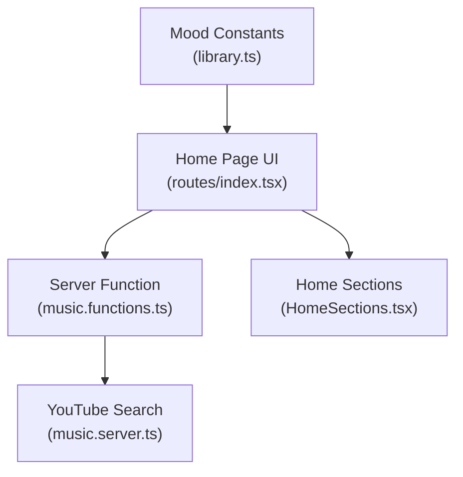
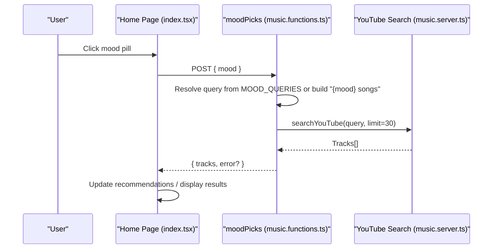
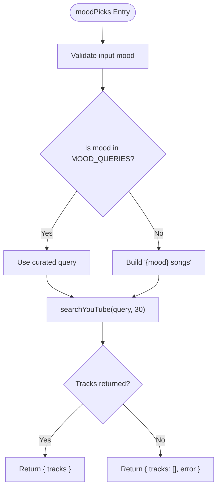
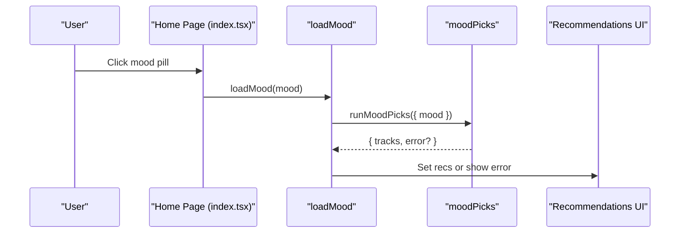
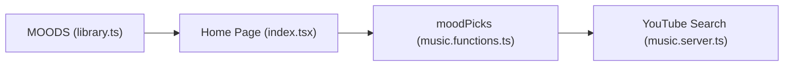

# Mood-Based Playlist Generation

<cite>
**Referenced Files in This Document**
- [music.functions.ts](file://src/lib/music.functions.ts)
- [library.ts](file://src/lib/library.ts)
- [index.tsx](file://src/routes/index.tsx)
- [HomeSections.tsx](file://src/components/music/ui/HomeSections.tsx)
</cite>

## Table of Contents
1. [Introduction](#introduction)
2. [Project Structure](#project-structure)
3. [Core Components](#core-components)
4. [Architecture Overview](#architecture-overview)
5. [Detailed Component Analysis](#detailed-component-analysis)
6. [Dependency Analysis](#dependency-analysis)
7. [Performance Considerations](#performance-considerations)
8. [Troubleshooting Guide](#troubleshooting-guide)
9. [Conclusion](#conclusion)

## Introduction
This document explains the mood-based playlist generation system that lets users discover curated music by selecting a mood. The core function, moodPicks, maps emotional states to optimized YouTube search queries and returns playable tracks without requiring an AI key. It includes a predefined mapping for popular moods and a fallback strategy for custom moods not in the set. Users can trigger mood playlists from the home page’s quick pick area, and results are displayed alongside other discovery sections.

## Project Structure
The mood system spans server functions, UI components, and route-level orchestration:
- Server-side logic defines the mood-to-query mapping and builds the mood radio via YouTube search.
- The home route wires user interactions (mood pill clicks) to the server function and updates recommendations.
- Home sections render discovery content, including empty-state messaging that encourages mood selection.

**Diagram sources**
- [index.tsx:652-663](file://src/routes/index.tsx#L652-L663)
- [music.functions.ts:583-610](file://src/lib/music.functions.ts#L583-L610)
- [HomeSections.tsx:111-121](file://src/components/music/ui/HomeSections.tsx#L111-L121)
- [library.ts:80-91](file://src/lib/library.ts#L80-L91)

**Section sources**
- [index.tsx:652-663](file://src/routes/index.tsx#L652-L663)
- [music.functions.ts:583-610](file://src/lib/music.functions.ts#L583-L610)
- [HomeSections.tsx:111-121](file://src/components/music/ui/HomeSections.tsx#L111-L121)
- [library.ts:80-91](file://src/lib/library.ts#L80-L91)

## Core Components
- moodPicks server function: Validates input, resolves a search query from the MOOD_QUERIES map or constructs a fallback query, calls YouTube search, and returns tracks or an error message.
- MOOD_QUERIES mapping: A lookup table that translates specific moods into optimized YouTube search strings.
- Home page integration: The home route exposes mood pills derived from the MOODS constant; clicking a pill triggers moodPicks and displays results.
- Home sections: Render discovery areas and provide guidance when no content is available, encouraging users to search or pick a mood.

Key responsibilities:
- Input validation ensures only short, safe mood strings are accepted.
- Query resolution prioritizes curated queries for known moods and falls back to a generic pattern for unknown ones.
- Error handling returns a friendly message and empty track list on failures.

**Section sources**
- [music.functions.ts:583-610](file://src/lib/music.functions.ts#L583-L610)
- [library.ts:80-91](file://src/lib/library.ts#L80-L91)
- [index.tsx:1092-1105](file://src/routes/index.tsx#L1092-L1105)
- [HomeSections.tsx:111-121](file://src/components/music/ui/HomeSections.tsx#L111-L121)

## Architecture Overview
The mood flow connects UI actions to server-side query building and YouTube search, then renders results in the home interface.

**Diagram sources**
- [index.tsx:652-663](file://src/routes/index.tsx#L652-L663)
- [music.functions.ts:583-610](file://src/lib/music.functions.ts#L583-L610)

## Detailed Component Analysis

### moodPicks Server Function
- Purpose: Build a mood-specific playlist instantly using YouTube search without AI.
- Input: A single mood string validated to be between 1 and 40 characters.
- Query resolution:
  - If the mood exists in MOOD_QUERIES, use the curated query.
  - Otherwise, construct a fallback query by appending “songs” to the mood.
- Execution: Calls YouTube search with a fixed limit and returns either tracks or an error message.
- Error handling: On failure, returns an empty track array and a user-friendly error string.

**Diagram sources**
- [music.functions.ts:583-610](file://src/lib/music.functions.ts#L583-L610)

**Section sources**
- [music.functions.ts:583-610](file://src/lib/music.functions.ts#L583-L610)

### MOOD_QUERIES Mapping System
- Definition: A record mapping specific moods to optimized YouTube search queries.
- Supported entries include late night, upbeat workout, focus, sad hours, throwbacks, romantic, happy, party, chill, and devotional.
- Behavior: When a mood matches a key, the corresponding curated query is used; otherwise, a generic fallback is constructed.

Examples of supported moods and their mapped queries:
- late night → curated lofi mix query
- upbeat workout → energetic workout query
- focus → instrumental concentration query
- sad hours → soulful Hindi query
- throwbacks → old Hindi hits query
- romantic → love songs query
- happy → feel-good Bollywood query
- party → dance Hindi query
- chill → relaxing songs query
- devotional → bhajan songs query

Custom moods:
- Any mood not present in the mapping will be transformed into a generic search by appending “songs”. For example, “midnight jazz” becomes “midnight jazz songs”.

**Section sources**
- [music.functions.ts:586-597](file://src/lib/music.functions.ts#L586-L597)

### Home Page Integration and Discovery
- Mood pills: The home page renders mood buttons based on the MOODS constant. Each button calls loadMood, which invokes moodPicks with the selected mood.
- Results display: After loading, the app updates the recommendation list so users can immediately play mood-specific tracks.
- Empty state: When there is no content, the home sections prompt users to search or pick a mood to get personalized picks.

**Diagram sources**
- [index.tsx:1092-1105](file://src/routes/index.tsx#L1092-L1105)
- [index.tsx:652-663](file://src/routes/index.tsx#L652-L663)

**Section sources**
- [index.tsx:1092-1105](file://src/routes/index.tsx#L1092-L1105)
- [index.tsx:652-663](file://src/routes/index.tsx#L652-L663)
- [HomeSections.tsx:111-121](file://src/components/music/ui/HomeSections.tsx#L111-L121)

### Supported Moods and Examples
- Predefined moods come from the MOODS constant and are rendered as quick pick buttons on the home page.
- Example flows:
  - Selecting “focus” uses a curated instrumental concentration query to surface study-friendly tracks.
  - Selecting “upbeat workout” uses an energetic workout query to surface high-tempo tracks.
  - Selecting “late night” uses a lofi mix query to surface relaxed nighttime listening.
  - Custom moods like “rainy day” are handled by constructing “rainy day songs” and searching YouTube.

**Section sources**
- [library.ts:80-91](file://src/lib/library.ts#L80-L91)
- [music.functions.ts:586-610](file://src/lib/music.functions.ts#L586-L610)
- [index.tsx:1092-1105](file://src/routes/index.tsx#L1092-L1105)

### Fallback Mechanisms for Unavailable Content
- Unknown moods: If a mood is not in MOOD_QUERIES, the system falls back to a generic query by appending “songs”.
- Network or API errors: If the YouTube search fails, the function returns an empty track list and a user-facing error message indicating the mood radio could not be built.
- UI behavior: The home page shows the error message and allows retrying or switching to another mood.

**Section sources**
- [music.functions.ts:600-610](file://src/lib/music.functions.ts#L600-L610)
- [index.tsx:652-663](file://src/routes/index.tsx#L652-L663)

## Dependency Analysis
- UI depends on the MOODS constant to render mood pills.
- The home route imports and executes the moodPicks server function to fetch mood-specific tracks.
- The server function depends on a YouTube search utility to resolve tracks based on the resolved query.

**Diagram sources**
- [library.ts:80-91](file://src/lib/library.ts#L80-L91)
- [index.tsx:652-663](file://src/routes/index.tsx#L652-L663)
- [music.functions.ts:583-610](file://src/lib/music.functions.ts#L583-L610)

**Section sources**
- [library.ts:80-91](file://src/lib/library.ts#L80-L91)
- [index.tsx:652-663](file://src/routes/index.tsx#L652-L663)
- [music.functions.ts:583-610](file://src/lib/music.functions.ts#L583-L610)

## Performance Considerations
- Fixed limit: The moodPicks function requests a fixed number of tracks per mood, balancing responsiveness and result richness.
- No AI overhead: Mood radios bypass AI models, reducing latency and dependency on external keys.
- Deduplication at UI level: The home page merges and deduplicates incoming tracks to avoid duplicates in the queue.

[No sources needed since this section provides general guidance]

## Troubleshooting Guide
- Symptom: No tracks appear after selecting a mood.
  - Check for error messages displayed by the home page after calling moodPicks.
  - Verify network connectivity and YouTube availability.
- Symptom: Unexpected results for a custom mood.
  - Confirm the mood is not in MOOD_QUERIES; if absent, it will use a generic “{mood} songs” query.
  - Try a more specific or commonly used mood phrase to improve relevance.
- Symptom: Repeated failures.
  - Retry the action; transient errors may resolve on subsequent attempts.
  - Switch to a different mood or use the general search to find content.

**Section sources**
- [music.functions.ts:600-610](file://src/lib/music.functions.ts#L600-L610)
- [index.tsx:652-663](file://src/routes/index.tsx#L652-L663)

## Conclusion
The mood-based playlist system provides fast, reliable access to curated music through predefined mood queries and a robust fallback for custom moods. Integrated directly into the home page, it enables users to discover content aligned with their current emotional state while maintaining performance and simplicity by avoiding AI dependencies. Errors are handled gracefully, and the UI guides users toward successful discovery even when content is temporarily unavailable.