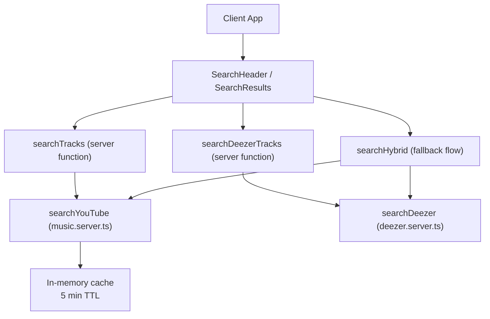
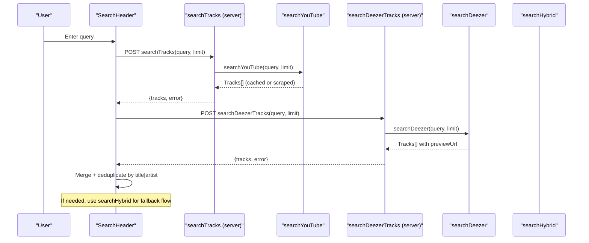
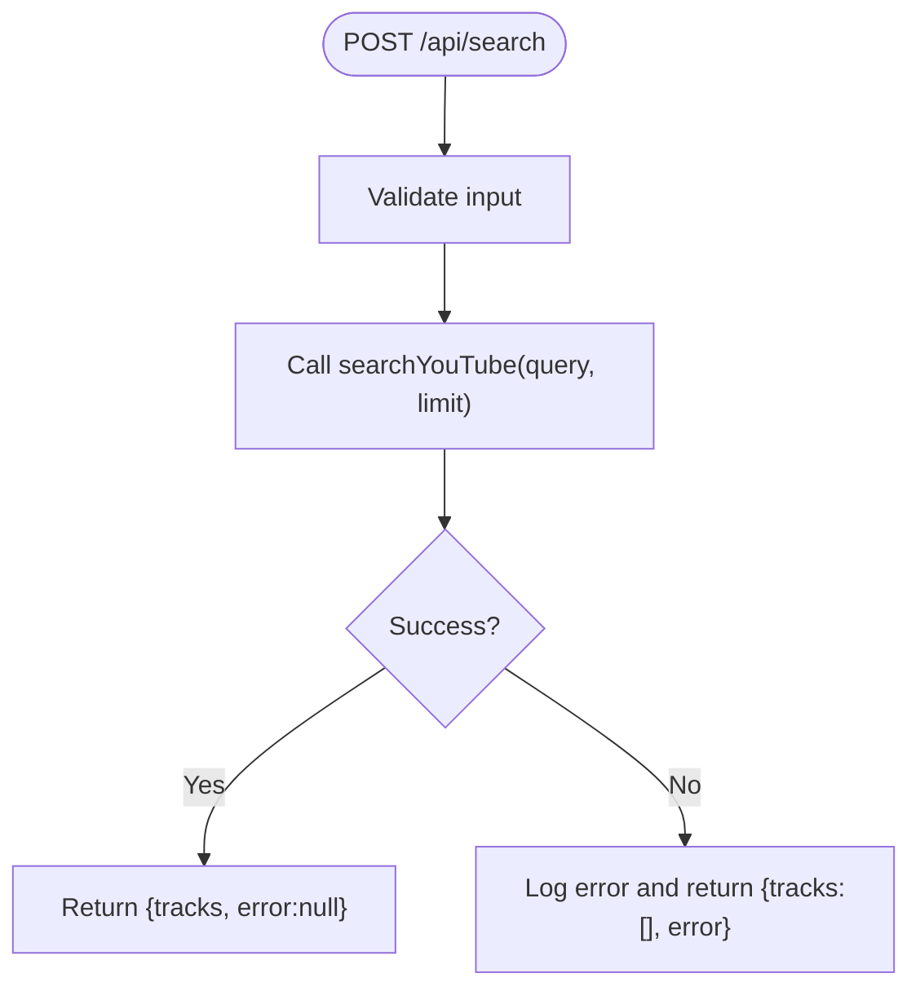
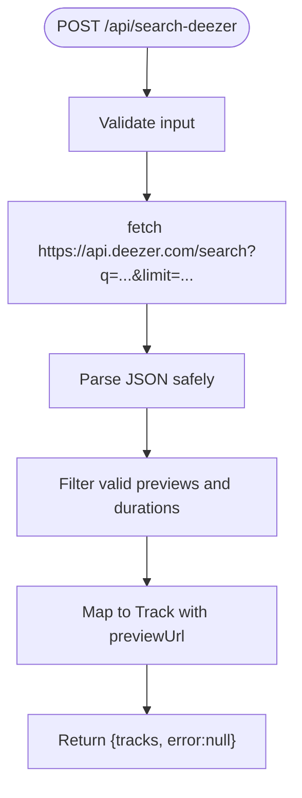
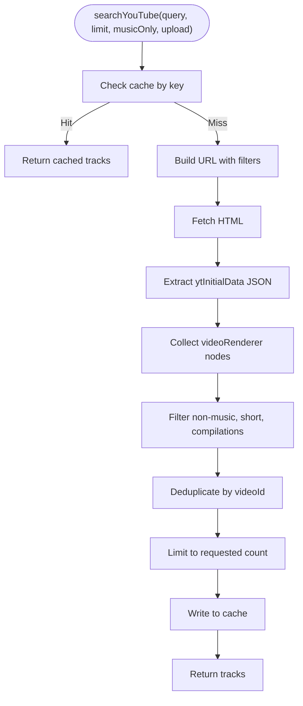
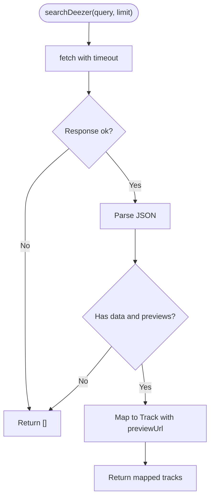
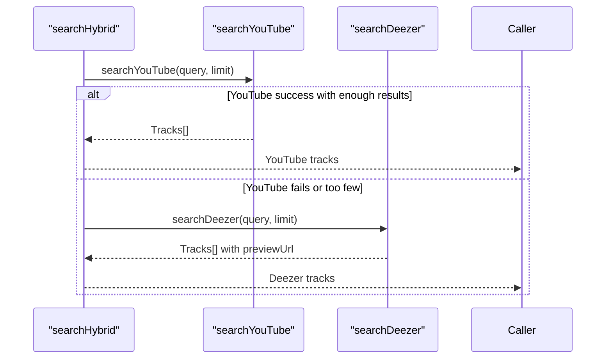
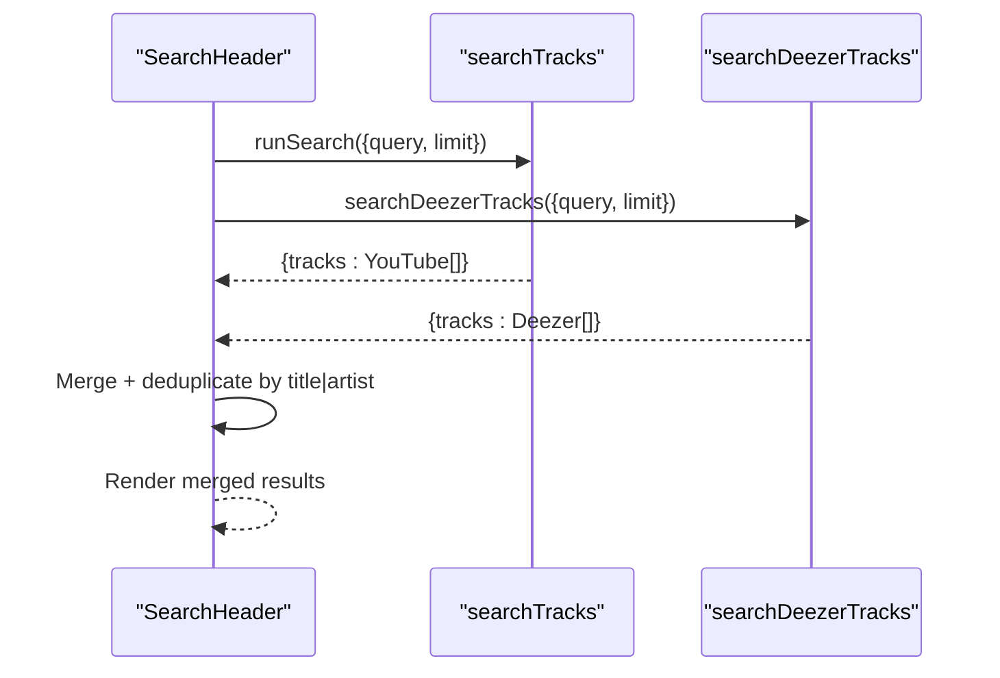
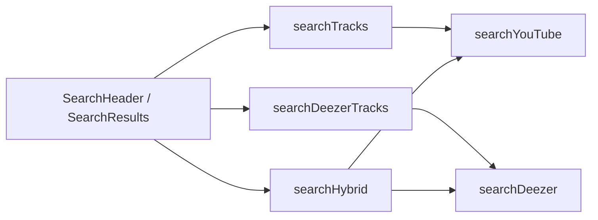

# Multi-Source Search Aggregation

<cite>
**Referenced Files in This Document**
- [music.functions.ts](file://src/lib/music.functions.ts)
- [music.server.ts](file://src/lib/music.server.ts)
- [deezer.server.ts](file://src/lib/deezer.server.ts)
- [music-hybrid.server.ts](file://src/lib/music-hybrid.server.ts)
- [SearchResults.tsx](file://src/components/music/ui/SearchResults.tsx)
- [SearchHeader.tsx](file://src/components/music/layout/SearchHeader.tsx)
- [index.tsx](file://src/routes/index.tsx)
- [sw.js](file://public/sw.js)
</cite>

## Table of Contents
1. [Introduction](#introduction)
2. [Project Structure](#project-structure)
3. [Core Components](#core-components)
4. [Architecture Overview](#architecture-overview)
5. [Detailed Component Analysis](#detailed-component-analysis)
6. [Dependency Analysis](#dependency-analysis)
7. [Performance Considerations](#performance-considerations)
8. [Troubleshooting Guide](#troubleshooting-guide)
9. [Conclusion](#conclusion)
10. [Appendices](#appendices)

## Introduction
This document explains the multi-source search aggregation system that combines results from YouTube and Deezer to deliver a resilient, high-quality music search experience. It covers how queries are processed, how results are deduplicated and ranked, how free preview streaming is enabled via Deezer without API keys, and how external API failures are handled. It also includes examples of query patterns, response formats, and performance considerations such as rate limiting and caching strategies.

## Project Structure
The search system spans server-side functions, scraping utilities, and UI components:
- Server entry points expose search endpoints and orchestrate calls to YouTube and Deezer.
- YouTube integration scrapes search results with filters and quality heuristics.
- Deezer integration provides free 30-second previews for reliable playback.
- A hybrid strategy ensures fallbacks when one source fails or returns insufficient results.
- The UI triggers parallel searches and merges results client-side for speed and coverage.

**Diagram sources**
- [music.functions.ts:8-21](file://src/lib/music.functions.ts#L8-L21)
- [music.functions.ts:35-44](file://src/lib/music.functions.ts#L35-L44)
- [music.server.ts:182-247](file://src/lib/music.server.ts#L182-L247)
- [deezer.server.ts:39-74](file://src/lib/deezer.server.ts#L39-L74)
- [music-hybrid.server.ts:22-49](file://src/lib/music-hybrid.server.ts#L22-L49)

**Section sources**
- [music.functions.ts:8-21](file://src/lib/music.functions.ts#L8-L21)
- [music.functions.ts:35-44](file://src/lib/music.functions.ts#L35-L44)
- [music.server.ts:182-247](file://src/lib/music.server.ts#L182-L247)
- [deezer.server.ts:39-74](file://src/lib/deezer.server.ts#L39-L74)
- [music-hybrid.server.ts:22-49](file://src/lib/music-hybrid.server.ts#L22-L49)

## Core Components
- searchTracks (server function): Validates input, calls YouTube search, and returns tracks or an error message.
- searchDeezerTracks (server function): Calls Deezer search and returns tracks with playable preview URLs.
- searchYouTube (utility): Scrapes YouTube search with music-only filtering, duration checks, and result deduplication; caches results for 5 minutes.
- searchDeezer (utility): Queries the public Deezer API, filters valid previews, and maps to a unified Track type.
- searchHybrid (utility): Orchestrates YouTube-first, Deezer-fallback logic to ensure playable results.
- UI search flow: Runs YouTube and Deezer in parallel, merges results, and deduplicates by title+artist.

Key responsibilities:
- Query processing: Input validation, query enrichment (e.g., appending “audio” for music), and upload/date filters.
- Result normalization: Mapping provider-specific fields into a common Track shape.
- Deduplication: In-memory sets keyed by video id (YouTube) or title+artist (client merge).
- Ranking: YouTube’s native ranking plus heuristics (duration, non-music filters); client-side ordering by relevance.

**Section sources**
- [music.functions.ts:8-21](file://src/lib/music.functions.ts#L8-L21)
- [music.functions.ts:35-44](file://src/lib/music.functions.ts#L35-L44)
- [music.server.ts:182-247](file://src/lib/music.server.ts#L182-L247)
- [deezer.server.ts:39-74](file://src/lib/deezer.server.ts#L39-L74)
- [music-hybrid.server.ts:22-49](file://src/lib/music-hybrid.server.ts#L22-L49)
- [index.tsx:760-790](file://src/routes/index.tsx#L760-L790)

## Architecture Overview
The system uses a layered approach:
- Presentation layer: SearchHeader and SearchResults manage user input and display merged results.
- API layer: Server functions validate inputs and delegate to providers.
- Provider layer: YouTube scraper and Deezer API wrapper normalize data.
- Fallback layer: Hybrid strategy ensures availability even if one provider fails.

**Diagram sources**
- [music.functions.ts:8-21](file://src/lib/music.functions.ts#L8-L21)
- [music.functions.ts:35-44](file://src/lib/music.functions.ts#L35-L44)
- [music.server.ts:182-247](file://src/lib/music.server.ts#L182-L247)
- [deezer.server.ts:39-74](file://src/lib/deezer.server.ts#L39-L74)
- [index.tsx:760-790](file://src/routes/index.tsx#L760-L790)

## Detailed Component Analysis

### searchTracks (Server Function)
- Purpose: Expose a stable server endpoint for searching YouTube tracks.
- Input validation: Ensures query string and optional numeric limit.
- Processing: Calls searchYouTube and returns normalized tracks or an error message on failure.
- Error handling: Catches exceptions and returns a user-friendly error while preserving empty track arrays.

**Diagram sources**
- [music.functions.ts:8-21](file://src/lib/music.functions.ts#L8-L21)

**Section sources**
- [music.functions.ts:8-21](file://src/lib/music.functions.ts#L8-L21)

### searchDeezerTracks (Server Function)
- Purpose: Provide a server endpoint for searching Deezer and returning playable previews without requiring API keys.
- Processing: Delegates to searchDeezer, which performs network requests with timeouts and parses responses safely.
- Output: Returns tracks with direct previewUrl suitable for <audio> playback.

**Diagram sources**
- [music.functions.ts:35-44](file://src/lib/music.functions.ts#L35-L44)
- [deezer.server.ts:39-74](file://src/lib/deezer.server.ts#L39-L74)

**Section sources**
- [music.functions.ts:35-44](file://src/lib/music.functions.ts#L35-L44)
- [deezer.server.ts:39-74](file://src/lib/deezer.server.ts#L39-L74)

### searchYouTube (Utility)
- Purpose: Scrape YouTube search results without API keys, focusing on music content.
- Query optimization:
  - Adds “audio” to prioritize audio-only content when musicOnly is true.
  - Applies music category filter and optional upload-date filters (“today”, “week”).
- Filtering and ranking:
  - Skips non-music titles using keyword lists.
  - Filters out compilation-style videos.
  - Enforces minimum duration thresholds to exclude shorts/live streams.
  - Deduplicates by videoId during parsing.
- Caching:
  - In-memory LRU-style cache with 5-minute TTL and max entries.
  - Reduces repeated network requests and improves responsiveness.

**Diagram sources**
- [music.server.ts:52-75](file://src/lib/music.server.ts#L52-L75)
- [music.server.ts:182-247](file://src/lib/music.server.ts#L182-L247)

**Section sources**
- [music.server.ts:52-75](file://src/lib/music.server.ts#L52-L75)
- [music.server.ts:182-247](file://src/lib/music.server.ts#L182-L247)

### searchDeezer (Utility)
- Purpose: Query the public Deezer API for tracks with free 30-second previews.
- Robustness:
  - Uses AbortSignal timeout to avoid hanging requests.
  - Safely handles malformed JSON and non-ok responses.
- Normalization:
  - Maps Deezer fields to the shared Track type.
  - Includes previewUrl for direct playback.
  - Formats duration consistently.

**Diagram sources**
- [deezer.server.ts:39-74](file://src/lib/deezer.server.ts#L39-L74)

**Section sources**
- [deezer.server.ts:39-74](file://src/lib/deezer.server.ts#L39-L74)

### searchHybrid (Fallback Strategy)
- Purpose: Ensure always-playable results by preferring YouTube full songs and falling back to Deezer previews.
- Flow:
  - Try YouTube first; if sufficient results are returned, use them.
  - On failure or insufficient results, try Deezer.
  - If both fail, return an empty array.
- Stream resolution:
  - YouTube tracks use a stream proxy endpoint.
  - Deezer tracks use direct previewUrl.

**Diagram sources**
- [music-hybrid.server.ts:22-49](file://src/lib/music-hybrid.server.ts#L22-L49)

**Section sources**
- [music-hybrid.server.ts:22-49](file://src/lib/music-hybrid.server.ts#L22-L49)

### UI Search Flow and Merging
- Parallel execution: The UI runs YouTube and Deezer searches concurrently to minimize latency.
- Merging and deduplication: Combines results with YouTube first, then adds Deezer tracks not already present by title+artist.
- Display: Results are rendered with a top result highlight and grid of song cards.

**Diagram sources**
- [index.tsx:760-790](file://src/routes/index.tsx#L760-L790)
- [SearchResults.tsx:148-208](file://src/components/music/ui/SearchResults.tsx#L148-L208)

**Section sources**
- [index.tsx:760-790](file://src/routes/index.tsx#L760-L790)
- [SearchResults.tsx:148-208](file://src/components/music/ui/SearchResults.tsx#L148-L208)

## Dependency Analysis
- Server functions depend on provider utilities:
  - searchTracks depends on searchYouTube.
  - searchDeezerTracks depends on searchDeezer.
- Hybrid strategy composes both providers to guarantee resilience.
- UI depends on server functions and local state to render results.

**Diagram sources**
- [music.functions.ts:8-21](file://src/lib/music.functions.ts#L8-L21)
- [music.functions.ts:35-44](file://src/lib/music.functions.ts#L35-L44)
- [music-hybrid.server.ts:22-49](file://src/lib/music-hybrid.server.ts#L22-L49)

**Section sources**
- [music.functions.ts:8-21](file://src/lib/music.functions.ts#L8-L21)
- [music.functions.ts:35-44](file://src/lib/music.functions.ts#L35-L44)
- [music-hybrid.server.ts:22-49](file://src/lib/music-hybrid.server.ts#L22-L49)

## Performance Considerations
- Caching:
  - In-memory LRU cache for YouTube search results with 5-minute TTL and max entries reduces repeated scraping and network load.
  - Service worker caches GET API responses to improve offline resilience and reduce redundant requests.
- Timeouts:
  - Network requests include timeouts to prevent long hangs and improve perceived performance.
- Rate limiting:
  - No explicit rate limiter is implemented; consider adding request throttling or queuing at the server layer to avoid provider limits or IP blocks.
- Concurrency:
  - Parallel search execution on the client reduces total latency by fetching from multiple sources simultaneously.
- Deduplication:
  - Efficient set-based deduplication prevents duplicate cards and minimizes rendering overhead.
- Streaming:
  - Audio streams bypass caching to avoid bloating storage quotas; offline downloads are handled separately.

[No sources needed since this section provides general guidance]

## Troubleshooting Guide
Common issues and resolutions:
- YouTube search fails or returns no results:
  - Check network connectivity and headers; verify that the page can be fetched and parsed.
  - Inspect filters (musicOnly, upload range) to ensure they match expected content.
  - Use searchHybrid to automatically fall back to Deezer previews.
- Deezer search returns empty or invalid previews:
  - Verify response status and JSON parsing; handle malformed payloads gracefully.
  - Confirm duration and preview fields exist before mapping to Track.
- UI shows loading indefinitely:
  - Ensure timeouts are configured and errors propagate back to the UI.
  - Confirm that merging logic does not block due to large datasets.
- Playback issues:
  - For YouTube tracks, confirm the stream proxy endpoint resolves correctly.
  - For Deezer tracks, ensure previewUrl is present and accessible.

**Section sources**
- [music.server.ts:182-247](file://src/lib/music.server.ts#L182-L247)
- [deezer.server.ts:39-74](file://src/lib/deezer.server.ts#L39-L74)
- [music-hybrid.server.ts:22-49](file://src/lib/music-hybrid.server.ts#L22-L49)
- [sw.js:41-89](file://public/sw.js#L41-L89)

## Conclusion
The multi-source search aggregation system delivers robust, fast, and playable music search results by combining YouTube’s rich catalog with Deezer’s reliable previews. Through careful query optimization, filtering, deduplication, and caching, it balances performance and reliability. The hybrid fallback strategy ensures users always get something playable, even when external APIs fail or restrict content. Extending the system with explicit rate limiting and more sophisticated ranking would further improve scalability and result quality.

[No sources needed since this section summarizes without analyzing specific files]

## Appendices

### Example Queries and Expected Behavior
- Basic search: “Arijit Singh” → YouTube full songs; if unavailable, Deezer previews.
- Language-focused: “new hindi songs” → YouTube filtered by language terms; Deezer fills gaps.
- Trending: “trending songs this week” → Fresh uploads and popular tracks.
- Mood radio: “late night lofi songs mix” → Curated mood-based results.

[No sources needed since this section provides conceptual examples]

### Data Models
- Track fields: id, title, artist, duration, thumbnail, previewUrl (optional), source (youtube|deezer), reason (optional).
- Deezer response fields: id, title, artist.name, album.cover_medium/big, preview, duration.

**Section sources**
- [music.server.ts:1-13](file://src/lib/music.server.ts#L1-L13)
- [deezer.server.ts:11-27](file://src/lib/deezer.server.ts#L11-L27)