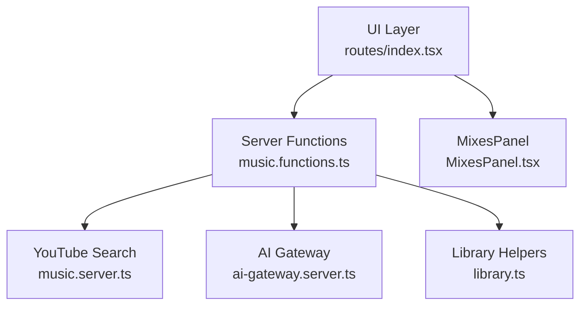
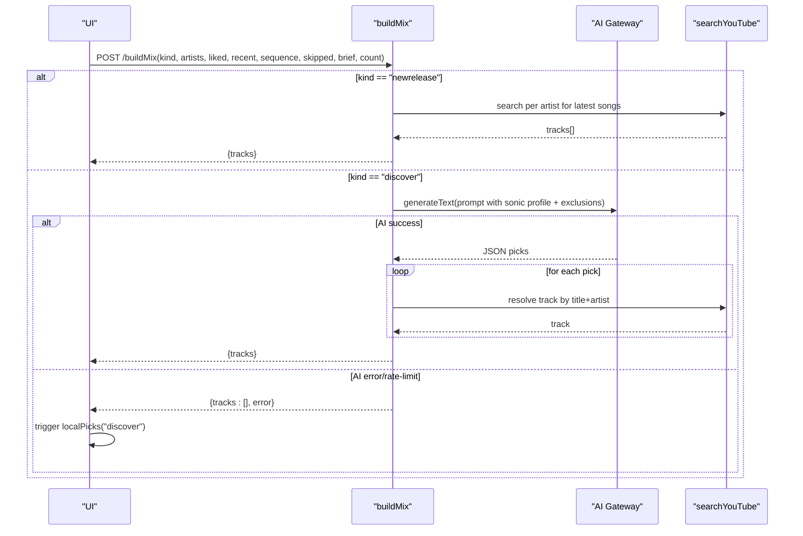
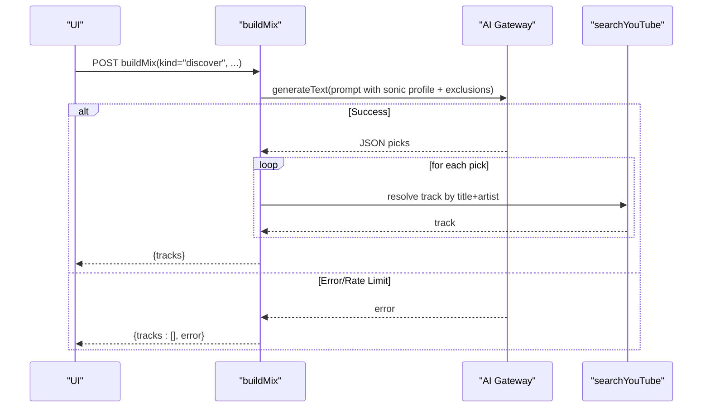
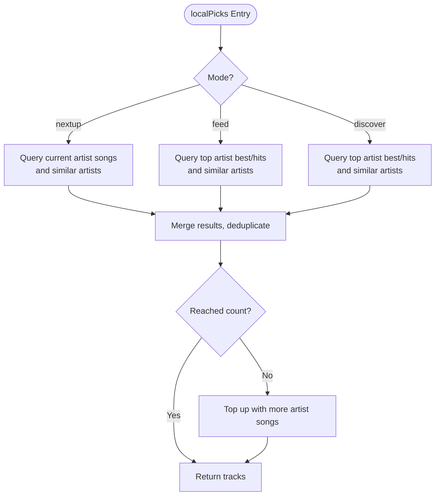
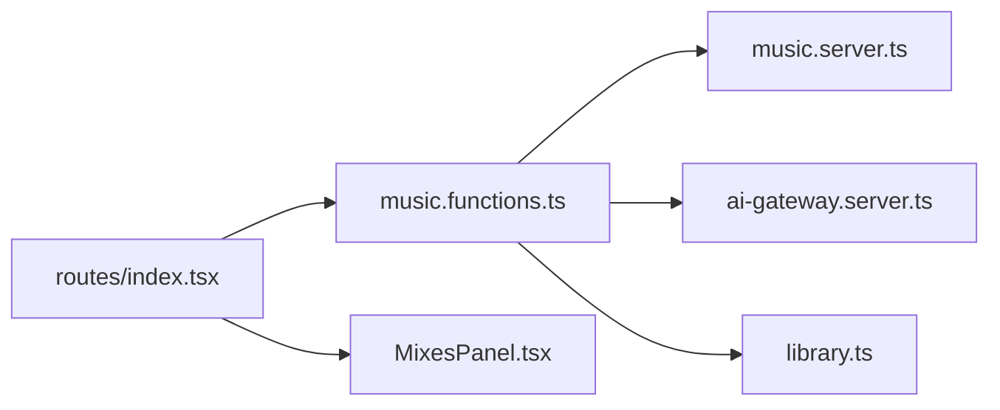

# Personalized Mix Generation

<cite>
**Referenced Files in This Document**
- [music.functions.ts](file://src/lib/music.functions.ts)
- [music.server.ts](file://src/lib/music.server.ts)
- [ai-gateway.server.ts](file://src/lib/ai-gateway.server.ts)
- [index.tsx](file://src/routes/index.tsx)
- [MixesPanel.tsx](file://src/components/music/MixesPanel.tsx)
- [library.ts](file://src/lib/library.ts)
- [error-capture.ts](file://src/lib/error-capture.ts)
</cite>

## Table of Contents
1. Introduction
2. Project Structure
3. Core Components
4. Architecture Overview
5. Detailed Component Analysis
6. Dependency Analysis
7. Performance Considerations
8. Troubleshooting Guide
9. Conclusion

## Introduction
This document explains the personalized mix generation system that powers two primary mixes:
- Discover Mix: AI-powered discovery of new artists that match the listener’s sonic profile while excluding known artists.
- New Release Mix: Latest drops from artists the listener already plays, without AI.

It also covers input validation for artist lists, listening sequences, and preference settings; the AI-powered discovery process; the localPicks fallback system; configuration options; quota management; and error handling strategies.

## Project Structure
The mix generation logic is implemented as server functions with strict input validation, backed by a YouTube search layer and an optional AI gateway. The UI orchestrates calls to these server functions and falls back to non-AI recommendations when needed.

**Diagram sources**
- [index.tsx:265-325](file://src/routes/index.tsx#L265-L325)
- [music.functions.ts:140-245](file://src/lib/music.functions.ts#L140-L245)
- [music.server.ts:182-247](file://src/lib/music.server.ts#L182-L247)
- [ai-gateway.server.ts:1-10](file://src/lib/ai-gateway.server.ts#L1-L10)
- [MixesPanel.tsx:10-46](file://src/components/music/MixesPanel.tsx#L10-L46)
- [library.ts:563-646](file://src/lib/library.ts#L563-L646)

**Section sources**
- [music.functions.ts:140-245](file://src/lib/music.functions.ts#L140-L245)
- [music.server.ts:182-247](file://src/lib/music.server.ts#L182-L247)
- [ai-gateway.server.ts:1-10](file://src/lib/ai-gateway.server.ts#L1-L10)
- [index.tsx:265-325](file://src/routes/index.tsx#L265-L325)
- [MixesPanel.tsx:10-46](file://src/components/music/MixesPanel.tsx#L10-L46)
- [library.ts:563-646](file://src/lib/library.ts#L563-L646)

## Core Components
- buildMix: Creates “discover” or “newrelease” mixes based on validated inputs.
- localPicks: Non-AI fallback that balances comfort tracks, similar artists, and forgotten favorites.
- newDrops: Fresh releases from the listener’s own artists (no AI).
- newSongs: Explore feed of fresh tracks with language focus (no AI).
- podcastPicks: Podcast suggestions based on topics/languages (no AI).
- searchYouTube: YouTube search abstraction with caching and music filtering.

Key responsibilities:
- Input validation via Zod schemas ensures safe and bounded data.
- AI path uses a gateway provider to call a model for discovery.
- Fallback path uses curated queries to produce reliable results even without AI.

**Section sources**
- [music.functions.ts:140-245](file://src/lib/music.functions.ts#L140-L245)
- [music.functions.ts:310-369](file://src/lib/music.functions.ts#L310-L369)
- [music.functions.ts:248-307](file://src/lib/music.functions.ts#L248-L307)
- [music.functions.ts:372-458](file://src/lib/music.functions.ts#L372-L458)
- [music.functions.ts:461-559](file://src/lib/music.functions.ts#L461-L559)
- [music.server.ts:182-247](file://src/lib/music.server.ts#L182-L247)

## Architecture Overview
The system follows a layered architecture:
- UI triggers mix loading and displays results.
- Server functions validate inputs and implement business logic.
- AI integration is optional; if unavailable or rate-limited, the system falls back to localPicks.
- YouTube search provides content with caching and filters to ensure music-only results.

**Diagram sources**
- [music.functions.ts:156-245](file://src/lib/music.functions.ts#L156-L245)
- [music.functions.ts:310-369](file://src/lib/music.functions.ts#L310-L369)
- [music.server.ts:182-247](file://src/lib/music.server.ts#L182-L247)
- [ai-gateway.server.ts:1-10](file://src/lib/ai-gateway.server.ts#L1-L10)
- [index.tsx:298-325](file://src/routes/index.tsx#L298-L325)

## Detailed Component Analysis

### buildMix Function
Purpose:
- Create two types of mixes:
  - discover: AI-powered selection of new artists matching the listener’s sonic profile, excluding known artists.
  - newrelease: Latest drops from the listener’s top artists using YouTube search (no AI).

Input validation:
- kind: enum ["discover", "newrelease"]
- liked: array of strings, max 30
- recent: array of strings, max 30
- sequence: array of strings, max 20
- skipped: array of strings, max 20
- artists: array of strings, max 15
- brief: string, max 800 (optional)
- count: number, min 1, max 30 (optional)

Processing logic:
- newrelease:
  - If no artists provided, return empty tracks.
  - Compute per-artist target count and query YouTube for “artist new song year”.
  - Deduplicate and cap at requested count.
- discover:
  - Requires AI key; otherwise returns an error.
  - Builds a prompt describing sonic DNA, recent behavior, skips, and known artists to exclude.
  - Calls AI to get JSON picks of new artists and reasons.
  - Filters out known artists and resolves each pick to a track via YouTube search.
  - Returns up to count resolved tracks.

Error handling:
- Missing AI key: returns explicit error message.
- Rate limits or credits exhausted: returns specific errors.
- Parsing failures: returns descriptive errors.

Quota and performance:
- Limits on arrays prevent oversized prompts.
- Parallel resolution of picks improves throughput.
- YouTube search is cached for 5 minutes to reduce repeated network calls.

**Section sources**
- [music.functions.ts:140-149](file://src/lib/music.functions.ts#L140-L149)
- [music.functions.ts:156-245](file://src/lib/music.functions.ts#L156-L245)
- [music.server.ts:52-75](file://src/lib/music.server.ts#L52-L75)

#### Sequence Diagram: Discover Mix Flow

**Diagram sources**
- [music.functions.ts:183-245](file://src/lib/music.functions.ts#L183-L245)
- [ai-gateway.server.ts:1-10](file://src/lib/ai-gateway.server.ts#L1-L10)
- [music.server.ts:182-247](file://src/lib/music.server.ts#L182-L247)

### Input Validation Details
- Artist list:
  - Enforced maximum length to bound downstream processing and AI context size.
  - Used to exclude known artists in discover mode and to scope newrelease searches.
- Listening sequences:
  - Ordered history with actions (played, skipped, replayed) informs the AI prompt to respect behavioral signals.
- Preference settings:
  - Brief encodes moods, genres, languages, familiarity vs discovery ratio, energy level, and instrumental-only preference.
  - Transformed into natural-language instructions for the AI.

Validation schemas:
- MixInput validates kind and all fields with appropriate constraints.
- LocalPicksInput, NewDropsInput, NewSongsInput, PodcastInput enforce bounds for their respective features.

**Section sources**
- [music.functions.ts:140-149](file://src/lib/music.functions.ts#L140-L149)
- [music.functions.ts:310-315](file://src/lib/music.functions.ts#L310-L315)
- [music.functions.ts:248-251](file://src/lib/music.functions.ts#L248-L251)
- [music.functions.ts:372-376](file://src/lib/music.functions.ts#L372-L376)
- [music.functions.ts:461-466](file://src/lib/music.functions.ts#L461-L466)
- [library.ts:563-588](file://src/lib/library.ts#L563-L588)

### AI-Powered Discovery Process
- Prompt construction includes:
  - Sonic DNA description (tempo, pitch feel, instrumentation, vocal texture, energy).
  - Loved and recently played tracks.
  - Sequential behavior (order, replays, skips).
  - Explicit exclusion of known artists.
  - Tuning preferences from settings.
- Model invocation:
  - Uses an OpenAI-compatible gateway configured with an API key.
  - Expects JSON array response with title, artist, reason.
- Post-processing:
  - Filters out known artists.
  - Resolves each pick to a playable track via YouTube search.
  - Deduplicates and caps at requested count.

Error handling:
- Handles rate limiting (429), credit exhaustion (402), and parsing errors.
- Returns user-friendly messages.

**Section sources**
- [music.functions.ts:183-245](file://src/lib/music.functions.ts#L183-L245)
- [ai-gateway.server.ts:1-10](file://src/lib/ai-gateway.server.ts#L1-L10)

### LocalPicks Fallback System
Purpose:
- Provide non-AI recommendations mirroring a balanced mix:
  - Comfort tracks from top artists.
  - Similar artists to top picks.
  - Familiar-but-older songs they may have forgotten.
Modes:
- feed: general recommendations.
- discover: mirrors discover mix behavior without AI.
- nextup: starts from current artist and widens out.

Algorithm highlights:
- Queries are tailored by mode and available artists.
- Results are deduplicated and capped at requested count.
- Gracefully handles search failures per query.

Fallback orchestration:
- UI triggers localPicks when AI is unavailable or returns no tracks for discover mode.

**Section sources**
- [music.functions.ts:310-369](file://src/lib/music.functions.ts#L310-L369)
- [index.tsx:298-325](file://src/routes/index.tsx#L298-L325)

#### Flowchart: LocalPicks Decision Logic

**Diagram sources**
- [music.functions.ts:324-369](file://src/lib/music.functions.ts#L324-L369)

### New Release Mix and Fresh Drops
- newrelease:
  - Computes per-artist targets and queries YouTube for “artist new song year”.
  - Deduplicates and caps at requested count.
- newDrops:
  - Searches each artist for “new song” within a week filter.
  - Prefers results whose channel matches the artist.
  - Returns a compact list of fresh drops for display in the UI.

**Section sources**
- [music.functions.ts:156-181](file://src/lib/music.functions.ts#L156-L181)
- [music.functions.ts:248-307](file://src/lib/music.functions.ts#L248-L307)

### Configuration Options
- AI configuration:
  - LOVABLE_API_KEY environment variable enables AI-powered discovery.
  - Without it, discover falls back to localPicks.
- Settings brief:
  - Encodes moods, genres, languages, discovery ratio, energy level, and instrumental-only preference.
- Count limits:
  - All server functions enforce maximum counts to control resource usage and response size.

**Section sources**
- [music.functions.ts:183-185](file://src/lib/music.functions.ts#L183-L185)
- [library.ts:563-588](file://src/lib/library.ts#L563-L588)
- [music.functions.ts:140-149](file://src/lib/music.functions.ts#L140-L149)

### Quota Management
- AI rate limiting:
  - Detects 429 responses and returns a user-facing message.
- Credit exhaustion:
  - Detects 402 or credit-related errors and instructs users to add credits.
- YouTube search caching:
  - In-memory LRU cache with 5-minute TTL reduces repeated network calls.
- Query quotas:
  - Each function caps per-query limits and deduplicates results to avoid over-fetching.

**Section sources**
- [music.functions.ts:207-218](file://src/lib/music.functions.ts#L207-L218)
- [music.server.ts:52-75](file://src/lib/music.server.ts#L52-L75)

### Error Handling Strategies
- Input validation:
  - Zod schemas reject malformed or oversized inputs early.
- Network errors:
  - Search failures return empty results or descriptive errors.
- AI errors:
  - Specific messages for rate limits and credit issues.
- UI resilience:
  - Routes handle errors and show messages; fallback to localPicks for discover when needed.
- Global error capture:
  - Captures and describes errors for observability.

**Section sources**
- [music.functions.ts:140-149](file://src/lib/music.functions.ts#L140-L149)
- [music.functions.ts:207-245](file://src/lib/music.functions.ts#L207-L245)
- [index.tsx:298-325](file://src/routes/index.tsx#L298-L325)
- [error-capture.ts:1-81](file://src/lib/error-capture.ts#L1-L81)

## Dependency Analysis
The system has clear separation between UI, server functions, and external services.

**Diagram sources**
- [index.tsx:265-325](file://src/routes/index.tsx#L265-L325)
- [music.functions.ts:140-245](file://src/lib/music.functions.ts#L140-L245)
- [music.server.ts:182-247](file://src/lib/music.server.ts#L182-L247)
- [ai-gateway.server.ts:1-10](file://src/lib/ai-gateway.server.ts#L1-L10)
- [library.ts:563-646](file://src/lib/library.ts#L563-L646)
- [MixesPanel.tsx:10-46](file://src/components/music/MixesPanel.tsx#L10-L46)

**Section sources**
- [music.functions.ts:140-245](file://src/lib/music.functions.ts#L140-L245)
- [music.server.ts:182-247](file://src/lib/music.server.ts#L182-L247)
- [ai-gateway.server.ts:1-10](file://src/lib/ai-gateway.server.ts#L1-L10)
- [library.ts:563-646](file://src/lib/library.ts#L563-L646)
- [index.tsx:265-325](file://src/routes/index.tsx#L265-L325)
- [MixesPanel.tsx:10-46](file://src/components/music/MixesPanel.tsx#L10-L46)

## Performance Considerations
- Caching:
  - YouTube search results cached for 5 minutes to reduce latency and bandwidth.
- Parallelism:
  - Parallel resolution of AI picks and per-artist searches improve throughput.
- Filtering:
  - Music-only filters and compilation/non-music keyword filters reduce noise.
- Limits:
  - Strict input bounds prevent excessive payloads and protect downstream services.
- Fallbacks:
  - localPicks ensures consistent UX even when AI is unavailable.

[No sources needed since this section provides general guidance]

## Troubleshooting Guide
Common issues and resolutions:
- AI not configured:
  - Ensure LOVABLE_API_KEY is set; otherwise discover falls back to localPicks.
- Rate limited:
  - Retry after a short delay; the system returns a specific message for 429.
- Credits exhausted:
  - Add credits to continue AI-powered discovery.
- No results:
  - For newrelease, ensure at least one artist is provided.
  - For discover, verify liked/recent/history data to inform the AI.
- Search failures:
  - Check network connectivity; the system gracefully handles errors and returns empty results.

Operational tips:
- Use the Rebuild button to refresh mixes.
- Adjust settings (moods, genres, languages, discovery ratio) to refine results.
- Monitor UI messages for errors and fallback status.

**Section sources**
- [music.functions.ts:183-218](file://src/lib/music.functions.ts#L183-L218)
- [music.functions.ts:156-181](file://src/lib/music.functions.ts#L156-L181)
- [index.tsx:298-325](file://src/routes/index.tsx#L298-L325)
- [error-capture.ts:1-81](file://src/lib/error-capture.ts#L1-L81)

## Conclusion
The personalized mix generation system combines AI-powered discovery with robust non-AI fallbacks to deliver high-quality mixes. Input validation, careful prompt engineering, and efficient search caching ensure reliability and performance. The localPicks fallback guarantees a consistent experience even when AI is unavailable, while configuration options allow fine-tuning to listener preferences.

[No sources needed since this section summarizes without analyzing specific files]