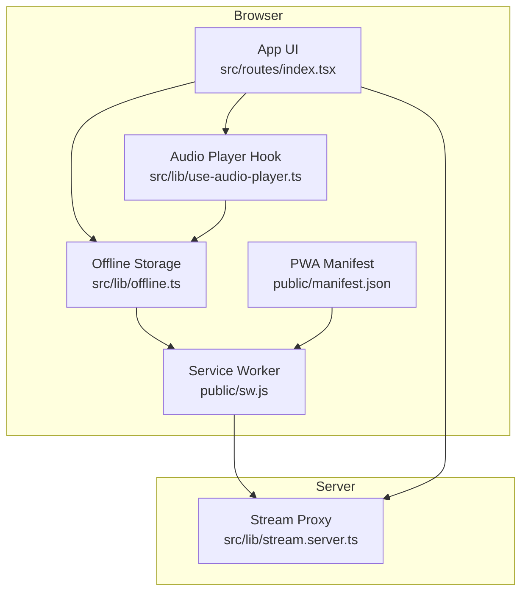
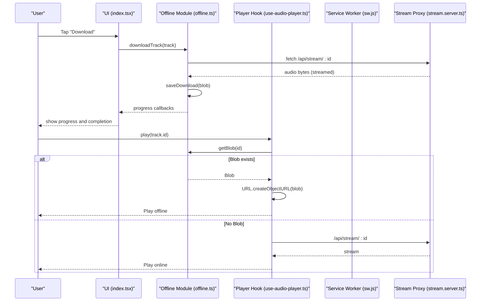
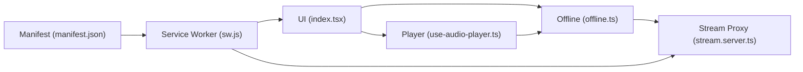

# Offline Functionality

<cite>
**Referenced Files in This Document**
- [offline.ts](file://src/lib/offline.ts)
- [use-audio-player.ts](file://src/lib/use-audio-player.ts)
- [sw.js](file://public/sw.js)
- [manifest.json](file://public/manifest.json)
- [library.ts](file://src/lib/library.ts)
- [stream.server.ts](file://src/lib/stream.server.ts)
- [index.tsx](file://src/routes/index.tsx)
</cite>

## Table of Contents
1. [Introduction](#introduction)
2. [Project Structure](#project-structure)
3. [Core Components](#core-components)
4. [Architecture Overview](#architecture-overview)
5. [Detailed Component Analysis](#detailed-component-analysis)
6. [Dependency Analysis](#dependency-analysis)
7. [Performance Considerations](#performance-considerations)
8. [Troubleshooting Guide](#troubleshooting-guide)
9. [Conclusion](#conclusion)

## Introduction
This document explains the offline functionality system that enables offline music playback without internet connectivity. It covers:
- IndexedDB-based download and storage for tracks
- Download management (queueing, storage optimization, cleanup)
- Service worker implementation for PWA capabilities and caching strategy
- Offline playback workflow and file management
- Storage limits handling and quota exceeded scenarios
- Browser compatibility, security considerations, and performance optimizations for large media files

The system uses a server-side stream proxy to resolve ad-free audio streams and stores downloaded content as blobs in IndexedDB so playback can continue offline. The service worker caches app shell assets and API responses while intentionally bypassing caching for large audio streams.

## Project Structure
Key files involved in offline functionality:
- src/lib/offline.ts: IndexedDB storage and download orchestration
- src/lib/use-audio-player.ts: Player integration with offline blob playback
- public/sw.js: Service worker for caching and offline shell
- public/manifest.json: PWA manifest configuration
- src/lib/library.ts: Track type definitions and local data utilities
- src/lib/stream.server.ts: Server-side stream resolution used by downloads and streaming
- src/routes/index.tsx: UI integration for downloading and managing offline tracks

**Diagram sources**
- [offline.ts:10-20](file://src/lib/offline.ts#L10-L20)
- [use-audio-player.ts:123-156](file://src/lib/use-audio-player.ts#L123-L156)
- [sw.js:35-84](file://public/sw.js#L35-L84)
- [manifest.json:1-26](file://public/manifest.json#L1-L26)
- [stream.server.ts:108-122](file://src/lib/stream.server.ts#L108-L122)
- [index.tsx:674-713](file://src/routes/index.tsx#L674-L713)

**Section sources**
- [offline.ts:10-20](file://src/lib/offline.ts#L10-L20)
- [use-audio-player.ts:123-156](file://src/lib/use-audio-player.ts#L123-L156)
- [sw.js:35-84](file://public/sw.js#L35-L84)
- [manifest.json:1-26](file://public/manifest.json#L1-L26)
- [stream.server.ts:108-122](file://src/lib/stream.server.ts#L108-L122)
- [index.tsx:674-713](file://src/routes/index.tsx#L674-L713)

## Core Components
- Offline storage module: Manages IndexedDB database, object store, transactions, and provides APIs to save, retrieve, list, remove, and clear downloads; includes progress reporting and storage quota estimation.
- Audio player hook: Integrates offline playback by loading blobs from IndexedDB into an HTML5 <audio> element via object URLs; falls back to network streaming when offline copies are unavailable.
- Service worker: Caches app shell and API responses; bypasses caching for audio streams to avoid bloating cache quotas; supports update skipping on message.
- Stream resolver: Server-side logic to obtain playable audio URLs from YouTube’s internal endpoints, probing for throttled or restricted content.
- UI integration: Provides download controls, lists offline tracks, shows total stored size, and allows clearing all offline data.

**Section sources**
- [offline.ts:58-147](file://src/lib/offline.ts#L58-L147)
- [use-audio-player.ts:123-156](file://src/lib/use-audio-player.ts#L123-L156)
- [sw.js:7-33](file://public/sw.js#L7-L33)
- [stream.server.ts:47-122](file://src/lib/stream.server.ts#L47-L122)
- [index.tsx:674-713](file://src/routes/index.tsx#L674-L713)

## Architecture Overview
The offline system combines client-side storage with server-side stream resolution and a service worker to ensure a resilient offline experience.

**Diagram sources**
- [index.tsx:683-713](file://src/routes/index.tsx#L683-L713)
- [offline.ts:149-200](file://src/lib/offline.ts#L149-L200)
- [use-audio-player.ts:123-156](file://src/lib/use-audio-player.ts#L123-L156)
- [stream.server.ts:108-122](file://src/lib/stream.server.ts#L108-L122)

## Detailed Component Analysis

### IndexedDB Offline Storage (offline.ts)
Responsibilities:
- Open and manage IndexedDB instance with versioning and object store creation
- Save downloaded tracks as blobs with metadata (track info, size, timestamp)
- Retrieve blobs for playback
- List, remove, and clear downloads
- Estimate storage quota and warn when running low
- Stream-download with progress updates and timeout handling

Key behaviors:
- Database name and version are constants; object store key is track id
- Transactions wrap read/write operations with promise wrappers for success/error handling
- Quota estimation uses navigator.storage.estimate to warn when remaining space is below a threshold
- Streaming download uses ReadableStream reader to accumulate chunks and construct a Blob with correct MIME type
- Timeout aborts long-running downloads

Complexity considerations:
- Chunk accumulation builds a Uint8Array sized to total received bytes; memory usage scales with file size
- Listing and sorting downloads returns metadata only (no blobs), reducing memory overhead

Error handling:
- Graceful fallbacks return empty arrays or null on errors
- Warnings logged for failed operations

Optimization opportunities:
- Implement LRU eviction or age-based cleanup policies to prevent unbounded growth
- Add explicit quota enforcement to reject new downloads when insufficient space remains
- Consider streaming directly to IndexedDB using Streams API to reduce peak memory usage

**Section sources**
- [offline.ts:10-41](file://src/lib/offline.ts#L10-L41)
- [offline.ts:58-147](file://src/lib/offline.ts#L58-L147)
- [offline.ts:149-200](file://src/lib/offline.ts#L149-L200)

### Audio Player Integration (use-audio-player.ts)
Responsibilities:
- Manage HTML5 <audio> element lifecycle and events
- Prefer offline playback by retrieving blobs from IndexedDB and creating object URLs
- Fall back to network streaming via /api/stream when offline copy is unavailable
- Support cueing at specific positions and controlling playback state

Key behaviors:
- playOffline attempts to load a downloaded blob; if found, creates an object URL and sets it as the source
- load and cue methods prioritize offline playback before attempting network streaming
- Object URLs are revoked on unmount or replacement to free memory

Error handling:
- Logs warnings for offline playback failures
- Handles autoplay restrictions by prompting user interaction

Optimization opportunities:
- Revoke object URLs promptly to avoid memory leaks
- Consider preloading frequently accessed offline tracks into memory for faster seek times

**Section sources**
- [use-audio-player.ts:123-156](file://src/lib/use-audio-player.ts#L123-L156)
- [use-audio-player.ts:158-172](file://src/lib/use-audio-player.ts#L158-L172)
- [use-audio-player.ts:174-187](file://src/lib/use-audio-player.ts#L174-L187)

### Service Worker and PWA (sw.js, manifest.json)
Responsibilities:
- Pre-cache app shell assets during install
- Activate and clean up old caches
- Intercept fetch requests with appropriate strategies:
  - Bypass caching for audio streams and range requests
  - Network-first for API calls with cache fallback
  - Cache-first for shell assets and other resources
- Allow immediate update checks via messages

Key behaviors:
- CACHE_VERSION and SHELL_CACHE separate dynamic API cache from static shell assets
- Audio streams are not cached to avoid exceeding quota and because offline downloads handle persistence
- Message listener supports skipWaiting for immediate updates

Security considerations:
- Only cache successful GET responses
- Avoid caching sensitive or mutable content

Compatibility:
- Uses standard CacheStorage and Service Worker APIs supported in modern browsers

**Section sources**
- [sw.js:1-33](file://public/sw.js#L1-L33)
- [sw.js:35-84](file://public/sw.js#L35-L84)
- [sw.js:86-89](file://public/sw.js#L86-L89)
- [manifest.json:1-26](file://public/manifest.json#L1-L26)

### Stream Resolution (stream.server.ts)
Responsibilities:
- Resolve direct audio stream URLs for videos using YouTube’s internal player endpoint
- Try multiple client configurations to handle throttling or restrictions
- Probe returned URLs to ensure they actually stream before returning

Key behaviors:
- Iterates through predefined clients and retries with delays
- Picks best audio-only format (prefers higher bitrate)
- Probes with Range request to validate stream availability

Error handling:
- Returns null if no valid stream can be resolved after retries

Integration points:
- Used by both online playback and offline downloads via /api/stream

**Section sources**
- [stream.server.ts:47-122](file://src/lib/stream.server.ts#L47-L122)

### UI Integration and Download Management (index.tsx)
Responsibilities:
- Provide UI to download tracks, remove individual downloads, and clear all offline data
- Display total offline storage size and list of downloaded tracks
- Integrate with queue and playback systems

Key behaviors:
- Tracks downloading state per track id to prevent duplicate downloads
- Refreshes download list after operations
- Shows human-readable storage size using formatting utility

User flows:
- Download: initiate download, show spinner, update list on completion
- Remove: delete specific track from offline storage and refresh list
- Clear: wipe all offline data and refresh list

**Section sources**
- [index.tsx:674-713](file://src/routes/index.tsx#L674-L713)
- [index.tsx:1201-1249](file://src/routes/index.tsx#L1201-L1249)

## Dependency Analysis
Relationships between components:
- UI depends on Offline module for download operations and on Player hook for playback
- Player hook depends on Offline module to retrieve offline blobs
- Offline module depends on server stream proxy for fetching audio bytes
- Service worker intercepts network requests and influences caching behavior for API and shell assets
- Manifest defines PWA metadata enabling installation and standalone display

**Diagram sources**
- [index.tsx:674-713](file://src/routes/index.tsx#L674-L713)
- [offline.ts:149-200](file://src/lib/offline.ts#L149-L200)
- [use-audio-player.ts:123-156](file://src/lib/use-audio-player.ts#L123-L156)
- [sw.js:35-84](file://public/sw.js#L35-L84)
- [manifest.json:1-26](file://public/manifest.json#L1-L26)
- [stream.server.ts:108-122](file://src/lib/stream.server.ts#L108-L122)

**Section sources**
- [index.tsx:674-713](file://src/routes/index.tsx#L674-L713)
- [offline.ts:149-200](file://src/lib/offline.ts#L149-L200)
- [use-audio-player.ts:123-156](file://src/lib/use-audio-player.ts#L123-L156)
- [sw.js:35-84](file://public/sw.js#L35-L84)
- [manifest.json:1-26](file://public/manifest.json#L1-L26)
- [stream.server.ts:108-122](file://src/lib/stream.server.ts#L108-L122)

## Performance Considerations
- Memory usage during download: Accumulating chunks into a Uint8Array scales with file size; consider streaming writes to IndexedDB to reduce peak memory.
- Blob object URLs: Ensure revocation on unmount or replacement to prevent memory leaks.
- Service worker caching: Avoid caching large audio streams; rely on IndexedDB for offline persistence.
- Quota estimation: Use navigator.storage.estimate to warn users before saving large blobs; implement stricter policies to prevent quota exceeded errors.
- Stream resolution retries: Multiple client configs and probes add latency; cache successful resolutions where appropriate to reduce repeated lookups.

[No sources needed since this section provides general guidance]

## Troubleshooting Guide
Common issues and resolutions:
- IndexedDB unavailable: If indexedDB is undefined, offline features will fail; provide fallback to online playback and inform the user.
- Download timeouts: Long downloads may time out; retry with exponential backoff and allow cancellation.
- Storage quota exceeded: When remaining space is insufficient, prompt the user to clear old downloads or free up space.
- Playback blocked: Autoplay restrictions require user interaction; prompt the user to tap play.
- Stream resolution failures: If server cannot resolve a playable URL, notify the user and suggest trying again later.

Operational tips:
- Monitor totalDownloadSize and listDownloads to audit storage usage.
- Implement cleanup policies based on savedAt timestamps or size thresholds.
- Use error boundaries and logging to capture failures in download and playback paths.

**Section sources**
- [offline.ts:24-41](file://src/lib/offline.ts#L24-L41)
- [offline.ts:58-72](file://src/lib/offline.ts#L58-L72)
- [offline.ts:149-200](file://src/lib/offline.ts#L149-L200)
- [use-audio-player.ts:115-120](file://src/lib/use-audio-player.ts#L115-L120)
- [stream.server.ts:108-122](file://src/lib/stream.server.ts#L108-L122)

## Conclusion
The offline functionality system provides robust offline music playback through IndexedDB storage, integrated with a service worker for PWA capabilities and a server-side stream resolver. Downloads are managed with progress feedback and storage awareness, while playback prioritizes offline blobs and gracefully falls back to streaming. To enhance reliability and performance, consider implementing proactive cleanup policies, streaming writes to IndexedDB, and improved quota enforcement.

[No sources needed since this section summarizes without analyzing specific files]