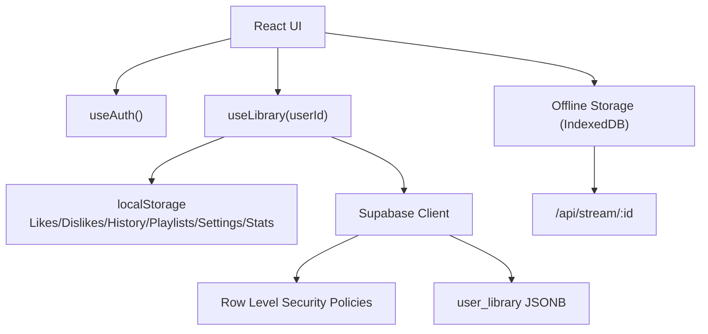
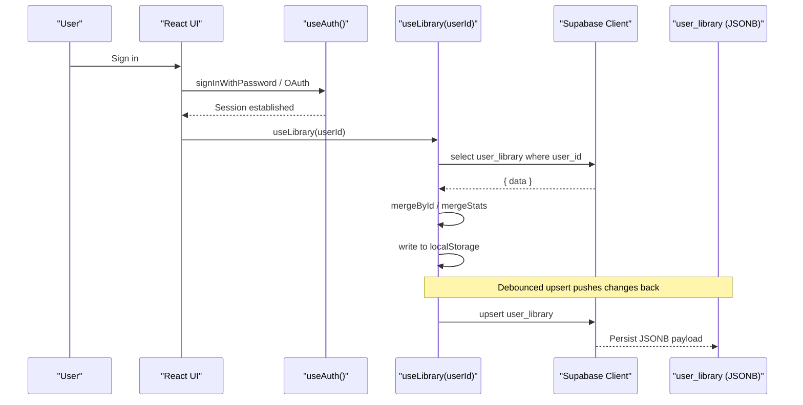
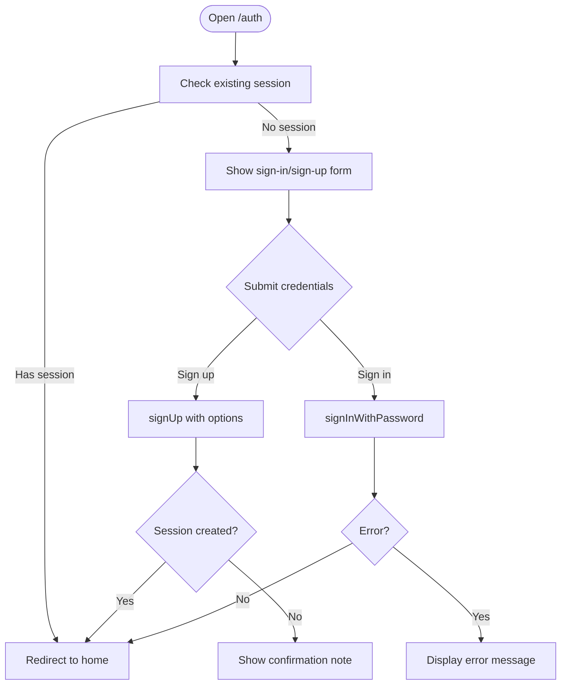
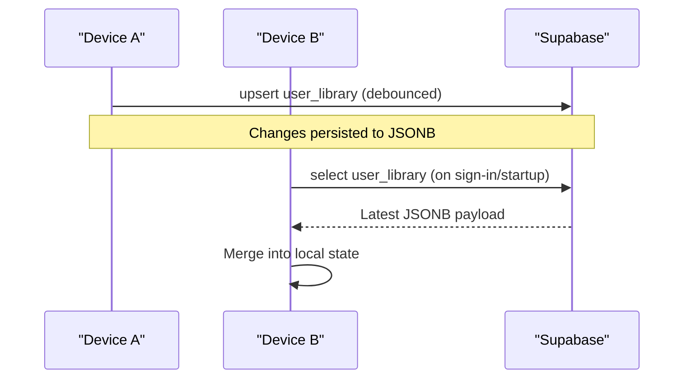
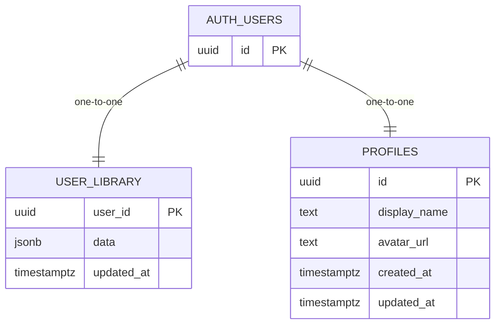
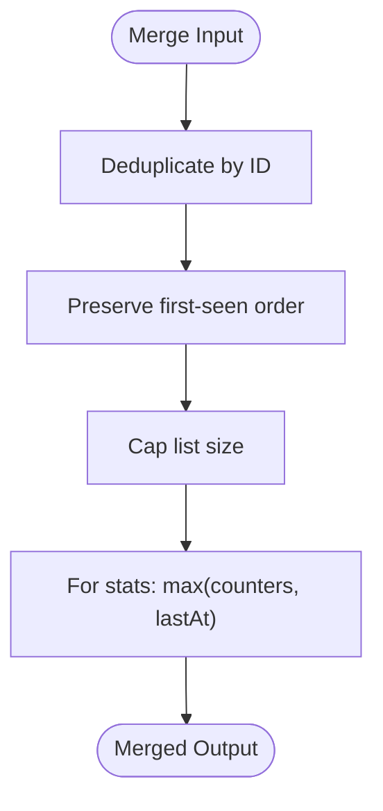
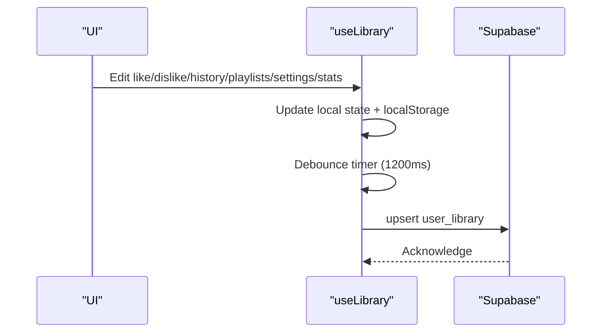
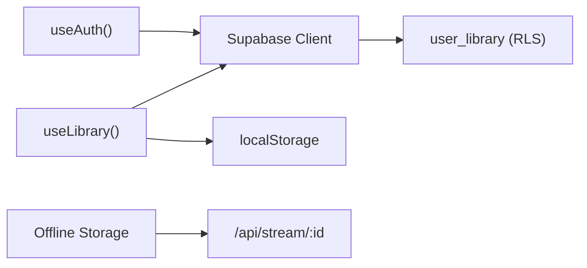

# Cloud Synchronization

<cite>
**Referenced Files in This Document**
- [client.ts](file://src/integrations/supabase/client.ts)
- [auth-attacher.ts](file://src/integrations/supabase/auth-attacher.ts)
- [types.ts](file://src/integrations/supabase/types.ts)
- [library.ts](file://src/lib/library.ts)
- [offline.ts](file://src/lib/offline.ts)
- [auth.ts](file://src/lib/auth.ts)
- [auth.tsx](file://src/routes/auth.tsx)
- [20260808085443_8253f78c-652e-4cb4-8772-8818ce90215c.sql](file://supabase/migrations/20260808085443_8253f78c-652e-4cb4-8772-8818ce90215c.sql)
- [20260808085506_fb5fd43f-6504-4c96-8335-2aeac753c924.sql](file://supabase/migrations/20260808085506_fb5fd43f-6504-4c96-8335-2aeac753c924.sql)
- [config.toml](file://supabase/config.toml)
</cite>

## Table of Contents
1. [Introduction](#introduction)
2. [Project Structure](#project-structure)
3. [Core Components](#core-components)
4. [Architecture Overview](#architecture-overview)
5. [Detailed Component Analysis](#detailed-component-analysis)
6. [Dependency Analysis](#dependency-analysis)
7. [Performance Considerations](#performance-considerations)
8. [Troubleshooting Guide](#troubleshooting-guide)
9. [Conclusion](#conclusion)
10. [Appendices](#appendices)

## Introduction
This document explains the cloud synchronization system that keeps user data consistent across devices using Supabase. It covers authentication flow and session management, real-time sync capabilities, database schema design for the user_library table, conflict resolution strategies when multiple devices modify data simultaneously, manual sync operations, error handling for network failures, backup/recovery procedures, security considerations, and troubleshooting guidance.

## Project Structure
The synchronization system is implemented as a local-first application with periodic cloud sync to Supabase:
- Authentication and session management are handled via Supabase Auth and React hooks.
- User library data (likes, dislikes, history, playlists, settings, stats) is stored locally first and synced to Supabase when signed in.
- Offline media playback is supported via IndexedDB storage through a streaming proxy.
- Database schema and Row Level Security policies enforce per-user isolation.

**Diagram sources**
- [library.ts:242-349](file://src/lib/library.ts#L242-L349)
- [auth.ts:12-68](file://src/lib/auth.ts#L12-L68)
- [client.ts:30-56](file://src/integrations/supabase/client.ts#L30-L56)
- [offline.ts:58-141](file://src/lib/offline.ts#L58-L141)
- [20260808085443_8253f78c-652e-4cb4-8772-8818ce90215c.sql:20-32](file://supabase/migrations/20260808085443_8253f78c-652e-4cb4-8772-8818ce90215c.sql#L20-L32)

**Section sources**
- [library.ts:242-349](file://src/lib/library.ts#L242-L349)
- [auth.ts:12-68](file://src/lib/auth.ts#L12-L68)
- [client.ts:30-56](file://src/integrations/supabase/client.ts#L30-L56)
- [offline.ts:58-141](file://src/lib/offline.ts#L58-L141)
- [20260808085443_8253f78c-652e-4cb4-8772-8818ce90215c.sql:20-32](file://supabase/migrations/20260808085443_8253f78c-652e-4cb4-8772-8818ce90215c.sql#L20-L32)

## Core Components
- Supabase client initialization and environment configuration
- Authentication hook and session persistence
- Library sync hook with local-first strategy and debounced upserts
- Offline media storage and download utilities
- Database schema and Row Level Security policies for user isolation

**Section sources**
- [client.ts:30-56](file://src/integrations/supabase/client.ts#L30-L56)
- [auth.ts:12-68](file://src/lib/auth.ts#L12-L68)
- [library.ts:242-349](file://src/lib/library.ts#L242-L349)
- [offline.ts:58-141](file://src/lib/offline.ts#L58-L141)
- [20260808085443_8253f78c-652e-4cb4-8772-8818ce90215c.sql:20-32](file://supabase/migrations/20260808085443_8253f78c-652e-4cb4-8772-8818ce90215c.sql#L20-L32)

## Architecture Overview
The system uses a local-first architecture:
- On sign-in, the app pulls the user’s library from Supabase and merges it into local storage.
- All mutations update local state immediately and persist to localStorage.
- Changes are debounced and pushed back to Supabase via upsert on user_library.
- Row Level Security ensures users can only access their own data.
- Offline playback is supported by storing audio blobs in IndexedDB via a streaming proxy.

**Diagram sources**
- [auth.tsx:46-80](file://src/routes/auth.tsx#L46-L80)
- [auth.ts:18-49](file://src/lib/auth.ts#L18-L49)
- [library.ts:262-349](file://src/lib/library.ts#L262-L349)
- [20260808085443_8253f78c-652e-4cb4-8772-8818ce90215c.sql:20-32](file://supabase/migrations/20260808085443_8253f78c-652e-4cb4-8772-8818ce90215c.sql#L20-L32)

## Detailed Component Analysis

### Authentication Flow and Session Management
- The auth route supports email/password sign-in and Google OAuth.
- After successful sign-in or sign-up, the user is redirected to the main app.
- The useAuth hook subscribes to auth state changes, updates userId/email, and fetches profile data.
- Session persistence is enabled in the Supabase client configuration.

**Diagram sources**
- [auth.tsx:40-80](file://src/routes/auth.tsx#L40-L80)
- [auth.ts:18-49](file://src/lib/auth.ts#L18-L49)
- [client.ts:50-55](file://src/integrations/supabase/client.ts#L50-L55)

**Section sources**
- [auth.tsx:40-80](file://src/routes/auth.tsx#L40-L80)
- [auth.ts:18-49](file://src/lib/auth.ts#L18-L49)
- [client.ts:50-55](file://src/integrations/supabase/client.ts#L50-L55)

### Real-Time Sync Capabilities and Change Propagation
- The current implementation uses a pull-based model: on sign-in, the app pulls the latest user_library record and merges it into local state.
- Subsequent changes are debounced and pushed back to Supabase via upsert.
- There is no active realtime subscription in the provided code; propagation relies on periodic upserts and subsequent pulls on next sign-in or device startup.

**Diagram sources**
- [library.ts:262-349](file://src/lib/library.ts#L262-L349)

**Section sources**
- [library.ts:262-349](file://src/lib/library.ts#L262-L349)

### Database Schema Design for user_library
- The user_library table stores per-user JSONB data containing likes, dislikes, history, playlists, settings, and stats.
- Row Level Security policies restrict access to authenticated users and ensure they can only manage their own records.
- Triggers update updated_at timestamps automatically.

**Diagram sources**
- [20260808085443_8253f78c-652e-4cb4-8772-8818ce90215c.sql:1-32](file://supabase/migrations/20260808085443_8253f78c-652e-4cb4-8772-8818ce90215c.sql#L1-L32)
- [types.ts:41-58](file://src/integrations/supabase/types.ts#L41-L58)

**Section sources**
- [20260808085443_8253f78c-652e-4cb4-8772-8818ce90215c.sql:1-32](file://supabase/migrations/20260808085443_8253f78c-652e-4cb4-8772-8818ce90215c.sql#L1-L32)
- [types.ts:41-58](file://src/integrations/supabase/types.ts#L41-L58)

### Conflict Resolution Algorithms
- When merging lists (likes, dislikes, history, playlists), the app uses an ID-based deduplication algorithm that preserves order and caps list sizes.
- For stats, the merge takes the maximum of counters and last activity timestamps to avoid overwriting newer values.
- These strategies minimize conflicts when multiple devices modify the same data concurrently.

**Diagram sources**
- [library.ts:209-236](file://src/lib/library.ts#L209-L236)

**Section sources**
- [library.ts:209-236](file://src/lib/library.ts#L209-L236)

### Manual Sync Operations
- Pull: On sign-in, the app pulls the user_library record and merges into local state.
- Push: Changes are debounced and upserted to user_library.
- You can trigger these flows by signing in/out or waiting for the debounce window after edits.

**Diagram sources**
- [library.ts:321-349](file://src/lib/library.ts#L321-L349)

**Section sources**
- [library.ts:321-349](file://src/lib/library.ts#L321-L349)

### Error Handling for Network Failures
- Library sync logs warnings on errors and continues operation without blocking UI.
- Offline downloads handle timeouts and stream read errors, providing clear error messages.
- IndexedDB operations wrap requests in promises and log warnings on failure.

**Section sources**
- [library.ts:325-343](file://src/lib/library.ts#L325-L343)
- [offline.ts:150-200](file://src/lib/offline.ts#L150-L200)
- [offline.ts:85-136](file://src/lib/offline.ts#L85-L136)

### Data Backup and Recovery Procedures
- Backup: Export user_library JSONB from Supabase for a given user_id.
- Recovery: Upsert the exported JSONB back into user_library for the same user_id.
- Local fallback: Ensure localStorage contains valid data; re-sync on next sign-in to reconcile differences.

[No sources needed since this section provides general guidance]

### Security Considerations
- Row Level Security policies ensure users can only access their own profiles and library data.
- Service role grants allow server-side migrations and functions to operate securely.
- Functions are restricted to prevent public execution.
- Environment variables protect API keys and URLs.

**Section sources**
- [20260808085443_8253f78c-652e-4cb4-8772-8818ce90215c.sql:9-32](file://supabase/migrations/20260808085443_8253f78c-652e-4cb4-8772-8818ce90215c.sql#L9-L32)
- [20260808085506_fb5fd43f-6504-4c96-8335-2aeac753c924.sql:1-2](file://supabase/migrations/20260808085506_fb5fd43f-6504-4c96-8335-2aeac753c924.sql#L1-L2)
- [client.ts:33-44](file://src/integrations/supabase/client.ts#L33-L44)

### Troubleshooting Guidance
- Missing environment variables: The Supabase client throws an error if required environment variables are not set.
- Auth issues: Check sign-in/sign-up responses and session retrieval; verify redirect URLs and provider configuration.
- Sync failures: Review console warnings for library sync errors; ensure user_id matches authenticated user.
- Offline playback: Verify IndexedDB availability and streaming proxy responses; check quota warnings and timeouts.

**Section sources**
- [client.ts:33-44](file://src/integrations/supabase/client.ts#L33-L44)
- [auth.tsx:46-80](file://src/routes/auth.tsx#L46-L80)
- [library.ts:325-343](file://src/lib/library.ts#L325-L343)
- [offline.ts:24-41](file://src/lib/offline.ts#L24-L41)
- [offline.ts:150-200](file://src/lib/offline.ts#L150-L200)

## Dependency Analysis
The synchronization components depend on each other as follows:
- useAuth depends on Supabase client and manages session state.
- useLibrary depends on useAuth for userId and interacts with Supabase for user_library.
- Offline storage depends on a streaming proxy endpoint and IndexedDB.
- Database schema defines constraints and policies enforced by Supabase.

**Diagram sources**
- [auth.ts:12-68](file://src/lib/auth.ts#L12-L68)
- [library.ts:242-349](file://src/lib/library.ts#L242-L349)
- [offline.ts:58-141](file://src/lib/offline.ts#L58-L141)
- [20260808085443_8253f78c-652e-4cb4-8772-8818ce90215c.sql:20-32](file://supabase/migrations/20260808085443_8253f78c-652e-4cb4-8772-8818ce90215c.sql#L20-L32)

**Section sources**
- [auth.ts:12-68](file://src/lib/auth.ts#L12-L68)
- [library.ts:242-349](file://src/lib/library.ts#L242-L349)
- [offline.ts:58-141](file://src/lib/offline.ts#L58-L141)
- [20260808085443_8253f78c-652e-4cb4-8772-8818ce90215c.sql:20-32](file://supabase/migrations/20260808085443_8253f78c-652e-4cb4-8772-8818ce90215c.sql#L20-L32)

## Performance Considerations
- Debounced upserts reduce network overhead during rapid edits.
- List capping prevents excessively large payloads.
- Merging algorithms prioritize performance and consistency.
- Offline playback avoids repeated network requests for downloaded tracks.

[No sources needed since this section provides general guidance]

## Troubleshooting Guide
Common issues and debugging techniques:
- Environment misconfiguration: Validate SUPABASE_URL and publishable key presence.
- Auth redirects: Ensure redirect URLs match your domain and provider settings.
- Sync warnings: Inspect console logs for library sync errors and network failures.
- Offline storage: Check IndexedDB availability, quota warnings, and stream responses.

**Section sources**
- [client.ts:33-44](file://src/integrations/supabase/client.ts#L33-L44)
- [auth.tsx:46-80](file://src/routes/auth.tsx#L46-L80)
- [library.ts:325-343](file://src/lib/library.ts#L325-L343)
- [offline.ts:24-41](file://src/lib/offline.ts#L24-L41)
- [offline.ts:150-200](file://src/lib/offline.ts#L150-L200)

## Conclusion
The cloud synchronization system employs a robust local-first approach with periodic Supabase upserts and careful conflict resolution. Authentication and session management are integrated via Supabase Auth, while Row Level Security ensures data isolation. Offline playback enhances resilience, and comprehensive error handling improves reliability. Future enhancements could include realtime subscriptions for live sync and more sophisticated conflict resolution strategies.

[No sources needed since this section summarizes without analyzing specific files]

## Appendices
- Migration configuration and project ID reference.

**Section sources**
- [config.toml:1-1](file://supabase/config.toml#L1-L1)