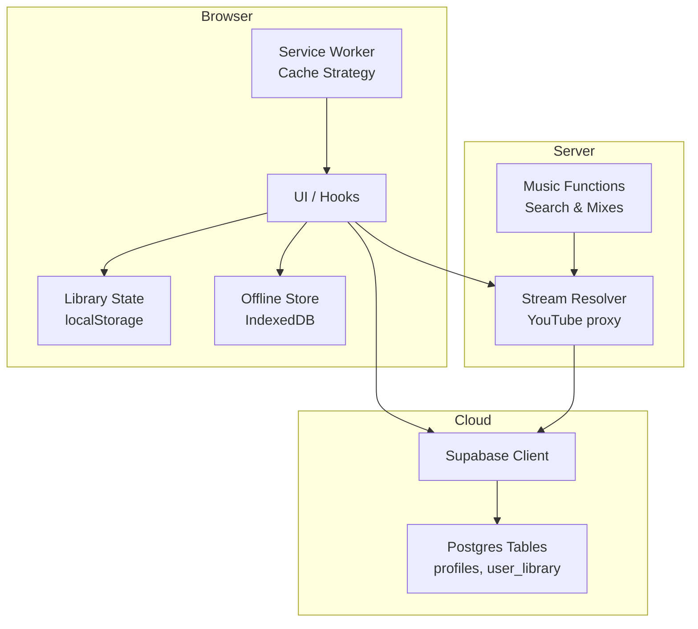
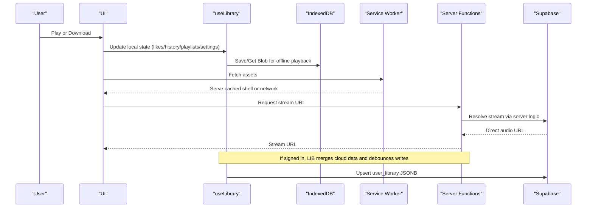
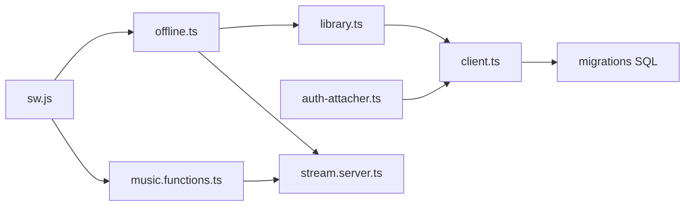

# Data Management

<cite>
**Referenced Files in This Document**
- [offline.ts](file://src/lib/offline.ts)
- [library.ts](file://src/lib/library.ts)
- [client.ts](file://src/integrations/supabase/client.ts)
- [auth-attacher.ts](file://src/integrations/supabase/auth-attacher.ts)
- [types.ts](file://src/integrations/supabase/types.ts)
- [20260808085443_8253f78c-652e-4cb4-8772-8818ce90215c.sql](file://supabase/migrations/20260808085443_8253f78c-652e-4cb4-8772-8818ce90215c.sql)
- [20260808085506_fb5fd43f-6504-4c96-8335-2aeac753c924.sql](file://supabase/migrations/20260808085506_fb5fd43f-6504-4c96-8335-2aeac753c924.sql)
- [config.toml](file://supabase/config.toml)
- [sw.js](file://public/sw.js)
- [music.functions.ts](file://src/lib/music.functions.ts)
- [stream.server.ts](file://src/lib/stream.server.ts)
</cite>

## Table of Contents
1. [Introduction](#introduction)
2. [Project Structure](#project-structure)
3. [Core Components](#core-components)
4. [Architecture Overview](#architecture-overview)
5. [Detailed Component Analysis](#detailed-component-analysis)
6. [Dependency Analysis](#dependency-analysis)
7. [Performance Considerations](#performance-considerations)
8. [Troubleshooting Guide](#troubleshooting-guide)
9. [Conclusion](#conclusion)
10. [Appendices](#appendices)

## Introduction
This document explains the data management strategy for the YouTube Music Companion application. It focuses on a local-first architecture: user data and media are stored locally first, then synchronized to cloud storage when authenticated. The system uses IndexedDB for offline audio downloads and blob storage, and Supabase for persistent cloud synchronization with row-level security and per-user library documents. It also covers schema design, lifecycle management, caching, conflict resolution, security, privacy, backup/recovery, common operations, and migration strategies.

## Project Structure
The data layer spans three main areas:
- Local persistence: IndexedDB for offline audio blobs; localStorage for small metadata (likes, history, playlists, settings, stats).
- Cloud sync: Supabase client configuration and typed database types; server-side functions for streaming and search that feed into local state.
- Service worker: App shell caching and stream pass-through policy to support offline UI and efficient streaming.

**Diagram sources**
- [offline.ts:10-38](file://src/lib/offline.ts#L10-L38)
- [library.ts:125-142](file://src/lib/library.ts#L125-L142)
- [client.ts:30-56](file://src/integrations/supabase/client.ts#L30-L56)
- [sw.js:1-48](file://public/sw.js#L1-L48)
- [stream.server.ts:108-122](file://src/lib/stream.server.ts#L108-L122)
- [music.functions.ts:8-21](file://src/lib/music.functions.ts#L8-L21)

**Section sources**
- [offline.ts:10-38](file://src/lib/offline.ts#L10-L38)
- [library.ts:125-142](file://src/lib/library.ts#L125-L142)
- [client.ts:30-56](file://src/integrations/supabase/client.ts#L30-L56)
- [sw.js:1-48](file://public/sw.js#L1-L48)
- [stream.server.ts:108-122](file://src/lib/stream.server.ts#L108-L122)
- [music.functions.ts:8-21](file://src/lib/music.functions.ts#L8-L21)

## Core Components
- Offline store (IndexedDB): Stores downloaded audio as blobs keyed by track id, with metadata like size and saved timestamp. Provides save, get, list, remove, clear, total size, and streaming download with progress.
- Library state (localStorage + React state): Tracks likes, dislikes, history, playlists, settings, and play stats. Merges with cloud data on sign-in and debouncedly pushes changes back.
- Supabase integration: Typed client with environment-based configuration, session persistence, and auth middleware for server RPCs.
- Database schema: Profiles and per-user library JSONB document with RLS policies and triggers for updated_at timestamps and profile creation.

Key responsibilities:
- Offline playback via IndexedDB blobs.
- Cross-device sync via Supabase user_library JSONB document.
- Secure access via RLS policies bound to auth.users.
- Efficient streaming through server-side URL resolution.

**Section sources**
- [offline.ts:55-161](file://src/lib/offline.ts#L55-L161)
- [library.ts:241-339](file://src/lib/library.ts#L241-L339)
- [client.ts:30-67](file://src/integrations/supabase/client.ts#L30-L67)
- [20260808085443_8253f78c-652e-4cb4-8772-8818ce90215c.sql:1-63](file://supabase/migrations/20260808085443_8253f78c-652e-4cb4-8772-8818ce90215c.sql#L1-L63)

## Architecture Overview
The app follows a local-first pattern:
- All user interactions update local state immediately (localStorage for small metadata; IndexedDB for large blobs).
- When signed in, the app pulls the latest cloud copy and merges it into local state.
- Changes are debounced and pushed back to the cloud as a single JSONB document per user.
- Streaming uses a server function to resolve direct audio URLs from YouTube, avoiding cross-origin restrictions and enabling background playback.
- The service worker caches the app shell and bypasses caching for large audio streams.

**Diagram sources**
- [library.ts:261-339](file://src/lib/library.ts#L261-L339)
- [offline.ts:123-161](file://src/lib/offline.ts#L123-L161)
- [music.functions.ts:613-626](file://src/lib/music.functions.ts#L613-L626)
- [stream.server.ts:108-122](file://src/lib/stream.server.ts#L108-L122)
- [sw.js:33-48](file://public/sw.js#L33-L48)

## Detailed Component Analysis

### Offline Storage (IndexedDB)
Responsibilities:
- Open and version the database with an object store for tracks.
- Persist audio blobs with metadata (track info, size, savedAt).
- Provide utilities to list, remove, clear, and compute total size.
- Stream-download with progress reporting and content-type preservation.

Data model:
- Object store name: tracks
- Key path: id (string)
- Record shape includes track metadata, blob, size, savedAt.

Operations:
- Save: put record with id, track, blob, size, savedAt.
- Get: retrieve blob by id.
- List: getAll and sort by savedAt descending.
- Remove/Clear: delete by id or clear all.
- Total size: sum sizes across records.
- Download: fetch via /api/stream/:id, stream chunks, merge into Blob, save.

Complexity:
- Read/Write: O(1) per key operation.
- List: O(n) to enumerate and sort.
- Download: proportional to file size; streaming avoids large memory spikes.

Error handling:
- Graceful fallbacks return null or empty arrays on errors.
- Transaction wrappers reject on error/abort.

Optimization opportunities:
- Add indexes if filtering by savedAt or track fields is needed.
- Consider chunked saves for very large files to reduce transaction size.
- Use requestAnimationFrame or throttling for progress updates.

**Section sources**
- [offline.ts:10-38](file://src/lib/offline.ts#L10-L38)
- [offline.ts:55-115](file://src/lib/offline.ts#L55-L115)
- [offline.ts:123-161](file://src/lib/offline.ts#L123-L161)

### Library State and Sync (localStorage + Supabase)
Responsibilities:
- Maintain local state for likes, dislikes, history, playlists, settings, and stats.
- On sign-in, pull cloud document and merge into local state using id-based deduplication and max limits.
- Debounce writes to upsert the entire user_library JSONB document.

Merge strategy:
- Arrays (likes/dislikes/history/playlists): merge by id, keep newest occurrence, cap at defined limits (e.g., 200).
- Stats: merge per track id, taking max counters and lastAt.
- Settings: deep merge with defaults applied.

Sync flow:
- Pull once per userId after hydration.
- Push changes every ~1.2 seconds while signed in.

Conflict resolution:
- Client-side merge prioritizes local edits but reconciles with cloud by id and timestamps where applicable.
- History capped to avoid unbounded growth.

Caching:
- Small metadata persisted in localStorage for instant availability.
- Large media persisted in IndexedDB for offline playback.

Security and privacy:
- Cloud data scoped to user_id via RLS policies.
- Sensitive tokens handled by Supabase client and middleware.

**Section sources**
- [library.ts:125-142](file://src/lib/library.ts#L125-L142)
- [library.ts:208-235](file://src/lib/library.ts#L208-L235)
- [library.ts:261-339](file://src/lib/library.ts#L261-L339)
- [20260808085443_8253f78c-652e-4cb4-8772-8818ce90215c.sql:20-32](file://supabase/migrations/20260808085443_8253f78c-652e-4cb4-8772-8818ce90215c.sql#L20-L32)

### Supabase Integration
Client configuration:
- Reads environment variables for URL and publishable key.
- Wraps fetch to inject apikey header and handle new-style keys.
- Persists sessions in localStorage with auto-refresh enabled.

Auth attachment:
- Middleware attaches bearer token to server function calls when a session exists.

Types:
- Generated TypeScript types mirror Postgres schema for type-safe queries.

Real-time updates:
- Not used explicitly in this codebase; sync is pull/push based with debounced upserts.

Consistency:
- Row-level security ensures users can only access their own rows.
- Updated_at triggers maintain auditability.

**Section sources**
- [client.ts:5-27](file://src/integrations/supabase/client.ts#L5-L27)
- [client.ts:30-67](file://src/integrations/supabase/client.ts#L30-L67)
- [auth-attacher.ts:7-15](file://src/integrations/supabase/auth-attacher.ts#L7-L15)
- [types.ts:51-58](file://src/integrations/supabase/types.ts#L51-L58)
- [20260808085443_8253f78c-652e-4cb4-8772-8818ce90215c.sql:1-18](file://supabase/migrations/20260808085443_8253f78c-652e-4cb4-8772-8818ce90215c.sql#L1-L18)

### Streaming and Media Handling
Server-side stream resolver:
- Resolves direct audio URLs from YouTube using internal player endpoints with multiple client configs.
- Probes URLs to ensure they stream before returning.
- Prefers specific audio formats for quality and compatibility.

Client usage:
- Downloads use /api/stream/:id endpoint to fetch bytes and persist to IndexedDB.
- Service worker bypasses caching for audio streams to avoid bloating cache quotas.

Reliability:
- Retries across client configurations and probes to mitigate flaky responses.

**Section sources**
- [stream.server.ts:14-122](file://src/lib/stream.server.ts#L14-L122)
- [offline.ts:123-161](file://src/lib/offline.ts#L123-L161)
- [sw.js:33-48](file://public/sw.js#L33-L48)

### Service Worker Caching Strategy
- Pre-caches app shell assets for offline loading.
- Cleans old caches on activation.
- Network-first for API calls; cache-first for static assets; no caching for audio streams.

Benefits:
- Fast cold starts and offline UI availability.
- Avoids storing large audio blobs in cache storage.

**Section sources**
- [sw.js:1-48](file://public/sw.js#L1-L48)

## Dependency Analysis

**Diagram sources**
- [offline.ts:1-161](file://src/lib/offline.ts#L1-L161)
- [library.ts:241-339](file://src/lib/library.ts#L241-L339)
- [client.ts:30-67](file://src/integrations/supabase/client.ts#L30-L67)
- [auth-attacher.ts:7-15](file://src/integrations/supabase/auth-attacher.ts#L7-L15)
- [20260808085443_8253f78c-652e-4cb4-8772-8818ce90215c.sql:1-63](file://supabase/migrations/20260808085443_8253f78c-652e-4cb4-8772-8818ce90215c.sql#L1-L63)
- [sw.js:1-48](file://public/sw.js#L1-L48)
- [stream.server.ts:108-122](file://src/lib/stream.server.ts#L108-L122)
- [music.functions.ts:613-626](file://src/lib/music.functions.ts#L613-L626)

**Section sources**
- [offline.ts:1-161](file://src/lib/offline.ts#L1-L161)
- [library.ts:241-339](file://src/lib/library.ts#L241-L339)
- [client.ts:30-67](file://src/integrations/supabase/client.ts#L30-L67)
- [auth-attacher.ts:7-15](file://src/integrations/supabase/auth-attacher.ts#L7-L15)
- [20260808085443_8253f78c-652e-4cb4-8772-8818ce90215c.sql:1-63](file://supabase/migrations/20260808085443_8253f78c-652e-4cb4-8772-8818ce90215c.sql#L1-L63)
- [sw.js:1-48](file://public/sw.js#L1-L48)
- [stream.server.ts:108-122](file://src/lib/stream.server.ts#L108-L122)
- [music.functions.ts:613-626](file://src/lib/music.functions.ts#L613-L626)

## Performance Considerations
- Debounced cloud writes reduce network overhead during rapid local edits.
- Array caps (e.g., history and playlists) prevent unbounded growth.
- Streaming downloads avoid loading entire files into memory at once.
- Service worker caches only the app shell; audio streams are not cached to conserve quota.
- IndexedDB transactions wrap operations to ensure consistency and proper error handling.

[No sources needed since this section provides general guidance]

## Troubleshooting Guide
Common issues and mitigations:
- IndexedDB unavailable: openDb rejects with an error; callers should handle gracefully and fall back to online-only mode.
- Missing Supabase env vars: client throws an error listing missing variables; configure VITE_SUPABASE_URL and VITE_SUPABASE_PUBLISHABLE_KEY.
- Stream resolution failures: server retries across client configs and probes URLs; if all fail, return null and surface an error to the UI.
- Storage full: localStorage writes catch exceptions; consider prompting users to clear downloads or playlists.

Operational checks:
- Verify Supabase project id in config.
- Ensure RLS policies allow authenticated access to profiles and user_library.
- Confirm service worker registration and cache names match expected values.

**Section sources**
- [offline.ts:24-38](file://src/lib/offline.ts#L24-L38)
- [client.ts:30-44](file://src/integrations/supabase/client.ts#L30-L44)
- [stream.server.ts:108-122](file://src/lib/stream.server.ts#L108-L122)
- [config.toml:1-1](file://supabase/config.toml#L1-L1)
- [20260808085443_8253f78c-652e-4cb4-8772-8818ce90215c.sql:1-18](file://supabase/migrations/20260808085443_8253f78c-652e-4cb4-8772-8818ce90215c.sql#L1-L18)

## Conclusion
The application implements a robust local-first data strategy with IndexedDB for offline media and localStorage for lightweight metadata, complemented by Supabase for cross-device synchronization. The design emphasizes immediate responsiveness, reliable offline playback, secure per-user data isolation, and efficient streaming. Conflict resolution is handled via id-based merging and capped collections, while performance is optimized through debounced sync, streaming downloads, and selective caching.

[No sources needed since this section summarizes without analyzing specific files]

## Appendices

### Database Schema Design
- profiles: stores display_name and avatar_url linked to auth.users; updated_at maintained by trigger; RLS restricts access to authenticated users and enforces ownership.
- user_library: JSONB document per user containing likes, dislikes, history, playlists, settings, and stats; updated_at maintained by trigger; RLS restricts access to the owning user.

Entity relationships:
- profiles.id references auth.users.id with cascade delete.
- user_library.user_id references auth.users.id with cascade delete.

Constraints and policies:
- Row-level security policies enforce that authenticated users can only read/write their own rows.
- Triggers automatically update timestamps on row changes.

**Section sources**
- [20260808085443_8253f78c-652e-4cb4-8772-8818ce90215c.sql:1-63](file://supabase/migrations/20260808085443_8253f78c-652e-4cb4-8772-8818ce90215c.sql#L1-L63)
- [20260808085506_fb5fd43f-6504-4c96-8335-2aeac753c924.sql:1-2](file://supabase/migrations/20260808085506_fb5fd43f-6504-4c96-8335-2aeac753c924.sql#L1-L2)

### Data Lifecycle Management
Creation:
- User actions create or update local state immediately (localStorage for metadata; IndexedDB for blobs).
- Signed-in sessions trigger a one-time pull and merge from cloud.

Propagation:
- Changes are debounced and upserted to user_library JSONB.

Archival:
- History and playlists are capped to prevent unbounded growth.
- Downloads can be cleared individually or entirely.

Caching:
- App shell cached via service worker; audio streams streamed directly without caching.

**Section sources**
- [library.ts:261-339](file://src/lib/library.ts#L261-L339)
- [offline.ts:85-115](file://src/lib/offline.ts#L85-L115)
- [sw.js:1-48](file://public/sw.js#L1-L48)

### Conflict Resolution During Sync
- Merge by id for arrays; prefer newer entries and enforce caps.
- Stats merged by taking maximum counters and most recent lastAt.
- Settings merged with defaults applied to ensure valid structure.

**Section sources**
- [library.ts:208-235](file://src/lib/library.ts#L208-L235)
- [library.ts:261-339](file://src/lib/library.ts#L261-L339)

### Security and Privacy
- Supabase RLS policies ensure users can only access their own data.
- Auth middleware attaches bearer tokens to server function calls when present.
- Environment variables protect credentials; client validates presence and logs errors.

**Section sources**
- [20260808085443_8253f78c-652e-4cb4-8772-8818ce90215c.sql:1-18](file://supabase/migrations/20260808085443_8253f78c-652e-4cb4-8772-8818ce90215c.sql#L1-L18)
- [auth-attacher.ts:7-15](file://src/integrations/supabase/auth-attacher.ts#L7-L15)
- [client.ts:30-44](file://src/integrations/supabase/client.ts#L30-L44)

### Backup and Recovery
- Export/import localStorage keys for quick recovery of non-media preferences (likes, history, playlists, settings, stats).
- IndexedDB backups require exporting blobs; consider periodic snapshots of the offline store for critical downloads.
- Cloud data is backed up by Supabase platform; restore via Supabase dashboard or CLI.

[No sources needed since this section provides general guidance]

### Common Data Operations
- Toggle like/dislike: updates local arrays and persists to localStorage; synced to cloud on next debounce cycle.
- Log play/skip/complete: updates history and stats; synced to cloud.
- Create/rename/delete playlist: updates local playlists array; synced to cloud.
- Download track: streams via server function, stores blob in IndexedDB, supports progress callbacks.
- Resume playback: reads saved queue and position from localStorage.

**Section sources**
- [library.ts:343-418](file://src/lib/library.ts#L343-L418)
- [library.ts:420-518](file://src/lib/library.ts#L420-L518)
- [offline.ts:123-161](file://src/lib/offline.ts#L123-L161)
- [library.ts:157-165](file://src/lib/library.ts#L157-L165)

### Migration Strategies for Schema Changes
- For IndexedDB: increment DB_VERSION and implement onupgradeneeded logic to add/remove object stores or indexes.
- For Supabase: add new migrations under supabase/migrations; use idempotent statements and preserve existing data.
- For localStorage: version keys (e.g., vinyl.*.v1) and implement migration routines to transform older formats.

**Section sources**
- [offline.ts:24-38](file://src/lib/offline.ts#L24-L38)
- [20260808085443_8253f78c-652e-4cb4-8772-8818ce90215c.sql:1-63](file://supabase/migrations/20260808085443_8253f78c-652e-4cb4-8772-8818ce90215c.sql#L1-L63)
- [library.ts:105-110](file://src/lib/library.ts#L105-L110)