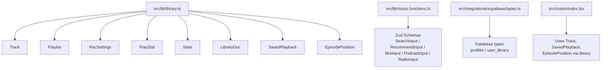
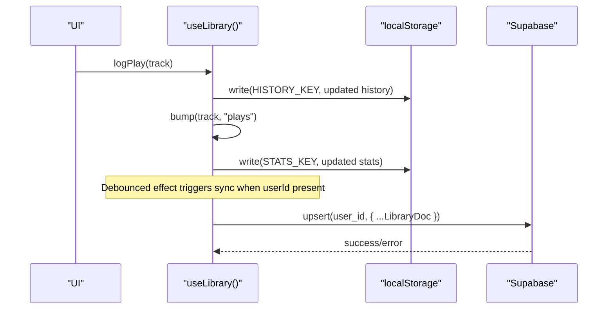
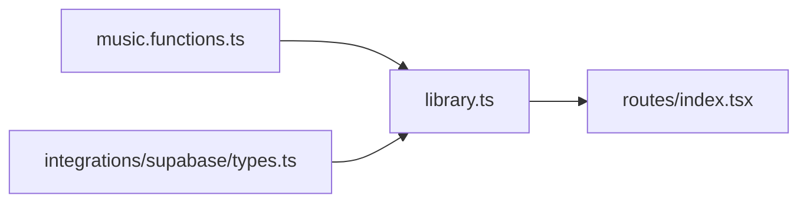

# Data Models & Types

<cite>
**Referenced Files in This Document**
- [library.ts](file://src/lib/library.ts)
- [music.functions.ts](file://src/lib/music.functions.ts)
- [types.ts](file://src/integrations/supabase/types.ts)
- [index.tsx](file://src/routes/index.tsx)
</cite>

## Table of Contents
1. [Introduction](#introduction)
2. [Project Structure](#project-structure)
3. [Core Components](#core-components)
4. [Architecture Overview](#architecture-overview)
5. [Detailed Component Analysis](#detailed-component-analysis)
6. [Dependency Analysis](#dependency-analysis)
7. [Performance Considerations](#performance-considerations)
8. [Troubleshooting Guide](#troubleshooting-guide)
9. [Conclusion](#conclusion)
10. [Appendices](#appendices)

## Introduction
This document describes all data models and TypeScript interfaces used throughout the application, focusing on core entities such as Track, Playlist, RecSettings, Stats, PlayStat, and LibraryDoc. It explains field definitions, types, validation rules, relationships, usage patterns, and how these models are persisted and synchronized. It also documents enum-like constants (GENRES, LANGUAGES, PODCAST_TOPICS, MOODS), type safety practices, migration considerations, and guidance for extending or creating new entity types consistently.

## Project Structure
The data models are primarily defined in a single library module that centralizes domain types, constants, and persistence helpers. Server-side input validation schemas are defined alongside server functions. Database schema types are generated for Supabase integration.

**Diagram sources**
- [library.ts:3-21](file://src/lib/library.ts#L3-L21)
- [library.ts:68-121](file://src/lib/library.ts#L68-L121)
- [library.ts:151-175](file://src/lib/library.ts#L151-L175)
- [library.ts:200-207](file://src/lib/library.ts#L200-L207)
- [music.functions.ts:6-56](file://src/lib/music.functions.ts#L6-L56)
- [music.functions.ts:140-149](file://src/lib/music.functions.ts#L140-L149)
- [music.functions.ts:461-466](file://src/lib/music.functions.ts#L461-L466)
- [types.ts:9-58](file://src/integrations/supabase/types.ts#L9-L58)
- [index.tsx:542-596](file://src/routes/index.tsx#L542-L596)

**Section sources**
- [library.ts:3-21](file://src/lib/library.ts#L3-L21)
- [library.ts:68-121](file://src/lib/library.ts#L68-L121)
- [library.ts:151-175](file://src/lib/library.ts#L151-L175)
- [library.ts:200-207](file://src/lib/library.ts#L200-L207)
- [music.functions.ts:6-56](file://src/lib/music.functions.ts#L6-L56)
- [music.functions.ts:140-149](file://src/lib/music.functions.ts#L140-L149)
- [music.functions.ts:461-466](file://src/lib/music.functions.ts#L461-L466)
- [types.ts:9-58](file://src/integrations/supabase/types.ts#L9-L58)
- [index.tsx:542-596](file://src/routes/index.tsx#L542-L596)

## Core Components
This section summarizes the primary data models and their roles.

- Track: Represents a playable media item with metadata and optional source-specific fields.
- Playlist: A named collection of tracks with creation timestamp.
- RecSettings: User preferences for recommendation behavior (moods, genres, languages, podcast topics, discovery/energy sliders, injection frequency, notifications, instrumental-only).
- PlayStat: Behavioral statistics per track (plays, skips, completions, last activity time).
- Stats: Map from track id to PlayStat.
- LibraryDoc: Aggregated document containing likes, dislikes, history, playlists, settings, and stats; persisted to Supabase when signed in.
- SavedPlayback: Current queue state and playback position for resuming sessions.
- EpisodePosition: Per-episode resume position for podcasts.

Validation and constraints:
- Many lists are bounded by maximum lengths in Zod schemas for server inputs (e.g., arrays capped at specific sizes).
- Enums/constants constrain allowed values for moods, genres, languages, and podcast topics.
- Local storage writes include guards and size limits (e.g., queue truncated to a fixed size).

Relationships:
- Playlist contains Track[]
- Stats maps string (track id) to PlayStat, which embeds Track
- LibraryDoc aggregates multiple collections including Track[], Playlist[], RecSettings, Stats

Usage patterns:
- Creation: Entities are created via helper functions (e.g., createPlaylist) and persisted to localStorage and optionally synced to Supabase.
- Modification: State updates go through dedicated update methods that write to local storage and trigger debounced sync.
- Serialization: All models are JSON-serializable; read/write helpers handle safe parsing and fallbacks.

**Section sources**
- [library.ts:3-21](file://src/lib/library.ts#L3-L21)
- [library.ts:68-121](file://src/lib/library.ts#L68-L121)
- [library.ts:151-175](file://src/lib/library.ts#L151-L175)
- [library.ts:200-207](file://src/lib/library.ts#L200-L207)
- [music.functions.ts:140-149](file://src/lib/music.functions.ts#L140-L149)
- [music.functions.ts:461-466](file://src/lib/music.functions.ts#L461-L466)

## Architecture Overview
The application follows a local-first architecture with optional cloud sync:
- Client-side state is maintained in React state and persisted to localStorage using typed keys.
- When a user is signed in, the client pulls a remote copy of LibraryDoc from Supabase and merges it with local state. Changes are debounced and pushed back to the server.
- Server functions validate inputs with Zod before processing requests and returning typed results.

**Diagram sources**
- [library.ts:242-349](file://src/lib/library.ts#L242-L349)
- [library.ts:397-411](file://src/lib/library.ts#L397-L411)
- [library.ts:384-395](file://src/lib/library.ts#L384-L395)

**Section sources**
- [library.ts:242-349](file://src/lib/library.ts#L242-L349)

## Detailed Component Analysis

### Track
- Purpose: Core media entity representing a song or podcast episode.
- Fields:
  - id: string — unique identifier
  - title: string
  - artist: string
  - duration: string
  - thumbnail: string
  - reason?: string — optional explanation for why this was recommended
  - previewUrl?: string — direct audio URL bypassing proxy
  - source?: "youtube" | "deezer" — provider tag
- Validation:
  - Used across search, recommendations, and podcast endpoints; server functions return arrays of Track.
- Relationships:
  - Embedded in Playlist.tracks
  - Referenced by PlayStat.track
  - Stored in LibraryDoc collections (likes, dislikes, history)

Example usage references:
- Creating playlist entries and adding tracks
- Persisting playback queue items
- Returning search/recommendation results

**Section sources**
- [library.ts:3-14](file://src/lib/library.ts#L3-L14)
- [library.ts:16-21](file://src/lib/library.ts#L16-L21)
- [music.functions.ts:123-136](file://src/lib/music.functions.ts#L123-L136)
- [music.functions.ts:508-528](file://src/lib/music.functions.ts#L508-L528)

### Playlist
- Purpose: Named collection of tracks with creation time.
- Fields:
  - id: string
  - name: string
  - tracks: Track[]
  - createdAt: number
- Operations:
  - Create, rename, delete
  - Add/remove/move/reorder tracks
- Validation:
  - Tracks must be valid Track objects; duplicates are prevented during add/move operations.

Example usage references:
- Creating playlists with initial tracks
- Reordering and moving tracks between playlists

**Section sources**
- [library.ts:16-21](file://src/lib/library.ts#L16-L21)
- [library.ts:430-515](file://src/lib/library.ts#L430-L515)

### RecSettings
- Purpose: Tuning preferences for AI-driven recommendations and mix generation.
- Fields:
  - moods: Record<string, number> — 0–100 weighting per mood
  - genres: string[] — preferred genres
  - languages: string[] — preferred languages
  - podcastTopics: string[] — topics for podcast mixes
  - injectInterval: number — insert fresh release every N songs (0 = off)
  - notifyNewDrops: boolean — browser notification preference
  - discovery: number — 0 familiar to 100 deep cuts
  - energy: number — 0 calm to 100 high energy
  - instrumentalOnly: boolean — filter out vocal tracks
- Defaults:
  - Provided via DEFAULT_SETTINGS with sensible defaults derived from MOODS and other fields.
- Validation:
  - UI enforces non-zero total mood weights; server uses brief text to guide AI.

Example usage references:
- Updating settings via patch
- Resetting to defaults
- Generating natural-language brief for AI

**Section sources**
- [library.ts:68-103](file://src/lib/library.ts#L68-L103)
- [library.ts:517-528](file://src/lib/library.ts#L517-L528)
- [library.ts:563-588](file://src/lib/library.ts#L563-L588)

### PlayStat and Stats
- PlayStat:
  - track: Track
  - plays: number
  - skips: number
  - completions: number
  - lastAt: number
- Stats:
  - Record<string, PlayStat> keyed by track id
- Behavior:
  - Incremented via bump() for plays, skips, completions
  - Merged on sync using max semantics for counters and timestamps

Example usage references:
- Logging play/skip/complete events
- Computing replay mixes and top artists based on stats

**Section sources**
- [library.ts:112-121](file://src/lib/library.ts#L112-L121)
- [library.ts:384-395](file://src/lib/library.ts#L384-L395)
- [library.ts:209-224](file://src/lib/library.ts#L209-L224)
- [library.ts:592-603](file://src/lib/library.ts#L592-L603)
- [library.ts:605-621](file://src/lib/library.ts#L605-L621)

### LibraryDoc
- Purpose: Canonical document representing a user’s library and preferences.
- Fields:
  - likes: Track[]
  - dislikes: Track[]
  - history: Track[]
  - playlists: Playlist[]
  - settings: RecSettings
  - stats?: Stats
- Sync:
  - Pulled from Supabase and merged with local state
  - Pushed back via upsert with debounced batching

Example usage references:
- Pulling remote library and merging
- Upserting changes to Supabase

**Section sources**
- [library.ts:200-207](file://src/lib/library.ts#L200-L207)
- [library.ts:262-313](file://src/lib/library.ts#L262-L313)
- [library.ts:321-349](file://src/lib/library.ts#L321-L349)

### SavedPlayback and EpisodePosition
- SavedPlayback:
  - queue: Track[]
  - index: number
  - position: number
- EpisodePosition:
  - position: number
  - duration: number
  - updatedAt: number
- Usage:
  - Persist current playback session and per-episode resume positions
  - Resume prompts shown when long episodes have been partially listened to

Example usage references:
- Writing playback state periodically
- Reading/writing episode positions and clearing them

**Section sources**
- [library.ts:151-166](file://src/lib/library.ts#L151-L166)
- [library.ts:171-197](file://src/lib/library.ts#L171-L197)
- [index.tsx:542-596](file://src/routes/index.tsx#L542-L596)

### Enum-like Constants
- GENRES: Array of genre strings used for filtering and UI selection.
- LANGUAGES: Array of language strings used for filtering and UI selection.
- PODCAST_TOPICS: Array of topic strings used for podcast mix generation.
- MOODS: Array of mood strings used for weighting in RecSettings.moods.

These constants provide closed sets of values for UI controls and validation logic.

**Section sources**
- [library.ts:23-36](file://src/lib/library.ts#L23-L36)
- [library.ts:38-49](file://src/lib/library.ts#L38-L49)
- [library.ts:51-66](file://src/lib/library.ts#L51-L66)
- [library.ts:80-91](file://src/lib/library.ts#L80-L91)

### Server Input Validation Schemas
- SearchInput: query string and optional limit
- RecommendInput: liked/recent/disliked/sequence/skipped/artists/mood/brief/count
- MixInput: kind enum, liked/recent/sequence/skipped/artists/brief/count
- PodcastInput: artists/count/languages/topics
- RadioInput: videoId and optional count

These schemas enforce bounds and types before server-side processing.

**Section sources**
- [music.functions.ts:6-21](file://src/lib/music.functions.ts#L6-L21)
- [music.functions.ts:47-56](file://src/lib/music.functions.ts#L47-L56)
- [music.functions.ts:140-149](file://src/lib/music.functions.ts#L140-L149)
- [music.functions.ts:461-466](file://src/lib/music.functions.ts#L461-L466)
- [music.functions.ts:562-565](file://src/lib/music.functions.ts#L562-L565)

### Database Schema Types
- profiles: user profile fields (id, display_name, avatar_url, timestamps)
- user_library: stores a JSON payload (data) along with user_id and updated_at

The app serializes LibraryDoc into the JSON column and reads it back with type assertions.

**Section sources**
- [types.ts:17-58](file://src/integrations/supabase/types.ts#L17-L58)
- [library.ts:268-308](file://src/lib/library.ts#L268-L308)
- [library.ts:321-349](file://src/lib/library.ts#L321-L349)

## Dependency Analysis
- library.ts defines core domain types and persistence utilities; components consume these types directly.
- music.functions.ts depends on Track type from server modules and validates inputs with Zod.
- routes/index.tsx consumes library types for playback and resume behaviors.
- integrations/supabase/types.ts provides database shape used during sync.

**Diagram sources**
- [library.ts:3-21](file://src/lib/library.ts#L3-L21)
- [music.functions.ts:4-5](file://src/lib/music.functions.ts#L4-L5)
- [index.tsx:542-596](file://src/routes/index.tsx#L542-L596)
- [types.ts:41-58](file://src/integrations/supabase/types.ts#L41-L58)

**Section sources**
- [library.ts:3-21](file://src/lib/library.ts#L3-L21)
- [music.functions.ts:4-5](file://src/lib/music.functions.ts#L4-L5)
- [index.tsx:542-596](file://src/routes/index.tsx#L542-L596)
- [types.ts:41-58](file://src/integrations/supabase/types.ts#L41-L58)

## Performance Considerations
- Queue truncation: Playback queue is limited to a fixed size when writing to avoid large payloads.
- Debounced sync: Library changes are batched and sent to Supabase after a delay to reduce network calls.
- Merge strategies: Arrays are deduplicated by id and capped; stats are merged using max semantics to preserve latest counts and timestamps.
- Episode position writes: Only saved when meaningful progress is detected to minimize storage churn.

[No sources needed since this section provides general guidance]

## Troubleshooting Guide
Common issues and mitigations:
- LocalStorage read/write failures: The read/write helpers catch errors and fall back to defaults or ignore writes, logging warnings.
- Sync failures: Errors during Supabase upsert are logged; local state remains authoritative until successful sync.
- Invalid inputs: Zod schemas prevent malformed server requests; invalid inputs result in empty or safe responses.

Operational tips:
- If playback does not resume, verify that SavedPlayback is being written and that the queue is non-empty.
- For podcast resume prompts, ensure EpisodePosition is being written only when position exceeds thresholds.

**Section sources**
- [library.ts:125-143](file://src/lib/library.ts#L125-L143)
- [library.ts:321-349](file://src/lib/library.ts#L321-L349)
- [index.tsx:542-596](file://src/routes/index.tsx#L542-L596)

## Conclusion
The application’s data model centers around a small set of well-defined types that support both local-first operation and optional cloud synchronization. Strong typing, Zod-based validation, and careful merge/persistence strategies ensure consistency and resilience. Extending the system involves adding new fields to relevant types, updating UI controls, and ensuring backward-compatible defaults and migrations.

[No sources needed since this section summarizes without analyzing specific files]

## Appendices

### Field Reference Tables

- Track
  - id: string
  - title: string
  - artist: string
  - duration: string
  - thumbnail: string
  - reason?: string
  - previewUrl?: string
  - source?: "youtube" | "deezer"

- Playlist
  - id: string
  - name: string
  - tracks: Track[]
  - createdAt: number

- RecSettings
  - moods: Record<string, number>
  - genres: string[]
  - languages: string[]
  - podcastTopics: string[]
  - injectInterval: number
  - notifyNewDrops: boolean
  - discovery: number
  - energy: number
  - instrumentalOnly: boolean

- PlayStat
  - track: Track
  - plays: number
  - skips: number
  - completions: number
  - lastAt: number

- Stats
  - Record<string, PlayStat>

- LibraryDoc
  - likes: Track[]
  - dislikes: Track[]
  - history: Track[]
  - playlists: Playlist[]
  - settings: RecSettings
  - stats?: Stats

- SavedPlayback
  - queue: Track[]
  - index: number
  - position: number

- EpisodePosition
  - position: number
  - duration: number
  - updatedAt: number

**Section sources**
- [library.ts:3-21](file://src/lib/library.ts#L3-L21)
- [library.ts:68-121](file://src/lib/library.ts#L68-L121)
- [library.ts:151-175](file://src/lib/library.ts#L151-L175)
- [library.ts:200-207](file://src/lib/library.ts#L200-L207)

### Enum Values

- GENRES: Pop, Hip-hop, R&B, Rock, Indie, Electronic, Jazz, Lo-fi, Classical, Desi / Bollywood, Afrobeats, Metal
- LANGUAGES: Hindi, Telugu, Tamil, Malayalam, Kannada, Punjabi, English, Korean, Spanish, Arabic
- PODCAST_TOPICS: Tech, Cinema, History, Motivation, Business, Science, Health, Comedy, True Crime, Sports, News, Finance, Psychology, Travel
- MOODS: late night, upbeat workout, focus, sad hours, throwbacks, romantic, happy, party, chill, devotional

**Section sources**
- [library.ts:23-36](file://src/lib/library.ts#L23-L36)
- [library.ts:38-49](file://src/lib/library.ts#L38-L49)
- [library.ts:51-66](file://src/lib/library.ts#L51-L66)
- [library.ts:80-91](file://src/lib/library.ts#L80-L91)

### Validation Rules Summary
- Server inputs validated via Zod with explicit min/max constraints and enums.
- Client-side writes guard against invalid or empty data and apply caps (e.g., queue length).
- Defaults provided for settings to ensure consistent behavior on first run.

**Section sources**
- [music.functions.ts:6-21](file://src/lib/music.functions.ts#L6-L21)
- [music.functions.ts:47-56](file://src/lib/music.functions.ts#L47-L56)
- [music.functions.ts:140-149](file://src/lib/music.functions.ts#L140-L149)
- [music.functions.ts:461-466](file://src/lib/music.functions.ts#L461-L466)
- [music.functions.ts:562-565](file://src/lib/music.functions.ts#L562-L565)
- [library.ts:93-103](file://src/lib/library.ts#L93-L103)

### Migration Patterns
- Versioned keys: Local storage keys include version suffixes (e.g., v1) to support future migrations.
- Safe reads: Read helpers parse JSON safely and return fallbacks on error or unexpected shapes.
- Merge strategies: Use id-based deduplication and max semantics for counters to reconcile local and remote data.
- Backward compatibility: Optional fields (e.g., stats) allow older clients to function while newer features roll out.

**Section sources**
- [library.ts:105-110](file://src/lib/library.ts#L105-L110)
- [library.ts:125-143](file://src/lib/library.ts#L125-L143)
- [library.ts:227-236](file://src/lib/library.ts#L227-L236)
- [library.ts:209-224](file://src/lib/library.ts#L209-L224)

### Extending Models
Guidelines:
- Add new fields to existing types where appropriate; mark as optional if not immediately required.
- Provide default values in DEFAULT_SETTINGS or initialization logic to maintain backward compatibility.
- Update UI controls and validation schemas to reflect new fields.
- Ensure persistence functions handle new fields during read/write and merge operations.
- For server interactions, update Zod schemas and handlers to accept and process new inputs.

[No sources needed since this section provides general guidance]