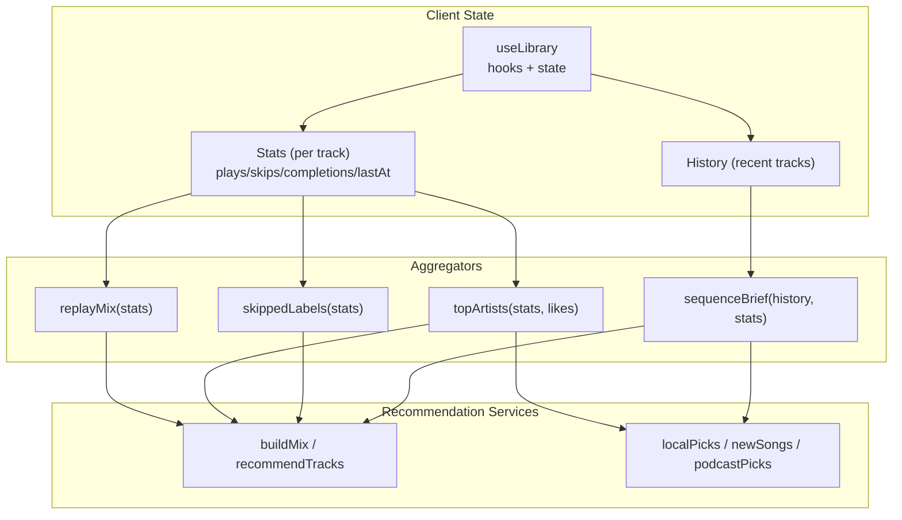
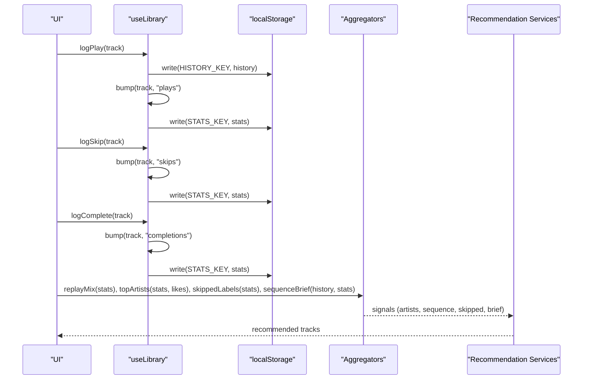
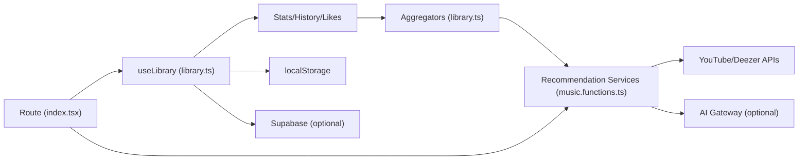

# Behavioral Tracking & Statistics

<cite>
**Referenced Files in This Document**
- [library.ts](file://src/lib/library.ts)
- [music.functions.ts](file://src/lib/music.functions.ts)
- [index.tsx](file://src/routes/index.tsx)
</cite>

## Table of Contents
1. [Introduction](#introduction)
2. [Project Structure](#project-structure)
3. [Core Components](#core-components)
4. [Architecture Overview](#architecture-overview)
5. [Detailed Component Analysis](#detailed-component-analysis)
6. [Dependency Analysis](#dependency-analysis)
7. [Performance Considerations](#performance-considerations)
8. [Troubleshooting Guide](#troubleshooting-guide)
9. [Conclusion](#conclusion)

## Introduction
This document explains the behavioral tracking system that records how users interact with tracks to power personalized recommendations and insights. It covers:
- The PlayStat structure used to store per-track behavior
- The bump function that increments plays, skips, and completions counters
- The logPlay, logSkip, and logComplete functions that record user interactions
- How statistics are aggregated into features like replay mixes, top artists, and skipped labels analysis
- Examples of how behavioral data feeds AI-powered recommendations and local fallbacks
- Scoring algorithms that weight different interaction types to determine preferences

## Project Structure
The behavioral tracking logic is implemented in a local-first library hook that persists state to localStorage and optionally syncs to a cloud account. Aggregation utilities compute derived insights from this state. A route component wires these behaviors into UI flows and recommendation pipelines.

**Diagram sources**
- [library.ts:112-121](file://src/lib/library.ts#L112-L121)
- [library.ts:384-411](file://src/lib/library.ts#L384-L411)
- [library.ts:592-645](file://src/lib/library.ts#L592-L645)
- [music.functions.ts:58-137](file://src/lib/music.functions.ts#L58-L137)
- [music.functions.ts:156-245](file://src/lib/music.functions.ts#L156-L245)
- [music.functions.ts:324-369](file://src/lib/music.functions.ts#L324-L369)
- [music.functions.ts:398-458](file://src/lib/music.functions.ts#L398-L458)
- [index.tsx:247-325](file://src/routes/index.tsx#L247-L325)

**Section sources**
- [library.ts:105-121](file://src/lib/library.ts#L105-L121)
- [library.ts:242-259](file://src/lib/library.ts#L242-L259)
- [index.tsx:247-325](file://src/routes/index.tsx#L247-L325)

## Core Components
- PlayStat: Per-track behavioral record containing the track reference, counts for plays, skips, completions, and last activity timestamp.
- Stats: Map keyed by track id to PlayStat entries.
- useLibrary hook: Initializes, persists, and updates behavioral state; exposes logging functions and returns current stats/history/settings.
- Aggregation functions: replayMix, topArtists, skippedLabels, sequenceBrief transform raw stats into actionable signals.
- Recommendation services: Use aggregated signals to generate personalized picks via AI or local heuristics.

**Section sources**
- [library.ts:112-121](file://src/lib/library.ts#L112-L121)
- [library.ts:242-259](file://src/lib/library.ts#L242-L259)
- [library.ts:592-645](file://src/lib/library.ts#L592-L645)

## Architecture Overview
Behavioral events flow from playback interactions into persistent stats, which feed both deterministic aggregators and AI-driven recommendation engines.

**Diagram sources**
- [library.ts:384-411](file://src/lib/library.ts#L384-L411)
- [library.ts:592-645](file://src/lib/library.ts#L592-L645)
- [music.functions.ts:58-137](file://src/lib/music.functions.ts#L58-L137)
- [music.functions.ts:156-245](file://src/lib/music.functions.ts#L156-L245)
- [index.tsx:247-325](file://src/routes/index.tsx#L247-L325)

## Detailed Component Analysis

### PlayStat and Stats
- PlayStat stores:
  - track: the Track object associated with the behavior
  - plays: number of times the track was started
  - skips: number of early exits
  - completions: number of full listens
  - lastAt: timestamp of the most recent interaction
- Stats is a map from track.id to PlayStat, enabling O(1) lookup and updates.

Complexity:
- Update operations are O(1) per event due to map-based storage.
- Aggregation scans all stats entries once per feature computation.

**Section sources**
- [library.ts:112-121](file://src/lib/library.ts#L112-L121)

### Bump Function
Purpose:
- Increments one of plays, skips, or completions for a given track.
- Creates a new PlayStat entry if none exists.
- Updates lastAt to the current time on each bump.
- Persists updated stats to localStorage.

Data flow:
- Reads existing stats by track.id
- Computes next PlayStat with incremented field and updated timestamp
- Writes back to stats map and persists

Edge cases:
- First-time track creates default counters and sets lastAt
- Ensures immutability by returning a new stats map

**Section sources**
- [library.ts:384-395](file://src/lib/library.ts#L384-L395)

### Logging Functions
- logPlay(track):
  - Adds track to the front of history (deduplicated, capped)
  - Persists history
  - Calls bump(track, "plays")
- logSkip(track):
  - Calls bump(track, "skips")
- logComplete(track):
  - Calls bump(track, "completions")

These functions encapsulate user actions and ensure consistent state updates and persistence.

**Section sources**
- [library.ts:397-411](file://src/lib/library.ts#L397-L411)

### Statistics Aggregation
- replayMix(stats, limit):
  - Filters tracks played or completed recently (within a rolling window)
  - Scores using weighted formula: plays * 2 + completions * 3 - skips * 2
  - Sorts by score descending, then recency
  - Returns top N tracks
- topArtists(stats, likes, limit):
  - Aggregates per artist: adds plays, doubles completions, subtracts skips
  - Boosts artists from likes list
  - Returns top N artists by score
- skippedLabels(stats, limit):
  - Identifies tracks frequently skipped relative to completions
  - Returns top N track labels as negative signals
- sequenceBrief(history, stats, limit):
  - Produces a concise narrative of recent sessions indicating played, skipped, or replayed behavior

These outputs feed recommendation services to tailor suggestions.

**Section sources**
- [library.ts:592-645](file://src/lib/library.ts#L592-L645)

### Recommendation Integration
- Discover/New Release/Podcast flows:
  - Build inputs from topArtists, sequenceBrief, skippedLabels, and settingsToBrief
  - Call buildMix or recommendTracks server functions
  - If AI unavailable or empty results, fall back to localPicks/newSongs/podcastPicks
- Local fallbacks:
  - localPicks uses top artists to generate comfort, discovery, and up-next content without AI
  - newSongs focuses on fresh releases filtered by language preferences
  - podcastPicks curates episodes by topics/languages and trending shows

Examples of usage:
- Replay Mix: Uses replayMix to surface tracks with high repeat behavior
- Top Artists: Feeds discover/new release queries to focus on known favorites
- Skipped Labels: Provides negative constraints to avoid similar sounds
- Sequence Brief: Gives ordered context of recent listening to guide AI tone and variety

**Section sources**
- [index.tsx:247-325](file://src/routes/index.tsx#L247-L325)
- [music.functions.ts:58-137](file://src/lib/music.functions.ts#L58-L137)
- [music.functions.ts:156-245](file://src/lib/music.functions.ts#L156-L245)
- [music.functions.ts:324-369](file://src/lib/music.functions.ts#L324-L369)
- [music.functions.ts:398-458](file://src/lib/music.functions.ts#L398-L458)

### Scoring Algorithms
- Replay mix scoring:
  - Weighted sum: plays * 2 + completions * 3 - skips * 2
  - Emphasizes completions more than plays, penalizes skips
  - Break ties by last activity timestamp
- Top artists scoring:
  - Artist score = sum over tracks: plays + completions * 2 - skips
  - Additional boost for liked tracks’ artists
- Skipped labels filtering:
  - Requires minimum skip threshold and more skips than completions
  - Orders by skip count to highlight strong negative signals

These algorithms translate raw interactions into preference signals for downstream features.

**Section sources**
- [library.ts:592-645](file://src/lib/library.ts#L592-L645)

## Dependency Analysis
- useLibrary depends on:
  - localStorage read/write helpers
  - Optional Supabase client for syncing when signed in
- Aggregators depend only on stats/history/likes
- Recommendation services depend on:
  - Aggregated signals
  - External search APIs (YouTube/Deezer) and optional AI gateway
- Route component composes hooks and services to render UI and trigger recommendations

**Diagram sources**
- [library.ts:125-143](file://src/lib/library.ts#L125-L143)
- [library.ts:262-349](file://src/lib/library.ts#L262-L349)
- [library.ts:592-645](file://src/lib/library.ts#L592-L645)
- [music.functions.ts:58-137](file://src/lib/music.functions.ts#L58-L137)
- [music.functions.ts:156-245](file://src/lib/music.functions.ts#L156-L245)
- [index.tsx:247-325](file://src/routes/index.tsx#L247-L325)

**Section sources**
- [library.ts:125-143](file://src/lib/library.ts#L125-L143)
- [library.ts:262-349](file://src/lib/library.ts#L262-L349)
- [music.functions.ts:58-137](file://src/lib/music.functions.ts#L58-L137)
- [index.tsx:247-325](file://src/routes/index.tsx#L247-L325)

## Performance Considerations
- Event handling:
  - Each interaction triggers a single stats update and possibly a history append; both are O(1) map/list operations with caps to prevent unbounded growth.
- Persistence:
  - Stats and history are written to localStorage on every change; consider batching writes if interaction frequency spikes.
- Aggregation:
  - replayMix/topArtists/skippedLabels iterate over stats once; complexity is O(N) where N is number of tracked tracks.
- Recommendations:
  - AI calls can be rate-limited; fallbacks ensure responsiveness even when AI is unavailable.
- Memory:
  - History and playlists are capped to reasonable limits to avoid excessive memory usage.

[No sources needed since this section provides general guidance]

## Troubleshooting Guide
Common issues and mitigations:
- localStorage quota exceeded:
  - Write helper logs warnings; consider pruning history/stats or reducing caps.
- Sync failures:
  - Debounced sync to Supabase may fail; errors are logged and retried on next change.
- AI unavailability:
  - Server functions return explicit errors; UI falls back to localPicks/newSongs/podcastPicks.
- Inconsistent stats:
  - Ensure logPlay/logSkip/logComplete are called at appropriate lifecycle points (start, skip, complete).
- Stale data:
  - On sign-in, stats are merged from cloud to device; verify merge logic preserves latest timestamps and max counters.

**Section sources**
- [library.ts:125-143](file://src/lib/library.ts#L125-L143)
- [library.ts:262-349](file://src/lib/library.ts#L262-L349)
- [music.functions.ts:58-137](file://src/lib/music.functions.ts#L58-L137)
- [music.functions.ts:156-245](file://src/lib/music.functions.ts#L156-L245)

## Conclusion
The behavioral tracking system captures granular user interactions through PlayStat and exposes them via simple logging functions. Aggregation utilities convert these signals into actionable insights that drive both AI-powered and heuristic-based recommendations. Scoring algorithms prioritize completions and penalize skips to reflect true preferences. The architecture balances local performance with optional cloud sync and resilient fallbacks, ensuring reliable personalization under varying conditions.

[No sources needed since this section summarizes without analyzing specific files]