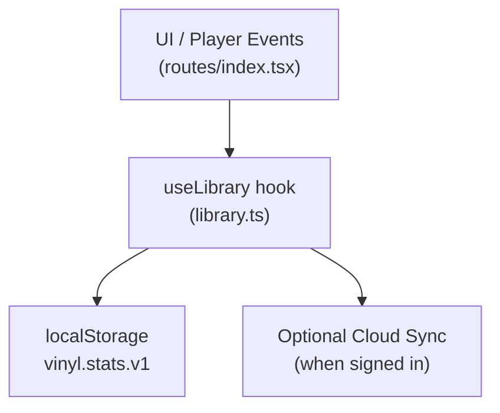
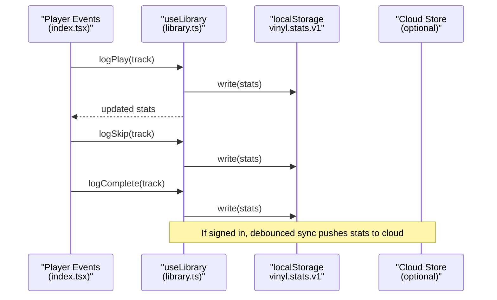
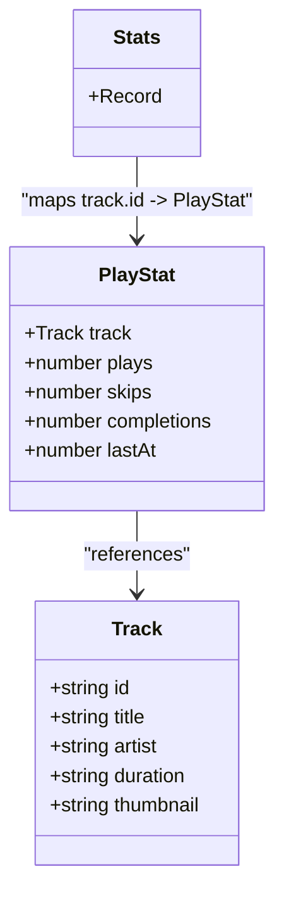
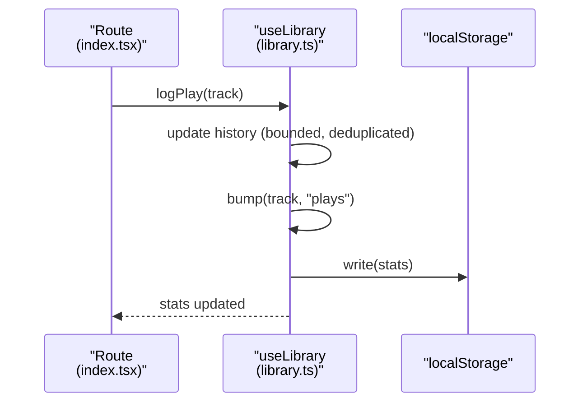
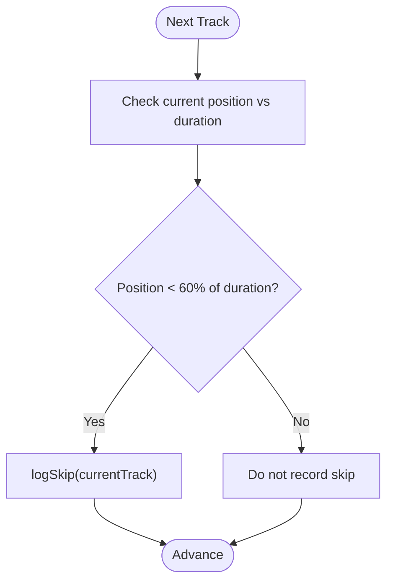
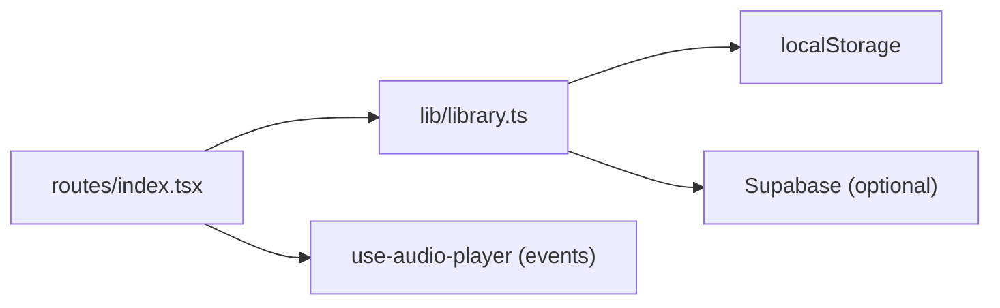

# Data Collection & Storage

<cite>
**Referenced Files in This Document**
- [library.ts](file://src/lib/library.ts)
- [index.tsx](file://src/routes/index.tsx)
</cite>

## Table of Contents
1. [Introduction](#introduction)
2. [Project Structure](#project-structure)
3. [Core Components](#core-components)
4. [Architecture Overview](#architecture-overview)
5. [Detailed Component Analysis](#detailed-component-analysis)
6. [Dependency Analysis](#dependency-analysis)
7. [Performance Considerations](#performance-considerations)
8. [Troubleshooting Guide](#troubleshooting-guide)
9. [Conclusion](#conclusion)

## Introduction
This document explains the behavioral data collection system that tracks user interactions with music content. It focuses on how plays, skips, and completions are recorded per track, how this data is persisted locally, and how it flows through the application during playback events. The system centers around a PlayStat structure and helper functions (bump, logPlay, logSkip, logComplete), with persistence via localStorage using a dedicated key for stats.

## Project Structure
The behavioral tracking logic lives in a library module that exposes a React hook to manage state and persistence. The main route integrates this hook with the audio player to record events as users interact with tracks.

**Diagram sources**
- [library.ts:105-110](file://src/lib/library.ts#L105-L110)
- [library.ts:125-143](file://src/lib/library.ts#L125-L143)
- [index.tsx:479-512](file://src/routes/index.tsx#L479-L512)
- [index.tsx:858-869](file://src/routes/index.tsx#L858-L869)

**Section sources**
- [library.ts:105-110](file://src/lib/library.ts#L105-L110)
- [index.tsx:479-512](file://src/routes/index.tsx#L479-L512)
- [index.tsx:858-869](file://src/routes/index.tsx#L858-L869)

## Core Components
- PlayStat: A per-track behavioral record containing the track reference, counters for plays, skips, and completions, and a timestamp of the last activity.
- Stats: A map keyed by track id where each value is a PlayStat.
- bump: Increments a specific counter (plays, skips, or completions) for a track and updates the last activity timestamp.
- logPlay: Records a play event and increments the plays counter.
- logSkip: Records a skip event and increments the skips counter.
- logComplete: Records a completion event and increments the completions counter.
- Persistence: All stats are written to localStorage under a dedicated key and read back on app start.

These components work together to capture meaningful signals about listening behavior, enabling features like replay mixes, top artists, and skipping patterns.

**Section sources**
- [library.ts:113-121](file://src/lib/library.ts#L113-L121)
- [library.ts:384-411](file://src/lib/library.ts#L384-L411)
- [library.ts:125-143](file://src/lib/library.ts#L125-L143)

## Architecture Overview
The flow begins in the UI when playback events occur. The route calls into the library hook to record these events. The hook updates in-memory state and persists changes to localStorage. When a user is signed in, the hook also syncs the local stats to the cloud account store.

**Diagram sources**
- [index.tsx:479-512](file://src/routes/index.tsx#L479-L512)
- [index.tsx:858-869](file://src/routes/index.tsx#L858-L869)
- [library.ts:384-411](file://src/lib/library.ts#L384-L411)
- [library.ts:125-143](file://src/lib/library.ts#L125-L143)
- [library.ts:321-349](file://src/lib/library.ts#L321-L349)

## Detailed Component Analysis

### PlayStat and Stats Model
- PlayStat includes:
  - track: the track object associated with the interaction
  - plays: number of times the track was started
  - skips: number of times the track was skipped before significant progress
  - completions: number of times the track reached natural end
  - lastAt: timestamp of the most recent activity
- Stats is a map from track id to PlayStat, enabling O(1) lookup by track.

Complexity considerations:
- Lookup by track id is constant time.
- Updates create new objects/maps to maintain immutability, which is safe for small-to-medium datasets typical in client-side storage.

**Section sources**
- [library.ts:113-121](file://src/lib/library.ts#L113-L121)

### bump Function
Purpose:
- Increment a specific counter (plays, skips, or completions) for a given track.
- Update lastAt to the current time.
- Persist the updated stats to localStorage.

Behavior:
- If an entry exists for the track, increment the specified field and refresh lastAt.
- If no entry exists, initialize counters to zero and set the targeted counter to one.

Data flow:
- Reads previous stats from memory.
- Writes updated stats to localStorage under the stats key.

**Section sources**
- [library.ts:384-395](file://src/lib/library.ts#L384-L395)
- [library.ts:125-143](file://src/lib/library.ts#L125-L143)

### logPlay, logSkip, logComplete Functions
- logPlay:
  - Adds the track to the history list (deduplicated and bounded).
  - Calls bump with the plays field to increment the play count.
- logSkip:
  - Calls bump with the skips field to increment the skip count.
- logComplete:
  - Calls bump with the completions field to increment the completion count.

Integration points:
- logPlay is invoked when a track starts playing.
- logSkip is invoked when the user advances to the next track before a threshold of progress.
- logComplete is invoked when a track finishes naturally.

**Section sources**
- [library.ts:397-411](file://src/lib/library.ts#L397-L411)
- [index.tsx:479-512](file://src/routes/index.tsx#L479-L512)
- [index.tsx:858-869](file://src/routes/index.tsx#L858-L869)

### Local Storage Implementation
- Keys:
  - Stats are stored under a dedicated key for behavioral data.
  - Other keys exist for likes, dislikes, history, playlists, settings, playback position, and episode positions.
- Read/Write helpers:
  - read(key, fallback): Safely reads JSON from localStorage and returns a fallback if unavailable or invalid.
  - write(key, value): Serializes and writes values to localStorage with error handling for quota or other failures.
- Initialization:
  - On mount, the hook reads all relevant keys, including stats, and hydrates state.

Persistence strategy:
- Immediate writes on every update ensure durability across sessions.
- Optional cloud sync merges and persists a server copy when the user is authenticated.

**Section sources**
- [library.ts:105-110](file://src/lib/library.ts#L105-L110)
- [library.ts:125-143](file://src/lib/library.ts#L125-L143)
- [library.ts:251-259](file://src/lib/library.ts#L251-L259)
- [library.ts:321-349](file://src/lib/library.ts#L321-L349)

### Playback Event Integration
- Completion:
  - When a track ends naturally, the route records a completion event for the current track.
- Skip:
  - When moving to the next track, if the current track has not reached a defined progress threshold, a skip is recorded.
- Play:
  - When starting a track, a play event is recorded and the track is added to history.

These integrations ensure accurate behavioral signals for recommendation and analytics.

**Section sources**
- [index.tsx:479-512](file://src/routes/index.tsx#L479-L512)
- [index.tsx:858-869](file://src/routes/index.tsx#L858-L869)

### Data Flow Diagrams

#### Class-like relationships

**Diagram sources**
- [library.ts:113-121](file://src/lib/library.ts#L113-L121)

#### Sequence of recording a play

**Diagram sources**
- [library.ts:397-411](file://src/lib/library.ts#L397-L411)
- [library.ts:125-143](file://src/lib/library.ts#L125-L143)

#### Flowchart of skip decision

**Diagram sources**
- [index.tsx:858-869](file://src/routes/index.tsx#L858-L869)

## Dependency Analysis
- The route depends on the library hook to access logging functions and current stats.
- The library hook depends on localStorage for persistence and optionally on cloud storage for synchronization.
- The audio player emits events that drive the recording of completion and error conditions.

**Diagram sources**
- [index.tsx:170-196](file://src/routes/index.tsx#L170-L196)
- [library.ts:251-259](file://src/lib/library.ts#L251-L259)
- [library.ts:321-349](file://src/lib/library.ts#L321-L349)

**Section sources**
- [index.tsx:170-196](file://src/routes/index.tsx#L170-L196)
- [library.ts:251-259](file://src/lib/library.ts#L251-L259)
- [library.ts:321-349](file://src/lib/library.ts#L321-L349)

## Performance Considerations
- Immutability: Each update creates new objects/maps to avoid side effects; suitable for moderate dataset sizes.
- Bounded lists: History and similar lists are capped to prevent unbounded growth.
- Debounced sync: Cloud sync is debounced to reduce network overhead while keeping data consistent.
- Safe I/O: Read/write helpers handle errors gracefully to avoid crashes due to quota or storage issues.

[No sources needed since this section provides general guidance]

## Troubleshooting Guide
Common issues and mitigations:
- Storage quota exceeded: Write operations catch and log errors; consider pruning history or limiting retained items.
- Corrupted data: Read operations parse safely and fall back to defaults when parsing fails.
- Inconsistent state after sign-in: On login, local and cloud data are merged; ensure merge logic preserves latest timestamps and counts.

Operational tips:
- Verify that the stats key is present and contains valid entries after initialization.
- Confirm that logPlay, logSkip, and logComplete are invoked at appropriate lifecycle points in the player integration.

**Section sources**
- [library.ts:125-143](file://src/lib/library.ts#L125-L143)
- [library.ts:251-259](file://src/lib/library.ts#L251-L259)
- [library.ts:321-349](file://src/lib/library.ts#L321-L349)

## Conclusion
The behavioral data collection system captures plays, skips, and completions per track using a clear and efficient model. The bump function centralizes counter updates, while logPlay, logSkip, and logComplete provide semantic hooks for different interaction types. Data is persisted locally for resilience and can be synchronized to the cloud when available. This design enables robust analytics and personalized recommendations based on real user behavior.