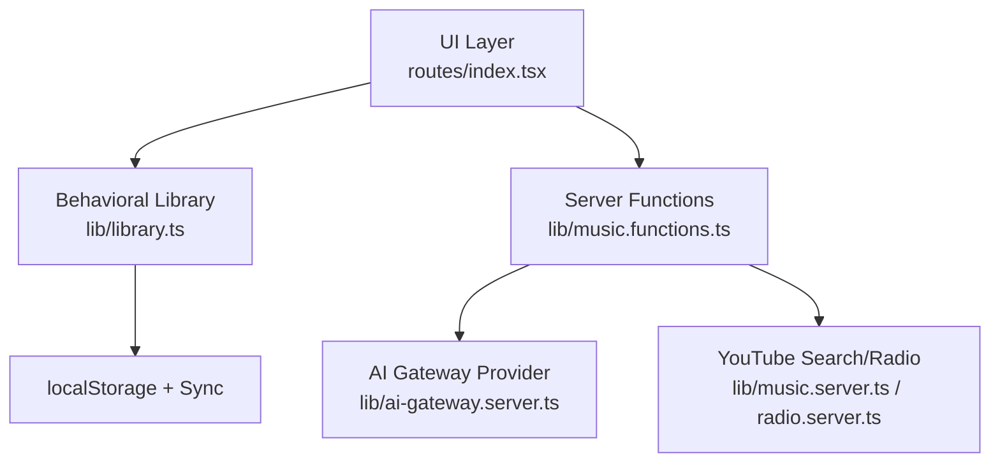
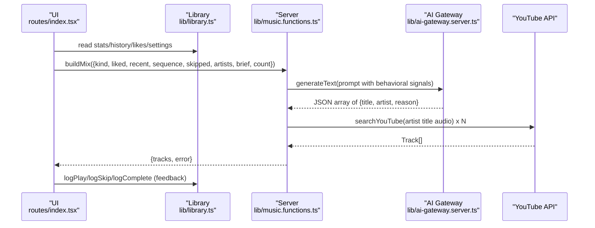
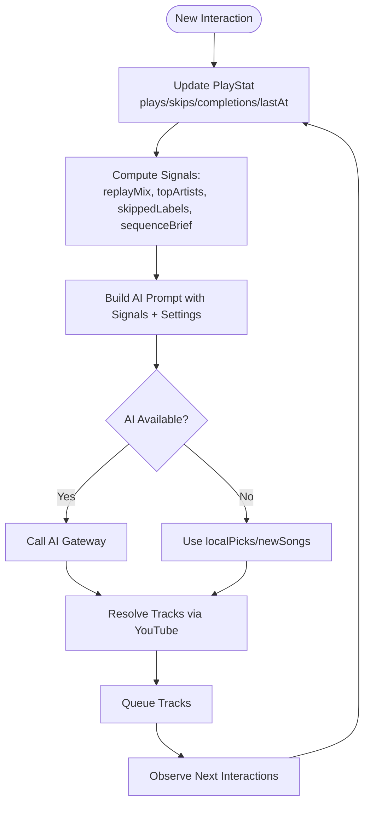
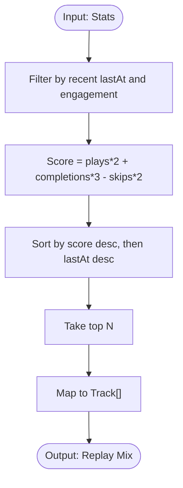
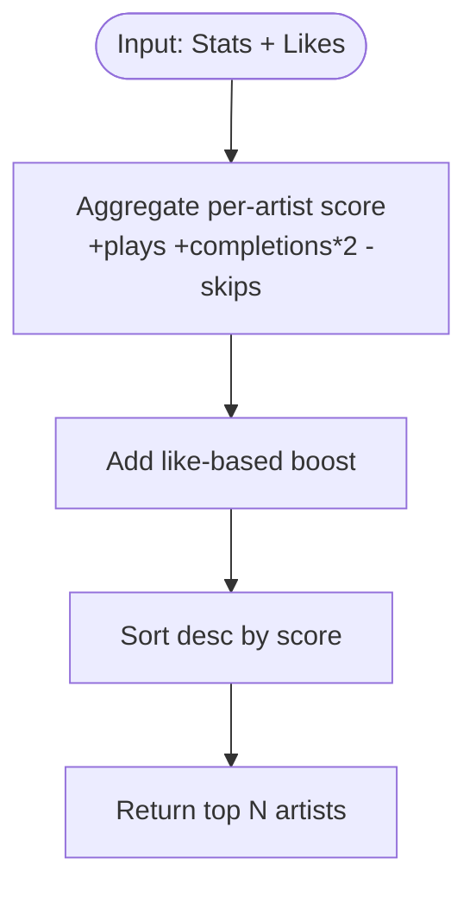
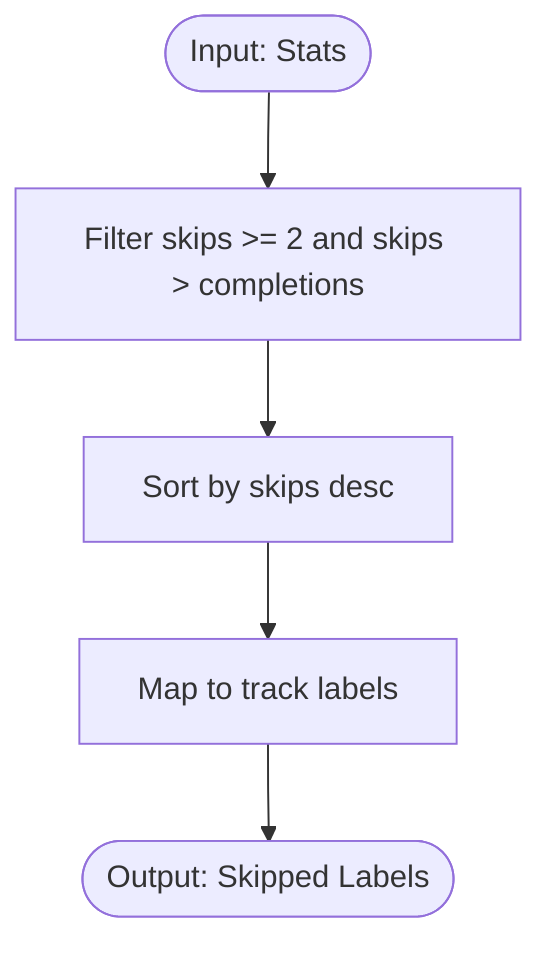
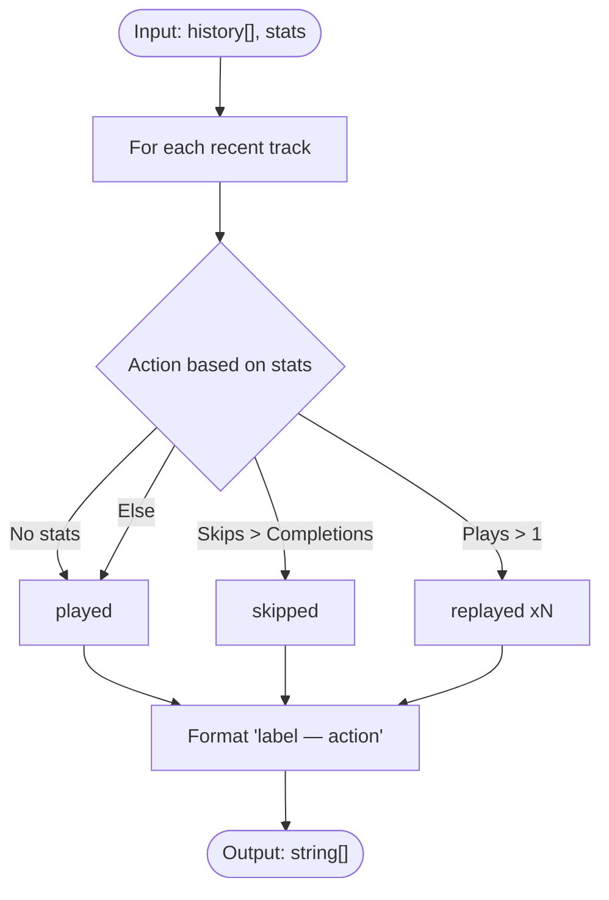
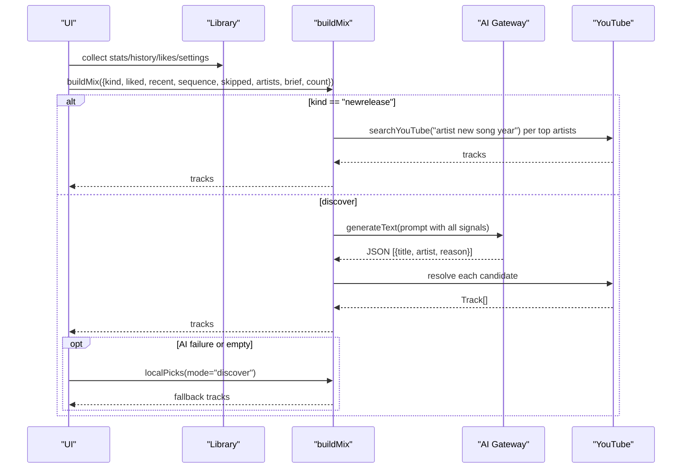
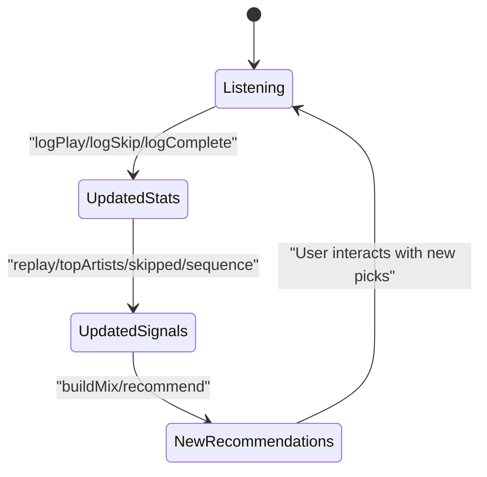
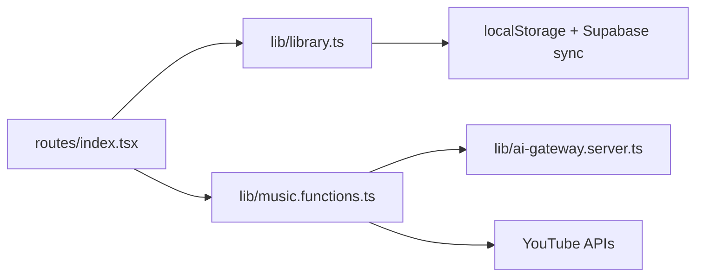

# Recommendation System Integration

<cite>
**Referenced Files in This Document**
- [library.ts](file://src/lib/library.ts)
- [music.functions.ts](file://src/lib/music.functions.ts)
- [index.tsx](file://src/routes/index.tsx)
- [ai-gateway.server.ts](file://src/lib/ai-gateway.server.ts)
</cite>

## Table of Contents
1. [Introduction](#introduction)
2. [Project Structure](#project-structure)
3. [Core Components](#core-components)
4. [Architecture Overview](#architecture-overview)
5. [Detailed Component Analysis](#detailed-component-analysis)
6. [Dependency Analysis](#dependency-analysis)
7. [Performance Considerations](#performance-considerations)
8. [Troubleshooting Guide](#troubleshooting-guide)
9. [Conclusion](#conclusion)

## Introduction
This document explains how behavioral statistics integrate with the AI recommendation system to generate personalized music suggestions. It covers:
- How replayMix identifies songs users have been on repeat and powers a behavior-only “Replay Mix.”
- How topArtists influences artist-focused recommendations and discovery patterns.
- How skippedLabels provides negative feedback to avoid similar content in future recommendations.
- How sequenceBrief summarizes recent listening actions to give the AI context about session flow.
- How these signals are weighted and combined with user preferences to produce tailored mixes.
- The continuous feedback loop where new interactions refine recommendation accuracy over time.

## Project Structure
The recommendation pipeline spans three layers:
- Behavioral data collection and aggregation (local storage, sync to account): library.ts
- Server-side mix generation and AI orchestration: music.functions.ts
- UI wiring that compiles behavioral signals into prompts and handles fallbacks: index.tsx
- AI provider configuration: ai-gateway.server.ts

**Diagram sources**
- [index.tsx:265-325](file://src/routes/index.tsx#L265-L325)
- [library.ts:592-645](file://src/lib/library.ts#L592-L645)
- [music.functions.ts:156-245](file://src/lib/music.functions.ts#L156-L245)
- [ai-gateway.server.ts:1-10](file://src/lib/ai-gateway.server.ts#L1-L10)

**Section sources**
- [index.tsx:265-325](file://src/routes/index.tsx#L265-L325)
- [library.ts:592-645](file://src/lib/library.ts#L592-L645)
- [music.functions.ts:156-245](file://src/lib/music.functions.ts#L156-L245)
- [ai-gateway.server.ts:1-10](file://src/lib/ai-gateway.server.ts#L1-L10)

## Core Components
- Behavioral stats model: PlayStat tracks plays, skips, completions, and lastAt per track; Stats is a map of these by track id.
- Signal extractors:
  - replayMix: finds recently repeated tracks using weighted scoring.
  - topArtists: ranks artists by play/completion counts and likes.
  - skippedLabels: extracts strongly negative signals from frequent skips.
  - sequenceBrief: builds an ordered summary of recent actions for the AI.
- Mix engines:
  - buildMix: AI-driven Discover/New Release mix using behavioral signals and tuning brief.
  - recommendTracks: general AI recommendations using liked/recent/disliked/sequence/skipped/brief.
  - localPicks/newSongs/podcastPicks: deterministic fallbacks when AI is unavailable or as complementary feeds.

**Section sources**
- [library.ts:112-121](file://src/lib/library.ts#L112-L121)
- [library.ts:592-645](file://src/lib/library.ts#L592-L645)
- [music.functions.ts:47-137](file://src/lib/music.functions.ts#L47-L137)
- [music.functions.ts:156-245](file://src/lib/music.functions.ts#L156-L245)

## Architecture Overview
The system combines explicit preferences (likes, dislikes, Tune settings) with implicit behavioral signals (plays, skips, completions, sequence order) to drive two recommendation paths:
- AI path: Sends a structured prompt including liked/recent/disliked, sequenceBrief, skippedLabels, topArtists, and settingsToBrief to an LLM via the AI gateway. The model returns candidate tracks, which are resolved to playable items via YouTube search.
- Deterministic path: When AI is unavailable or returns no results, local algorithms use topArtists and other heuristics to generate picks.

**Diagram sources**
- [index.tsx:297-325](file://src/routes/index.tsx#L297-L325)
- [music.functions.ts:156-245](file://src/lib/music.functions.ts#L156-L245)
- [ai-gateway.server.ts:1-10](file://src/lib/ai-gateway.server.ts#L1-L10)

## Detailed Component Analysis

### Behavioral Signals and Their Weighting
- Plays and completions increase affinity; skips reduce it. Scoring formulas:
  - Replay scoring weights plays and completions positively and penalizes skips.
  - Artist ranking adds completion weight and subtracts skips; likes add a positive boost.
  - Skipped labels require multiple skips and more skips than completions to be considered strong negatives.
- These signals feed both deterministic and AI-driven paths.

**Diagram sources**
- [library.ts:384-411](file://src/lib/library.ts#L384-L411)
- [library.ts:592-645](file://src/lib/library.ts#L592-L645)
- [music.functions.ts:156-245](file://src/lib/music.functions.ts#L156-L245)

**Section sources**
- [library.ts:384-411](file://src/lib/library.ts#L384-L411)
- [library.ts:592-645](file://src/lib/library.ts#L592-L645)

### replayMix: Identifying Songs on Repeat
- Purpose: Surface tracks the user has repeatedly engaged with recently.
- Logic: Filters by recency and engagement threshold, then scores by plays and completions while penalizing skips, sorts by score and last played time, and returns top N tracks.
- Usage: Powers the “Replay” mix view without AI.

**Diagram sources**
- [library.ts:592-603](file://src/lib/library.ts#L592-L603)

**Section sources**
- [library.ts:592-603](file://src/lib/library.ts#L592-L603)

### topArtists: Influencing Artist-Focused Recommendations
- Purpose: Rank artists the listener actually engages with, combining behavioral signals and explicit likes.
- Logic: Aggregates per-artist score from plays, completions (weighted higher), and skips (penalty); adds bonus for liked tracks; returns top N artist names.
- Usage: Feeds Discover/New Release/Podcasts/New Songs flows to focus on known tastes and to exclude already-known artists in discovery.

**Diagram sources**
- [library.ts:605-621](file://src/lib/library.ts#L605-L621)

**Section sources**
- [library.ts:605-621](file://src/lib/library.ts#L605-L621)

### skippedLabels: Negative Feedback to Avoid Similar Content
- Purpose: Identify tracks the user consistently skips to steer the AI away from similar sounds.
- Logic: Filters tracks with multiple skips and more skips than completions; sorts by skip count; returns track labels.
- Usage: Included in AI prompts to explicitly avoid disliked sonic profiles.

**Diagram sources**
- [library.ts:623-630](file://src/lib/library.ts#L623-L630)

**Section sources**
- [library.ts:623-630](file://src/lib/library.ts#L623-L630)

### sequenceBrief: Contextualizing Recent Listening Patterns
- Purpose: Provide an ordered, action-aware snapshot of recent listening to help the AI understand session flow.
- Logic: For each recent track, determines whether it was played, skipped, or replayed based on stats; formats as “track — action”.
- Usage: Sent to AI to inform sequential taste and immediate context.

**Diagram sources**
- [library.ts:632-645](file://src/lib/library.ts#L632-L645)

**Section sources**
- [library.ts:632-645](file://src/lib/library.ts#L632-L645)

### AI Mix Generation: Combining Signals with Preferences
- Inputs compiled by the UI:
  - liked: recent liked tracks (labels)
  - recent: recent history (labels)
  - sequence: sequenceBrief output
  - skipped: skippedLabels output
  - artists: topArtists output
  - brief: settingsToBrief output (moods, genres, languages, discovery vs familiarity, energy, instrumental-only)
- Processing:
  - If AI key configured, call AI to generate candidates with balanced comfort/forgotten/new-similar ratios and strict non-repeat constraints.
  - Resolve candidates to playable tracks via YouTube search.
  - If AI fails or returns empty for Discover, fall back to localPicks.

**Diagram sources**
- [index.tsx:297-325](file://src/routes/index.tsx#L297-L325)
- [music.functions.ts:156-245](file://src/lib/music.functions.ts#L156-L245)
- [ai-gateway.server.ts:1-10](file://src/lib/ai-gateway.server.ts#L1-L10)

**Section sources**
- [index.tsx:297-325](file://src/routes/index.tsx#L297-L325)
- [music.functions.ts:156-245](file://src/lib/music.functions.ts#L156-L245)

### Feedback Loop: Continuous Refinement
- Every play, skip, or completion updates PlayStat counters and lastAt timestamps.
- History is maintained in order; stats persist locally and sync to the user’s account when signed in.
- On next mix request, updated stats alter:
  - replayMix (repeat detection)
  - topArtists (artist weighting)
  - skippedLabels (negative signal strength)
  - sequenceBrief (recent actions)
- This creates a closed loop: interactions update signals, signals shape prompts, prompts influence recommendations, recommendations lead to new interactions.

**Diagram sources**
- [library.ts:384-411](file://src/lib/library.ts#L384-L411)
- [library.ts:242-349](file://src/lib/library.ts#L242-L349)
- [index.tsx:297-325](file://src/routes/index.tsx#L297-L325)

**Section sources**
- [library.ts:384-411](file://src/lib/library.ts#L384-L411)
- [library.ts:242-349](file://src/lib/library.ts#L242-L349)
- [index.tsx:297-325](file://src/routes/index.tsx#L297-L325)

## Dependency Analysis
- UI depends on library functions to compile behavioral signals and settings into concise inputs for server functions.
- Server functions depend on:
  - AI gateway provider for LLM calls
  - YouTube search/radio for resolution and deterministic discovery
- Library persists and merges state across sessions and devices.

**Diagram sources**
- [index.tsx:265-325](file://src/routes/index.tsx#L265-L325)
- [music.functions.ts:156-245](file://src/lib/music.functions.ts#L156-L245)
- [ai-gateway.server.ts:1-10](file://src/lib/ai-gateway.server.ts#L1-L10)
- [library.ts:242-349](file://src/lib/library.ts#L242-L349)

**Section sources**
- [index.tsx:265-325](file://src/routes/index.tsx#L265-L325)
- [music.functions.ts:156-245](file://src/lib/music.functions.ts#L156-L245)
- [ai-gateway.server.ts:1-10](file://src/lib/ai-gateway.server.ts#L1-L10)
- [library.ts:242-349](file://src/lib/library.ts#L242-L349)

## Performance Considerations
- Batched queries: New release and podcast flows parallelize searches across artists/topics to reduce latency.
- Deduplication: Sets prevent duplicate tracks across batches.
- Fallbacks: Deterministic localPicks ensure availability even when AI is down or rate-limited.
- Storage limits: Library writes guard against quota errors; large histories are truncated to manageable sizes.

[No sources needed since this section provides general guidance]

## Troubleshooting Guide
Common issues and their handling:
- AI not configured: Returns a clear message indicating AI is unavailable; UI falls back to local engine.
- Rate limiting or credits exhausted: Specific error messages guide retry or credit replenishment.
- Parsing failures: If AI response cannot be parsed as JSON, a friendly error is returned.
- Network failures: Graceful fallbacks to Deezer previews or trending content when primary sources fail.

**Section sources**
- [music.functions.ts:61-137](file://src/lib/music.functions.ts#L61-L137)
- [music.functions.ts:183-245](file://src/lib/music.functions.ts#L183-L245)

## Conclusion
The recommendation system integrates rich behavioral signals—repeats, artist affinity, skips, and sequential actions—with explicit preferences to deliver highly personalized music suggestions. The design balances AI-driven discovery with robust deterministic fallbacks, ensuring reliability and performance. Continuous interaction updates the underlying signals, creating a self-improving loop that adapts to evolving listener taste over time.