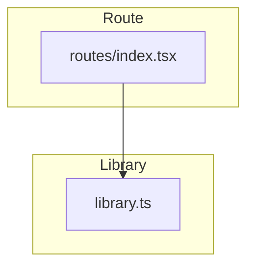
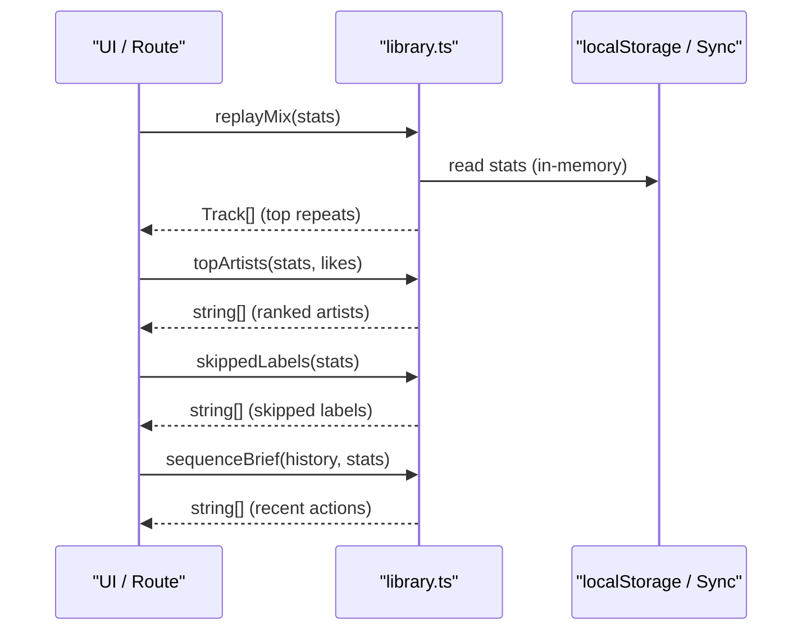
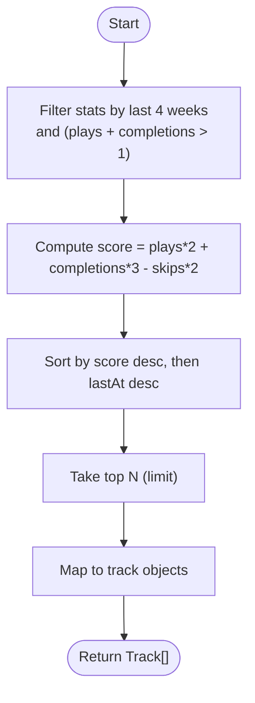
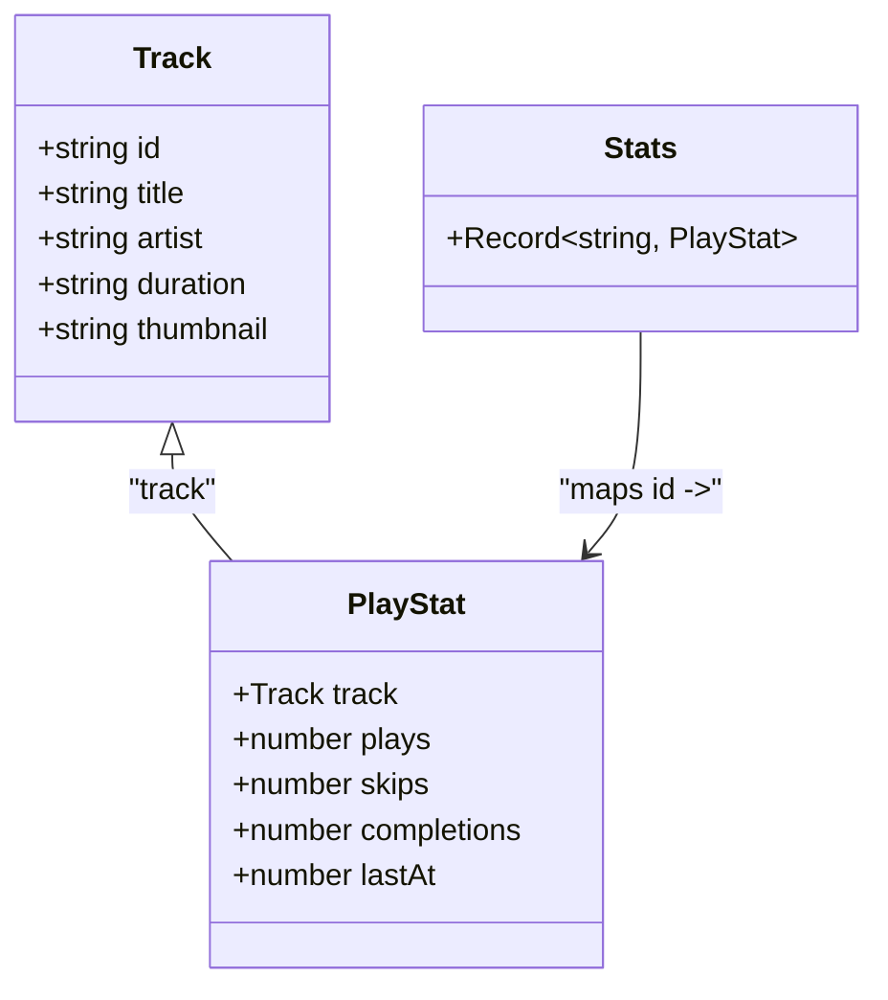
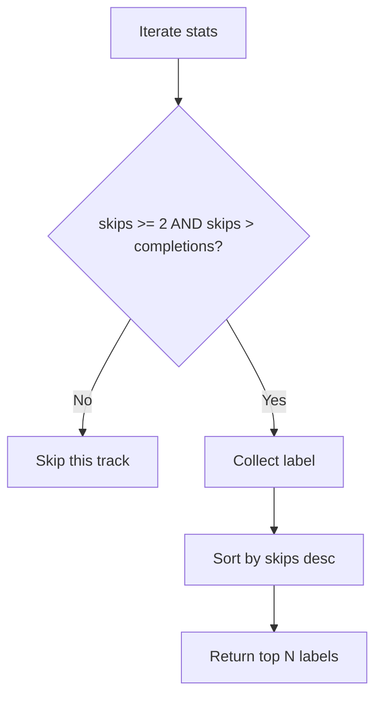
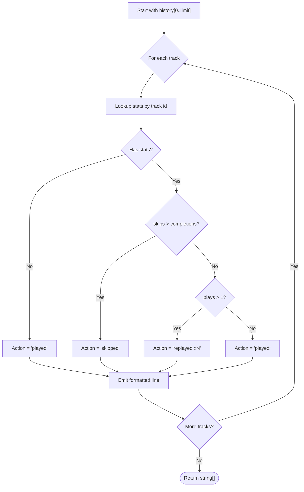

# Statistics Computation & Analysis

<cite>
**Referenced Files in This Document**
- [library.ts](file://src/lib/library.ts)
- [index.tsx](file://src/routes/index.tsx)
</cite>

## Table of Contents
1. [Introduction](#introduction)
2. [Project Structure](#project-structure)
3. [Core Components](#core-components)
4. [Architecture Overview](#architecture-overview)
5. [Detailed Component Analysis](#detailed-component-analysis)
6. [Dependency Analysis](#dependency-analysis)
7. [Performance Considerations](#performance-considerations)
8. [Troubleshooting Guide](#troubleshooting-guide)
9. [Conclusion](#conclusion)

## Introduction
This document explains the statistics computation engine that transforms raw behavioral data into actionable insights for music recommendations and mixes. It focuses on four key functions:
- replayMix: identifies frequently played songs from the last 4 weeks using a weighted scoring algorithm.
- topArtists: ranks artists by combining play behavior with explicit likes.
- skippedLabels: identifies consistently skipped content as strong negative signals.
- sequenceBrief: generates human-readable listening history summaries.

These functions operate on local behavioral stats, enabling both pure behavior-driven features (like Replay Mix) and AI-assisted recommendations (by feeding concise summaries to recommendation services).

## Project Structure
The analytics logic is implemented in a single library module and consumed by the main route component. The library defines types for tracks and per-track behavioral stats, persists them locally, and exposes pure functions to compute insights. The route composes these functions to build mix inputs and display results.

**Diagram sources**
- [library.ts:1-121](file://src/lib/library.ts#L1-L121)
- [index.tsx:240-330](file://src/routes/index.tsx#L240-L330)

**Section sources**
- [library.ts:1-121](file://src/lib/library.ts#L1-L121)
- [index.tsx:240-330](file://src/routes/index.tsx#L240-L330)

## Core Components
- Behavioral stats model: Each track has a PlayStat record capturing plays, skips, completions, and last activity timestamp. Stats are stored as a map keyed by track id.
- Data persistence: Stats are persisted to localStorage and optionally synced to a user account when signed in.
- Pure analytics functions: replayMix, topArtists, skippedLabels, and sequenceBrief transform stats into insights without side effects.

Key responsibilities:
- Collecting and updating behavioral counters via logPlay, logSkip, logComplete.
- Computing time-filtered, score-based rankings for mixes and recommendations.
- Summarizing recent listening actions for human readability or AI context.

**Section sources**
- [library.ts:112-121](file://src/lib/library.ts#L112-L121)
- [library.ts:384-411](file://src/lib/library.ts#L384-L411)
- [library.ts:590-645](file://src/lib/library.ts#L590-L645)

## Architecture Overview
The analytics pipeline reads from a Stats map and produces ranked lists or summaries used by UI and recommendation flows.

**Diagram sources**
- [library.ts:590-645](file://src/lib/library.ts#L590-L645)
- [index.tsx:247-330](file://src/routes/index.tsx#L247-L330)

## Detailed Component Analysis

### replayMix: Frequently Played Songs in the Last 4 Weeks
Purpose:
- Surface songs you have been playing repeatedly over the last 4 weeks.

Inputs:
- stats: Map of track id to PlayStat.
- limit: maximum number of tracks to return (default 30).

Processing:
- Time filter: only consider entries whose lastAt is within the last 4 weeks.
- Activity threshold: require at least one combined signal of plays or completions greater than 1 to avoid noise.
- Scoring: compute a composite score per track using weights:
  - plays × 2
  - completions × 3
  - skips × -2
- Ranking: sort by descending score; tie-break by most recent lastAt.
- Output: return up to limit track objects.

Complexity:
- Filtering and scoring iterate once over stats values: O(n).
- Sorting dominates: O(n log n).
- Slicing and mapping are linear in output size.

Edge cases:
- Empty stats returns an empty list.
- Tracks with no artist or missing fields still included if they meet thresholds.

Usage:
- Used directly in the UI to render the Replay Mix tab without external services.

**Section sources**
- [library.ts:590-603](file://src/lib/library.ts#L590-L603)
- [index.tsx:247-249](file://src/routes/index.tsx#L247-L249)

#### Algorithm Flowchart

**Diagram sources**
- [library.ts:590-603](file://src/lib/library.ts#L590-L603)

### topArtists: Ranked Artists by Behavior and Likes
Purpose:
- Produce a ranked list of artists based on actual listening behavior and explicit likes.

Inputs:
- stats: Map of track id to PlayStat.
- likes: array of liked tracks.
- limit: maximum number of artists to return (default 12).

Processing:
- Aggregate per artist:
  - For each stat entry, add plays + completions×2 - skips to the artist’s running score.
- Boost explicit preferences:
  - For each liked track, add +3 points to its artist’s score.
- Filter out non-positive scores.
- Sort by descending score.
- Return up to limit artist names.

Complexity:
- Aggregation over stats: O(n).
- Likes loop: O(m).
- Sorting: O(a log a), where a is number of unique artists.

Edge cases:
- Tracks without artist are ignored.
- Artists with zero net score are excluded.

Usage:
- Feeds recommendation engines and local fallbacks to tailor suggestions.

**Section sources**
- [library.ts:605-621](file://src/lib/library.ts#L605-L621)
- [index.tsx:254-260](file://src/routes/index.tsx#L254-L260)
- [index.tsx:274-291](file://src/routes/index.tsx#L274-L291)
- [index.tsx:298-309](file://src/routes/index.tsx#L298-L309)
- [index.tsx:363-372](file://src/routes/index.tsx#L363-L372)

#### Class-like Model and Relationships

**Diagram sources**
- [library.ts:3-14](file://src/lib/library.ts#L3-L14)
- [library.ts:112-121](file://src/lib/library.ts#L112-L121)

### skippedLabels: Strong Negative Signals
Purpose:
- Identify tracks that are consistently skipped, providing negative signals to avoid similar content in future picks.

Inputs:
- stats: Map of track id to PlayStat.
- limit: maximum number of labels to return (default 15).

Processing:
- Filter tracks where skips >= 2 and skips > completions.
- Sort by descending skip count.
- Return up to limit human-readable labels (title — artist).

Complexity:
- Linear scan and sort: O(n log n).

Edge cases:
- If no tracks meet criteria, returns an empty list.

Usage:
- Passed to recommendation pipelines to suppress disliked styles or artists.

**Section sources**
- [library.ts:623-630](file://src/lib/library.ts#L623-L630)
- [index.tsx:303-305](file://src/routes/index.tsx#L303-L305)

#### Decision Flow

**Diagram sources**
- [library.ts:623-630](file://src/lib/library.ts#L623-L630)

### sequenceBrief: Human-Readable Listening History
Purpose:
- Generate a concise, ordered summary of recent listening sessions with the action taken on each track.

Inputs:
- history: ordered list of recently played tracks.
- stats: Map of track id to PlayStat.
- limit: maximum entries to summarize (default 15).

Processing:
- For each track in history (up to limit):
  - Look up its stats.
  - Determine action:
    - If no stats: "played".
    - Else if skips > completions: "skipped".
    - Else if plays > 1: "replayed xN" (where N is plays).
    - Else: "played".
  - Format as "title — artist — action".

Complexity:
- Iterates over history slice: O(k), where k <= limit.

Edge cases:
- Missing stats default to neutral "played".
- Replays are explicitly called out to highlight favorites.

Usage:
- Provides a compact narrative of recent behavior to recommendation systems or UI displays.

**Section sources**
- [library.ts:632-645](file://src/lib/library.ts#L632-L645)
- [index.tsx:301-305](file://src/routes/index.tsx#L301-L305)

#### Sequence Generation Flow

**Diagram sources**
- [library.ts:632-645](file://src/lib/library.ts#L632-L645)

## Dependency Analysis
- replayMix depends on:
  - Stats map and PlayStat fields (plays, completions, skips, lastAt).
  - Time window constant (4 weeks).
- topArtists depends on:
  - Stats map and likes list.
  - Aggregation across artists.
- skippedLabels depends on:
  - Stats map and track labeling utility.
- sequenceBrief depends on:
  - Ordered history and stats lookup.

Coupling:
- All functions are pure and depend only on immutable inputs, minimizing side effects and improving testability.
- They rely on shared types defined in the same module, ensuring consistency.

External integration:
- The route composes these outputs into payloads for recommendation services and local fallbacks.

**Section sources**
- [library.ts:590-645](file://src/lib/library.ts#L590-L645)
- [index.tsx:247-330](file://src/routes/index.tsx#L247-L330)

## Performance Considerations
- Time complexity:
  - replayMix: O(n log n) due to sorting; acceptable for typical user-level stats sizes.
  - topArtists: O(n + m + a log a); efficient aggregation and limited ranking set.
  - skippedLabels: O(n log n) for sorting; small result sets after filtering.
  - sequenceBrief: O(k) where k is limited by input limit.
- Memory:
  - All functions create intermediate arrays/maps proportional to input size; ensure limits are reasonable to avoid large allocations.
- Optimization opportunities:
  - Precompute time windows if stats are large and queries are frequent.
  - Cache topArtists results when inputs haven’t changed.
  - Use stable sorts to preserve recency ties deterministically.

## Troubleshooting Guide
Common issues and diagnostics:
- Empty or stale stats:
  - Ensure logPlay, logSkip, and logComplete are invoked during playback events.
  - Verify localStorage writes succeed and stats are not overwritten by sync merges.
- Unexpected rankings:
  - Check weights in scoring formulas and confirm skips/completions/plays counts reflect actual behavior.
  - Confirm lastAt timestamps are updated on each interaction.
- UI not reflecting changes:
  - Confirm useMemo dependencies include stats and likes so recomputations trigger.
  - Validate that the route passes correct history and stats slices to sequenceBrief and other functions.

Relevant code paths:
- Stats update and persistence:
  - [library.ts:384-411](file://src/lib/library.ts#L384-L411)
- Memoized usage in UI:
  - [index.tsx:247-249](file://src/routes/index.tsx#L247-L249)
- Mix payload composition:
  - [index.tsx:298-309](file://src/routes/index.tsx#L298-L309)

**Section sources**
- [library.ts:384-411](file://src/lib/library.ts#L384-L411)
- [index.tsx:247-309](file://src/routes/index.tsx#L247-L309)

## Conclusion
The statistics computation engine provides robust, behavior-driven insights that power both immediate UI features and downstream recommendation systems. By weighting plays, completions, and skips appropriately, and by incorporating explicit likes, it balances comfort and discovery while surfacing strong negative signals to refine future picks. The pure functions are efficient, predictable, and easy to integrate into broader analytics workflows.