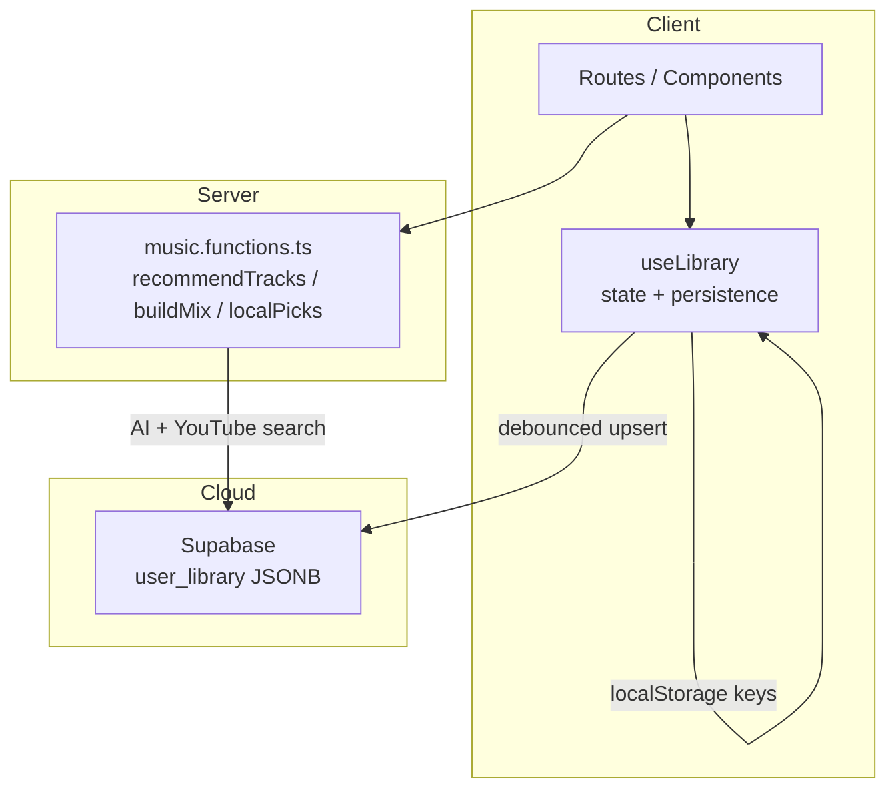
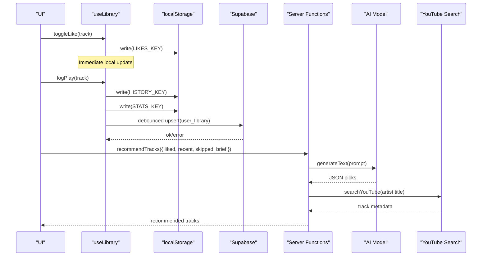
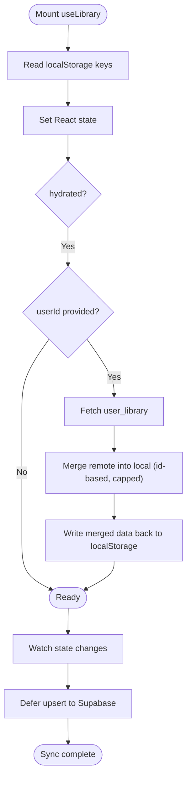
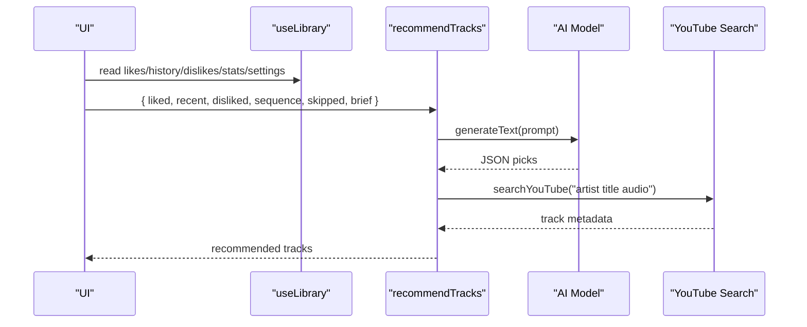
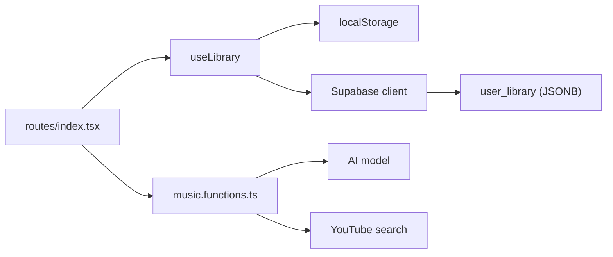

# Library Management System

<cite>
**Referenced Files in This Document**
- [library.ts](file://src/lib/library.ts)
- [music.functions.ts](file://src/lib/music.functions.ts)
- [client.ts](file://src/integrations/supabase/client.ts)
- [20260808085443_8253f78c-652e-4cb4-8772-8818ce90215c.sql](file://supabase/migrations/20260808085443_8253f78c-652e-4cb4-8772-8818ce90215c.sql)
- [index.tsx](file://src/routes/index.tsx)
</cite>

## Table of Contents
1. [Introduction](#introduction)
2. [Project Structure](#project-structure)
3. [Core Components](#core-components)
4. [Architecture Overview](#architecture-overview)
5. [Detailed Component Analysis](#detailed-component-analysis)
6. [Dependency Analysis](#dependency-analysis)
7. [Performance Considerations](#performance-considerations)
8. [Troubleshooting Guide](#troubleshooting-guide)
9. [Conclusion](#conclusion)
10. [Appendices](#appendices)

## Introduction
This document explains the library management system that powers user music collections: likes, dislikes, playlists, listening history, and behavioral stats used to inform AI recommendations. It focuses on the useLibrary hook’s state management patterns, data structures (Track, Playlist, RecSettings, Stats), CRUD operations for user preferences, behavioral tracking, persistence strategies, and integration with the recommendation engine. It also covers performance considerations for large libraries and optimization techniques for frequent updates.

## Project Structure
The library system is implemented primarily in a single module that defines types, local storage helpers, and a React hook that manages state and syncs to the cloud when a user is signed in. The recommendation engine is implemented as server functions that consume the library’s derived signals (likes, history, skips, settings) to generate personalized picks.

**Diagram sources**
- [library.ts:242-557](file://src/lib/library.ts#L242-L557)
- [music.functions.ts:58-137](file://src/lib/music.functions.ts#L58-L137)
- [client.ts:30-67](file://src/integrations/supabase/client.ts#L30-L67)
- [20260808085443_8253f78c-652e-4cb4-8772-8818ce90215c.sql:20-32](file://supabase/migrations/20260808085443_8253f78c-652e-4cb4-8772-8818ce90215c.sql#L20-L32)

**Section sources**
- [library.ts:242-557](file://src/lib/library.ts#L242-L557)
- [music.functions.ts:58-137](file://src/lib/music.functions.ts#L58-L137)
- [client.ts:30-67](file://src/integrations/supabase/client.ts#L30-L67)
- [20260808085443_8253f78c-652e-4cb4-8772-8818ce90215c.sql:20-32](file://supabase/migrations/20260808085443_8253f78c-652e-4cb4-8772-8818ce90215c.sql#L20-L32)

## Core Components
- Data models: Track, Playlist, RecSettings, PlayStat, Stats
- Persistence layer: localStorage read/write helpers and keys
- Stateful hook: useLibrary(userId?)
- Behavioral tracking: logPlay, logSkip, logComplete via bump
- Playlist CRUD: createPlaylist, renamePlaylist, deletePlaylist, addToPlaylist, removeFromPlaylist, removeManyFromPlaylist, moveTracksToPlaylist, reorderPlaylist
- Settings management: updateSettings, resetSettings
- Derived utilities: settingsToBrief, replayMix, topArtists, skippedLabels, sequenceBrief

Key responsibilities:
- Keep a consistent client-side view of the user’s library
- Persist changes immediately to localStorage
- Debounce and merge cloud sync when authenticated
- Provide pure functions to derive recommendation signals from local state

**Section sources**
- [library.ts:3-121](file://src/lib/library.ts#L3-L121)
- [library.ts:125-147](file://src/lib/library.ts#L125-L147)
- [library.ts:242-557](file://src/lib/library.ts#L242-L557)
- [library.ts:559-646](file://src/lib/library.ts#L559-L646)

## Architecture Overview
The system uses a local-first architecture:
- All mutations are applied to React state and persisted to localStorage synchronously.
- When a userId is present, the hook hydrates from Supabase and merges remote data into local arrays using id-based deduplication and size caps.
- Changes are pushed back to Supabase with a debounce to avoid excessive network calls.
- Recommendation endpoints consume derived signals (liked labels, recent history, skips, tuning brief) to call an AI model and resolve tracks via YouTube search.

**Diagram sources**
- [library.ts:242-349](file://src/lib/library.ts#L242-L349)
- [music.functions.ts:58-137](file://src/lib/music.functions.ts#L58-L137)
- [client.ts:30-67](file://src/integrations/supabase/client.ts#L30-L67)

## Detailed Component Analysis

### Data Structures
- Track: unique identifier, title, artist, duration, thumbnail, optional previewUrl and source provider
- Playlist: id, name, array of Track, createdAt timestamp
- RecSettings: mood weights, genres, languages, podcast topics, injection interval, notifications, discovery vs familiarity, energy level, instrumental-only flag
- PlayStat: per-track counters for plays, skips, completions, last interaction time
- Stats: map from track id to PlayStat

Complexity notes:
- Stats lookup by id is O(1).
- History and likes/dislikes arrays are capped at bounded sizes during merge/sync to limit memory and I/O.

**Section sources**
- [library.ts:3-21](file://src/lib/library.ts#L3-L21)
- [library.ts:68-103](file://src/lib/library.ts#L68-L103)
- [library.ts:113-121](file://src/lib/library.ts#L113-L121)

### useLibrary Hook: State Management Patterns
- Local-first state: useState for likes, dislikes, history, playlists, settings, stats; hydrated flag indicates initial load completed.
- Hydration: reads all keys from localStorage on mount and sets state.
- Cloud merge: when userId changes, fetches user_library row, merges arrays by id with limits, persists merged results locally.
- Debounced sync: useEffect watches all relevant state slices and writes to Supabase after a delay; previous timers are cleared to avoid race conditions.
- Immutability: all updates return new arrays/objects; helper functions like mergeById and mergeStats ensure stable merges.

**Diagram sources**
- [library.ts:242-349](file://src/lib/library.ts#L242-L349)

**Section sources**
- [library.ts:242-349](file://src/lib/library.ts#L242-L349)

### CRUD Operations for User Preferences
- Like/Dislike toggles:
  - toggleLike(track): removes from dislikes if present; adds/removes from likes; persists both lists.
  - toggleDislike(track): removes from likes if present; adds/removes from dislikes; persists both lists.
- History:
  - logPlay(track): prepends track to history (deduplicated), persists; increments plays stat.
  - logSkip(track): increments skips stat.
  - logComplete(track): increments completions stat.
- Playlists:
  - createPlaylist(name, tracks?): creates new playlist with unique id and timestamp.
  - renamePlaylist(id, name): updates name.
  - deletePlaylist(id): removes playlist.
  - addToPlaylist(id, track): appends if not already present.
  - removeFromPlaylist(id, trackId): removes by id.
  - removeManyFromPlaylist(id, trackIds): bulk removal.
  - moveTracksToPlaylist(fromId, toId, trackIds): moves without duplicates.
  - reorderPlaylist(id, from, to): reorders within playlist.
- Settings:
  - updateSettings(patch): merges patch into current settings and persists.
  - resetSettings(): restores defaults and persists.

All operations persist immediately to localStorage and participate in the debounced cloud sync.

**Section sources**
- [library.ts:353-528](file://src/lib/library.ts#L353-L528)

### Behavioral Tracking System
- Per-track stats tracked via bump(track, field) incrementing plays, skips, or completions and updating lastAt.
- logPlay integrates history and stats; logSkip and logComplete update stats only.
- Derived signals:
  - replayMix(stats): recent repeated listens scored by plays/completions minus skips.
  - topArtists(stats, likes): artists ranked by engagement and likes.
  - skippedLabels(stats): frequently skipped tracks as negative signals.
  - sequenceBrief(history, stats): ordered list of recent actions for prompt context.

These signals feed directly into the recommendation prompts.

**Section sources**
- [library.ts:384-411](file://src/lib/library.ts#L384-L411)
- [library.ts:593-646](file://src/lib/library.ts#L593-L646)

### Integration with Recommendation Engine
- Client composes inputs for the recommendation endpoint:
  - liked labels (from likes)
  - recent labels (from history)
  - disliked labels (from dislikes)
  - sequenceBrief (ordered behavior)
  - skippedLabels (negative signal)
  - settingsToBrief (tuning preferences)
- Server function recommendTracks builds a prompt describing the listener’s sonic profile and behavior, calls the AI model, parses JSON picks, resolves each pick to a real track via YouTube search, and returns them.
- Fallback path: if AI is unavailable, localPicks generates non-AI recommendations based on similar heuristics.

**Diagram sources**
- [index.tsx:612-650](file://src/routes/index.tsx#L612-L650)
- [music.functions.ts:58-137](file://src/lib/music.functions.ts#L58-L137)
- [library.ts:559-646](file://src/lib/library.ts#L559-L646)

**Section sources**
- [index.tsx:612-650](file://src/routes/index.tsx#L612-L650)
- [music.functions.ts:58-137](file://src/lib/music.functions.ts#L58-L137)
- [library.ts:559-646](file://src/lib/library.ts#L559-L646)

## Dependency Analysis
- useLibrary depends on:
  - React hooks (useState, useEffect, useCallback, useRef)
  - localStorage read/write helpers
  - Optional Supabase client (lazy-imported when userId is present)
- Supabase schema:
  - user_library table stores JSONB data containing likes, dislikes, history, playlists, settings, stats
  - Row-level security ensures users can only access their own data
- Recommendation server functions depend on:
  - AI gateway provider and model
  - YouTube search utilities
  - Derived helpers from library.ts for building prompts

**Diagram sources**
- [library.ts:242-349](file://src/lib/library.ts#L242-L349)
- [20260808085443_8253f78c-652e-4cb4-8772-8818ce90215c.sql:20-32](file://supabase/migrations/20260808085443_8253f78c-652e-4cb4-8772-8818ce90215c.sql#L20-L32)
- [music.functions.ts:58-137](file://src/lib/music.functions.ts#L58-L137)
- [index.tsx:612-650](file://src/routes/index.tsx#L612-L650)

**Section sources**
- [library.ts:242-349](file://src/lib/library.ts#L242-L349)
- [20260808085443_8253f78c-652e-4cb4-8772-8818ce90215c.sql:20-32](file://supabase/migrations/20260808085443_8253f78c-652e-4cb4-8772-8818ce90215c.sql#L20-L32)
- [music.functions.ts:58-137](file://src/lib/music.functions.ts#L58-L137)
- [index.tsx:612-650](file://src/routes/index.tsx#L612-L650)

## Performance Considerations
- Local-first updates: immediate state changes and localStorage writes keep UI responsive.
- Array capping:
  - Merging remote arrays caps to a fixed size to prevent unbounded growth.
  - History slice limited before upload to reduce payload size.
- Debounced sync:
  - Cloud writes are delayed to batch rapid successive updates (e.g., multiple likes).
  - Previous timers are canceled to avoid redundant writes.
- Id-based merging:
  - Uses a Set to deduplicate items efficiently while preserving order.
- Stats structure:
  - Map-by-id allows O(1) lookups and minimal object churn.
- Recommendations:
  - Prompt inputs are truncated to reasonable lengths to control token usage and latency.
  - Parallelized YouTube searches for multiple picks to reduce total wait time.

[No sources needed since this section provides general guidance]

## Troubleshooting Guide
Common issues and where to inspect:
- localStorage quota exceeded:
  - Writes catch and warn; check browser storage limits and consider reducing history length or clearing old entries.
- Sync failures:
  - Errors logged when Supabase upsert fails; verify environment variables and RLS policies.
- AI unavailability:
  - Server functions return explicit errors for rate limits or credits exhaustion; fallback to localPicks is available.
- Hydration mismatch:
  - If userId changes, the hook resets pull state; ensure components handle loading states gracefully.

**Section sources**
- [library.ts:125-143](file://src/lib/library.ts#L125-L143)
- [library.ts:321-349](file://src/lib/library.ts#L321-L349)
- [music.functions.ts:97-137](file://src/lib/music.functions.ts#L97-L137)

## Conclusion
The library management system provides a robust, local-first foundation for managing user music collections and behavioral signals. The useLibrary hook centralizes state, persistence, and cloud sync with careful attention to performance and consistency. Its derived utilities produce rich signals for the recommendation engine, which combines AI insights with practical search resolution to deliver personalized music experiences. For large libraries, the system employs array capping, id-based merging, and debounced syncing to maintain responsiveness and minimize overhead.

[No sources needed since this section summarizes without analyzing specific files]

## Appendices

### Example Workflows

- Toggle like a track:
  - Call toggleLike(track) from UI
  - State updates immediately; localStorage updated; debounced cloud sync occurs
  - Stats may be affected indirectly through subsequent play/skip/completion events

- Create and manage a playlist:
  - createPlaylist(name, tracks) to add a new playlist
  - Use addToPlaylist/removeFromPlaylist/reorderPlaylist to curate content
  - Changes persist locally and sync to cloud when authenticated

- Record listening behavior:
  - logPlay(track) on start of playback
  - logSkip(track) if user skips early
  - logComplete(track) if user listens to completion
  - These updates drive replayMix, topArtists, skippedLabels, and sequenceBrief

- Generate recommendations:
  - Compose inputs from useLibrary state and helpers
  - Call recommendTracks server function
  - Handle errors and fall back to localPicks if needed

[No sources needed since this section provides conceptual examples]