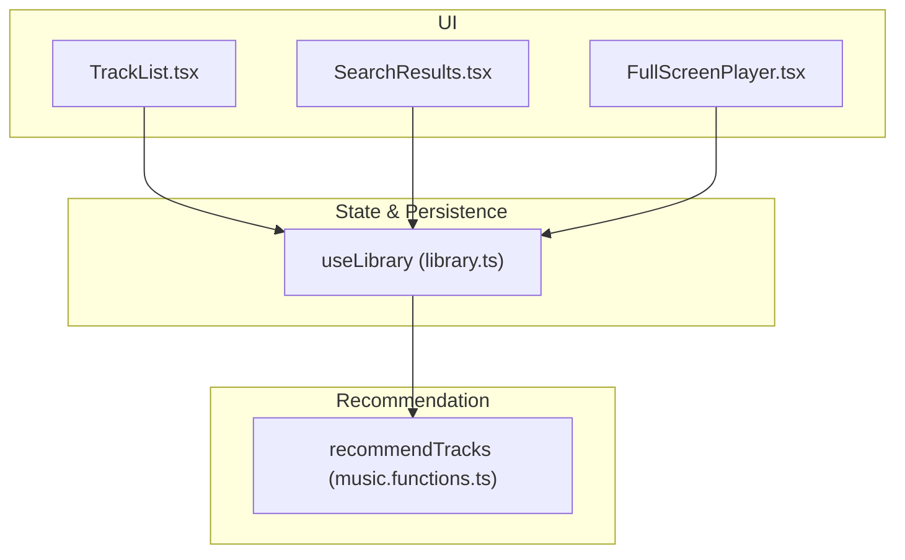
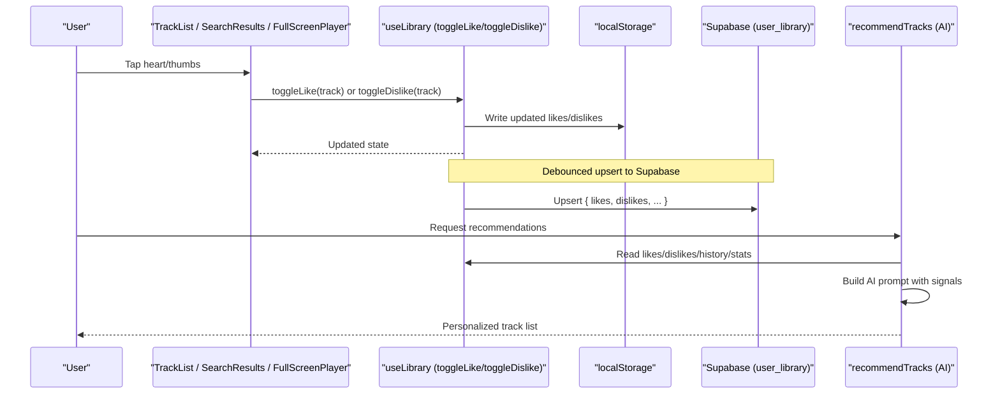
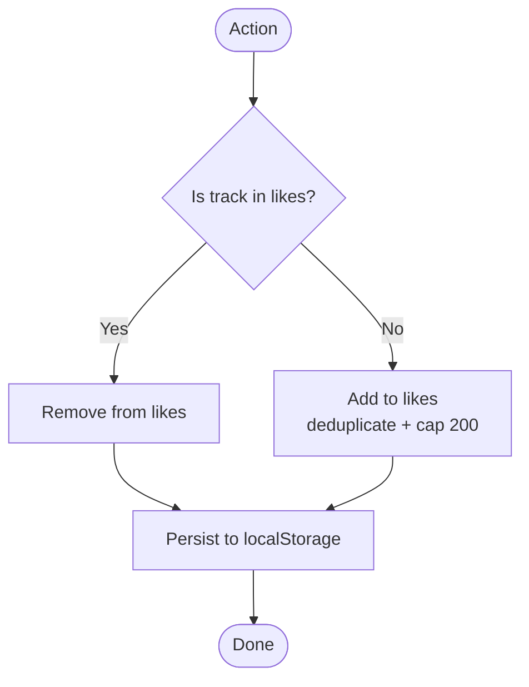
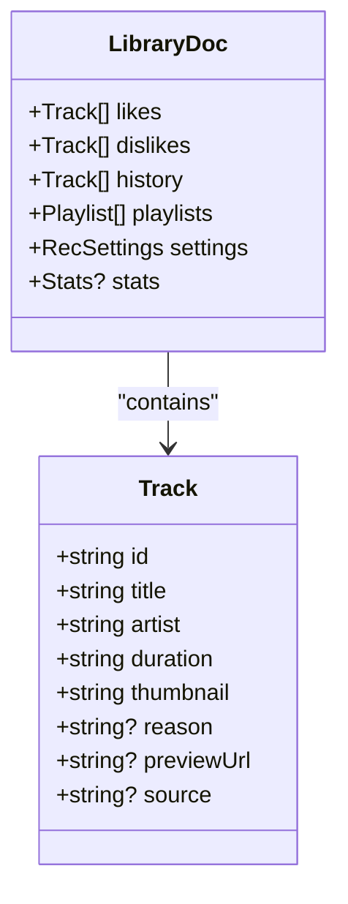
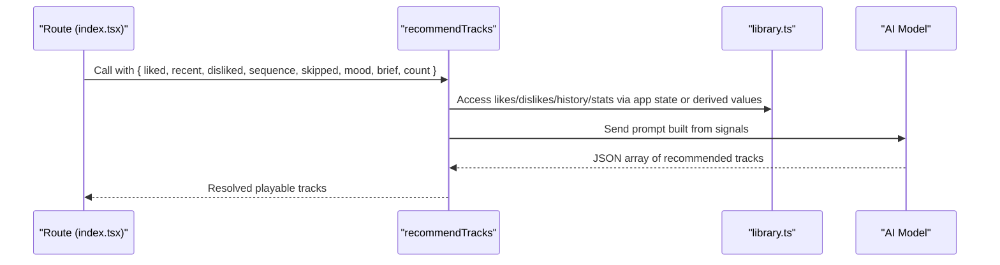
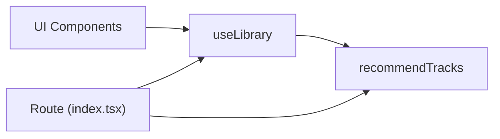

# Like/Dislike System

<cite>
**Referenced Files in This Document**
- [library.ts](file://src/lib/library.ts)
- [music.functions.ts](file://src/lib/music.functions.ts)
- [index.tsx](file://src/routes/index.tsx)
- [TrackList.tsx](file://src/components/music/TrackList.tsx)
- [SearchResults.tsx](file://src/components/music/ui/SearchResults.tsx)
- [FullScreenPlayer.tsx](file://src/components/music/ui/FullScreenPlayer.tsx)
</cite>

## Table of Contents
1. [Introduction](#introduction)
2. [Project Structure](#project-structure)
3. [Core Components](#core-components)
4. [Architecture Overview](#architecture-overview)
5. [Detailed Component Analysis](#detailed-component-analysis)
6. [Dependency Analysis](#dependency-analysis)
7. [Performance Considerations](#performance-considerations)
8. [Troubleshooting Guide](#troubleshooting-guide)
9. [Conclusion](#conclusion)

## Introduction
This document explains the like/dislike system that lets users curate their music preferences and how those actions feed behavioral signals into the AI recommendation engine. It focuses on:
- The toggleLike and toggleDislike functions that add tracks to favorites or mark them as unwanted, including automatic deduplication and size limits.
- How components interact with the library hook to update user preferences.
- How the recommendation system consumes these signals to improve future suggestions.

## Project Structure
The like/dislike functionality spans a small set of focused files:
- Library state and persistence live in the library hook.
- UI components call into the hook to update likes/dislikes.
- The recommendation server function consumes like/dislike data to build prompts for the AI model.

**Diagram sources**
- [library.ts:242-557](file://src/lib/library.ts#L242-L557)
- [music.functions.ts:47-137](file://src/lib/music.functions.ts#L47-L137)
- [TrackList.tsx:183-206](file://src/components/music/TrackList.tsx#L183-L206)
- [SearchResults.tsx:188-203](file://src/components/music/ui/SearchResults.tsx#L188-L203)
- [FullScreenPlayer.tsx:217-228](file://src/components/music/ui/FullScreenPlayer.tsx#L217-L228)

**Section sources**
- [library.ts:242-557](file://src/lib/library.ts#L242-L557)
- [music.functions.ts:47-137](file://src/lib/music.functions.ts#L47-L137)
- [index.tsx:170-196](file://src/routes/index.tsx#L170-L196)

## Core Components
- useLibrary hook: owns likes, dislikes, history, playlists, settings, stats; persists to localStorage and syncs to the user’s account when signed in. Exposes toggleLike and toggleDislike.
- UI components: TrackList, SearchResults, FullScreenPlayer render like/dislike buttons and wire them to the hook.
- Recommendation server function: recommendTracks builds an AI prompt using liked, disliked, recent, skipped, and sequence signals to generate tailored song picks.

Key behaviors:
- toggleLike toggles a track in/out of likes and removes it from dislikes.
- toggleDislike toggles a track in/out of dislikes and removes it from likes.
- Both lists are automatically deduplicated by track id and capped at 200 items.
- Changes are persisted locally and synced to the cloud with debounce.

**Section sources**
- [library.ts:353-382](file://src/lib/library.ts#L353-L382)
- [library.ts:227-236](file://src/lib/library.ts#L227-L236)
- [library.ts:321-349](file://src/lib/library.ts#L321-L349)

## Architecture Overview
The flow from user action to improved recommendations:

**Diagram sources**
- [library.ts:353-382](file://src/lib/library.ts#L353-L382)
- [library.ts:321-349](file://src/lib/library.ts#L321-L349)
- [music.functions.ts:47-137](file://src/lib/music.functions.ts#L47-L137)

## Detailed Component Analysis

### Library Hook: toggleLike and toggleDislike
- toggleLike:
  - Removes the track from dislikes if present.
  - Adds the track to likes if not already there; otherwise removes it from likes.
  - Enforces uniqueness by id and caps the list at 200 items.
  - Persists changes to localStorage immediately.
- toggleDislike:
  - Removes the track from likes if present.
  - Adds the track to dislikes if not already there; otherwise removes it from dislikes.
  - Enforces uniqueness by id and caps the list at 200 items.
  - Persists changes to localStorage immediately.

These operations also participate in the debounced cloud sync so that the user’s account copy stays consistent across devices.

**Diagram sources**
- [library.ts:353-366](file://src/lib/library.ts#L353-L366)
- [library.ts:227-236](file://src/lib/library.ts#L227-L236)

**Section sources**
- [library.ts:353-382](file://src/lib/library.ts#L353-L382)
- [library.ts:227-236](file://src/lib/library.ts#L227-L236)
- [library.ts:321-349](file://src/lib/library.ts#L321-L349)

### Data Structures and Limits
- Likes and dislikes are arrays of Track objects.
- Deduplication is by track id; duplicates are ignored during merge and write paths.
- Size limit: both lists are truncated to 200 items after updates and merges.
- History is similarly capped (recent entries limited), and stats are merged per track.

**Diagram sources**
- [library.ts:3-14](file://src/lib/library.ts#L3-L14)
- [library.ts:200-207](file://src/lib/library.ts#L200-L207)

**Section sources**
- [library.ts:200-207](file://src/lib/library.ts#L200-L207)
- [library.ts:227-236](file://src/lib/library.ts#L227-L236)

### UI Integration Examples
- TrackList renders like/dislike buttons per row and calls the provided callbacks.
- SearchResults passes onToggleLike to MediaCard, which invokes the parent callback bound to the hook.
- FullScreenPlayer exposes a heart button that triggers the like action for the current track.

Usage patterns:
- Pass toggleLike and toggleDislike from the route component (which destructures them from useLibrary).
- Bind each UI control to the corresponding callback.
- Optionally filter out disliked tracks from recommendation views after a dislike.

**Section sources**
- [TrackList.tsx:183-206](file://src/components/music/TrackList.tsx#L183-L206)
- [SearchResults.tsx:188-203](file://src/components/music/ui/SearchResults.tsx#L188-L203)
- [FullScreenPlayer.tsx:217-228](file://src/components/music/ui/FullScreenPlayer.tsx#L217-L228)
- [index.tsx:170-196](file://src/routes/index.tsx#L170-L196)

### AI Recommendation Integration
Behavioral signals used by the recommendation engine include:
- Liked songs: positive signal to find similar sonic profiles.
- Disliked songs: negative signal to avoid recommending them or very similar tracks.
- Recent listening sequence: order and actions (play, skip, completion) inform context.
- Skipped tracks: repeated skips steer away from certain sounds.
- Mood and tuning preferences: additional constraints for relevance.

The server function composes these signals into a prompt for the AI model, then resolves suggested titles/artists back to playable tracks.

**Diagram sources**
- [music.functions.ts:47-137](file://src/lib/music.functions.ts#L47-L137)
- [library.ts:242-557](file://src/lib/library.ts#L242-L557)

**Section sources**
- [music.functions.ts:47-137](file://src/lib/music.functions.ts#L47-L137)

## Dependency Analysis
- UI components depend on the library hook for state and actions.
- The route component wires UI callbacks to the hook and passes data to recommendation functions.
- The recommendation function depends on the presence of behavioral signals (likes, dislikes, history, stats) to produce personalized results.

**Diagram sources**
- [index.tsx:170-196](file://src/routes/index.tsx#L170-L196)
- [library.ts:242-557](file://src/lib/library.ts#L242-L557)
- [music.functions.ts:47-137](file://src/lib/music.functions.ts#L47-L137)

**Section sources**
- [index.tsx:170-196](file://src/routes/index.tsx#L170-L196)
- [library.ts:242-557](file://src/lib/library.ts#L242-L557)
- [music.functions.ts:47-137](file://src/lib/music.functions.ts#L47-L137)

## Performance Considerations
- Local-first writes: like/dislike updates are written to localStorage synchronously for immediate UI feedback.
- Debounced cloud sync: changes are batched and sent to the server every ~1.2 seconds to reduce network overhead.
- Deduplication and capping: merging and slicing ensure bounded memory usage and prevent duplicate entries.
- Efficient UI rendering: components memoize where appropriate and only re-render on relevant state changes.

[No sources needed since this section provides general guidance]

## Troubleshooting Guide
Common issues and checks:
- Like/dislike not persisting:
  - Verify localStorage keys are being written and read correctly.
  - Ensure the debounced sync is not cancelled unexpectedly.
- Cloud sync failures:
  - Watch for warnings about sync errors; check network connectivity and authentication.
- Duplicate entries:
  - Confirm that ids are unique per track and that merge logic runs before writes.
- Recommendations not improving:
  - Ensure likes/dislikes are populated and that the recommendation call includes these signals.
  - Validate that the AI provider is configured and available.

**Section sources**
- [library.ts:321-349](file://src/lib/library.ts#L321-L349)
- [music.functions.ts:60-110](file://src/lib/music.functions.ts#L60-L110)

## Conclusion
The like/dislike system provides a simple, robust way for users to shape their music experience. toggleLike and toggleDislike maintain clean, bounded collections of preferences that are persisted locally and synced to the cloud. These preferences become powerful behavioral signals for the AI recommendation engine, enabling more accurate and personalized suggestions over time. By integrating seamlessly with UI components and the recommendation pipeline, the system ensures that user intent directly influences future content discovery.