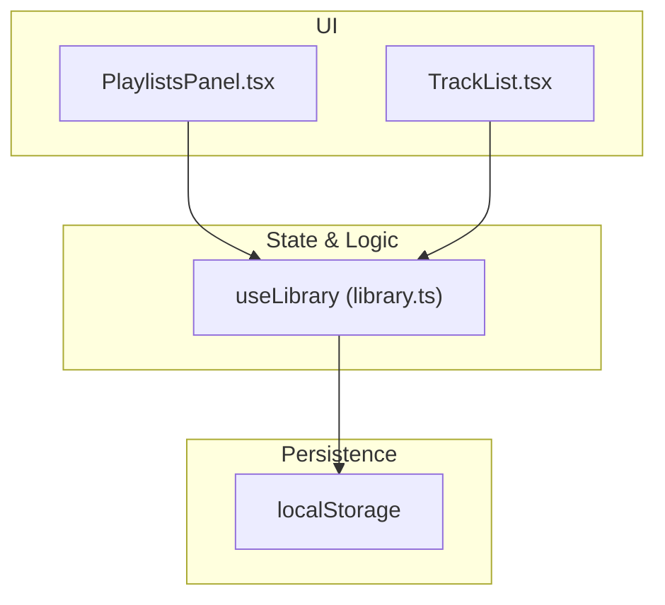
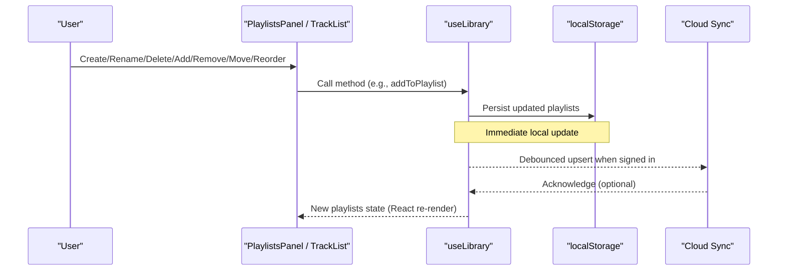
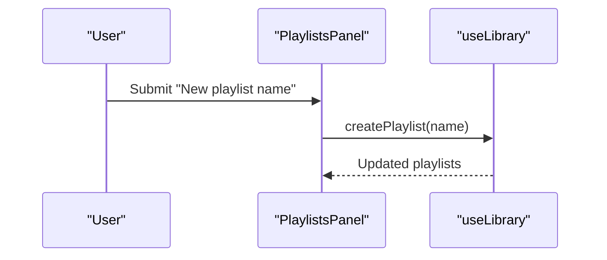
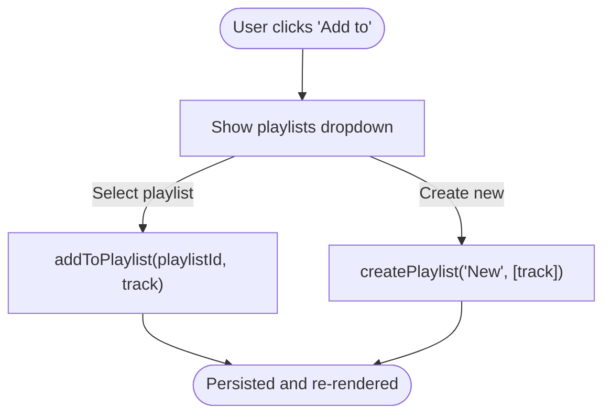
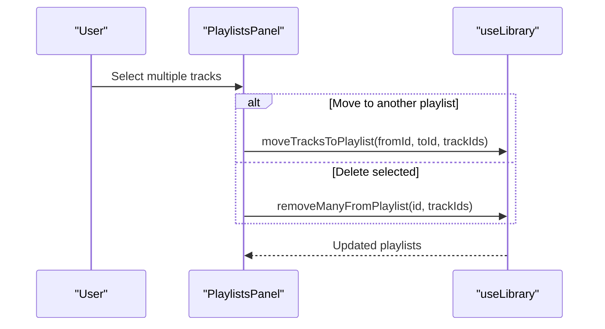
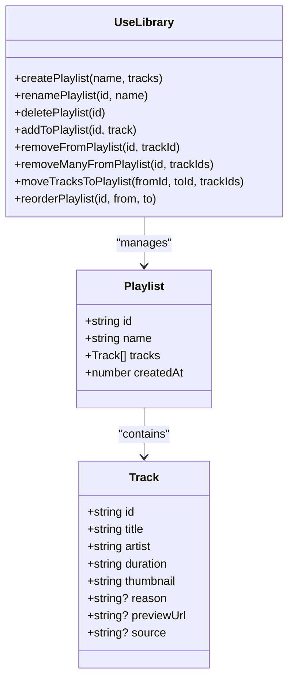

# Playlist Management

<cite>
**Referenced Files in This Document**
- [library.ts](file://src/lib/library.ts)
- [PlaylistsPanel.tsx](file://src/components/music/PlaylistsPanel.tsx)
- [TrackList.tsx](file://src/components/music/TrackList.tsx)
</cite>

## Table of Contents
1. [Introduction](#introduction)
2. [Project Structure](#project-structure)
3. [Core Components](#core-components)
4. [Architecture Overview](#architecture-overview)
5. [Detailed Component Analysis](#detailed-component-analysis)
6. [Dependency Analysis](#dependency-analysis)
7. [Performance Considerations](#performance-considerations)
8. [Troubleshooting Guide](#troubleshooting-guide)
9. [Conclusion](#conclusion)

## Introduction
This document explains the playlist management system that lets users organize their music collections. It covers all playlist operations: createPlaylist, renamePlaylist, deletePlaylist, addToPlaylist, removeFromPlaylist, removeManyFromPlaylist, moveTracksToPlaylist, and reorderPlaylist. It also documents the Playlist data structure (id, name, tracks array, createdAt timestamp), duplicate prevention for track addition, bulk operations for multiple tracks, and drag-and-drop reordering. Finally, it provides common workflow examples and performance guidance for large playlists and frequent updates.

## Project Structure
The playlist feature is implemented across a small set of focused files:
- Data model and stateful library hook: src/lib/library.ts
- Playlist UI panel with creation, editing, selection, and drag-and-drop: src/components/music/PlaylistsPanel.tsx
- Track list component that integrates adding tracks to playlists from search or other lists: src/components/music/TrackList.tsx

**Diagram sources**
- [PlaylistsPanel.tsx:16-28](file://src/components/music/PlaylistsPanel.tsx#L16-L28)
- [library.ts:422-515](file://src/lib/library.ts#L422-L515)

**Section sources**
- [library.ts:16-21](file://src/lib/library.ts#L16-L21)
- [PlaylistsPanel.tsx:16-28](file://src/components/music/PlaylistsPanel.tsx#L16-L28)
- [TrackList.tsx:24-43](file://src/components/music/TrackList.tsx#L24-L43)

## Core Components
- Playlist data model: id, name, tracks (array of Track), createdAt (timestamp).
- Library hook: useLibrary exposes playlist CRUD and manipulation methods, persists changes to localStorage, and syncs to cloud when signed in.
- PlaylistsPanel: user-facing interface to create, rename, delete playlists; add/remove tracks; select multiple tracks for bulk actions; and reorder via drag-and-drop.
- TrackList: integrates adding tracks to existing playlists or creating new ones from search results.

Key responsibilities:
- State mutation and persistence are centralized in useLibrary.
- UI components call callbacks exposed by useLibrary to perform operations.
- Duplicate prevention is enforced at the state layer during additions.

**Section sources**
- [library.ts:16-21](file://src/lib/library.ts#L16-L21)
- [library.ts:422-515](file://src/lib/library.ts#L422-L515)
- [PlaylistsPanel.tsx:61-307](file://src/components/music/PlaylistsPanel.tsx#L61-L307)
- [TrackList.tsx:24-43](file://src/components/music/TrackList.tsx#L24-L43)

## Architecture Overview
The system follows a unidirectional data flow:
- UI events trigger callbacks bound to useLibrary methods.
- useLibrary updates local state and writes to localStorage.
- When signed in, changes are debounced and synced to the user’s account.

**Diagram sources**
- [library.ts:238-349](file://src/lib/library.ts#L238-L349)
- [library.ts:422-515](file://src/lib/library.ts#L422-L515)
- [PlaylistsPanel.tsx:61-307](file://src/components/music/PlaylistsPanel.tsx#L61-L307)

## Detailed Component Analysis

### Playlist Data Model
- Playlist:
  - id: unique string identifier
  - name: display name
  - tracks: array of Track objects
  - createdAt: numeric timestamp
- Track: includes id, title, artist, duration, thumbnail, optional previewUrl and source provider.

Complexity notes:
- Track lookup within a playlist uses linear scan per operation; acceptable for typical sizes but can be optimized for very large playlists.

**Section sources**
- [library.ts:3-21](file://src/lib/library.ts#L3-L21)

### Playlist Operations

#### createPlaylist(name, tracks?)
- Creates a new playlist with a generated id and current timestamp.
- Prepends to the playlist list and persists immediately.
- Returns the created playlist object.

Typical usage:
- From a form input in PlaylistsPanel or from TrackList “New playlist…” action.

**Section sources**
- [library.ts:430-437](file://src/lib/library.ts#L430-L437)
- [PlaylistsPanel.tsx:63-82](file://src/components/music/PlaylistsPanel.tsx#L63-L82)
- [TrackList.tsx:231-237](file://src/components/music/TrackList.tsx#L231-L237)

#### renamePlaylist(id, name)
- Updates the name of an existing playlist by id.
- Persists change immediately.

**Section sources**
- [library.ts:439-443](file://src/lib/library.ts#L439-L443)
- [PlaylistsPanel.tsx:112-118](file://src/components/music/PlaylistsPanel.tsx#L112-L118)

#### deletePlaylist(id)
- Removes a playlist by id.
- Persists change immediately.

**Section sources**
- [library.ts:445-448](file://src/lib/library.ts#L445-L448)
- [PlaylistsPanel.tsx:129-139](file://src/components/music/PlaylistsPanel.tsx#L129-L139)

#### addToPlaylist(id, track)
- Adds a single track to a playlist if not already present (duplicate prevention by track.id).
- Appends to the end of the tracks array.
- Persists change immediately.

Duplicate prevention detail:
- Checks existing tracks for matching id before insertion.

**Section sources**
- [library.ts:450-460](file://src/lib/library.ts#L450-L460)

#### removeFromPlaylist(id, trackId)
- Removes a single track by id from a playlist.
- Persists change immediately.

**Section sources**
- [library.ts:462-470](file://src/lib/library.ts#L462-L470)
- [PlaylistsPanel.tsx:291-298](file://src/components/music/PlaylistsPanel.tsx#L291-L298)

#### removeManyFromPlaylist(id, trackIds[])
- Bulk removal of multiple tracks by ids from a playlist.
- Uses filter to exclude any matching ids.
- Persists change immediately.

**Section sources**
- [library.ts:472-480](file://src/lib/library.ts#L472-L480)
- [PlaylistsPanel.tsx:193-203](file://src/components/music/PlaylistsPanel.tsx#L193-L203)

#### moveTracksToPlaylist(fromId, toId, trackIds[])
- Moves selected tracks from one playlist to another without duplicates.
- Removes tracks from source playlist and appends only non-duplicate tracks to destination.
- If fromId equals toId, no-op.
- Persists change immediately.

**Section sources**
- [library.ts:482-500](file://src/lib/library.ts#L482-L500)
- [PlaylistsPanel.tsx:167-191](file://src/components/music/PlaylistsPanel.tsx#L167-L191)

#### reorderPlaylist(id, from, to)
- Reorders tracks within a playlist using drag-and-drop indices.
- Splices the moved track from its original index and inserts at target index.
- Persists change immediately.

Drag-and-drop behavior:
- Handled in PlaylistsPanel with onDragStart/onDragOver/onDrop events.
- Calls onReorder callback which maps to reorderPlaylist.

**Section sources**
- [library.ts:502-515](file://src/lib/library.ts#L502-L515)
- [PlaylistsPanel.tsx:219-237](file://src/components/music/PlaylistsPanel.tsx#L219-L237)

### UI Integration and Workflows

#### Creating a new playlist
- User types a name and submits the form in PlaylistsPanel.
- Triggers createPlaylist with the provided name and empty tracks.
- The new playlist appears at the top of the list.

**Diagram sources**
- [PlaylistsPanel.tsx:63-82](file://src/components/music/PlaylistsPanel.tsx#L63-L82)
- [library.ts:430-437](file://src/lib/library.ts#L430-L437)

**Section sources**
- [PlaylistsPanel.tsx:63-82](file://src/components/music/PlaylistsPanel.tsx#L63-L82)
- [library.ts:430-437](file://src/lib/library.ts#L430-L437)

#### Adding tracks from search results
- In TrackList, each track has an “Add to” menu that lists existing playlists and an option to create a new playlist with this track.
- Selecting a playlist calls addToPlaylist with the track.
- Duplicate prevention ensures the same track cannot be added twice.

**Diagram sources**
- [TrackList.tsx:228-237](file://src/components/music/TrackList.tsx#L228-L237)
- [library.ts:430-460](file://src/lib/library.ts#L430-L460)

**Section sources**
- [TrackList.tsx:228-237](file://src/components/music/TrackList.tsx#L228-L237)
- [library.ts:430-460](file://src/lib/library.ts#L430-L460)

#### Organizing existing collections
- Bulk selection in PlaylistsPanel allows moving multiple tracks between playlists or deleting them in one action.
- Drag handles enable intuitive reordering of tracks within a playlist.

**Diagram sources**
- [PlaylistsPanel.tsx:142-203](file://src/components/music/PlaylistsPanel.tsx#L142-L203)
- [library.ts:472-500](file://src/lib/library.ts#L472-L500)

**Section sources**
- [PlaylistsPanel.tsx:142-203](file://src/components/music/PlaylistsPanel.tsx#L142-L203)
- [library.ts:472-500](file://src/lib/library.ts#L472-L500)

### Class Diagram of Key Types and Methods

**Diagram sources**
- [library.ts:3-21](file://src/lib/library.ts#L3-L21)
- [library.ts:430-515](file://src/lib/library.ts#L430-L515)

## Dependency Analysis
- PlaylistsPanel depends on:
  - Props for playlist data and callbacks (onCreate, onRename, onDelete, onRemoveTrack, onRemoveMany, onMoveMany, onReorder, onPlay).
  - Local state for selection and drag-and-drop interactions.
- TrackList depends on:
  - Callbacks to add tracks to playlists or create new playlists.
- useLibrary centralizes:
  - All playlist mutations and persistence.
  - Optional cloud sync when signed in.

Coupling and cohesion:
- High cohesion within useLibrary for playlist logic.
- Low coupling between UI and state via explicit callbacks.
- No circular dependencies observed.

External integrations:
- localStorage for persistence.
- Supabase client for cloud sync when userId is present.

**Section sources**
- [PlaylistsPanel.tsx:16-28](file://src/components/music/PlaylistsPanel.tsx#L16-L28)
- [library.ts:238-349](file://src/lib/library.ts#L238-L349)
- [library.ts:422-515](file://src/lib/library.ts#L422-L515)

## Performance Considerations
- Duplicate checks:
  - addToPlaylist uses linear scan to prevent duplicates. For very large playlists, consider indexing by track id for O(1) lookups.
- Bulk operations:
  - removeManyFromPlaylist filters by trackIds; ensure trackIds arrays are reasonably sized. Using a Set for lookups can improve performance for large selections.
- Reordering:
  - reorderPlaylist splices arrays; this is efficient for moderate sizes. For extremely large playlists, consider virtualization or chunked updates.
- Persistence:
  - Each mutation writes to localStorage immediately. For high-frequency updates, batch or debounce writes to reduce I/O overhead.
- Cloud sync:
  - Changes are debounced when syncing to avoid excessive network requests. Keep payload size reasonable by limiting history and stats slices.

Optimization techniques:
- Maintain a map of track ids per playlist for faster duplicate checks and bulk removals.
- Virtualize long track lists in UI to reduce render cost.
- Batch multiple UI actions into a single state update where possible.
- Limit initial load of heavy metadata; lazy-load thumbnails and previews.

[No sources needed since this section provides general guidance]

## Troubleshooting Guide
Common issues and resolutions:
- Duplicate tracks appear after adding:
  - Verify addToPlaylist is used and that track ids are unique. Check for inconsistent track objects with different ids representing the same song.
- Bulk actions do nothing:
  - Ensure trackIds passed to removeManyFromPlaylist or moveTracksToPlaylist match the actual ids in the playlist.
- Reorder not persisting:
  - Confirm onReorder is wired to reorderPlaylist and that the correct playlist id is passed.
- Sync failures:
  - Check console warnings for sync errors; verify network connectivity and authentication status.

**Section sources**
- [library.ts:450-515](file://src/lib/library.ts#L450-L515)
- [PlaylistsPanel.tsx:167-203](file://src/components/music/PlaylistsPanel.tsx#L167-L203)
- [PlaylistsPanel.tsx:219-237](file://src/components/music/PlaylistsPanel.tsx#L219-L237)

## Conclusion
The playlist management system provides a complete set of operations to create, edit, and curate playlists with robust duplicate prevention, bulk actions, and drag-and-drop reordering. The architecture keeps state and persistence centralized in useLibrary while exposing clean callbacks to UI components. For large-scale usage, consider optimizing duplicate checks and bulk operations with indexed structures and virtualized rendering to maintain responsiveness.