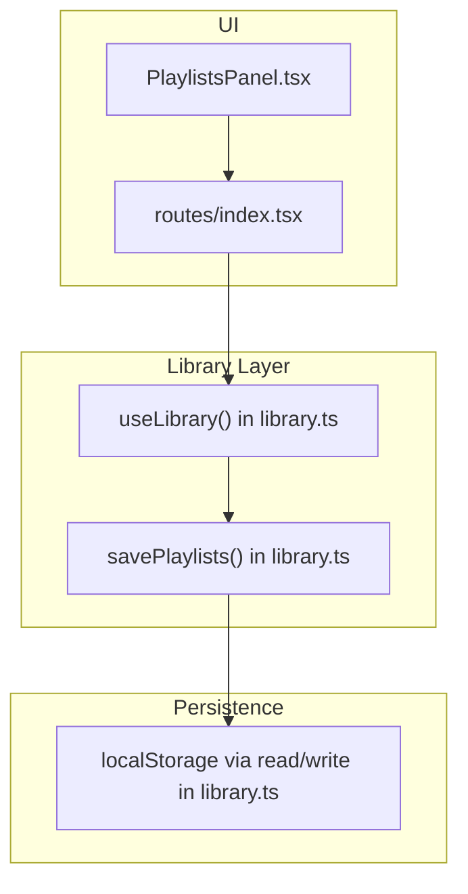
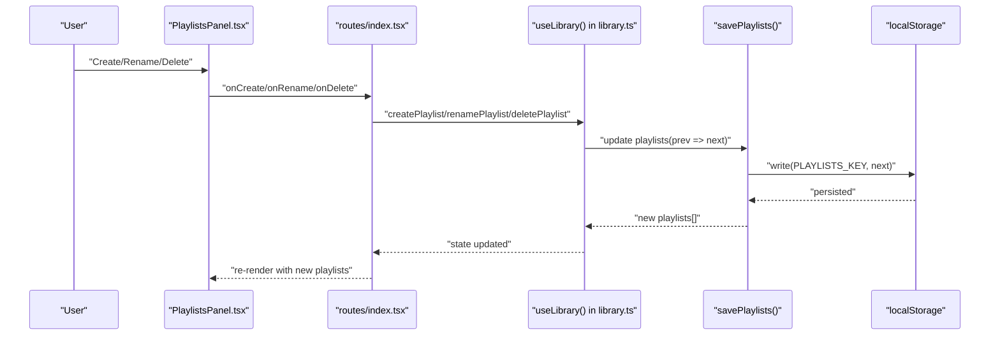
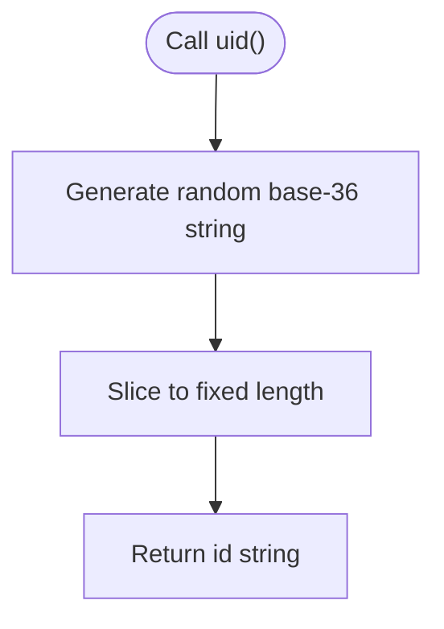
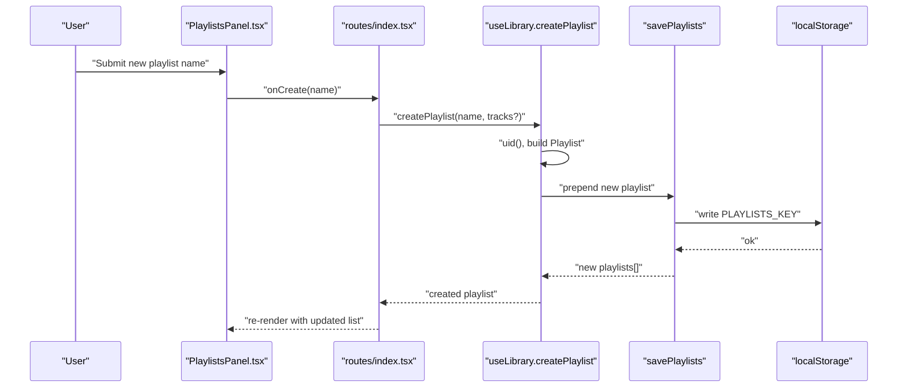
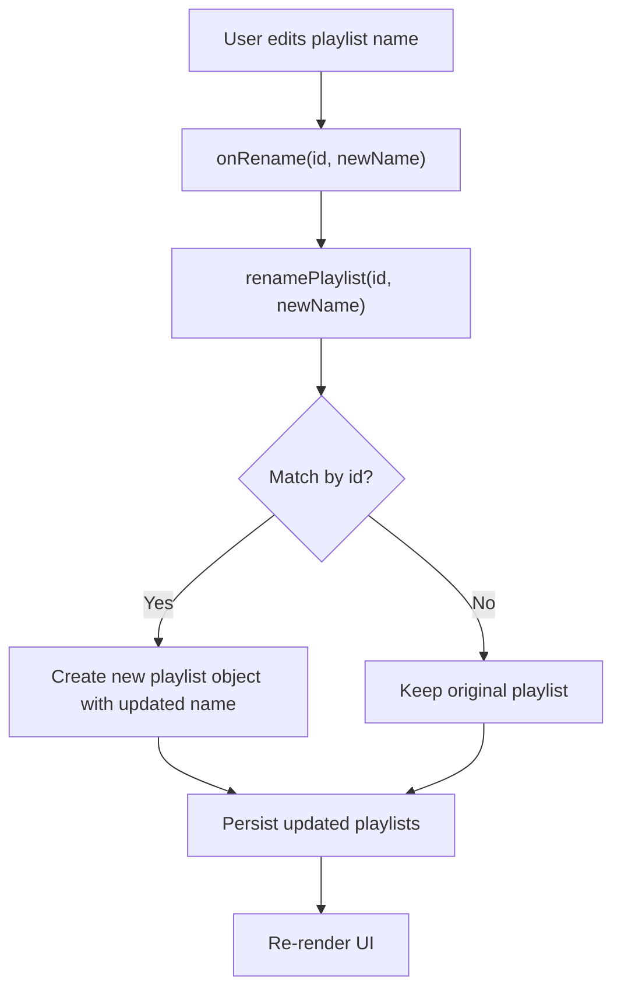
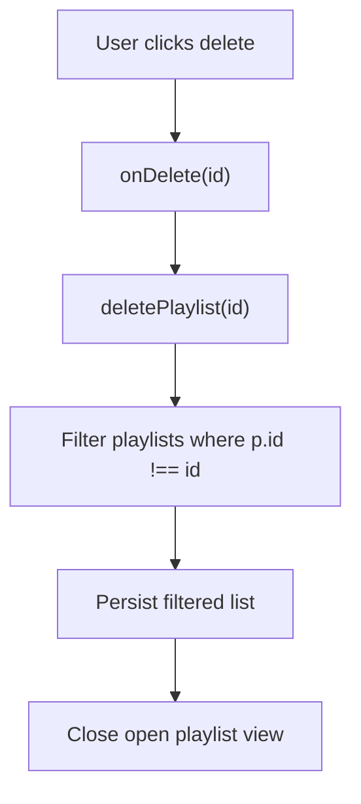
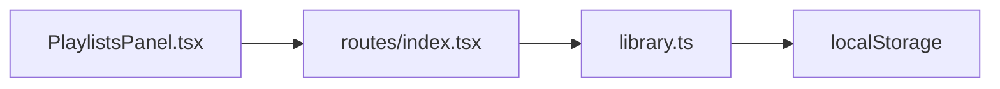

# Playlist Operations

<cite>
**Referenced Files in This Document**
- [library.ts](file://src/lib/library.ts)
- [PlaylistsPanel.tsx](file://src/components/music/PlaylistsPanel.tsx)
- [index.tsx](file://src/routes/index.tsx)
</cite>

## Table of Contents
1. [Introduction](#introduction)
2. [Project Structure](#project-structure)
3. [Core Components](#core-components)
4. [Architecture Overview](#architecture-overview)
5. [Detailed Component Analysis](#detailed-component-analysis)
6. [Dependency Analysis](#dependency-analysis)
7. [Performance Considerations](#performance-considerations)
8. [Troubleshooting Guide](#troubleshooting-guide)
9. [Conclusion](#conclusion)

## Introduction
This document explains the playlist CRUD operations implemented in the application: createPlaylist, renamePlaylist, and deletePlaylist. It covers the Playlist data model (id, name, tracks array, createdAt timestamp), how unique IDs are generated with uid(), immutable update patterns for renaming, and filtering-based deletion by ID. Practical usage examples and error handling considerations are included to guide correct integration.

## Project Structure
The playlist functionality is centered around a local-first library hook that manages state and persistence, and a UI panel that exposes user actions. The route component wires these together.

**Diagram sources**
- [library.ts:422-448](file://src/lib/library.ts#L422-L448)
- [PlaylistsPanel.tsx:63-82](file://src/components/music/PlaylistsPanel.tsx#L63-L82)
- [index.tsx:180-196](file://src/routes/index.tsx#L180-L196)

**Section sources**
- [library.ts:16-21](file://src/lib/library.ts#L16-L21)
- [library.ts:125-147](file://src/lib/library.ts#L125-L147)
- [library.ts:422-448](file://src/lib/library.ts#L422-L448)
- [PlaylistsPanel.tsx:16-29](file://src/components/music/PlaylistsPanel.tsx#L16-L29)
- [index.tsx:180-196](file://src/routes/index.tsx#L180-L196)

## Core Components
- Playlist data structure: id (string), name (string), tracks (Track[]), createdAt (number).
- ID generation: uid() produces short random identifiers used as playlist ids.
- State and persistence: savePlaylists updates React state and persists playlists to localStorage under a dedicated key.
- CRUD functions:
  - createPlaylist(name, tracks?) creates a new playlist with a unique id and timestamp, prepends it to the list, and returns the created object.
  - renamePlaylist(id, name) performs an immutable update that preserves all other fields including tracks.
  - deletePlaylist(id) removes the playlist whose id matches the given id.

**Section sources**
- [library.ts:16-21](file://src/lib/library.ts#L16-L21)
- [library.ts:145-147](file://src/lib/library.ts#L145-L147)
- [library.ts:422-448](file://src/lib/library.ts#L422-L448)

## Architecture Overview
The flow from UI to storage for playlist operations is consistent:
- UI triggers callbacks (create, rename, delete).
- The route passes these to useLibrary, which provides the actual implementations.
- Each operation uses savePlaylists to compute a new array immutably and persist it.

**Diagram sources**
- [PlaylistsPanel.tsx:63-82](file://src/components/music/PlaylistsPanel.tsx#L63-L82)
- [index.tsx:180-196](file://src/routes/index.tsx#L180-L196)
- [library.ts:422-448](file://src/lib/library.ts#L422-L448)

## Detailed Component Analysis

### Playlist Data Model
- id: string — unique identifier for the playlist.
- name: string — display name.
- tracks: Track[] — ordered list of tracks associated with the playlist.
- createdAt: number — timestamp when the playlist was created.

Complexity notes:
- Creating a playlist is O(1) aside from persistence serialization.
- Renaming is O(n) over playlists due to mapping; track arrays remain unchanged.
- Deleting is O(n) over playlists due to filtering.

**Section sources**
- [library.ts:16-21](file://src/lib/library.ts#L16-L21)

### Unique ID Generation with uid()
- uid() generates a short random string using Math.random().toString(36) and slicing to produce a compact id suitable for client-side uniqueness.
- Used by createPlaylist to assign a unique id to each new playlist.

**Diagram sources**
- [library.ts:145-147](file://src/lib/library.ts#L145-L147)

**Section sources**
- [library.ts:145-147](file://src/lib/library.ts#L145-L147)

### createPlaylist(name, tracks?)
Behavior:
- Creates a new Playlist object with:
  - id from uid()
  - name provided
  - tracks initialized from the optional argument (defaults to empty array)
  - createdAt set to current time
- Prepends the new playlist to the existing list.
- Persists the updated list to localStorage.
- Returns the newly created playlist object.

Usage pattern:
- UI form collects a non-empty name and calls createPlaylist(name).
- Optional initial tracks can be passed if creating from a single track or batch.

Error handling considerations:
- Ensure name is trimmed and non-empty before calling createPlaylist.
- If tracks are provided, ensure they are valid Track objects.

Practical example references:
- Form submission handler that validates input and invokes createPlaylist.
- Passing a single track as the initial tracks array.

**Section sources**
- [library.ts:430-437](file://src/lib/library.ts#L430-L437)
- [PlaylistsPanel.tsx:63-82](file://src/components/music/PlaylistsPanel.tsx#L63-L82)
- [index.tsx:1177-1194](file://src/routes/index.tsx#L1177-L1194)

### renamePlaylist(id, name)
Behavior:
- Immutable update: maps over playlists and replaces only the matching playlist’s name while preserving its tracks and other fields.
- Persists the new playlists array.

Immutability highlights:
- Uses spread to create a new object for the matched playlist.
- Does not mutate existing playlist references.

Usage pattern:
- Inline editing of playlist name in the UI triggers onRename with the playlist id and new name.

Error handling considerations:
- Validate that the id exists before updating.
- Trim and validate the new name to avoid empty or whitespace-only names.

Practical example references:
- Input field bound to onRename for live updates.

**Section sources**
- [library.ts:439-443](file://src/lib/library.ts#L439-L443)
- [PlaylistsPanel.tsx:110-118](file://src/components/music/PlaylistsPanel.tsx#L110-L118)

### deletePlaylist(id)
Behavior:
- Filters out the playlist whose id equals the provided id.
- Persists the filtered list.

Filtering mechanism:
- Uses Array.filter to keep all playlists except the one with the matching id.

Usage pattern:
- Delete button in the UI calls onDelete with the playlist id.

Error handling considerations:
- Confirm deletion to prevent accidental loss.
- After deletion, close any open view of the deleted playlist.

Practical example references:
- Delete action in the playlist header area.

**Section sources**
- [library.ts:445-448](file://src/lib/library.ts#L445-L448)
- [PlaylistsPanel.tsx:129-139](file://src/components/music/PlaylistsPanel.tsx#L129-L139)

### End-to-End Flow Diagrams

#### Create Playlist Sequence

**Diagram sources**
- [PlaylistsPanel.tsx:63-82](file://src/components/music/PlaylistsPanel.tsx#L63-L82)
- [library.ts:430-437](file://src/lib/library.ts#L430-L437)
- [library.ts:422-428](file://src/lib/library.ts#L422-L428)

#### Rename Playlist Flow

**Diagram sources**
- [library.ts:439-443](file://src/lib/library.ts#L439-L443)
- [PlaylistsPanel.tsx:110-118](file://src/components/music/PlaylistsPanel.tsx#L110-L118)

#### Delete Playlist Flow

**Diagram sources**
- [library.ts:445-448](file://src/lib/library.ts#L445-L448)
- [PlaylistsPanel.tsx:129-139](file://src/components/music/PlaylistsPanel.tsx#L129-L139)

## Dependency Analysis
- PlaylistsPanel depends on:
  - Props for CRUD callbacks (onCreate, onRename, onDelete).
  - Types Playlist and Track imported from library.ts.
- routes/index.tsx:
  - Destructures createPlaylist, renamePlaylist, deletePlaylist from useLibrary and forwards them to PlaylistsPanel.
- library.ts:
  - Provides uid(), savePlaylists, and the three CRUD functions.
  - Persists to localStorage via read/write helpers.

**Diagram sources**
- [PlaylistsPanel.tsx:13-29](file://src/components/music/PlaylistsPanel.tsx#L13-L29)
- [index.tsx:180-196](file://src/routes/index.tsx#L180-L196)
- [library.ts:125-147](file://src/lib/library.ts#L125-L147)
- [library.ts:422-448](file://src/lib/library.ts#L422-L448)

**Section sources**
- [PlaylistsPanel.tsx:13-29](file://src/components/music/PlaylistsPanel.tsx#L13-L29)
- [index.tsx:180-196](file://src/routes/index.tsx#L180-L196)
- [library.ts:125-147](file://src/lib/library.ts#L125-L147)
- [library.ts:422-448](file://src/lib/library.ts#L422-L448)

## Performance Considerations
- createPlaylist: O(1) update plus persistence cost; minimal overhead.
- renamePlaylist: O(n) over playlists due to map; safe for typical playlist counts.
- deletePlaylist: O(n) over playlists due to filter; efficient for moderate sizes.
- Persistence: All changes write to localStorage synchronously; consider batching or debouncing if performing many rapid updates.

[No sources needed since this section provides general guidance]

## Troubleshooting Guide
Common issues and mitigations:
- Empty or invalid playlist names:
  - Validate and trim input before calling createPlaylist or renamePlaylist.
  - Prevent submission if name is blank.
- Duplicate or missing playlist ids:
  - Ensure you pass the correct id to renamePlaylist and deletePlaylist.
  - Verify that the playlist exists before attempting rename/delete.
- Unexpected state after operations:
  - Confirm that savePlaylists is invoked through the provided hooks and not bypassed.
  - Check localStorage keys for corruption or quota errors; the code logs warnings on failures.

Operational tips:
- Always confirm destructive actions like deletePlaylist.
- Close any open playlist view after deletion to avoid stale references.
- When adding initial tracks to createPlaylist, ensure they conform to the Track type.

**Section sources**
- [library.ts:125-143](file://src/lib/library.ts#L125-L143)
- [library.ts:430-448](file://src/lib/library.ts#L430-L448)
- [PlaylistsPanel.tsx:63-82](file://src/components/music/PlaylistsPanel.tsx#L63-L82)
- [PlaylistsPanel.tsx:129-139](file://src/components/music/PlaylistsPanel.tsx#L129-L139)

## Conclusion
The playlist CRUD operations are implemented with clear separation between UI and library logic, leveraging immutable updates and persistent storage. createPlaylist generates unique ids via uid() and initializes playlists with optional tracks. renamePlaylist updates names without altering tracks, and deletePlaylist removes playlists by id using filtering. Following the usage patterns and error handling guidelines ensures robust and predictable behavior across the application.