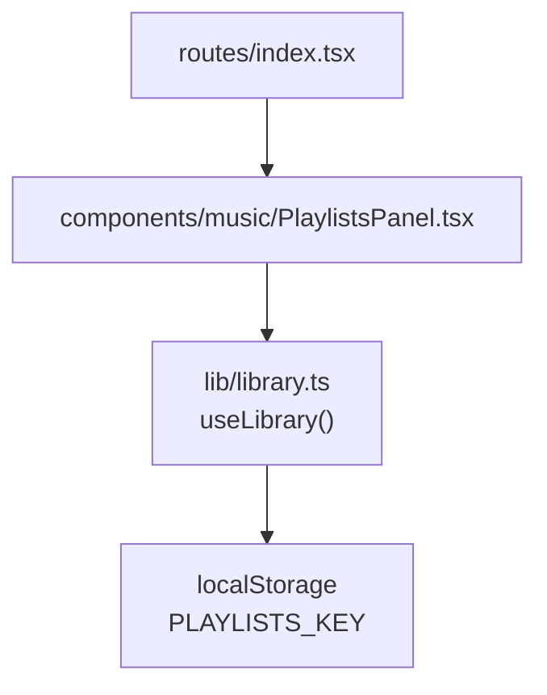
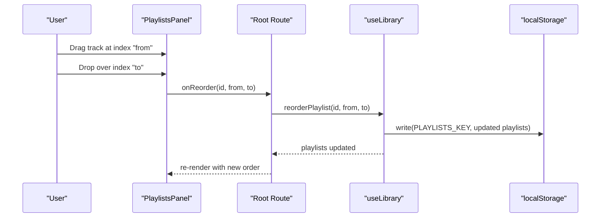
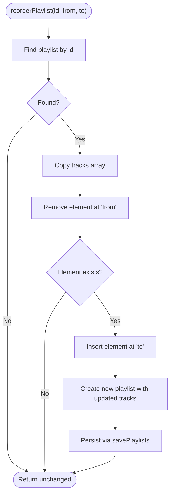
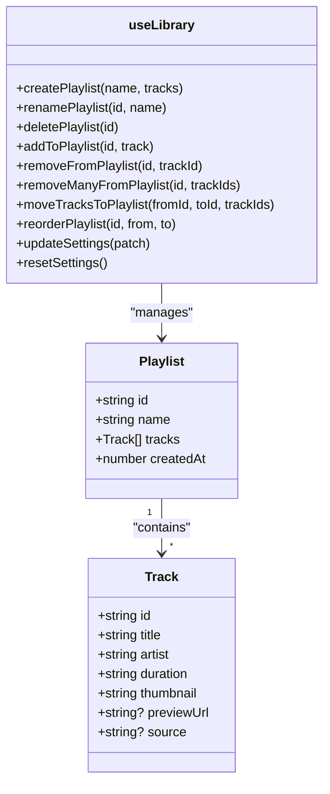

# Playlist Reordering

<cite>
**Referenced Files in This Document**
- [library.ts](file://src/lib/library.ts)
- [PlaylistsPanel.tsx](file://src/components/music/PlaylistsPanel.tsx)
- [index.tsx](file://src/routes/index.tsx)
</cite>

## Table of Contents
1. [Introduction](#introduction)
2. [Project Structure](#project-structure)
3. [Core Components](#core-components)
4. [Architecture Overview](#architecture-overview)
5. [Detailed Component Analysis](#detailed-component-analysis)
6. [Dependency Analysis](#dependency-analysis)
7. [Performance Considerations](#performance-considerations)
8. [Troubleshooting Guide](#troubleshooting-guide)
9. [Conclusion](#conclusion)
10. [Appendices](#appendices)

## Introduction
This document explains the playlist reordering feature that enables drag-and-drop movement of tracks within a playlist. It focuses on the reorderPlaylist function, which moves a track from a source index to a target index using array splice operations. The documentation covers the function signature, data flow, UI integration, edge cases, and performance considerations for large playlists.

## Project Structure
The reordering feature spans three main areas:
- State and persistence logic in the library hook
- Drag-and-drop UI in the playlists panel
- Wiring of callbacks in the root route

**Diagram sources**
- [index.tsx:1190-1200](file://src/routes/index.tsx#L1190-L1200)
- [PlaylistsPanel.tsx:215-237](file://src/components/music/PlaylistsPanel.tsx#L215-L237)
- [library.ts:422-428](file://src/lib/library.ts#L422-L428)
- [library.ts:502-515](file://src/lib/library.ts#L502-L515)

**Section sources**
- [index.tsx:1190-1200](file://src/routes/index.tsx#L1190-L1200)
- [PlaylistsPanel.tsx:215-237](file://src/components/music/PlaylistsPanel.tsx#L215-L237)
- [library.ts:422-428](file://src/lib/library.ts#L422-L428)
- [library.ts:502-515](file://src/lib/library.ts#L502-L515)

## Core Components
- reorderPlaylist(id, from, to): Moves a single track within a playlist by removing it at from and inserting it at to.
- savePlaylists(updater): Centralized state updater that persists changes to localStorage.
- PlaylistsPanel: Renders each track as draggable and calls onReorder with the correct indices when a drop occurs.
- Root route wiring: Passes reorderPlaylist into the playlists panel via onReorder.

Key responsibilities:
- Library layer performs immutable updates and persists to storage.
- UI layer captures drag events and computes indices.
- Route layer connects UI to library methods.

**Section sources**
- [library.ts:502-515](file://src/lib/library.ts#L502-L515)
- [library.ts:422-428](file://src/lib/library.ts#L422-L428)
- [PlaylistsPanel.tsx:215-237](file://src/components/music/PlaylistsPanel.tsx#L215-L237)
- [index.tsx:1190-1200](file://src/routes/index.tsx#L1190-L1200)

## Architecture Overview
The reordering flow is event-driven:
1. User drags a track row and drops it onto another row.
2. The panel computes from (drag start index) and to (drop target index).
3. onReorder is invoked with id, from, to.
4. reorderPlaylist updates the playlist immutably and persists to localStorage.
5. React re-renders with the new order.

**Diagram sources**
- [PlaylistsPanel.tsx:215-237](file://src/components/music/PlaylistsPanel.tsx#L215-L237)
- [index.tsx:1190-1200](file://src/routes/index.tsx#L1190-L1200)
- [library.ts:422-428](file://src/lib/library.ts#L422-L428)
- [library.ts:502-515](file://src/lib/library.ts#L502-L515)

## Detailed Component Analysis

### reorderPlaylist Function
Purpose:
- Move a track from one position to another within a specific playlist.

Signature:
- Parameters:
  - id: string — playlist identifier
  - from: number — source index of the track to move
  - to: number — target index where the track should be inserted

Behavior:
- Finds the matching playlist by id.
- Creates a shallow copy of its tracks array.
- Removes the track at from using splice(from, 1).
- Inserts the removed track at to using splice(to, 0, moved).
- Returns a new playlist object with the updated tracks array.
- Persists the change via savePlaylists.

Edge case handling:
- If the playlist id does not match, no changes are made.
- If the track at from does not exist (invalid index), the function returns without changes.
- Moving to the same index or adjacent positions is handled naturally by splice semantics.

Complexity:
- Time: O(n) due to mapping over playlists; within the matched playlist, splice operations are O(k) where k is the number of tracks after the insertion point.
- Space: O(k) for creating a copy of the tracks array for the matched playlist.

Integration points:
- Called by the playlists panel via onReorder.
- Persists through savePlaylists to localStorage.

**Section sources**
- [library.ts:502-515](file://src/lib/library.ts#L502-L515)
- [library.ts:422-428](file://src/lib/library.ts#L422-L428)

#### Algorithm Flowchart

**Diagram sources**
- [library.ts:502-515](file://src/lib/library.ts#L502-L515)
- [library.ts:422-428](file://src/lib/library.ts#L422-L428)

### Drag-and-Drop UI Integration
The playlists panel implements native HTML drag-and-drop:
- Each track row is marked draggable.
- onDragStart records the source index.
- onDragOver prevents default and highlights the target row.
- onDrop validates that from differs from to and calls onReorder(open.id, dragIndex, index).

This design ensures minimal dependencies and straightforward integration.

Example usage pattern:
- When a user drags a track from index 2 to index 5, the panel invokes onReorder with from=2 and to=5.
- The root route passes reorderPlaylist as onReorder, so the library handles the update and persistence.

**Section sources**
- [PlaylistsPanel.tsx:215-237](file://src/components/music/PlaylistsPanel.tsx#L215-L237)
- [index.tsx:1190-1200](file://src/routes/index.tsx#L1190-L1200)

### Data Model Relationships

**Diagram sources**
- [library.ts:3-21](file://src/lib/library.ts#L3-L21)
- [library.ts:530-556](file://src/lib/library.ts#L530-L556)

## Dependency Analysis
- PlaylistsPanel depends on:
  - Props including onReorder(id, from, to)
  - Local state for dragIndex and overIndex
- Root route depends on:
  - useLibrary to obtain reorderPlaylist
  - Passing onReorder to PlaylistsPanel
- Library depends on:
  - savePlaylists for centralized state updates and persistence
  - localStorage for durability

Potential coupling:
- Tight coupling between UI indices and library parameters requires careful validation in the UI layer to avoid invalid indices.

External integrations:
- Optional cloud sync is triggered elsewhere in the library; reorderPlaylist participates in local-first updates that later sync if a user is signed in.

**Section sources**
- [PlaylistsPanel.tsx:215-237](file://src/components/music/PlaylistsPanel.tsx#L215-L237)
- [index.tsx:1190-1200](file://src/routes/index.tsx#L1190-L1200)
- [library.ts:422-428](file://src/lib/library.ts#L422-L428)
- [library.ts:502-515](file://src/lib/library.ts#L502-L515)

## Performance Considerations
- Array operations:
  - splice(from, 1) and splice(to, 0, moved) are efficient for small to medium playlists.
  - For very large playlists, consider virtualization or pagination to reduce render cost.
- Immutability:
  - Creating a copy of tracks per reorder avoids shared references but incurs O(k) memory allocation.
- Persistence:
  - savePlaylists writes to localStorage synchronously; frequent rapid reorders may cause repeated writes. Debouncing or batching can mitigate this if needed.
- Rendering:
  - Ensure stable keys (track.id) to minimize re-renders.
- Memory:
  - Avoid unnecessary deep copies; current approach uses shallow copy of tracks array, which is appropriate.

[No sources needed since this section provides general guidance]

## Troubleshooting Guide
Common issues and resolutions:
- No effect when dropping on the same row:
  - Expected behavior; the UI guards against calling onReorder when from equals to.
- Invalid indices:
  - If from is out of bounds, reorderPlaylist safely returns without changes. Validate indices in the UI before invoking onReorder to provide better feedback.
- Unexpected order after multiple rapid reorders:
  - Ensure UI state (dragIndex, overIndex) resets correctly on dragEnd and drop.
- Persistence failures:
  - Check localStorage quota or browser restrictions; errors are logged in the library’s write helper.

Validation tips:
- Clamp indices to valid ranges before calling onReorder.
- Guard against empty playlists or missing playlist ids.

**Section sources**
- [PlaylistsPanel.tsx:215-237](file://src/components/music/PlaylistsPanel.tsx#L215-L237)
- [library.ts:502-515](file://src/lib/library.ts#L502-L515)
- [library.ts:136-143](file://src/lib/library.ts#L136-L143)

## Conclusion
The reorderPlaylist function provides a robust, immutable way to reorder tracks within playlists using array splice operations. Combined with a simple native drag-and-drop UI, it delivers an intuitive experience while maintaining performance and persistence. Proper index validation and awareness of large playlist characteristics ensure smooth interactions across devices and datasets.

[No sources needed since this section summarizes without analyzing specific files]

## Appendices

### API Reference: reorderPlaylist
- Signature: reorderPlaylist(id: string, from: number, to: number)
- Behavior:
  - Moves the track at index from to index to within the specified playlist.
  - Updates state immutably and persists to localStorage.
- Return: None (side-effect driven via state update and persistence)

Usage example (conceptual):
- When dragging a track from index 2 to index 5:
  - Call reorderPlaylist("playlist-id", 2, 5)
- When moving to the same position:
  - Do nothing (UI already guards against this)

**Section sources**
- [library.ts:502-515](file://src/lib/library.ts#L502-L515)
- [PlaylistsPanel.tsx:215-237](file://src/components/music/PlaylistsPanel.tsx#L215-L237)
- [index.tsx:1190-1200](file://src/routes/index.tsx#L1190-L1200)