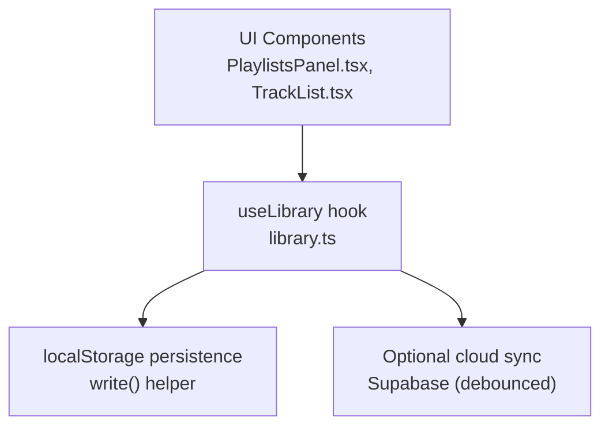
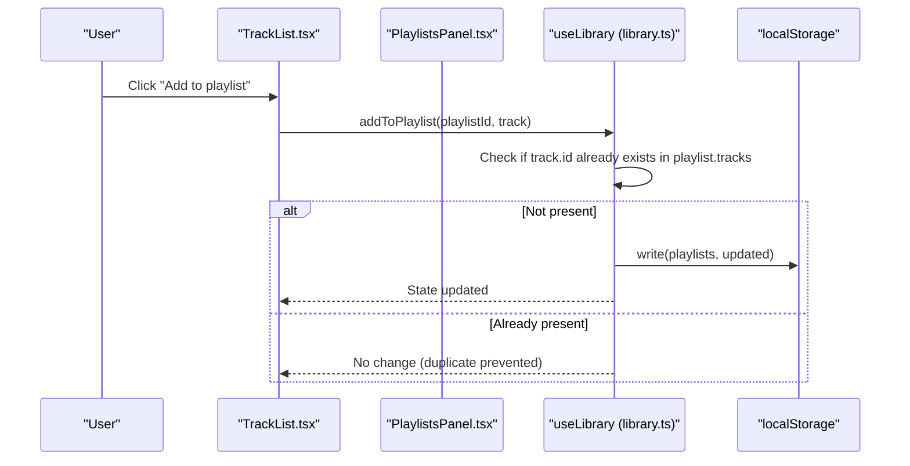
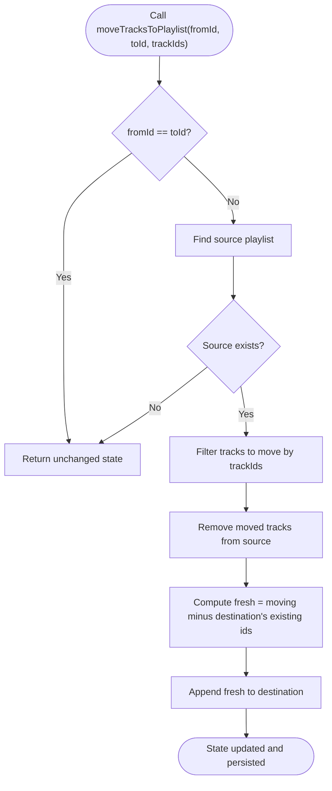
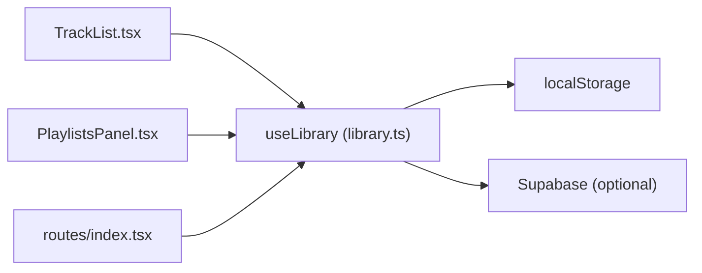

# Track Management

<cite>
**Referenced Files in This Document**
- [library.ts](file://src/lib/library.ts)
- [PlaylistsPanel.tsx](file://src/components/music/PlaylistsPanel.tsx)
- [TrackList.tsx](file://src/components/music/TrackList.tsx)
- [index.tsx](file://src/routes/index.tsx)
</cite>

## Table of Contents
1. [Introduction](#introduction)
2. [Project Structure](#project-structure)
3. [Core Components](#core-components)
4. [Architecture Overview](#architecture-overview)
5. [Detailed Component Analysis](#detailed-component-analysis)
6. [Dependency Analysis](#dependency-analysis)
7. [Performance Considerations](#performance-considerations)
8. [Troubleshooting Guide](#troubleshooting-guide)
9. [Conclusion](#conclusion)

## Introduction
This document explains how track management works within playlists, focusing on adding, removing, bulk removal, and moving tracks across playlists. It details duplicate prevention mechanisms, the data flow from UI to state updates, and performance considerations for large playlists and frequent updates.

## Project Structure
The playlist system is implemented as a local-first library with React hooks that manage state and persist changes to localStorage. The UI components provide interactive controls for selecting, adding, removing, and moving tracks.

**Diagram sources**
- [library.ts:422-428](file://src/lib/library.ts#L422-L428)
- [library.ts:321-349](file://src/lib/library.ts#L321-L349)

**Section sources**
- [library.ts:125-143](file://src/lib/library.ts#L125-L143)
- [library.ts:242-349](file://src/lib/library.ts#L242-L349)
- [PlaylistsPanel.tsx:16-29](file://src/components/music/PlaylistsPanel.tsx#L16-L29)
- [TrackList.tsx:208-241](file://src/components/music/TrackList.tsx#L208-L241)

## Core Components
- useLibrary hook exposes playlist operations: createPlaylist, renamePlaylist, deletePlaylist, addToPlaylist, removeFromPlaylist, removeManyFromPlaylist, moveTracksToPlaylist, reorderPlaylist.
- PlaylistsPanel renders playlist list, selection toolbar, and per-track actions.
- TrackList provides “Add to playlist” dropdown per track.
- Route-level wiring connects search results and UI actions to the hook’s methods.

Key responsibilities:
- Duplicate prevention during add and move operations.
- Bulk removal of multiple selected tracks.
- Cross-playlist movement without duplicates at destination.
- Local persistence and optional cloud sync.

**Section sources**
- [library.ts:430-515](file://src/lib/library.ts#L430-L515)
- [PlaylistsPanel.tsx:142-206](file://src/components/music/PlaylistsPanel.tsx#L142-L206)
- [TrackList.tsx:208-241](file://src/components/music/TrackList.tsx#L208-L241)
- [index.tsx:1173-1178](file://src/routes/index.tsx#L1173-L1178)

## Architecture Overview
The following sequence shows how a user adds a track from search results into a playlist, including duplicate prevention.

**Diagram sources**
- [TrackList.tsx:208-241](file://src/components/music/TrackList.tsx#L208-L241)
- [library.ts:450-460](file://src/lib/library.ts#L450-L460)
- [library.ts:422-428](file://src/lib/library.ts#L422-L428)

**Section sources**
- [TrackList.tsx:208-241](file://src/components/music/TrackList.tsx#L208-L241)
- [library.ts:450-460](file://src/lib/library.ts#L450-L460)

## Detailed Component Analysis

### Add to Playlist (addToPlaylist)
- Purpose: Append a single track to a specific playlist.
- Duplicate prevention: Before appending, checks whether any existing track has the same id; if found, no update occurs.
- Data flow: UI calls addToPlaylist with playlist id and track object; hook maps over playlists, updates only the target playlist, then persists via savePlaylists.

Complexity:
- Time: O(P + N) where P is number of playlists and N is number of tracks in the target playlist due to some() check and array concatenation.
- Space: Creates new playlist objects and arrays for changed playlists.

Common workflow example:
- From search results, user clicks “Add to playlist” and selects a playlist. The hook prevents duplicates automatically.

**Section sources**
- [library.ts:450-460](file://src/lib/library.ts#L450-L460)
- [TrackList.tsx:208-241](file://src/components/music/TrackList.tsx#L208-L241)
- [index.tsx:1173-1178](file://src/routes/index.tsx#L1173-L1178)

### Remove from Playlist (removeFromPlaylist)
- Purpose: Remove a single track by its id from a specific playlist.
- Implementation: Filters out the matching track id in the target playlist.

Complexity:
- Time: O(P + N) due to mapping and filtering.
- Space: New arrays for affected playlists.

**Section sources**
- [library.ts:462-470](file://src/lib/library.ts#L462-L470)
- [PlaylistsPanel.tsx:291-298](file://src/components/music/PlaylistsPanel.tsx#L291-L298)

### Bulk Remove Many Tracks (removeManyFromPlaylist)
- Purpose: Efficiently remove multiple selected tracks from a playlist in one operation.
- Implementation: Filters tracks whose ids are not included in the provided array of ids.

Optimization notes:
- Single state update reduces re-renders compared to calling removeFromPlaylist repeatedly.
- For very large selections, consider converting trackIds to a Set for O(1) lookups instead of Array.includes.

**Section sources**
- [library.ts:472-480](file://src/lib/library.ts#L472-L480)
- [PlaylistsPanel.tsx:193-204](file://src/components/music/PlaylistsPanel.tsx#L193-L204)

### Move Tracks Between Playlists (moveTracksToPlaylist)
- Purpose: Move selected tracks from source playlist to destination playlist while preventing duplicates at the destination.
- Behavior:
  - If source equals destination, no-op.
  - Extracts tracks to move based on selected ids.
  - Removes them from source.
  - Adds only those not already present in destination (by id).

Complexity:
- Time: O(P + N_source + N_dest) for mapping and filtering; duplicate check uses some() per candidate.
- Space: New arrays for both source and destination playlists when modified.

Flowchart of move logic:

**Diagram sources**
- [library.ts:482-500](file://src/lib/library.ts#L482-L500)

**Section sources**
- [library.ts:482-500](file://src/lib/library.ts#L482-L500)
- [PlaylistsPanel.tsx:167-191](file://src/components/music/PlaylistsPanel.tsx#L167-L191)

### Reorder Playlist (reorderPlaylist)
- Purpose: Change order of tracks within a playlist by dragging handles.
- Implementation: Splices the array to move an item from one index to another.

**Section sources**
- [library.ts:502-515](file://src/lib/library.ts#L502-L515)
- [PlaylistsPanel.tsx:221-237](file://src/components/music/PlaylistsPanel.tsx#L221-L237)

### UI Integration Points
- TrackList provides per-track “Add to playlist” menu that calls addToPlaylist.
- PlaylistsPanel supports:
  - Selecting multiple tracks and removing them via removeManyFromPlaylist.
  - Moving selected tracks to another playlist via moveTracksToPlaylist.
  - Reordering via drag-and-drop using reorderPlaylist.

**Section sources**
- [TrackList.tsx:208-241](file://src/components/music/TrackList.tsx#L208-L241)
- [PlaylistsPanel.tsx:142-206](file://src/components/music/PlaylistsPanel.tsx#L142-L206)
- [PlaylistsPanel.tsx:221-237](file://src/components/music/PlaylistsPanel.tsx#L221-L237)

## Dependency Analysis
- UI components depend on the useLibrary hook for all playlist mutations.
- The hook centralizes persistence via a write helper and debounced cloud sync.
- Routing layer wires search results and UI callbacks to the hook’s methods.

**Diagram sources**
- [library.ts:422-428](file://src/lib/library.ts#L422-L428)
- [library.ts:321-349](file://src/lib/library.ts#L321-L349)
- [TrackList.tsx:208-241](file://src/components/music/TrackList.tsx#L208-L241)
- [PlaylistsPanel.tsx:16-29](file://src/components/music/PlaylistsPanel.tsx#L16-L29)
- [index.tsx:1173-1178](file://src/routes/index.tsx#L1173-L1178)

**Section sources**
- [library.ts:422-428](file://src/lib/library.ts#L422-L428)
- [library.ts:321-349](file://src/lib/library.ts#L321-L349)
- [TrackList.tsx:208-241](file://src/components/music/TrackList.tsx#L208-L241)
- [PlaylistsPanel.tsx:16-29](file://src/components/music/PlaylistsPanel.tsx#L16-L29)
- [index.tsx:1173-1178](file://src/routes/index.tsx#L1173-L1178)

## Performance Considerations
- Current implementations use array.some() and Array.includes() for duplicate checks and filtering. For large playlists or large selection sets, this can be O(N) per check.
- Recommendations:
  - Convert trackIds to a Set before filtering in removeManyFromPlaylist to achieve O(1) membership tests.
  - In moveTracksToPlaylist, precompute a Set of destination track ids to deduplicate efficiently.
  - Batch multiple small mutations into a single savePlaylists call when possible to reduce re-renders and writes.
  - Debounce rapid successive adds/removes if triggered by high-frequency events.
  - Consider virtualizing long track lists in UI to improve rendering performance.

[No sources needed since this section provides general guidance]

## Troubleshooting Guide
- Duplicates appear after add:
  - Verify that track objects have stable, unique ids. Duplicate prevention relies on id equality.
  - Ensure addToPlaylist is called with the correct playlist id.
- Bulk remove does not work:
  - Confirm that selected track ids match the ids in the playlist.
  - For large selections, ensure the ids array is complete and not truncated.
- Move operation fails silently:
  - If fromId equals toId, the operation is intentionally a no-op.
  - If source playlist not found, no changes occur.
  - Destination duplicates are filtered; verify expected tracks were not already present.

**Section sources**
- [library.ts:450-460](file://src/lib/library.ts#L450-L460)
- [library.ts:472-480](file://src/lib/library.ts#L472-L480)
- [library.ts:482-500](file://src/lib/library.ts#L482-L500)

## Conclusion
The playlist system provides robust track management with built-in duplicate prevention for adding and moving tracks, efficient bulk removal, and cross-playlist movement. The architecture keeps state local-first with persistence and optional cloud sync. For large-scale usage, adopting Set-based lookups and batching updates will further improve performance and responsiveness.