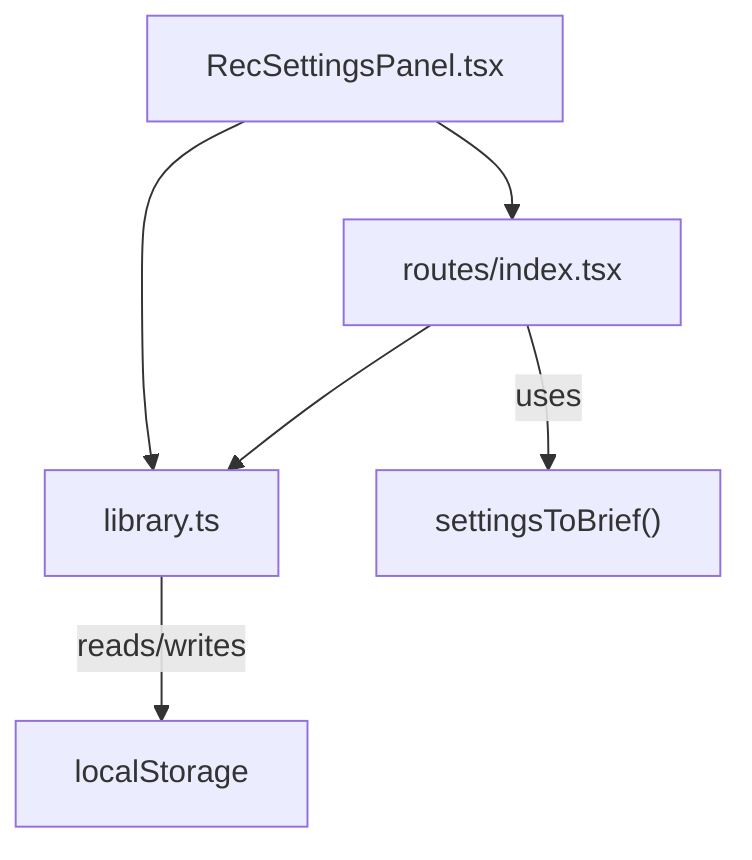
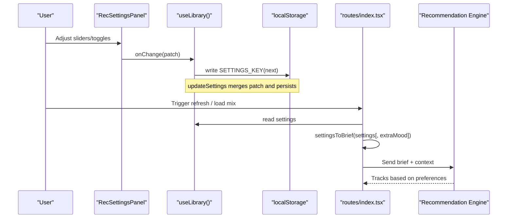
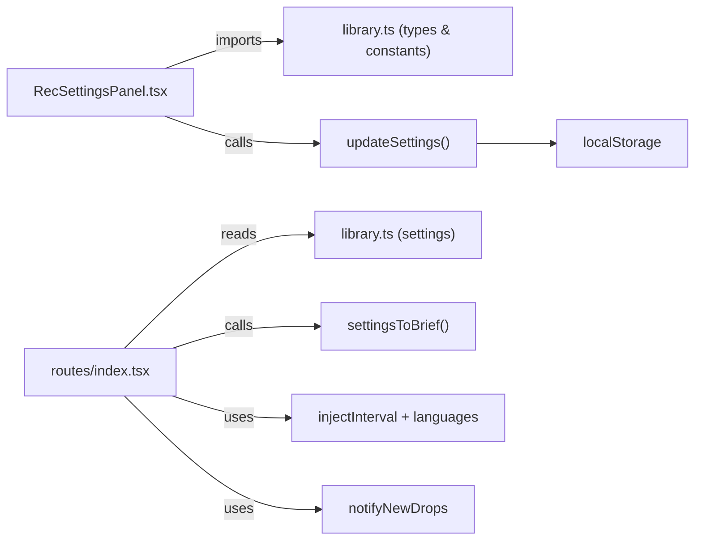

# Recommendation Settings

<cite>
**Referenced Files in This Document**
- [RecSettingsPanel.tsx](file://src/components/music/RecSettingsPanel.tsx)
- [library.ts](file://src/lib/library.ts)
- [index.tsx](file://src/routes/index.tsx)
</cite>

## Table of Contents
1. [Introduction](#introduction)
2. [Project Structure](#project-structure)
3. [Core Components](#core-components)
4. [Architecture Overview](#architecture-overview)
5. [Detailed Component Analysis](#detailed-component-analysis)
6. [Dependency Analysis](#dependency-analysis)
7. [Performance Considerations](#performance-considerations)
8. [Troubleshooting Guide](#troubleshooting-guide)
9. [Conclusion](#conclusion)
10. [Appendices](#appendices)

## Introduction
This document explains the recommendation settings system that lets users customize their music discovery experience. It covers the RecSettings type, default configuration, how user preferences override defaults, and the functions used to update or reset settings. It also documents the settingsToBrief utility that converts preference objects into natural language for the AI recommendation engine, and provides examples of how different setting combinations influence recommendations and discovery patterns.

## Project Structure
The recommendation settings feature spans three main areas:
- UI panel for editing preferences (sliders, toggles, and filters)
- Central library module defining types, defaults, persistence, and utilities
- Route logic that consumes settings when generating mixes and feeds

**Diagram sources**
- [RecSettingsPanel.tsx:1-284](file://src/components/music/RecSettingsPanel.tsx#L1-L284)
- [library.ts:68-103](file://src/lib/library.ts#L68-L103)
- [index.tsx:300-325](file://src/routes/index.tsx#L300-L325)
- [index.tsx:615-629](file://src/routes/index.tsx#L615-L629)

**Section sources**
- [RecSettingsPanel.tsx:1-284](file://src/components/music/RecSettingsPanel.tsx#L1-L284)
- [library.ts:68-103](file://src/lib/library.ts#L68-L103)
- [index.tsx:300-325](file://src/routes/index.tsx#L300-L325)
- [index.tsx:615-629](file://src/routes/index.tsx#L615-L629)

## Core Components
- RecSettings type defines all tunable parameters for recommendations: mood weights, genre/language filters, podcast topics, injection interval, notification preference, discovery vs familiarity balance, energy level, and instrumental-only mode.
- DEFAULT_SETTINGS provides a sensible baseline applied on first run and when resetting.
- updateSettings merges partial changes into current settings and persists them.
- resetSettings restores DEFAULT_SETTINGS and persists it.
- settingsToBrief converts the current settings into a concise natural-language brief consumed by the AI recommendation pipeline.

Key responsibilities:
- RecSettingsPanel: renders controls and emits partial updates via onChange; debounces mood slider changes; warns if all moods are zero.
- library.ts: owns state, persistence, and the settingsToBrief utility; exposes updateSettings and resetSettings.
- index.tsx: calls settingsToBrief when requesting recommendations and uses settings for fresh release injection and notifications.

**Section sources**
- [library.ts:68-103](file://src/lib/library.ts#L68-L103)
- [library.ts:517-528](file://src/lib/library.ts#L517-L528)
- [library.ts:563-588](file://src/lib/library.ts#L563-L588)
- [RecSettingsPanel.tsx:17-61](file://src/components/music/RecSettingsPanel.tsx#L17-L61)
- [index.tsx:300-325](file://src/routes/index.tsx#L300-L325)
- [index.tsx:615-629](file://src/routes/index.tsx#L615-L629)

## Architecture Overview
The settings flow connects UI interactions to persistent storage and then to the recommendation engine through a natural-language brief.

**Diagram sources**
- [RecSettingsPanel.tsx:27-40](file://src/components/music/RecSettingsPanel.tsx#L27-L40)
- [library.ts:517-528](file://src/lib/library.ts#L517-L528)
- [index.tsx:300-325](file://src/routes/index.tsx#L300-L325)
- [index.tsx:615-629](file://src/routes/index.tsx#L615-L629)
- [library.ts:563-588](file://src/lib/library.ts#L563-L588)

## Detailed Component Analysis

### RecSettings Type and Defaults
- RecSettings fields:
  - moods: per-mood weights from 0 to 100
  - genres: selected genres
  - languages: selected languages
  - podcastTopics: selected podcast topics
  - injectInterval: insert a fresh release every N songs (0 = off)
  - notifyNewDrops: enable browser notifications for new releases from favorite artists
  - discovery: 0 = familiar, 100 = deep cuts
  - energy: 0 = calm, 100 = high energy
  - instrumentalOnly: restrict to instrumental tracks
- DEFAULT_SETTINGS initializes all moods to 50, empty arrays for lists, injectInterval at 5, notifyNewDrops false, discovery at 40, energy at 50, instrumentalOnly false.

How defaults apply:
- On app start, stored settings are merged with DEFAULT_SETTINGS so any missing fields fall back to defaults.
- Resetting settings restores DEFAULT_SETTINGS exactly.

**Section sources**
- [library.ts:68-103](file://src/lib/library.ts#L68-L103)
- [library.ts:251-259](file://src/lib/library.ts#L251-L259)
- [library.ts:303-307](file://src/lib/library.ts#L303-L307)

### updateSettings and resetSettings
- updateSettings accepts a partial RecSettings object, merges it with the current settings, and writes the result to localStorage under a dedicated key.
- resetSettings sets settings to DEFAULT_SETTINGS and persists it.

These functions ensure consistent state transitions and durable persistence across sessions.

**Section sources**
- [library.ts:517-528](file://src/lib/library.ts#L517-L528)

### settingsToBrief Utility
- Converts current settings into a short natural-language string describing:
  - High-weight moods (>= 60) and low-weight moods (<= 20) to avoid
  - Selected genres and languages
  - Discovery vs familiarity ratio
  - Energy target
  - Instrumental-only constraint
- Accepts an optional extraMood to emphasize a specific mood for the current request.

This brief is passed to the recommendation engine alongside other context like liked/recent tracks and history.

**Section sources**
- [library.ts:563-588](file://src/lib/library.ts#L563-L588)
- [index.tsx:300-325](file://src/routes/index.tsx#L300-L325)
- [index.tsx:615-629](file://src/routes/index.tsx#L615-L629)

### RecSettingsPanel Interaction Model
- Mood sliders:
  - Debounced via pending state; committed on value commit to reduce updates.
  - Warns if all moods are set to 0 to encourage personalization.
- Genre, language, and podcast topic toggles:
  - Toggle inclusion/exclusion in arrays.
- Discovery and energy sliders:
  - Directly update numeric preferences.
- Instrumental-only switch:
  - Boolean toggle to filter out vocal tracks.
- Notification preference:
  - Requests browser notification permission when enabling.
- Fresh release injection:
  - Select interval (Off, Every 3, 5, or 10 songs).

```mermaid
flowchart TD
Start(["User adjusts settings"]) --> Moods{"Mood slider?"}
Moods --> |Yes| Pending["Update pending moods"]
Pending --> Commit{"Slider released?"}
Commit --> |Yes| ApplyMoods["onChange({ moods })"]
Commit --> |No| Pending
Moods --> |No| Other{"Other control?"}
Other --> GenresLang["Toggle genres/languages/topics"]
Other --> Sliders["Adjust discovery/energy"]
Other --> Toggles["Toggle instrumentalOnly / notifyNewDrops"]
Other --> Interval["Set injectInterval"]
GenresLang --> Persist["updateSettings(patch)"]
Sliders --> Persist
Toggles --> Persist
Interval --> Persist
Persist --> End(["Settings persisted"])
```

**Diagram sources**
- [RecSettingsPanel.tsx:17-61](file://src/components/music/RecSettingsPanel.tsx#L17-L61)
- [RecSettingsPanel.tsx:187-266](file://src/components/music/RecSettingsPanel.tsx#L187-L266)
- [library.ts:517-528](file://src/lib/library.ts#L517-L528)

**Section sources**
- [RecSettingsPanel.tsx:17-61](file://src/components/music/RecSettingsPanel.tsx#L17-L61)
- [RecSettingsPanel.tsx:187-266](file://src/components/music/RecSettingsPanel.tsx#L187-L266)

## Dependency Analysis
- RecSettingsPanel depends on:
  - Types and constants from library.ts (RecSettings, MOODS, GENRES, LANGUAGES, PODCAST_TOPICS)
  - UI primitives (Button, Slider, Switch)
  - Props handlers (onChange, onReset, onApply) provided by the parent route
- routes/index.tsx:
  - Consumes useLibrary to get settings and call updateSettings/resetSettings
  - Calls settingsToBrief when building recommendation requests
  - Uses settings.injectInterval and settings.languages for fresh release injection
  - Uses settings.notifyNewDrops to trigger browser notifications

**Diagram sources**
- [RecSettingsPanel.tsx:1-7](file://src/components/music/RecSettingsPanel.tsx#L1-L7)
- [library.ts:68-103](file://src/lib/library.ts#L68-L103)
- [library.ts:517-528](file://src/lib/library.ts#L517-L528)
- [index.tsx:300-325](file://src/routes/index.tsx#L300-L325)
- [index.tsx:615-629](file://src/routes/index.tsx#L615-L629)

**Section sources**
- [RecSettingsPanel.tsx:1-7](file://src/components/music/RecSettingsPanel.tsx#L1-L7)
- [library.ts:68-103](file://src/lib/library.ts#L68-L103)
- [library.ts:517-528](file://src/lib/library.ts#L517-L528)
- [index.tsx:300-325](file://src/routes/index.tsx#L300-L325)
- [index.tsx:615-629](file://src/routes/index.tsx#L615-L629)

## Performance Considerations
- Debounced mood updates: The panel batches mood slider changes until release to minimize state updates and network writes.
- Local-first persistence: Settings are written to localStorage immediately on change, avoiding heavy remote calls during interaction.
- Fallback behavior: When AI services fail, the system falls back to local engines, ensuring responsiveness even without external dependencies.

[No sources needed since this section provides general guidance]

## Troubleshooting Guide
- All moods at zero: The panel shows a warning indicating recommendations may be less personalized; increase at least one mood weight.
- Notifications not appearing:
  - Ensure browser permissions are granted when enabling notifyNewDrops.
  - Permission is requested only when enabling the toggle.
- Fresh release injection not working:
  - Verify injectInterval is not set to Off (0).
  - Check that languages are configured if you expect language-specific new releases.

**Section sources**
- [RecSettingsPanel.tsx:21-25](file://src/components/music/RecSettingsPanel.tsx#L21-L25)
- [RecSettingsPanel.tsx:223-239](file://src/components/music/RecSettingsPanel.tsx#L223-L239)
- [index.tsx:442-476](file://src/routes/index.tsx#L442-L476)

## Conclusion
The recommendation settings system provides a flexible, user-driven way to tailor music discovery. Users can fine-tune moods, genres, languages, podcast topics, energy, discovery depth, and instrumental filtering. The system persists preferences locally, supports resets to defaults, and translates preferences into a natural-language brief for the AI engine. Combined with fresh release injection and optional notifications, it delivers a responsive and personalized listening experience.

[No sources needed since this section summarizes without analyzing specific files]

## Appendices

### How Different Setting Combinations Affect Recommendations
- High discovery + high energy: Emphasizes lesser-known, energetic tracks; suitable for workouts or exploring new scenes.
- Low discovery + low energy: Focuses on familiar, calming favorites; good for background listening.
- Instrumental-only enabled: Filters out vocal tracks; ideal for focus or study sessions.
- Specific genres/languages: Narrows results to preferred styles or languages; useful for targeted exploration.
- Podcast topics: Influences podcast mix content rather than music directly.
- Fresh release injection: Periodically inserts newly released tracks into the queue based on your language preferences and top artists.
- Notifications: Alerts you when favorite artists release new songs, keeping you updated outside the app.

[No sources needed since this section provides conceptual examples]