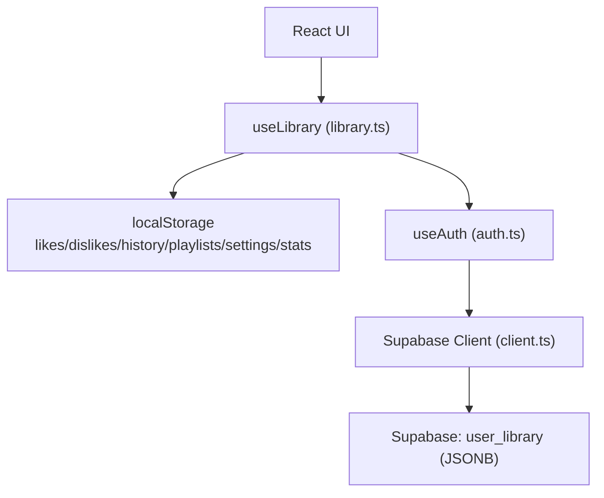
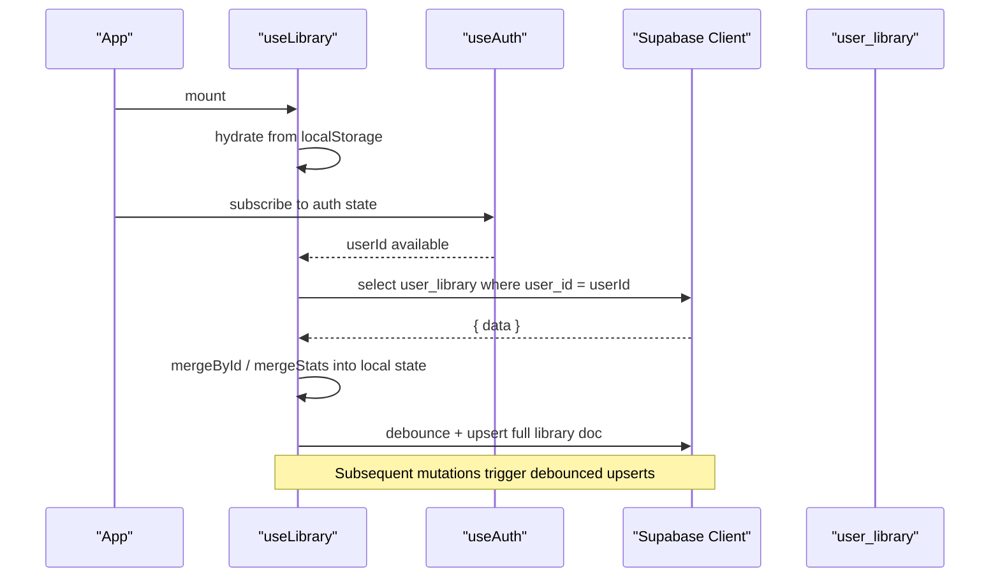
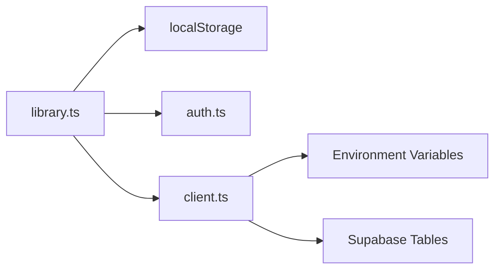

# Cloud Synchronization

<cite>
**Referenced Files in This Document**
- [library.ts](file://src/lib/library.ts)
- [client.ts](file://src/integrations/supabase/client.ts)
- [auth.ts](file://src/lib/auth.ts)
- [types.ts](file://src/integrations/supabase/types.ts)
- [20260808085443_8253f78c-652e-4cb4-8772-8818ce90215c.sql](file://supabase/migrations/20260808085443_8253f78c-652e-4cb4-8772-8818ce90215c.sql)
</cite>

## Table of Contents
1. [Introduction](#introduction)
2. [Project Structure](#project-structure)
3. [Core Components](#core-components)
4. [Architecture Overview](#architecture-overview)
5. [Detailed Component Analysis](#detailed-component-analysis)
6. [Dependency Analysis](#dependency-analysis)
7. [Performance Considerations](#performance-considerations)
8. [Troubleshooting Guide](#troubleshooting-guide)
9. [Conclusion](#conclusion)

## Introduction
This document explains the cloud synchronization mechanism that bridges local user library data with a Supabase backend. It focuses on how local arrays and behavioral statistics are merged with remote data, how authentication gates synchronization, and how changes are pushed back to the server in a debounced manner to avoid race conditions. It also covers conflict resolution strategies, data consistency guarantees, and error handling for network failures.

## Project Structure
The synchronization logic is primarily implemented in the library hook and integrates with Supabase via a client module. Authentication state drives when sync runs. The database schema stores the user’s library as JSONB in a dedicated table.

**Diagram sources**
- [library.ts:242-349](file://src/lib/library.ts#L242-L349)
- [auth.ts:12-68](file://src/lib/auth.ts#L12-L68)
- [client.ts:30-67](file://src/integrations/supabase/client.ts#L30-L67)
- [types.ts:41-58](file://src/integrations/supabase/types.ts#L41-L58)

**Section sources**
- [library.ts:242-349](file://src/lib/library.ts#L242-L349)
- [auth.ts:12-68](file://src/lib/auth.ts#L12-L68)
- [client.ts:30-67](file://src/integrations/supabase/client.ts#L30-L67)
- [types.ts:41-58](file://src/integrations/supabase/types.ts#L41-L58)

## Core Components
- mergeById: Merges two arrays by id while preserving order and preventing duplicates. Used for likes, dislikes, history, and playlists.
- mergeStats: Merges behavioral statistics per track by taking maximums for plays, skips, completions, and lastAt.
- Pull operation: Fetches the user’s library from Supabase once per sign-in and merges into local state.
- Push operation: Debounces updates and upserts the entire library document to the server.
- Authentication-aware sync: Only activates when userId is present; resets when signed out.

Key responsibilities and behaviors are implemented in the useLibrary hook and supported by Supabase client and types.

**Section sources**
- [library.ts:209-236](file://src/lib/library.ts#L209-L236)
- [library.ts:262-313](file://src/lib/library.ts#L262-L313)
- [library.ts:321-349](file://src/lib/library.ts#L321-L349)
- [types.ts:41-58](file://src/integrations/supabase/types.ts#L41-L58)

## Architecture Overview
The system follows a local-first pattern with periodic cloud sync:
- On app start, local data is hydrated from localStorage.
- When authenticated, the hook pulls the remote library once and merges it locally.
- Any local mutation triggers a debounced push that upserts the full library document to Supabase.
- Conflict resolution is deterministic: arrays are deduplicated by id with local-first ordering; stats are merged by max values.

**Diagram sources**
- [library.ts:242-349](file://src/lib/library.ts#L242-L349)
- [auth.ts:12-68](file://src/lib/auth.ts#L12-L68)
- [client.ts:30-67](file://src/integrations/supabase/client.ts#L30-L67)
- [types.ts:41-58](file://src/integrations/supabase/types.ts#L41-L58)

## Detailed Component Analysis

### mergeById: Array Merge with Deduplication and Order Preservation
Purpose:
- Combine local and remote arrays while avoiding duplicate entries by id.
- Preserve the relative order of first occurrence across both arrays.
- Enforce a maximum length to bound storage size.

Behavior:
- Iterates through concatenated arrays and keeps only the first occurrence of each id.
- Truncates to a configured limit to prevent unbounded growth.

Complexity:
- Time: O(n + m) where n and m are lengths of input arrays.
- Space: O(k) for the output array and a set of seen ids.

Usage:
- Applied to likes, dislikes, history, and playlists during pull.

Conflict resolution strategy:
- First-seen wins; if an item exists locally, its position is preserved even if remote has a different order.

**Section sources**
- [library.ts:227-236](file://src/lib/library.ts#L227-L236)
- [library.ts:276-295](file://src/lib/library.ts#L276-L295)

### mergeStats: Behavioral Statistics Merge
Purpose:
- Intelligently merge per-track statistics from remote into local.
- Take maximum values for plays, skips, completions, and lastAt to ensure no regression.

Behavior:
- For each track id in remote stats, if already present locally, update counters using Math.max.
- If not present, add the remote entry.

Complexity:
- Time: O(r) where r is number of remote stat entries.
- Space: O(1) additional beyond existing stats object.

Data consistency guarantee:
- Monotonic increase of counters prevents losing progress due to network timing or concurrent edits.

**Section sources**
- [library.ts:209-224](file://src/lib/library.ts#L209-L224)
- [library.ts:296-302](file://src/lib/library.ts#L296-L302)

### Pull Operation: Fetch and Merge Remote Library
Trigger:
- Runs once per userId after hydration completes.
- Skips if already pulled for the current userId.

Steps:
- Import Supabase client dynamically to reduce startup cost.
- Query user_library for the current userId.
- Merge remote arrays into local using mergeById with limits.
- Merge remote stats using mergeStats.
- Merge settings with defaults applied.

Error handling:
- Early return if no data or request cancelled.
- Errors are surfaced via Supabase client; hook does not throw but relies on caller to handle.

Race condition mitigation:
- Uses a ref to track pulled userId and a cancellation flag to ignore stale responses.

**Section sources**
- [library.ts:262-313](file://src/lib/library.ts#L262-L313)
- [client.ts:30-67](file://src/integrations/supabase/client.ts#L30-L67)

### Push Operation: Debounced Upsert of Full Library
Trigger:
- Runs whenever any part of the library changes (likes, dislikes, history, playlists, settings, stats).
- Only active when hydrated and authenticated with a stable userId.

Mechanism:
- Wraps upsert in a timeout to debounce rapid successive mutations.
- Upserts the complete library document to user_library for the current userId.
- Logs warnings on errors without interrupting UI flow.

Consistency:
- Upsert ensures a single authoritative document per user, reducing divergence risk.
- History is truncated before upload to control payload size.

Cancellation:
- Cleanup clears pending timers and ignores work if component unmounts or userId changes.

**Section sources**
- [library.ts:321-349](file://src/lib/library.ts#L321-L349)

### Authentication-Aware Synchronization
Activation:
- Sync operations depend on userId from useAuth.
- When userId is absent, synchronization is disabled and pulled ref is reset.

Flow:
- useAuth listens to auth state changes and provides userId.
- useLibrary reacts to userId changes to trigger pull and enable push.

Security:
- Supabase Row Level Security policies restrict access to user_library by user_id.

**Section sources**
- [auth.ts:12-68](file://src/lib/auth.ts#L12-L68)
- [library.ts:262-319](file://src/lib/library.ts#L262-L319)
- [20260808085443_8253f78c-652e-4cb4-8772-8818ce90215c.sql:20-32](file://supabase/migrations/20260808085443_8253f78c-652e-4cb4-8772-8818ce90215c.sql#L20-L32)

### Data Models and Schema
- user_library: Stores a JSONB data field containing likes, dislikes, history, playlists, settings, and stats keyed by user_id.
- profiles: Stores display_name and avatar_url for authenticated users.

Constraints:
- Row Level Security ensures users can only read/write their own records.
- updated_at timestamps are maintained automatically.

**Section sources**
- [types.ts:41-58](file://src/integrations/supabase/types.ts#L41-L58)
- [20260808085443_8253f78c-652e-4cb4-8772-8818ce90215c.sql:1-63](file://supabase/migrations/20260808085443_8253f78c-652e-4cb4-8772-8818ce90215c.sql#L1-L63)

## Dependency Analysis
High-level dependencies:
- useLibrary depends on:
  - localStorage for persistence
  - Supabase client for network I/O
  - useAuth for userId-driven activation
- Supabase client depends on environment variables for URL and key.
- Database schema enforces security policies and timestamps.

**Diagram sources**
- [library.ts:242-349](file://src/lib/library.ts#L242-L349)
- [auth.ts:12-68](file://src/lib/auth.ts#L12-L68)
- [client.ts:30-67](file://src/integrations/supabase/client.ts#L30-L67)

**Section sources**
- [library.ts:242-349](file://src/lib/library.ts#L242-L349)
- [auth.ts:12-68](file://src/lib/auth.ts#L12-L68)
- [client.ts:30-67](file://src/integrations/supabase/client.ts#L30-L67)

## Performance Considerations
- Debounced push reduces network calls during rapid interactions like typing or bulk liking.
- Array merging uses Set-based deduplication for O(n+m) performance.
- Stats merging is linear in remote entries and avoids unnecessary writes by using max semantics.
- History truncation on push controls payload size and storage usage.
- Dynamic import of Supabase client defers initialization until needed.

[No sources needed since this section provides general guidance]

## Troubleshooting Guide
Common issues and resolutions:
- Missing environment variables:
  - Symptom: Supabase client throws an error indicating missing URL or key.
  - Resolution: Ensure VITE_SUPABASE_URL and VITE_SUPABASE_PUBLISHABLE_KEY are set.
- Network failures during pull/push:
  - Symptom: Console warnings about sync failures.
  - Resolution: Retry later; local data remains consistent. Consider adding exponential backoff for retries.
- Race conditions between devices:
  - Strategy: mergeById preserves local order and removes duplicates; mergeStats takes maximums to avoid regressions.
  - Recommendation: Add versioned fields or timestamps to detect newer remote changes if needed.
- Storage quota issues:
  - Symptom: Warnings about low storage when saving offline content.
  - Resolution: Clear downloads or manage offline media separately from library sync.

Error handling patterns:
- Pull: early returns on cancellation or missing data; errors propagate via Supabase client.
- Push: try/catch logs warnings; does not block UI.
- Local storage: read/write functions catch and log errors gracefully.

**Section sources**
- [client.ts:30-67](file://src/integrations/supabase/client.ts#L30-L67)
- [library.ts:262-349](file://src/lib/library.ts#L262-L349)
- [library.ts:125-143](file://src/lib/library.ts#L125-L143)

## Conclusion
The synchronization mechanism implements a robust local-first architecture with deterministic conflict resolution and efficient merging strategies. Authentication gating ensures sync only occurs for signed-in users, while debounced upserts minimize network overhead and reduce race conditions. mergeById and mergeStats provide predictable behavior for arrays and statistics, respectively. Error handling is resilient, logging issues without disrupting user experience. For enhanced resilience, consider adding retry logic with backoff and versioned conflict resolution for multi-device scenarios.