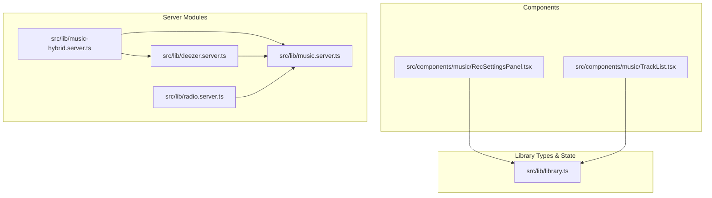
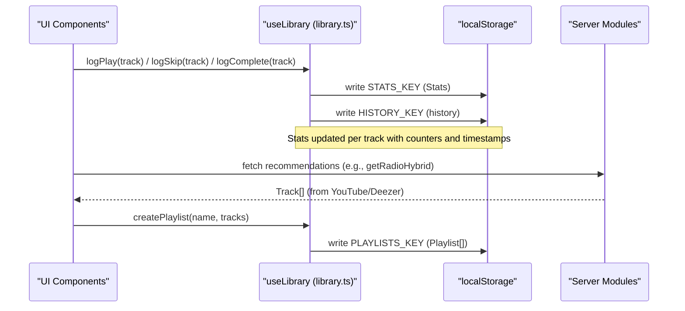
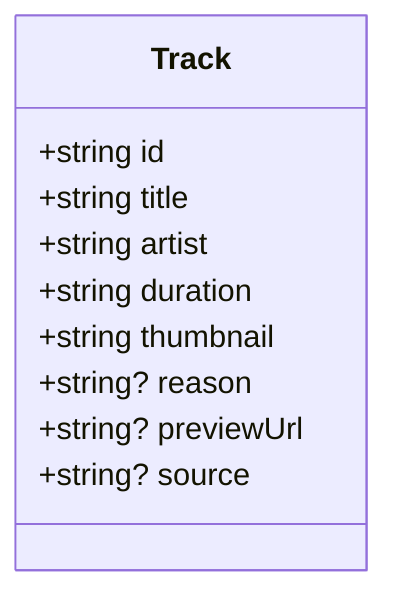
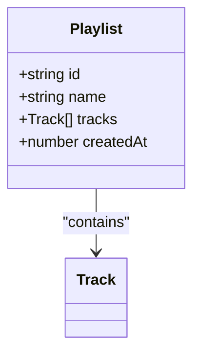
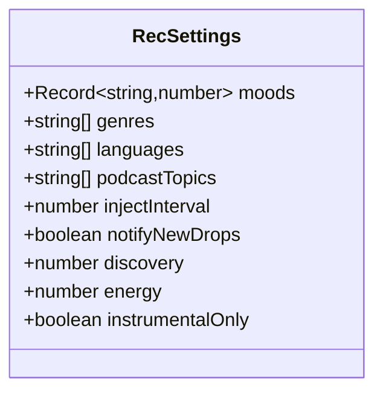
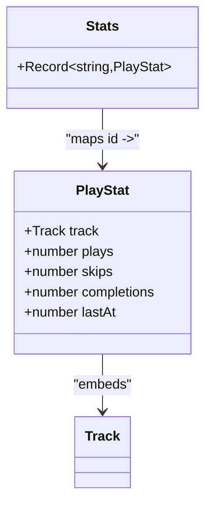
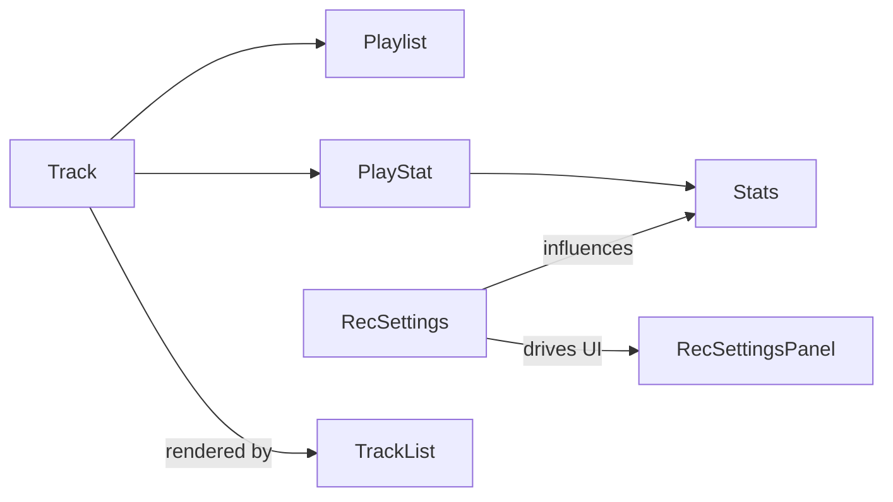

# Core Data Structures

<cite>
**Referenced Files in This Document**
- [library.ts](file://src/lib/library.ts)
- [music.server.ts](file://src/lib/music.server.ts)
- [deezer.server.ts](file://src/lib/deezer.server.ts)
- [radio.server.ts](file://src/lib/radio.server.ts)
- [music-hybrid.server.ts](file://src/lib/music-hybrid.server.ts)
- [RecSettingsPanel.tsx](file://src/components/music/RecSettingsPanel.tsx)
- [TrackList.tsx](file://src/components/music/TrackList.tsx)
</cite>

## Table of Contents
1. [Introduction](#introduction)
2. [Project Structure](#project-structure)
3. [Core Components](#core-components)
4. [Architecture Overview](#architecture-overview)
5. [Detailed Component Analysis](#detailed-component-analysis)
6. [Dependency Analysis](#dependency-analysis)
7. [Performance Considerations](#performance-considerations)
8. [Troubleshooting Guide](#troubleshooting-guide)
9. [Conclusion](#conclusion)

## Introduction
This document explains the core data structures that power the user library state management system: Track, Playlist, RecSettings, Stats, and PlayStat. It also documents the default settings and available constants (GENRES, LANGUAGES, PODCAST_TOPICS, MOODS), and shows how these types are used across the application to drive recommendations, playlists, behavioral analytics, and UI interactions.

## Project Structure
The core types and state logic live in a single library module, while components consume them for UI and behavior tracking. Server modules produce or transform Track objects from external sources.

**Diagram sources**
- [library.ts:3-21](file://src/lib/library.ts#L3-L21)
- [RecSettingsPanel.tsx:6-6](file://src/components/music/RecSettingsPanel.tsx#L6-L6)
- [TrackList.tsx:12-12](file://src/components/music/TrackList.tsx#L12-L12)
- [music-hybrid.server.ts:83-97](file://src/lib/music-hybrid.server.ts#L83-L97)
- [deezer.server.ts:9-22](file://src/lib/deezer.server.ts#L9-L22)
- [radio.server.ts:68-94](file://src/lib/radio.server.ts#L68-L94)

**Section sources**
- [library.ts:3-21](file://src/lib/library.ts#L3-L21)
- [RecSettingsPanel.tsx:6-6](file://src/components/music/RecSettingsPanel.tsx#L6-L6)
- [TrackList.tsx:12-12](file://src/components/music/TrackList.tsx#L12-L12)
- [music-hybrid.server.ts:83-97](file://src/lib/music-hybrid.server.ts#L83-L97)
- [deezer.server.ts:9-22](file://src/lib/deezer.server.ts#L9-L22)
- [radio.server.ts:68-94](file://src/lib/radio.server.ts#L68-L94)

## Core Components
This section defines the primary data structures and their roles.

- Track: Represents a playable item with identity, metadata, optional preview URL, and source provider.
- Playlist: A named collection of tracks with creation timestamp.
- RecSettings: Configuration object that tunes recommendation behavior via moods, genres, languages, podcast topics, injection interval, notifications, discovery level, energy target, and instrumental-only mode.
- PlayStat: Per-track behavioral counters including plays, skips, completions, and last interaction time.
- Stats: Map of track id to PlayStat entries.

Key relationships:
- Playlist contains an array of Track.
- Stats maps Track.id to PlayStat, which embeds the original Track.
- RecSettings drives recommendation logic and is persisted alongside other library state.

**Section sources**
- [library.ts:3-21](file://src/lib/library.ts#L3-L21)
- [library.ts:68-103](file://src/lib/library.ts#L68-L103)
- [library.ts:112-121](file://src/lib/library.ts#L112-L121)

## Architecture Overview
The library module centralizes type definitions and state management. Components read and update this state, while server modules generate Track objects from YouTube and Deezer. Behavioral signals (plays/skips/completions) feed back into Stats to influence future recommendations.

**Diagram sources**
- [library.ts:384-411](file://src/lib/library.ts#L384-L411)
- [library.ts:430-437](file://src/lib/library.ts#L430-L437)
- [music-hybrid.server.ts:54-78](file://src/lib/music-hybrid.server.ts#L54-L78)

## Detailed Component Analysis

### Track
- Purpose: Canonical representation of a playable item across the app.
- Fields:
  - id: string — unique identifier
  - title: string
  - artist: string
  - duration: string
  - thumbnail: string
  - reason?: string — optional AI recommendation reason
  - previewUrl?: string — direct audio URL (e.g., Deezer preview) bypassing proxy
  - source?: "youtube" | "deezer" — provider origin

Usage examples:
- Produced by server modules when fetching radio or search results.
- Consumed by TrackList for rendering and actions like play, add to playlist, download.
- Used by hybrid utilities to determine stream URLs based on source.

**Diagram sources**
- [library.ts:3-14](file://src/lib/library.ts#L3-L14)
- [music.server.ts:1-13](file://src/lib/music.server.ts#L1-L13)

**Section sources**
- [library.ts:3-14](file://src/lib/library.ts#L3-L14)
- [music.server.ts:1-13](file://src/lib/music.server.ts#L1-L13)
- [deezer.server.ts:63-73](file://src/lib/deezer.server.ts#L63-L73)
- [radio.server.ts:68-94](file://src/lib/radio.server.ts#L68-L94)
- [music-hybrid.server.ts:83-97](file://src/lib/music-hybrid.server.ts#L83-L97)
- [TrackList.tsx:12-12](file://src/components/music/TrackList.tsx#L12-L12)

### Playlist
- Purpose: User-created collections of tracks.
- Fields:
  - id: string
  - name: string
  - tracks: Track[]
  - createdAt: number

Usage examples:
- Created via useLibrary.createPlaylist.
- Updated via addToPlaylist, removeFromPlaylist, moveTracksToPlaylist, reorderPlaylist.
- Rendered in UI panels for browsing and managing collections.

**Diagram sources**
- [library.ts:16-21](file://src/lib/library.ts#L16-L21)

**Section sources**
- [library.ts:16-21](file://src/lib/library.ts#L16-L21)
- [library.ts:430-515](file://src/lib/library.ts#L430-L515)
- [TrackList.tsx:25-37](file://src/components/music/TrackList.tsx#L25-L37)

### RecSettings
- Purpose: Tuning configuration for recommendations and features.
- Fields:
  - moods: Record<string, number> — 0–100 weighting per mood
  - genres: string[] — preferred genres
  - languages: string[] — language filters
  - podcastTopics: string[] — topics for podcast mix
  - injectInterval: number — insert fresh release every N songs (0 = off)
  - notifyNewDrops: boolean — browser notification on new drops
  - discovery: number — 0 familiar to 100 deep cuts
  - energy: number — 0 calm to 100 high energy
  - instrumentalOnly: boolean — filter to instrumental-only

Defaults:
- moods: all set to 50
- genres: empty
- languages: empty
- podcastTopics: empty
- injectInterval: 5
- notifyNewDrops: false
- discovery: 40
- energy: 50
- instrumentalOnly: false

Constants:
- GENRES: curated list of genre strings
- LANGUAGES: curated list of language strings
- PODCAST_TOPICS: curated list of topic strings
- MOODS: curated list of mood strings

Usage examples:
- RecSettingsPanel renders sliders/toggles bound to these fields.
- settingsToBrief converts current settings into a natural-language brief for recommendation engines.

**Diagram sources**
- [library.ts:68-78](file://src/lib/library.ts#L68-L78)
- [library.ts:80-103](file://src/lib/library.ts#L80-L103)

**Section sources**
- [library.ts:68-103](file://src/lib/library.ts#L68-L103)
- [RecSettingsPanel.tsx:6-6](file://src/components/music/RecSettingsPanel.tsx#L6-L6)
- [RecSettingsPanel.tsx:18-61](file://src/components/music/RecSettingsPanel.tsx#L18-L61)
- [RecSettingsPanel.tsx:187-266](file://src/components/music/RecSettingsPanel.tsx#L187-L266)
- [library.ts:563-588](file://src/lib/library.ts#L563-L588)

### Stats and PlayStat
- Purpose: Capture behavioral signals per track to inform recommendations and insights.
- PlayStat fields:
  - track: Track — the associated track
  - plays: number — count of plays
  - skips: number — count of skips
  - completions: number — count of completions
  - lastAt: number — timestamp of last interaction
- Stats: Record<string, PlayStat> keyed by track id

Usage examples:
- Bumped via bump(track, field) when logging play, skip, or completion.
- Used to compute replay mixes, top artists, skipped labels, and sequence briefs.

**Diagram sources**
- [library.ts:112-121](file://src/lib/library.ts#L112-L121)

**Section sources**
- [library.ts:112-121](file://src/lib/library.ts#L112-L121)
- [library.ts:384-411](file://src/lib/library.ts#L384-L411)
- [library.ts:592-645](file://src/lib/library.ts#L592-L645)

## Dependency Analysis
- Track is produced by server modules and consumed by components and library functions.
- Playlist depends on Track; operations maintain uniqueness and ordering.
- Stats depends on Track via PlayStat; Stats drives derived metrics and recommendation prompts.
- RecSettings influences recommendation generation and UI controls; it is persisted alongside other library state.

**Diagram sources**
- [library.ts:16-21](file://src/lib/library.ts#L16-L21)
- [library.ts:112-121](file://src/lib/library.ts#L112-L121)
- [library.ts:68-103](file://src/lib/library.ts#L68-L103)
- [RecSettingsPanel.tsx:6-6](file://src/components/music/RecSettingsPanel.tsx#L6-L6)
- [TrackList.tsx:12-12](file://src/components/music/TrackList.tsx#L12-L12)

**Section sources**
- [library.ts:16-21](file://src/lib/library.ts#L16-L21)
- [library.ts:112-121](file://src/lib/library.ts#L112-L121)
- [library.ts:68-103](file://src/lib/library.ts#L68-L103)
- [RecSettingsPanel.tsx:6-6](file://src/components/music/RecSettingsPanel.tsx#L6-L6)
- [TrackList.tsx:12-12](file://src/components/music/TrackList.tsx#L12-L12)

## Performance Considerations
- Stats updates are frequent; they are batched via debounced sync to cloud storage to avoid excessive network calls.
- History and likes/dislikes arrays are capped to prevent unbounded growth.
- LocalStorage writes are wrapped in try/catch to handle quota errors gracefully.
- Recommendation pipelines short-circuit on failures and fall back to alternative sources.

[No sources needed since this section provides general guidance]

## Troubleshooting Guide
Common issues and where to look:
- Missing previewUrl: Ensure source is set correctly; Deezer tracks include previewUrl, while YouTube tracks rely on streaming endpoints.
- Stats not updating: Verify that logPlay/logSkip/logComplete are called after user interactions; check localStorage keys for persistence.
- Settings not applied: Confirm that updateSettings is invoked and DEFAULT_SETTINGS are merged properly.

**Section sources**
- [library.ts:125-143](file://src/lib/library.ts#L125-L143)
- [library.ts:384-411](file://src/lib/library.ts#L384-L411)
- [library.ts:517-528](file://src/lib/library.ts#L517-L528)
- [music-hybrid.server.ts:83-97](file://src/lib/music-hybrid.server.ts#L83-L97)

## Conclusion
The core data structures—Track, Playlist, RecSettings, Stats, and PlayStat—form the backbone of the user library state management system. They enable rich personalization through configurable settings, robust behavioral tracking, and flexible playlist management. By keeping types consistent across components and server modules, the application maintains coherence between UI, state, and external data sources.