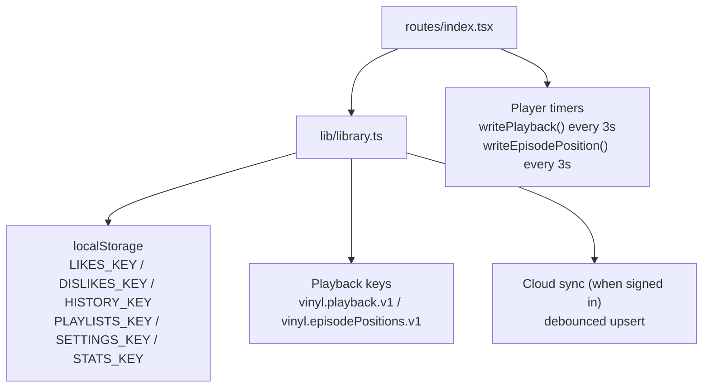
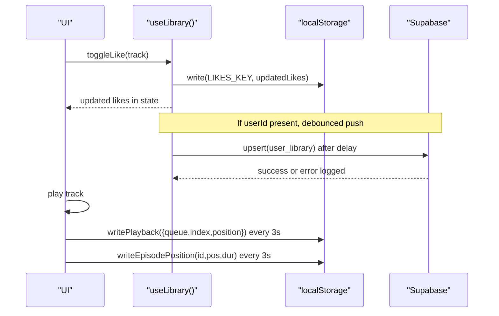
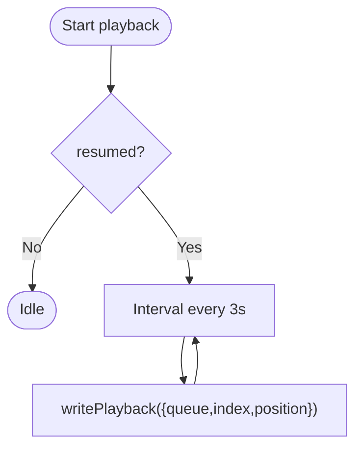
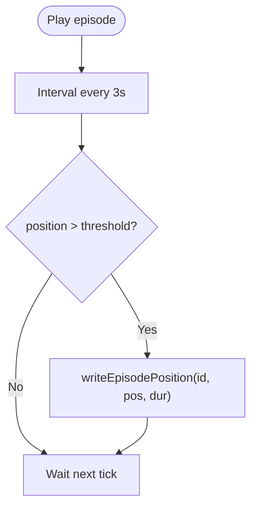
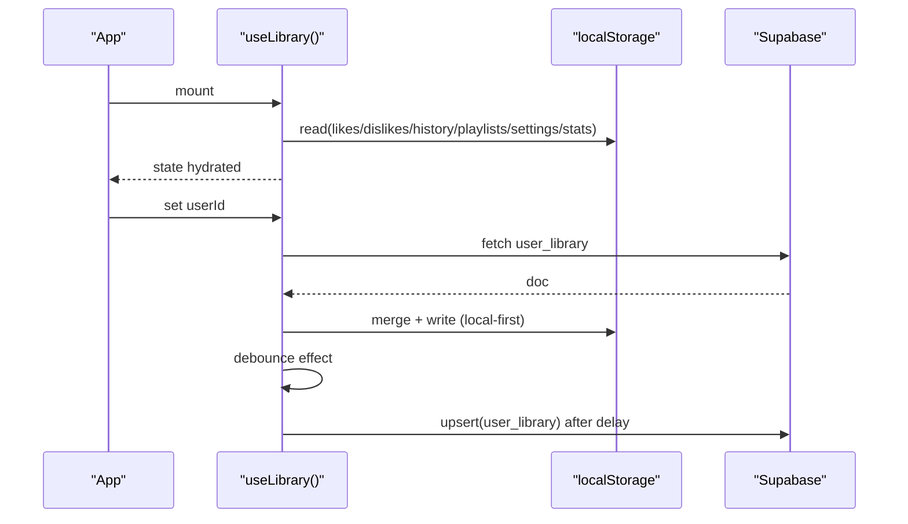
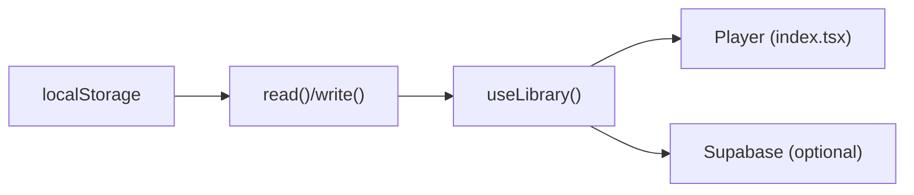

# Persistence Layer

<cite>
**Referenced Files in This Document**
- [library.ts](file://src/lib/library.ts)
- [index.tsx](file://src/routes/index.tsx)
- [offline.ts](file://src/lib/offline.ts)
</cite>

## Table of Contents
1. [Introduction](#introduction)
2. [Project Structure](#project-structure)
3. [Core Components](#core-components)
4. [Architecture Overview](#architecture-overview)
5. [Detailed Component Analysis](#detailed-component-analysis)
6. [Dependency Analysis](#dependency-analysis)
7. [Performance Considerations](#performance-considerations)
8. [Troubleshooting Guide](#troubleshooting-guide)
9. [Conclusion](#conclusion)

## Introduction
This document explains the local-first persistence layer that keeps user data and playback state safe in the browser using localStorage. It covers:
- Storage keys for likes, dislikes, history, playlists, settings, and stats
- Read/write utilities with JSON serialization and error handling
- Playback persistence (SavedPlayback) and podcast resume positions (EpisodePosition)
- Handling storage failures, quota limits, and browser compatibility
- Examples of persistence during user interactions and restoration on startup
- Debounced sync strategy to prevent excessive API calls

## Project Structure
The persistence logic is centered around a single module that defines storage keys, typed models, and utility functions, plus a React hook that hydrates state from localStorage and optionally syncs to a cloud account when signed in. The player route integrates playback persistence and episode position tracking.

**Diagram sources**
- [library.ts:105-110](file://src/lib/library.ts#L105-L110)
- [library.ts:149-197](file://src/lib/library.ts#L149-L197)
- [index.tsx:577-596](file://src/routes/index.tsx#L577-L596)

**Section sources**
- [library.ts:105-110](file://src/lib/library.ts#L105-L110)
- [library.ts:149-197](file://src/lib/library.ts#L149-L197)
- [index.tsx:577-596](file://src/routes/index.tsx#L577-L596)

## Core Components
- Storage keys: LIKES_KEY, DISLIKES_KEY, HISTORY_KEY, PLAYLISTS_KEY, SETTINGS_KEY, STATS_KEY
- Playback keys: vinyl.playback.v1, vinyl.episodePositions.v1
- Types: SavedPlayback (queue, index, position), EpisodePosition (position, duration, updatedAt)
- Utilities: read(key, fallback), write(key, value)
- Hook: useLibrary(userId?) hydrates state from localStorage and merges/syncs with cloud when available

Key responsibilities:
- Persist user library data locally first
- Persist playback queue and position
- Persist per-episode listening positions for podcast resume
- Safely handle errors and quota issues
- Debounce cloud sync to avoid spamming APIs

**Section sources**
- [library.ts:105-110](file://src/lib/library.ts#L105-L110)
- [library.ts:125-143](file://src/lib/library.ts#L125-L143)
- [library.ts:151-197](file://src/lib/library.ts#L151-L197)
- [library.ts:242-349](file://src/lib/library.ts#L242-L349)

## Architecture Overview
The system follows a local-first pattern:
- On app start, the library hook reads all persisted data from localStorage into React state.
- User actions update local state immediately and persist via write().
- When signed in, changes are merged with the server copy and pushed back with a debounce.
- Playback state is saved periodically while playing; episode positions are saved separately for long-form content.

**Diagram sources**
- [library.ts:353-366](file://src/lib/library.ts#L353-L366)
- [library.ts:321-349](file://src/lib/library.ts#L321-L349)
- [index.tsx:577-596](file://src/routes/index.tsx#L577-L596)

## Detailed Component Analysis

### Storage Keys and Data Model
- LIKES_KEY, DISLIKES_KEY, HISTORY_KEY, PLAYLISTS_KEY, SETTINGS_KEY, STATS_KEY store arrays/objects of user library data.
- Additional keys:
  - vinyl.playback.v1 stores SavedPlayback
  - vinyl.episodePositions.v1 stores a map of EpisodePosition by videoId

Data types:
- SavedPlayback: queue (Track[]), index (number), position (number)
- EpisodePosition: position (number), duration (number), updatedAt (number)

Complexity notes:
- Lists are capped at fixed sizes (e.g., 200 items for likes/dislikes/history) to control memory and storage usage.
- Playback queue is truncated to a maximum size before writing to reduce payload size.

**Section sources**
- [library.ts:105-110](file://src/lib/library.ts#L105-L110)
- [library.ts:151-166](file://src/lib/library.ts#L151-L166)
- [library.ts:171-197](file://src/lib/library.ts#L171-L197)

### Read/Write Utilities and Error Handling
- read(key, fallback): safely reads from localStorage, parses JSON, returns fallback on missing or parse errors.
- write(key, value): serializes to JSON and writes to localStorage; catches quota or security exceptions and logs warnings.
- Both functions guard against server-side rendering by checking window availability.

Error handling:
- Read failures return fallback values so the app remains functional.
- Write failures log warnings but do not crash the app; this protects UX under quota constraints.

**Section sources**
- [library.ts:125-143](file://src/lib/library.ts#L125-L143)

### Playback Persistence (SavedPlayback)
- writePlayback(value) persists queue, current index, and playback position. Queue is sliced to a maximum length to limit storage growth.
- readPlayback() returns null if no valid saved state exists (missing key, invalid structure, empty queue).

Usage in the player:
- While resumed playback is active, an interval persists the current queue and position every few seconds.
- On startup, the player can cue from a saved position or offer to resume podcasts based on EpisodePosition.

**Diagram sources**
- [index.tsx:577-584](file://src/routes/index.tsx#L577-L584)
- [library.ts:158-166](file://src/lib/library.ts#L158-L166)

**Section sources**
- [library.ts:158-166](file://src/lib/library.ts#L158-L166)
- [index.tsx:577-584](file://src/routes/index.tsx#L577-L584)

### Podcast Resume Positions (EpisodePosition)
- writeEpisodePosition(videoId, position, duration) updates the last known position only if position > threshold and duration is valid.
- readEpisodePositions() returns a validated map keyed by videoId.
- clearEpisodePosition(videoId) removes a specific entry.

Usage in the player:
- An interval saves the current episode’s position and duration while resumed playback is active.
- On load, the player checks for a saved position and prompts the user to resume if conditions are met.

**Diagram sources**
- [index.tsx:586-596](file://src/routes/index.tsx#L586-L596)
- [library.ts:177-197](file://src/lib/library.ts#L177-L197)

**Section sources**
- [library.ts:177-197](file://src/lib/library.ts#L177-L197)
- [index.tsx:586-596](file://src/routes/index.tsx#L586-L596)

### Library Hydration and Sync
- On mount, useLibrary reads all keys into React state and marks hydrated true.
- When a userId is present, it pulls the cloud copy once, merges with local data (deduplicating by id and capping sizes), and writes back to localStorage.
- Changes are pushed back to the cloud with a debounce to avoid excessive API calls.

**Diagram sources**
- [library.ts:251-313](file://src/lib/library.ts#L251-L313)
- [library.ts:321-349](file://src/lib/library.ts#L321-L349)

**Section sources**
- [library.ts:251-313](file://src/lib/library.ts#L251-L313)
- [library.ts:321-349](file://src/lib/library.ts#L321-L349)

### User Interaction Examples
- Liking/disliking tracks updates both lists and persists them immediately.
- Playing a track logs it to history and bumps behavioral stats.
- Creating or editing playlists persists playlist changes.
- Updating settings persists new preferences.

These operations call write() directly to ensure immediate local persistence, while cloud sync happens later via debounce.

**Section sources**
- [library.ts:353-428](file://src/lib/library.ts#L353-L428)
- [library.ts:517-528](file://src/lib/library.ts#L517-L528)

## Dependency Analysis
- The persistence layer depends on:
  - Browser localStorage API (guarded by environment checks)
  - React hooks for state management and side effects
  - Optional Supabase client for cloud sync when signed in
- Coupling:
  - Strong cohesion within library.ts for all library-related persistence
  - Loose coupling to the player via exported read/write helpers and types
- External dependencies:
  - Supabase integration is dynamically imported and only used when userId is present

**Diagram sources**
- [library.ts:125-143](file://src/lib/library.ts#L125-L143)
- [library.ts:242-349](file://src/lib/library.ts#L242-L349)
- [index.tsx:577-596](file://src/routes/index.tsx#L577-L596)

**Section sources**
- [library.ts:125-143](file://src/lib/library.ts#L125-L143)
- [library.ts:242-349](file://src/lib/library.ts#L242-L349)
- [index.tsx:577-596](file://src/routes/index.tsx#L577-L596)

## Performance Considerations
- Local-first design ensures instant UI updates without network latency.
- Debounced cloud sync reduces API calls during rapid interactions (e.g., multiple likes).
- List caps (e.g., 200 items) and queue truncation (e.g., 100 items) limit storage growth and parsing overhead.
- Periodic persistence (every few seconds) balances freshness with I/O cost.

[No sources needed since this section provides general guidance]

## Troubleshooting Guide
Common issues and how the system handles them:
- Quota exceeded or blocked writes:
  - write() catches exceptions and logs a warning; app continues to function with stale local data.
- Corrupted or missing localStorage entries:
  - read() returns fallback values; app initializes with defaults.
- Browser incompatibility:
  - Functions check for window presence to avoid errors in SSR environments.
- Offline downloads storage pressure:
  - Separate offline storage uses IndexedDB with best-effort quota estimation and warnings.

Recommendations:
- Monitor console warnings for storage errors.
- Clear or reset settings/history if storage grows too large.
- Ensure modern browsers support localStorage and consider graceful degradation paths.

**Section sources**
- [library.ts:125-143](file://src/lib/library.ts#L125-L143)
- [offline.ts:58-83](file://src/lib/offline.ts#L58-L83)

## Conclusion
The persistence layer implements a robust local-first architecture:
- Immediate, reliable local storage for all user data and playback state
- Safe read/write utilities with comprehensive error handling
- Periodic persistence for playback and podcast resume positions
- Debounced synchronization to the cloud when signed in
- Defensive programming for quota limits and browser compatibility

This approach ensures a responsive user experience even under network or storage constraints, while preserving data across sessions and devices when possible.