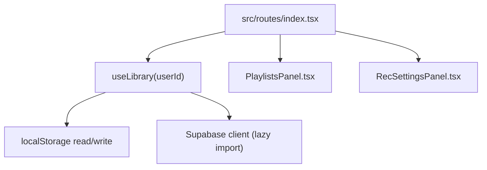
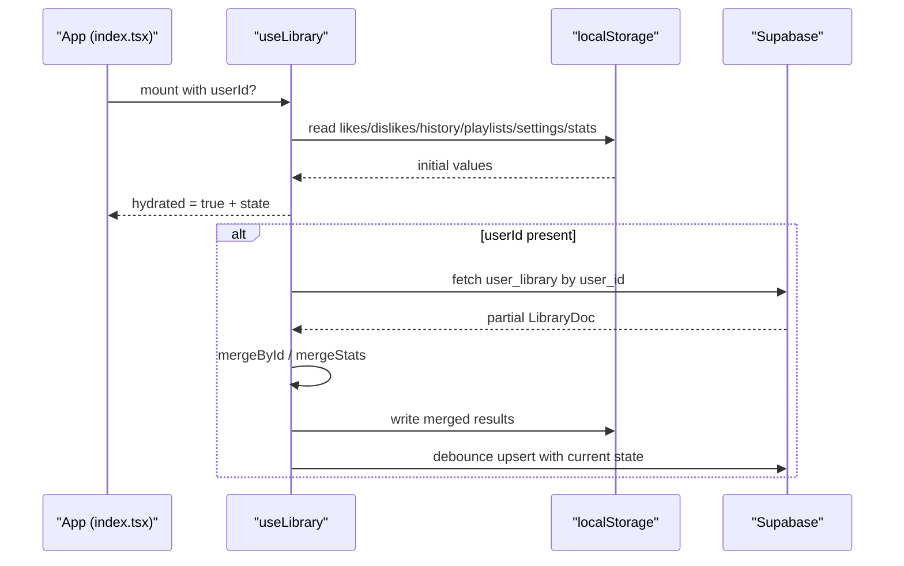
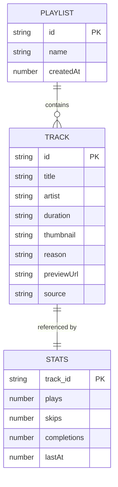
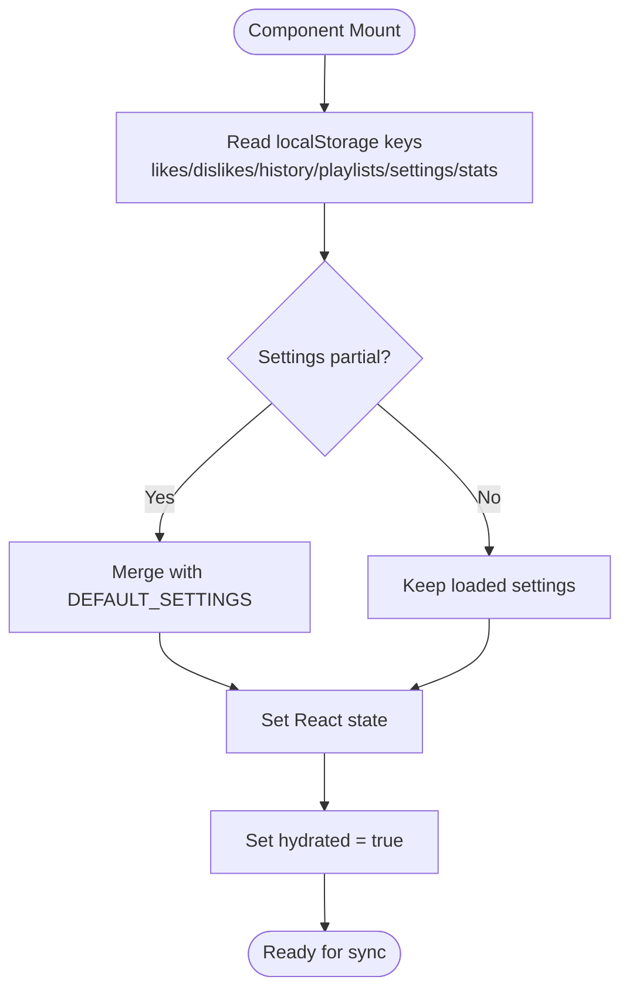
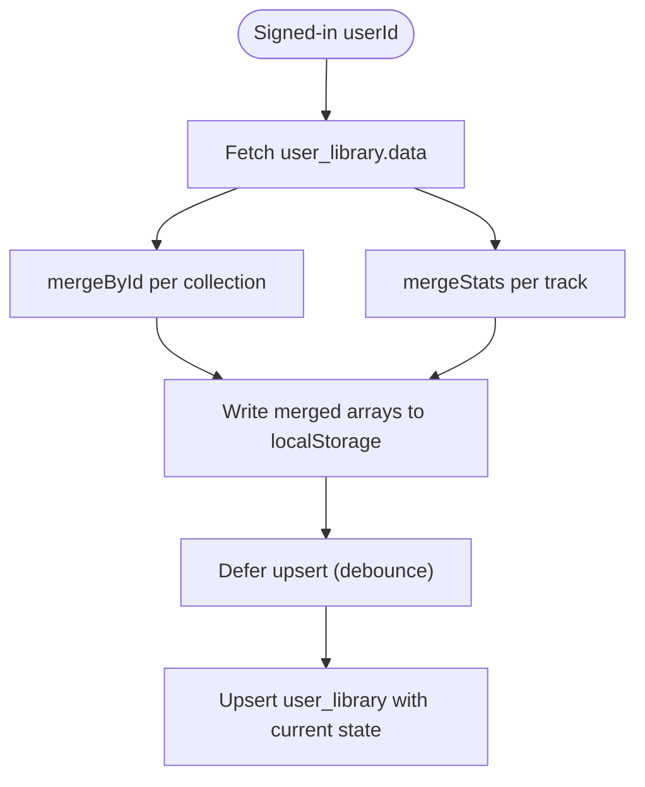
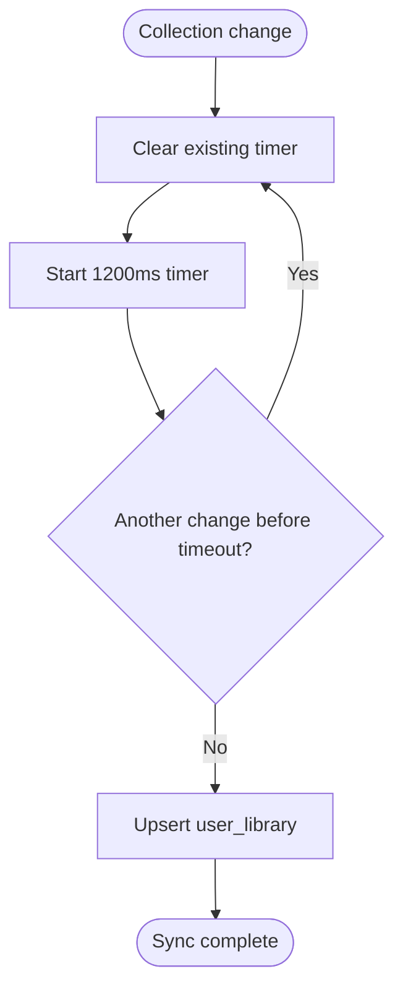
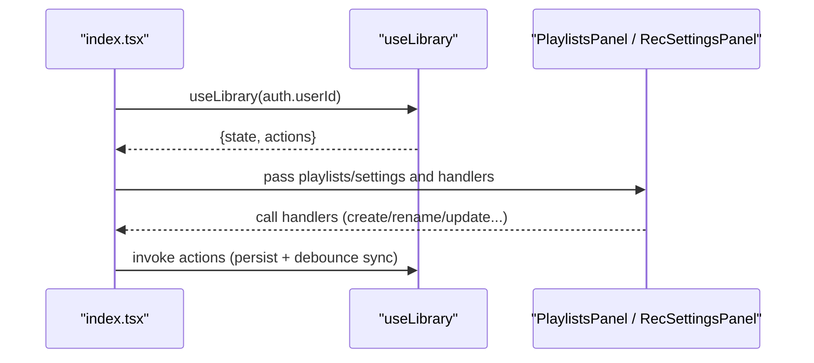
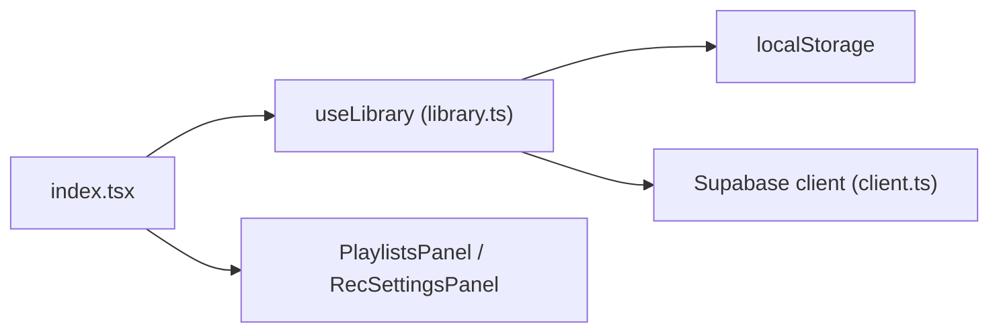

# User Library State Management

<cite>
**Referenced Files in This Document**
- [library.ts](file://src/lib/library.ts)
- [index.tsx](file://src/routes/index.tsx)
- [RecSettingsPanel.tsx](file://src/components/music/RecSettingsPanel.tsx)
- [PlaylistsPanel.tsx](file://src/components/music/PlaylistsPanel.tsx)
- [client.ts](file://src/integrations/supabase/client.ts)
</cite>

## Table of Contents
1. [Introduction](#introduction)
2. [Project Structure](#project-structure)
3. [Core Components](#core-components)
4. [Architecture Overview](#architecture-overview)
5. [Detailed Component Analysis](#detailed-component-analysis)
6. [Dependency Analysis](#dependency-analysis)
7. [Performance Considerations](#performance-considerations)
8. [Troubleshooting Guide](#troubleshooting-guide)
9. [Conclusion](#conclusion)

## Introduction
This document explains the user library state management system implemented by the useLibrary hook. It follows a local-first architecture: all user data (likes, dislikes, history, playlists, settings, and stats) is persisted immediately to localStorage and then synchronized to Supabase when the user is authenticated. The system hydrates from localStorage on component mount, merges remote data with local changes using mergeById and mergeStats, and debounces writes to avoid excessive API calls during rapid interactions.

## Project Structure
The library module centralizes types, persistence helpers, and the useLibrary hook. UI components consume the hook via the root route and pass derived state into panels for playlists and settings.

**Diagram sources**
- [index.tsx:166-196](file://src/routes/index.tsx#L166-L196)
- [library.ts:242-349](file://src/lib/library.ts#L242-L349)
- [client.ts:36-67](file://src/integrations/supabase/client.ts#L36-L67)

**Section sources**
- [library.ts:1-122](file://src/lib/library.ts#L1-L122)
- [index.tsx:166-196](file://src/routes/index.tsx#L166-L196)

## Core Components
- Types: Track, Playlist, RecSettings, PlayStat, Stats define the shape of library data and behavioral signals.
- Persistence: read/write helpers abstract localStorage access with safe fallbacks.
- Hook: useLibrary manages state, hydration, cloud sync, and exposes actions for likes/dislikes, history, playlists, settings, and stats.

Key responsibilities:
- Hydrate state from localStorage on mount.
- Merge remote library doc into local state when signed in.
- Debounce writes to Supabase to reduce network load.
- Provide immutable update functions for collections and settings.

**Section sources**
- [library.ts:105-122](file://src/lib/library.ts#L105-L122)
- [library.ts:125-147](file://src/lib/library.ts#L125-L147)
- [library.ts:242-349](file://src/lib/library.ts#L242-L349)

## Architecture Overview
The system implements a local-first pattern with three phases:
1. Hydration: On mount, read all collections from localStorage into React state.
2. Sync-in: When userId becomes available, fetch the user’s library doc from Supabase and merge it with local state using mergeById and mergeStats.
3. Sync-out: Any change to collections triggers a debounced upsert to Supabase.

**Diagram sources**
- [library.ts:251-313](file://src/lib/library.ts#L251-L313)
- [library.ts:321-349](file://src/lib/library.ts#L321-L349)
- [client.ts:36-67](file://src/integrations/supabase/client.ts#L36-L67)

## Detailed Component Analysis

### Data Model and Relationships
- Track: Represents a playable item with id, title, artist, duration, thumbnail, optional metadata like reason, previewUrl, and source provider.
- Playlist: Named collection of tracks with creation timestamp.
- RecSettings: Tuning preferences including mood weights, genres, languages, podcast topics, injection interval, notifications, discovery vs familiarity, energy level, and instrumental-only mode.
- PlayStat: Per-track behavioral signal tracking plays, skips, completions, and last activity time.
- Stats: Map of track id to PlayStat.

Relationships:
- Playlist contains multiple Tracks.
- Stats maps Track ids to PlayStat entries.
- History is an ordered list of Tracks reflecting recent playback.
- Settings influence recommendation behavior and are persisted alongside other collections.

**Diagram sources**
- [library.ts:3-21](file://src/lib/library.ts#L3-L21)
- [library.ts:68-122](file://src/lib/library.ts#L68-L122)

**Section sources**
- [library.ts:3-21](file://src/lib/library.ts#L3-L21)
- [library.ts:68-122](file://src/lib/library.ts#L68-L122)

### State Initialization (Hydration)
On component mount, the hook reads each collection from localStorage and sets React state accordingly. Settings are merged with defaults so that unknown or missing fields fall back to sensible values. After reading, hydrated is set to true to enable syncing logic.

**Diagram sources**
- [library.ts:251-259](file://src/lib/library.ts#L251-L259)

**Section sources**
- [library.ts:251-259](file://src/lib/library.ts#L251-L259)

### Cloud Synchronization Mechanism
When the user signs in, the hook fetches the user’s library document from Supabase and merges it with local state:
- Arrays (likes, dislikes, history, playlists): merged by id to deduplicate while preserving order and limiting size.
- Stats: merged by id, taking the maximum of numeric counters and timestamps to reconcile concurrent edits.
- Settings: merged with defaults to ensure completeness.

After merging, the hook persists the merged result back to localStorage and schedules a debounced upsert to Supabase whenever any collection changes.

**Diagram sources**
- [library.ts:264-313](file://src/lib/library.ts#L264-L313)
- [library.ts:321-349](file://src/lib/library.ts#L321-L349)

**Section sources**
- [library.ts:264-313](file://src/lib/library.ts#L264-L313)
- [library.ts:321-349](file://src/lib/library.ts#L321-L349)

### Debounced Sync Strategy
To prevent spamming the API during rapid interactions (e.g., typing settings or toggling likes), the hook uses a timeout-based debounce:
- Any change to collections triggers a new timer.
- The timer waits 1200ms before performing the upsert.
- If another change occurs before the timer fires, the previous timer is cleared and a new one starts.
- The effect cleans up timers on unmount or dependency changes to avoid stale writes.

**Diagram sources**
- [library.ts:321-349](file://src/lib/library.ts#L321-L349)

**Section sources**
- [library.ts:321-349](file://src/lib/library.ts#L321-L349)

### Managing Likes, Dislikes, History, Playlists, Settings, and Stats

#### Likes and Dislikes
- toggleLike: Removes the track from dislikes if present; toggles presence in likes and caps lists to a fixed size.
- toggleDislike: Removes the track from likes if present; toggles presence in dislikes and caps lists to a fixed size.
- Both operations persist immediately to localStorage and trigger debounced sync.

**Section sources**
- [library.ts:353-382](file://src/lib/library.ts#L353-L382)

#### History and Behavioral Stats
- logPlay: Prepends the track to history (deduplicated) and bumps the plays counter in stats.
- logSkip/logComplete: Increment respective counters and update last activity timestamp.
- Stats are stored as a map keyed by track id and persisted after each bump.

**Section sources**
- [library.ts:384-411](file://src/lib/library.ts#L384-L411)

#### Playlists
- createPlaylist: Generates a unique id and adds a new playlist at the front.
- renamePlaylist/deletePlaylist: Update or remove playlists by id.
- addToPlaylist/removeFromPlaylist/removeManyFromPlaylist: Manage tracks within a playlist with duplicate prevention.
- moveTracksToPlaylist: Moves selected tracks between playlists without duplication.
- reorderPlaylist: Reorders tracks via drag-and-drop indices.
- All mutations persist to localStorage and trigger debounced sync.

**Section sources**
- [library.ts:422-515](file://src/lib/library.ts#L422-L515)

#### Settings
- updateSettings: Merges partial updates into current settings and persists.
- resetSettings: Restores default configuration and persists.
- Settings influence recommendation behavior and are synced along with other collections.

**Section sources**
- [library.ts:517-528](file://src/lib/library.ts#L517-L528)

### Usage in the Application
The root route consumes useLibrary with the current userId from authentication and passes state and actions down to UI components:
- PlaylistsPanel receives playlists and mutation callbacks for creating, renaming, deleting, adding/removing tracks, moving tracks, reordering, and playing.
- RecSettingsPanel receives settings and callbacks to update/reset settings, with additional UI-level debouncing for slider commits.

**Diagram sources**
- [index.tsx:166-196](file://src/routes/index.tsx#L166-L196)
- [RecSettingsPanel.tsx:17-40](file://src/components/music/RecSettingsPanel.tsx#L17-L40)
- [PlaylistsPanel.tsx:31-44](file://src/components/music/PlaylistsPanel.tsx#L31-L44)

**Section sources**
- [index.tsx:166-196](file://src/routes/index.tsx#L166-L196)
- [RecSettingsPanel.tsx:17-40](file://src/components/music/RecSettingsPanel.tsx#L17-L40)
- [PlaylistsPanel.tsx:31-44](file://src/components/music/PlaylistsPanel.tsx#L31-L44)

## Dependency Analysis
- useLibrary depends on:
  - React hooks for state and effects.
  - Local storage read/write utilities for immediate persistence.
  - Supabase client for fetching and upserting user_library data.
- Integration points:
  - Supabase client is lazily imported to avoid unnecessary initialization until needed.
  - Authentication context provides userId which gates sync behavior.

**Diagram sources**
- [library.ts:242-349](file://src/lib/library.ts#L242-L349)
- [client.ts:36-67](file://src/integrations/supabase/client.ts#L36-L67)
- [index.tsx:166-196](file://src/routes/index.tsx#L166-L196)

**Section sources**
- [library.ts:242-349](file://src/lib/library.ts#L242-L349)
- [client.ts:36-67](file://src/integrations/supabase/client.ts#L36-L67)
- [index.tsx:166-196](file://src/routes/index.tsx#L166-L196)

## Performance Considerations
- Local-first writes ensure instant UI responsiveness; network calls are deferred.
- mergeById limits merged arrays to a fixed size to control memory usage.
- Debounced upsert reduces API calls during rapid interactions.
- Lazy loading of Supabase client avoids startup overhead.
- Stats merging uses max aggregation to handle concurrent edits safely.

[No sources needed since this section provides general guidance]

## Troubleshooting Guide
Common issues and mitigations:
- Missing environment variables for Supabase: The client throws a descriptive error if required variables are absent. Ensure SUPABASE_URL and SUPABASE_PUBLISHABLE_KEY are configured.
- LocalStorage quota exceeded: Write operations catch and warn on errors; consider trimming history or stats if storage fills up.
- Stale sync due to sign-out: The hook resets internal pulled state when userId is null to avoid writing under wrong accounts.
- Network failures: Errors during upsert are logged; local state remains consistent and will retry on next change.

**Section sources**
- [client.ts:36-44](file://src/integrations/supabase/client.ts#L36-L44)
- [library.ts:136-143](file://src/lib/library.ts#L136-L143)
- [library.ts:315-319](file://src/lib/library.ts#L315-L319)
- [library.ts:325-343](file://src/lib/library.ts#L325-L343)

## Conclusion
The useLibrary hook delivers a robust local-first state management solution for the user library. It ensures immediate persistence to localStorage, seamless synchronization to Supabase when authenticated, and resilient merging strategies to reconcile local and remote data. By debouncing writes and capping collection sizes, it balances performance and reliability while providing a comprehensive API for managing likes, dislikes, history, playlists, settings, and behavioral stats.