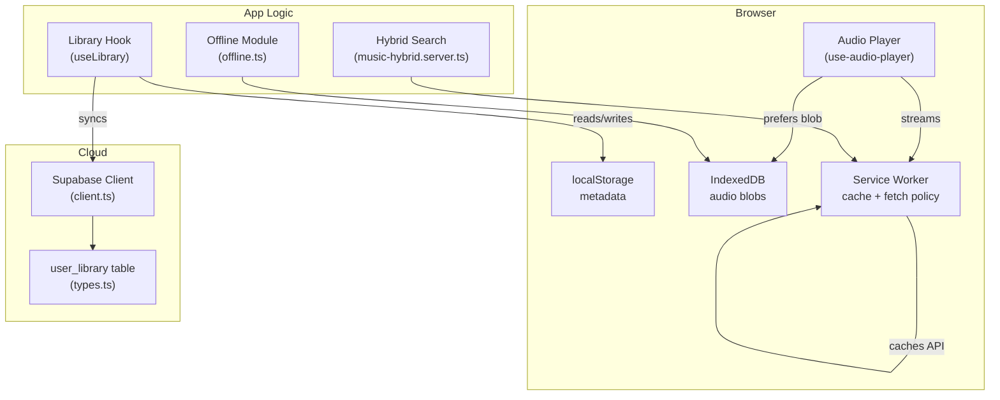
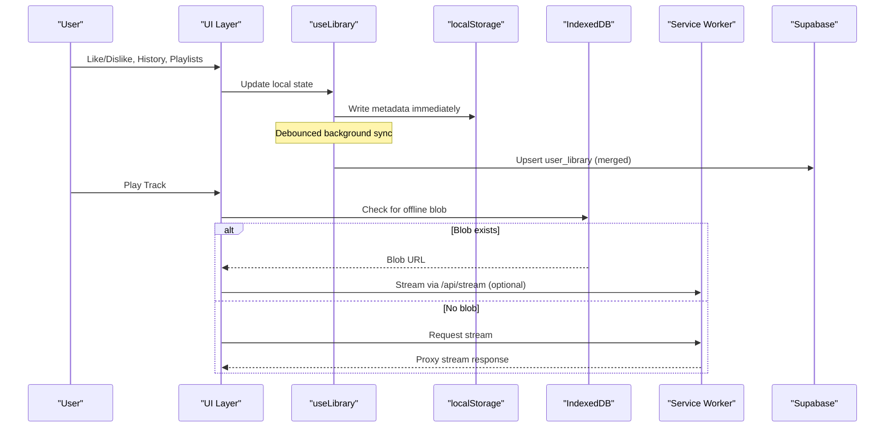
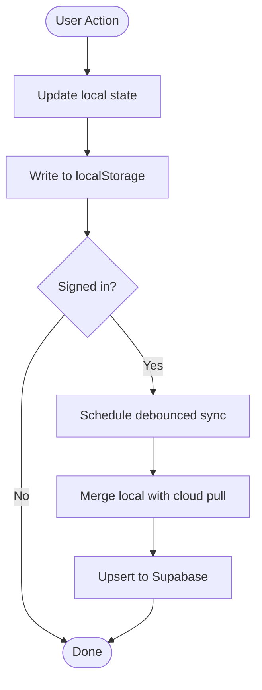
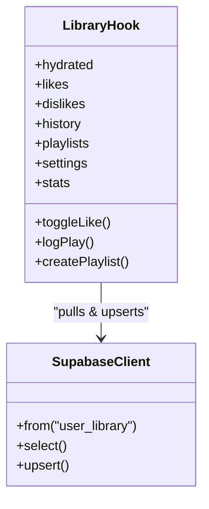
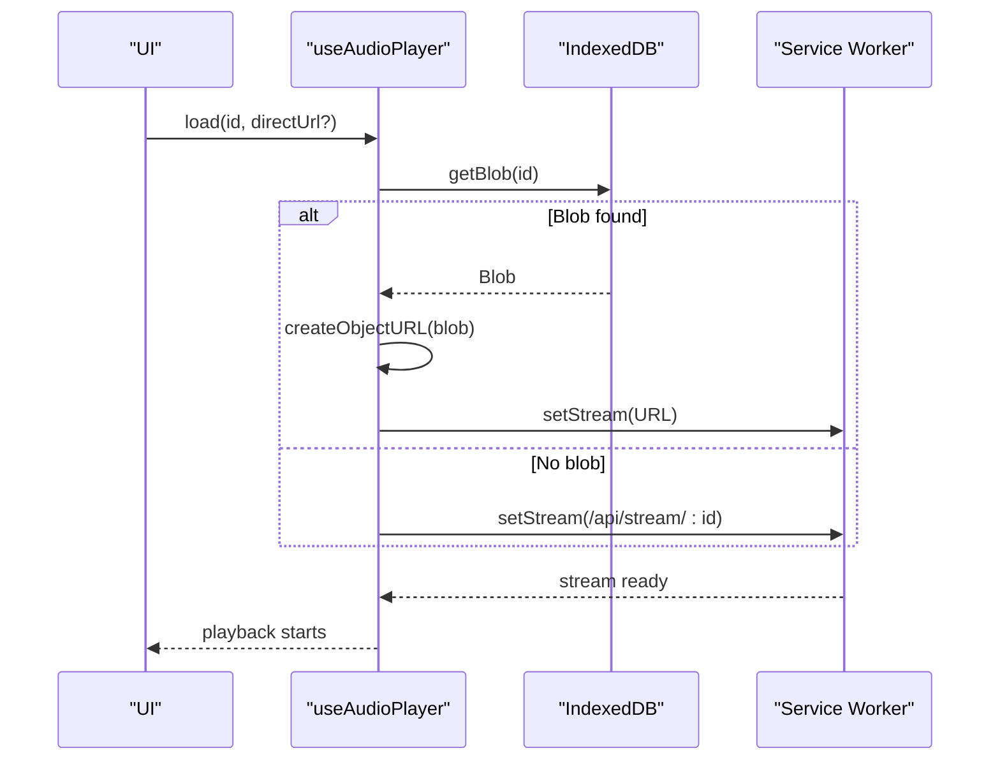
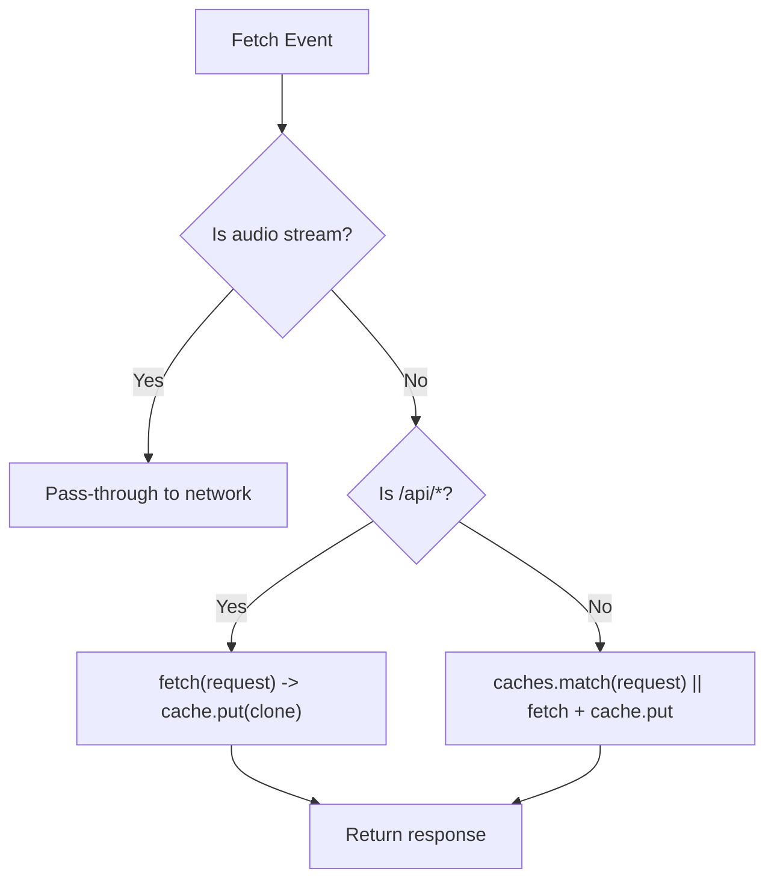
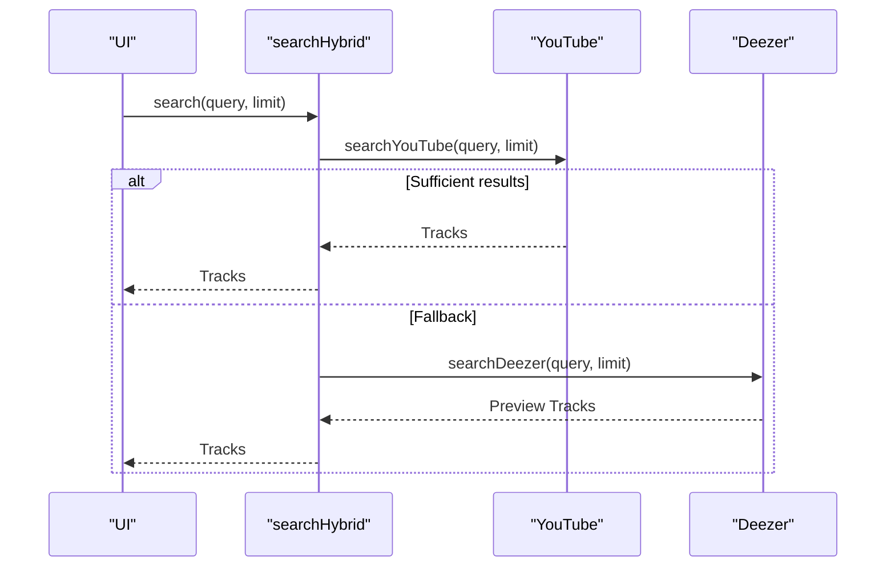
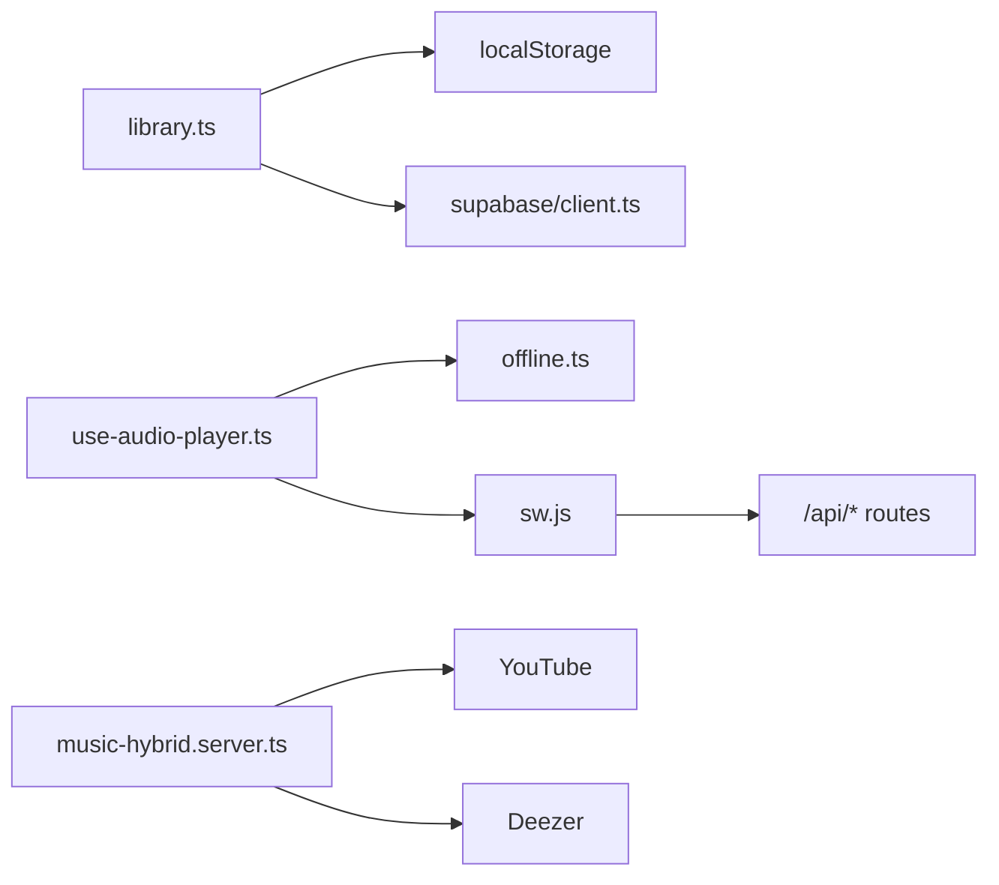

# Local-First Architecture

<cite>
**Referenced Files in This Document**
- [offline.ts](file://src/lib/offline.ts)
- [library.ts](file://src/lib/library.ts)
- [client.ts](file://src/integrations/supabase/client.ts)
- [types.ts](file://src/integrations/supabase/types.ts)
- [music-hybrid.server.ts](file://src/lib/music-hybrid.server.ts)
- [use-audio-player.ts](file://src/lib/use-audio-player.ts)
- [sw.js](file://public/sw.js)
- [music.functions.ts](file://src/lib/music.functions.ts)
</cite>

## Table of Contents
1. [Introduction](#introduction)
2. [Project Structure](#project-structure)
3. [Core Components](#core-components)
4. [Architecture Overview](#architecture-overview)
5. [Detailed Component Analysis](#detailed-component-analysis)
6. [Dependency Analysis](#dependency-analysis)
7. [Performance Considerations](#performance-considerations)
8. [Troubleshooting Guide](#troubleshooting-guide)
9. [Conclusion](#conclusion)

## Introduction
This document explains the local-first architecture implemented in the YouTube Music Companion application. The system prioritizes immediate, offline-capable operations using browser storage (localStorage and IndexedDB), then synchronizes user data to a cloud account via Supabase when online. It combines:
- Instant UI updates from local writes
- Background, debounced sync to the cloud
- Offline playback for downloaded tracks
- Service Worker caching for app shell and API responses
- Hybrid search that ensures playable results even if one provider fails

The result is a responsive experience that works seamlessly online and offline, with robust recovery and conflict resolution strategies during synchronization.

## Project Structure
Key areas implementing the local-first pattern:
- Local persistence layer: localStorage for metadata and IndexedDB for large binary assets
- Cloud sync layer: Supabase client configuration and library upserts
- Playback layer: audio player that prefers offline blobs, falls back to streaming
- Caching layer: Service Worker strategy for network resilience
- Search and media layer: hybrid providers and server functions



**Diagram sources**
- [library.ts:125-143](file://src/lib/library.ts#L125-L143)
- [offline.ts:24-41](file://src/lib/offline.ts#L24-L41)
- [client.ts:30-56](file://src/integrations/supabase/client.ts#L30-L56)
- [types.ts:41-58](file://src/integrations/supabase/types.ts#L41-L58)
- [use-audio-player.ts:123-156](file://src/lib/use-audio-player.ts#L123-L156)
- [sw.js:33-75](file://public/sw.js#L33-L75)

**Section sources**
- [library.ts:125-143](file://src/lib/library.ts#L125-L143)
- [offline.ts:24-41](file://src/lib/offline.ts#L24-L41)
- [client.ts:30-56](file://src/integrations/supabase/client.ts#L30-L56)
- [types.ts:41-58](file://src/integrations/supabase/types.ts#L41-L58)
- [use-audio-player.ts:123-156](file://src/lib/use-audio-player.ts#L123-L156)
- [sw.js:33-75](file://public/sw.js#L33-L75)

## Core Components
- Local metadata store: localStorage keys for likes, dislikes, history, playlists, settings, stats, playback position, and episode positions. Reads are synchronous and fast; writes are wrapped with error handling for quota issues.
- Offline media store: IndexedDB stores audio blobs keyed by track id, with size and timestamp metadata. Includes download utilities, progress callbacks, and storage quota checks.
- Cloud sync: A React hook pulls the user’s library from Supabase on sign-in, merges it with local state, and periodically upserts the merged state back to the cloud.
- Audio player: Prefers locally downloaded blobs for playback; otherwise streams via a same-origin proxy endpoint.
- Service Worker: Pre-caches app shell, caches API responses with network-first fallback, and bypasses caching for large audio streams.

**Section sources**
- [library.ts:105-143](file://src/lib/library.ts#L105-L143)
- [library.ts:149-197](file://src/lib/library.ts#L149-L197)
- [offline.ts:58-141](file://src/lib/offline.ts#L58-L141)
- [client.ts:30-56](file://src/integrations/supabase/client.ts#L30-L56)
- [use-audio-player.ts:123-156](file://src/lib/use-audio-player.ts#L123-L156)
- [sw.js:7-31](file://public/sw.js#L7-L31)
- [sw.js:50-75](file://public/sw.js#L50-L75)

## Architecture Overview
The application follows a local-first design:
- User interactions update local state immediately (localStorage/IndexedDB).
- When signed in, the app pulls the remote copy once per session and merges it into local state.
- Changes are debounced and pushed back to the cloud asynchronously.
- Playback uses offline blobs when available; otherwise streams through a proxy.
- The Service Worker improves resilience by caching app shell and API responses.



**Diagram sources**
- [library.ts:242-349](file://src/lib/library.ts#L242-L349)
- [offline.ts:58-141](file://src/lib/offline.ts#L58-L141)
- [use-audio-player.ts:123-156](file://src/lib/use-audio-player.ts#L123-L156)
- [sw.js:50-75](file://public/sw.js#L50-L75)
- [client.ts:30-56](file://src/integrations/supabase/client.ts#L30-L56)

## Detailed Component Analysis

### Local Metadata Persistence (localStorage)
- Keys include likes, dislikes, history, playlists, settings, stats, playback position, and episode positions.
- Read/write helpers handle environment checks and errors gracefully.
- Playback and episode positions enable resume experiences across sessions.



**Diagram sources**
- [library.ts:125-143](file://src/lib/library.ts#L125-L143)
- [library.ts:242-349](file://src/lib/library.ts#L242-L349)

**Section sources**
- [library.ts:105-143](file://src/lib/library.ts#L105-L143)
- [library.ts:149-197](file://src/lib/library.ts#L149-L197)
- [library.ts:242-349](file://src/lib/library.ts#L242-L349)

### Offline Media Storage (IndexedDB)
- Stores audio blobs with track metadata, size, and timestamps.
- Provides save, get, list, remove, clear, and total size utilities.
- Includes download flow with progress reporting and timeout handling.
- Quota estimation warns when storage is running low.

```mermaid
sequenceDiagram
participant UI as "UI"
participant Off as "offline.ts"
participant IDB as "IndexedDB"
participant Net as "Network"
UI->>Off : downloadTrack(track, onProgress)
Off->>Net : GET /api/stream/ : id
Net-->>Off : Stream chunks
loop For each chunk
Off->>Off : Accumulate bytes
Off->>UI : onProgress(percent)
end
Off->>IDB : saveDownload(track, blob)
IDB-->>Off : success
Off-->>UI : complete
```

**Diagram sources**
- [offline.ts:149-200](file://src/lib/offline.ts#L149-L200)
- [offline.ts:58-83](file://src/lib/offline.ts#L58-L83)

**Section sources**
- [offline.ts:24-41](file://src/lib/offline.ts#L24-L41)
- [offline.ts:58-141](file://src/lib/offline.ts#L58-L141)
- [offline.ts:149-200](file://src/lib/offline.ts#L149-L200)

### Cloud Sync with Supabase
- On sign-in, the app pulls the user’s library from Supabase and merges it with local data using merge-by-id strategies.
- Writes are debounced to avoid spamming the network.
- The Supabase client persists auth sessions in localStorage and configures headers appropriately.



**Diagram sources**
- [library.ts:242-349](file://src/lib/library.ts#L242-L349)
- [client.ts:30-56](file://src/integrations/supabase/client.ts#L30-L56)
- [types.ts:41-58](file://src/integrations/supabase/types.ts#L41-L58)

**Section sources**
- [library.ts:242-349](file://src/lib/library.ts#L242-L349)
- [client.ts:30-56](file://src/integrations/supabase/client.ts#L30-L56)
- [types.ts:41-58](file://src/integrations/supabase/types.ts#L41-L58)

### Audio Player with Offline Priority
- Attempts to play from an offline blob first; if unavailable, streams via the same-origin proxy.
- Supports cueing at a specific time and resuming playback.
- Manages object URLs for offline playback and cleans them up on unmount.



**Diagram sources**
- [use-audio-player.ts:123-156](file://src/lib/use-audio-player.ts#L123-L156)
- [use-audio-player.ts:158-172](file://src/lib/use-audio-player.ts#L158-L172)
- [sw.js:33-75](file://public/sw.js#L33-L75)

**Section sources**
- [use-audio-player.ts:123-156](file://src/lib/use-audio-player.ts#L123-L156)
- [use-audio-player.ts:158-172](file://src/lib/use-audio-player.ts#L158-L172)

### Service Worker Caching Strategy
- App shell cached on install; old caches cleaned on activate.
- API calls use network-first with cache fallback.
- Audio streams bypass caching to avoid bloating storage.



**Diagram sources**
- [sw.js:7-31](file://public/sw.js#L7-L31)
- [sw.js:33-75](file://public/sw.js#L33-L75)

**Section sources**
- [sw.js:7-31](file://public/sw.js#L7-L31)
- [sw.js:33-75](file://public/sw.js#L33-L75)

### Hybrid Search and Recommendations
- Hybrid search tries YouTube first; if insufficient or failing, falls back to Deezer previews.
- Server functions provide recommendations, mixes, new drops, podcast picks, radio, and mood-based suggestions.
- These flows integrate with local state (e.g., liked/recent tracks) to personalize results.



**Diagram sources**
- [music-hybrid.server.ts:22-49](file://src/lib/music-hybrid.server.ts#L22-L49)
- [music.functions.ts:8-21](file://src/lib/music.functions.ts#L8-L21)
- [music.functions.ts:35-44](file://src/lib/music.functions.ts#L35-L44)

**Section sources**
- [music-hybrid.server.ts:22-49](file://src/lib/music-hybrid.server.ts#L22-L49)
- [music.functions.ts:8-21](file://src/lib/music.functions.ts#L8-L21)
- [music.functions.ts:35-44](file://src/lib/music.functions.ts#L35-L44)

## Dependency Analysis
- The library hook depends on localStorage for immediate reads/writes and on Supabase for cloud sync.
- The audio player depends on the offline module for blob retrieval and on the service worker for streaming.
- The service worker intercepts fetch events to implement caching policies.
- Hybrid search composes multiple providers to ensure availability.



**Diagram sources**
- [library.ts:242-349](file://src/lib/library.ts#L242-L349)
- [use-audio-player.ts:123-156](file://src/lib/use-audio-player.ts#L123-L156)
- [sw.js:33-75](file://public/sw.js#L33-L75)
- [music-hybrid.server.ts:22-49](file://src/lib/music-hybrid.server.ts#L22-L49)

**Section sources**
- [library.ts:242-349](file://src/lib/library.ts#L242-L349)
- [use-audio-player.ts:123-156](file://src/lib/use-audio-player.ts#L123-L156)
- [sw.js:33-75](file://public/sw.js#L33-L75)
- [music-hybrid.server.ts:22-49](file://src/lib/music-hybrid.server.ts#L22-L49)

## Performance Considerations
- Immediate UI responsiveness: All user actions update localStorage synchronously before any network call.
- Debounced sync: Cloud writes are throttled to reduce network overhead and prevent race conditions.
- Offline playback: IndexedDB-backed audio blobs eliminate network latency for downloaded content.
- Efficient caching: Service Worker caches app shell and API responses; avoids caching large audio streams.
- Provider fallback: Hybrid search ensures playable results even when primary provider fails.

[No sources needed since this section provides general guidance]

## Troubleshooting Guide
Common issues and resolutions:
- IndexedDB unavailable: If IndexedDB is not supported, offline downloads will fail; fall back to streaming.
- Storage quota exceeded: The offline module estimates remaining storage and warns when low; consider clearing downloads.
- Sync failures: Library sync logs warnings on errors; retry automatically on next change due to debouncing.
- Streaming errors: Audio player handles errors and notifies users; restricted tracks may require manual skip.
- Service Worker cache stale: Use message event to trigger skipWaiting for immediate updates.

**Section sources**
- [offline.ts:24-41](file://src/lib/offline.ts#L24-L41)
- [offline.ts:58-83](file://src/lib/offline.ts#L58-L83)
- [library.ts:321-349](file://src/lib/library.ts#L321-L349)
- [use-audio-player.ts:56-67](file://src/lib/use-audio-player.ts#L56-L67)
- [sw.js:78-81](file://public/sw.js#L78-L81)

## Conclusion
The local-first architecture delivers a resilient, high-performance music experience:
- Instant feedback via local storage
- Seamless offline playback with IndexedDB
- Robust cloud sync with conflict resolution and debouncing
- Network resilience through Service Worker caching and hybrid provider fallback
This approach optimizes both performance and user experience, ensuring the app remains functional and responsive regardless of connectivity.

[No sources needed since this section summarizes without analyzing specific files]