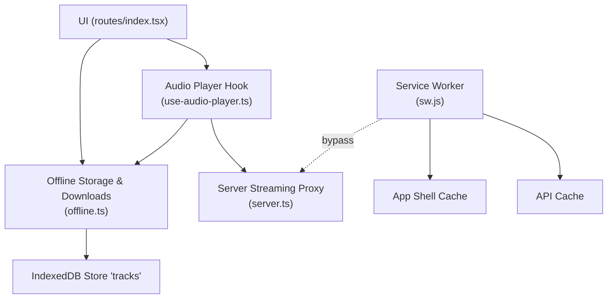
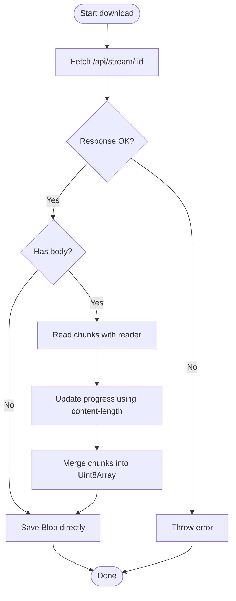
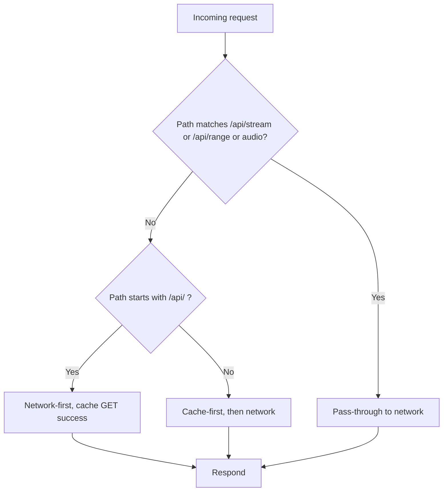
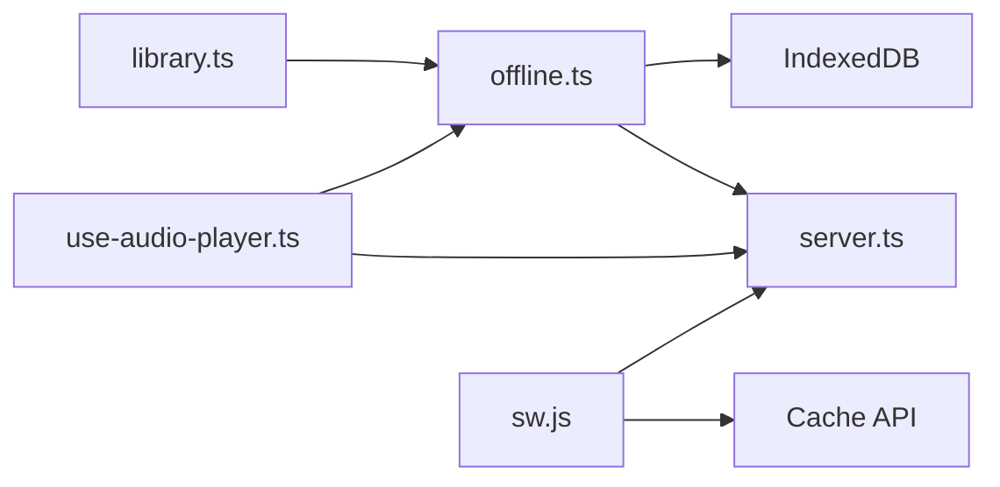

# Offline Storage & Downloads

<cite>
**Referenced Files in This Document**
- [offline.ts](file://src/lib/offline.ts)
- [sw.js](file://public/sw.js)
- [use-audio-player.ts](file://src/lib/use-audio-player.ts)
- [index.tsx](file://src/routes/index.tsx)
- [server.ts](file://src/server.ts)
- [library.ts](file://src/lib/library.ts)
</cite>

## Table of Contents
1. [Introduction](#introduction)
2. [Project Structure](#project-structure)
3. [Core Components](#core-components)
4. [Architecture Overview](#architecture-overview)
5. [Detailed Component Analysis](#detailed-component-analysis)
6. [Dependency Analysis](#dependency-analysis)
7. [Performance Considerations](#performance-considerations)
8. [Troubleshooting Guide](#troubleshooting-guide)
9. [Conclusion](#conclusion)
10. [Appendices](#appendices)

## Introduction
This document explains the offline storage and download system that enables downloading and playing music without internet connectivity. It covers IndexedDB-based blob storage for audio files, a download manager with progress tracking, service worker caching for static assets, and how playback falls back to offline content when available. It also documents storage limits, cleanup strategies, error handling, browser compatibility considerations, and fallback mechanisms.

## Project Structure
The offline system spans several modules:
- Offline storage and downloads: src/lib/offline.ts
- Service worker for app shell and API caching: public/sw.js
- Audio player integration with offline blobs: src/lib/use-audio-player.ts
- UI orchestration for downloads and playback: src/routes/index.tsx
- Server-side streaming proxy enabling range requests and cross-origin access: src/server.ts
- Shared types and local library utilities: src/lib/library.ts



**Diagram sources**
- [offline.ts:10-13](file://src/lib/offline.ts#L10-L13)
- [offline.ts:58-83](file://src/lib/offline.ts#L58-L83)
- [offline.ts:150-200](file://src/lib/offline.ts#L150-L200)
- [use-audio-player.ts:123-156](file://src/lib/use-audio-player.ts#L123-L156)
- [sw.js:37-84](file://public/sw.js#L37-L84)
- [server.ts:48-67](file://src/server.ts#L48-L67)

**Section sources**
- [offline.ts:10-13](file://src/lib/offline.ts#L10-L13)
- [sw.js:1-18](file://public/sw.js#L1-L18)
- [use-audio-player.ts:123-156](file://src/lib/use-audio-player.ts#L123-L156)
- [index.tsx:674-714](file://src/routes/index.tsx#L674-L714)
- [server.ts:48-67](file://src/server.ts#L48-L67)

## Core Components
- Offline storage module: manages IndexedDB database lifecycle, stores audio blobs with metadata, lists/removes/clears downloads, and computes total size.
- Download manager: streams audio via a same-origin proxy, supports progress callbacks, handles timeouts, and persists complete blobs.
- Audio player hook: prefers offline blobs for playback; otherwise streams via the server proxy or direct URL if provided.
- Service worker: caches app shell and API responses, bypasses audio stream caching, and cleans old caches on activation.
- Server streaming proxy: serves bounded byte ranges and full files through a same-origin endpoint to work around CORS and throttling constraints.

**Section sources**
- [offline.ts:24-41](file://src/lib/offline.ts#L24-L41)
- [offline.ts:58-83](file://src/lib/offline.ts#L58-L83)
- [offline.ts:150-200](file://src/lib/offline.ts#L150-L200)
- [use-audio-player.ts:123-156](file://src/lib/use-audio-player.ts#L123-L156)
- [sw.js:37-84](file://public/sw.js#L37-L84)
- [server.ts:48-67](file://src/server.ts#L48-L67)

## Architecture Overview
The system combines client-side persistence with a streaming proxy and a service worker:
- Downloads: The UI triggers a download; the offline module fetches bytes from the server proxy, reports progress, and saves the resulting Blob into IndexedDB under a tracks store.
- Playback: The audio player first attempts to play an offline Blob; if unavailable, it streams via the server proxy or a direct URL.
- Caching: The service worker pre-caches the app shell and caches API GET responses. Audio streams are intentionally not cached by the service worker because they are large and handled by offline downloads.

```mermaid
sequenceDiagram
participant UI as "UI"
participant Off as "Offline Module"
participant SW as "Service Worker"
participant Srv as "Server Proxy"
participant IDB as "IndexedDB"
participant Play as "Audio Player"
UI->>Off : downloadTrack(track, onProgress)
Off->>Srv : GET /api/stream/ : id
Srv-->>Off : stream (bytes, content-length)
Off->>Off : accumulate chunks + progress
Off->>IDB : saveDownload(track, blob)
Note over Off,IDB : Blob stored with metadata
UI->>Play : load(id)
Play->>Off : getBlob(id)
alt Blob exists
Play->>Play : createObjectURL(blob)
Play-->>UI : play offline
else No Blob
Play->>Srv : GET /api/stream/ : id
Srv-->>Play : stream (range-aware)
Play-->>UI : play online
end
Note over SW,Srv : SW bypasses /api/stream and /api/range
```

**Diagram sources**
- [offline.ts:150-200](file://src/lib/offline.ts#L150-L200)
- [offline.ts:58-83](file://src/lib/offline.ts#L58-L83)
- [use-audio-player.ts:123-156](file://src/lib/use-audio-player.ts#L123-L156)
- [sw.js:41-50](file://public/sw.js#L41-L50)
- [server.ts:48-67](file://src/server.ts#L48-L67)

## Detailed Component Analysis

### Offline Storage and Downloads (IndexedDB)
- Database schema: A single object store named tracks holds records keyed by track id, including the track metadata, the audio Blob, size, and saved timestamp.
- Persistence: saveDownload writes a record; listDownloads enumerates all records; removeDownload deletes a single entry; clearDownloads empties the store; totalDownloadSize sums sizes.
- Quota awareness: Before saving, the module estimates storage quota and warns when remaining space is low.
- Download flow: Uses fetch against the server proxy, reads the response body with a ReadableStream reader, accumulates chunks, updates progress based on content-length, merges chunks into a final Blob, and saves it. Includes a timeout to abort long-running downloads.



**Diagram sources**
- [offline.ts:150-200](file://src/lib/offline.ts#L150-L200)
- [offline.ts:58-83](file://src/lib/offline.ts#L58-L83)

**Section sources**
- [offline.ts:10-13](file://src/lib/offline.ts#L10-L13)
- [offline.ts:24-41](file://src/lib/offline.ts#L24-L41)
- [offline.ts:58-83](file://src/lib/offline.ts#L58-L83)
- [offline.ts:85-95](file://src/lib/offline.ts#L85-L95)
- [offline.ts:103-141](file://src/lib/offline.ts#L103-L141)
- [offline.ts:150-200](file://src/lib/offline.ts#L150-L200)

### Audio Player Integration (Offline-first Playback)
- Offline preference: When loading or cueing a track, the player first tries to retrieve a Blob from IndexedDB. If found, it creates an object URL and plays locally, enabling playback without network.
- Online fallback: If no offline Blob exists, it streams via the server proxy or a direct URL if provided.
- Lifecycle management: Ensures object URLs are revoked on unmount or replacement; handles autoplay policies and errors gracefully.

```mermaid
sequenceDiagram
participant UI as "UI"
participant Player as "Audio Player"
participant Off as "Offline Module"
participant Srv as "Server Proxy"
UI->>Player : load(id)
Player->>Off : getBlob(id)
alt Blob found
Player->>Player : createObjectURL(blob)
Player-->>UI : play offline
else No Blob
Player->>Srv : GET /api/stream/ : id
Srv-->>Player : stream (range-aware)
Player-->>UI : play online
end
```

**Diagram sources**
- [use-audio-player.ts:123-156](file://src/lib/use-audio-player.ts#L123-L156)
- [offline.ts:85-95](file://src/lib/offline.ts#L85-L95)
- [server.ts:48-67](file://src/server.ts#L48-L67)

**Section sources**
- [use-audio-player.ts:123-156](file://src/lib/use-audio-player.ts#L123-L156)
- [use-audio-player.ts:158-172](file://src/lib/use-audio-player.ts#L158-L172)

### Service Worker Caching Strategy
- App shell caching: On install, caches core shell assets to enable offline loading of the UI.
- API caching: For /api/* requests, uses network-first with cache fallback; caches successful GET responses.
- Audio bypass: Requests to /api/stream, /api/range, and audio destinations are passed through to the network to avoid bloating cache quotas; offline audio is managed via IndexedDB instead.
- Cache maintenance: On activate, deletes caches not in the active set and claims clients.



**Diagram sources**
- [sw.js:37-84](file://public/sw.js#L37-L84)

**Section sources**
- [sw.js:1-18](file://public/sw.js#L1-L18)
- [sw.js:20-33](file://public/sw.js#L20-L33)
- [sw.js:37-84](file://public/sw.js#L37-L84)

### Server Streaming Proxy
- Purpose: Provides a same-origin endpoint to stream audio, solving CORS restrictions and working around throttled or open-ended range requests from upstream providers.
- Behavior: Supports both full-file downloads (for offline storage) and range requests (for seeking), returning appropriate headers and status codes.

**Section sources**
- [server.ts:48-67](file://src/server.ts#L48-L67)
- [server.ts:135-175](file://src/server.ts#L135-L175)

### UI Orchestration and Queue Management
- Download controls: The UI prevents duplicate downloads per track, shows downloading state, handles errors, refreshes the download list, and allows removing or clearing all downloads.
- Queue behavior: Tracks are enqueued for playback; when playing from the downloads view, the queue is initialized with downloaded tracks.

**Section sources**
- [index.tsx:674-714](file://src/routes/index.tsx#L674-L714)
- [index.tsx:1215-1248](file://src/routes/index.tsx#L1215-L1248)

## Dependency Analysis
- offline.ts depends on:
  - Track type from library.ts
  - IndexedDB APIs
  - navigator.storage for quota estimation
  - fetch for streaming from server proxy
- use-audio-player.ts depends on:
  - offline.ts for getBlob
  - HTML5 Audio element
- sw.js depends on:
  - Cache API
  - Network fetch
- server.ts provides endpoints consumed by offline.ts and use-audio-player.ts



**Diagram sources**
- [offline.ts:1-2](file://src/lib/offline.ts#L1-L2)
- [use-audio-player.ts:1-4](file://src/lib/use-audio-player.ts#L1-L4)
- [sw.js:37-84](file://public/sw.js#L37-L84)
- [server.ts:48-67](file://src/server.ts#L48-L67)

**Section sources**
- [offline.ts:1-2](file://src/lib/offline.ts#L1-L2)
- [use-audio-player.ts:1-4](file://src/lib/use-audio-player.ts#L1-L4)
- [sw.js:37-84](file://public/sw.js#L37-L84)
- [server.ts:48-67](file://src/server.ts#L48-L67)

## Performance Considerations
- Streaming accumulation: The download process accumulates chunks in memory before creating a final Blob. For very large files, this can increase memory usage during download.
- Content-length reliance: Progress reporting depends on content-length; if missing, progress may not be shown accurately.
- Range requests: The server proxy splits large streams into bounded chunks to comply with upstream constraints, improving reliability and seek performance.
- Service worker caching: Avoids caching large audio streams to prevent quota exhaustion; relies on IndexedDB for offline audio.

[No sources needed since this section provides general guidance]

## Troubleshooting Guide
Common issues and resolutions:
- IndexedDB unavailable: If the environment lacks IndexedDB, operations will fail early. Ensure modern browser support or provide a fallback path.
- Storage quota warnings: The module logs warnings when remaining storage is low. Users should free space by removing downloads or clearing all.
- Download failures: Network errors or non-OK responses result in thrown errors; UI surfaces messages to users. Timeouts trigger specific error messages.
- Playback errors: If offline playback fails, the player falls back to online streaming; persistent errors surface user-facing messages.

Operational tips:
- Use listDownloads to verify stored tracks and sizes.
- Use removeDownload or clearDownloads to manage storage.
- Monitor console warnings for storage and download issues.

**Section sources**
- [offline.ts:24-41](file://src/lib/offline.ts#L24-L41)
- [offline.ts:58-83](file://src/lib/offline.ts#L58-L83)
- [offline.ts:150-200](file://src/lib/offline.ts#L150-L200)
- [use-audio-player.ts:123-156](file://src/lib/use-audio-player.ts#L123-L156)
- [index.tsx:674-714](file://src/routes/index.tsx#L674-L714)

## Conclusion
The offline storage system leverages IndexedDB to persist audio Blobs alongside metadata, enabling seamless offline playback. Downloads are streamed via a server proxy with progress tracking and robust error handling. The service worker ensures the app shell and API responses are cached while avoiding expensive audio stream caching. Together, these components deliver a resilient offline experience with practical storage management and clear fallback paths.

[No sources needed since this section summarizes without analyzing specific files]

## Appendices

### Examples

- Initiating a download:
  - Call the download function with a track and optional progress callback.
  - Reference: [downloadTrack:150-200](file://src/lib/offline.ts#L150-L200)

- Checking download status:
  - List current downloads and compute total size.
  - References: [listDownloads:103-114](file://src/lib/offline.ts#L103-L114), [totalDownloadSize:138-141](file://src/lib/offline.ts#L138-L141)

- Playing offline content:
  - Attempt to retrieve a Blob and play via object URL; fall back to streaming if unavailable.
  - Reference: [playOffline/load:123-156](file://src/lib/use-audio-player.ts#L123-L156)

- Removing or clearing downloads:
  - Remove a single download or clear all entries.
  - References: [removeDownload:116-125](file://src/lib/offline.ts#L116-L125), [clearDownloads:127-136](file://src/lib/offline.ts#L127-L136)

### Storage Limits and Cleanup Strategies
- Quota estimation: The module checks available quota and warns when remaining space is low.
- Cleanup: Provide user actions to remove individual downloads or clear all; consider implementing periodic cleanup based on total size thresholds.
- References: [saveDownload quota check:58-83](file://src/lib/offline.ts#L58-L83), [clearDownloads:127-136](file://src/lib/offline.ts#L127-L136)

### Browser Compatibility and Fallbacks
- IndexedDB availability: Operations guard against missing IndexedDB and reject early.
- Service worker: Relies on Cache API; ensure registration and proper scope.
- Fallback strategy: If offline playback fails, the player streams online; if IndexedDB is unavailable, offline features are disabled.
- References: [openDb guard:24-41](file://src/lib/offline.ts#L24-L41), [sw.js fetch pass-through:41-50](file://public/sw.js#L41-L50)