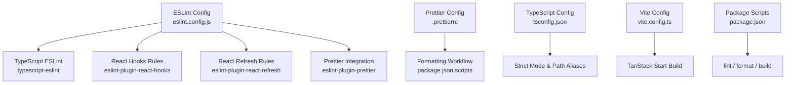
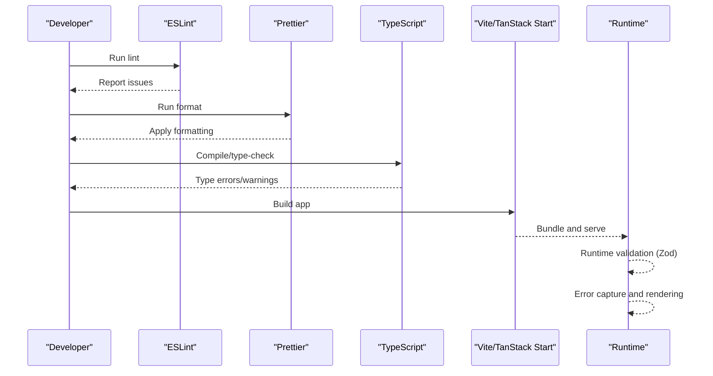
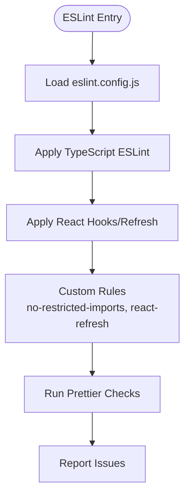
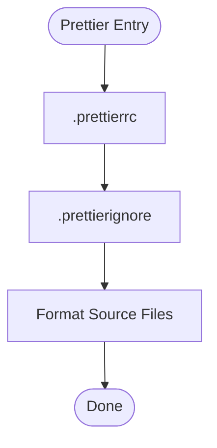
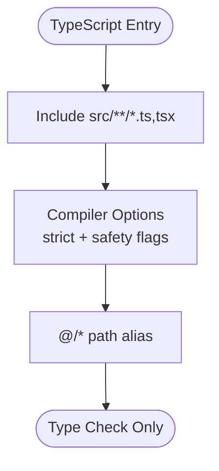
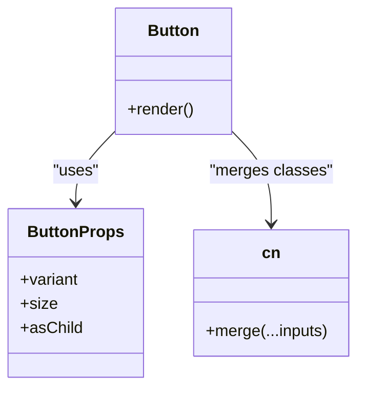
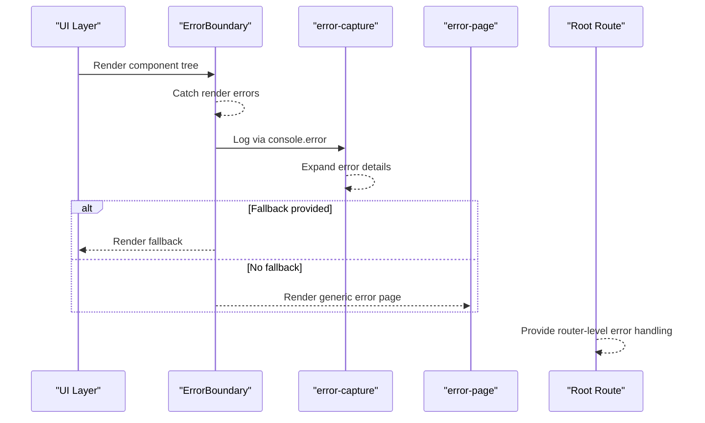
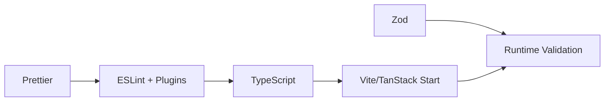

# Code Quality Tools

<cite>
**Referenced Files in This Document**
- [eslint.config.js](file://eslint.config.js)
- [.prettierrc](file://.prettierrc)
- [.prettierignore](file://.prettierignore)
- [tsconfig.json](file://tsconfig.json)
- [package.json](file://package.json)
- [vite.config.ts](file://vite.config.ts)
- [src/components/ui/button.tsx](file://src/components/ui/button.tsx)
- [src/lib/utils.ts](file://src/lib/utils.ts)
- [src/components/music/ErrorBoundary.tsx](file://src/components/music/ErrorBoundary.tsx)
- [src/lib/error-capture.ts](file://src/lib/error-capture.ts)
- [src/lib/error-page.ts](file://src/lib/error-page.ts)
- [src/routes/__root.tsx](file://src/routes/__root.tsx)
</cite>

## Table of Contents
1. Introduction
2. Project Structure
3. Core Components
4. Architecture Overview
5. Detailed Component Analysis
6. Dependency Analysis
7. Performance Considerations
8. Troubleshooting Guide
9. Conclusion
10. Appendices

## Introduction
This document explains the code quality tooling and configuration for the YouTube Music Companion project. It covers ESLint rules and plugins, Prettier formatting conventions, TypeScript strictness and type safety practices, component composition patterns, runtime validation with Zod, error handling strategies, and guidance for code review and continuous integration. It also includes performance considerations and bundle size optimization techniques relevant to this codebase.

## Project Structure
The project uses a modern TypeScript + React stack with Vite as the build tool and TanStack Start for routing/SSR. Code quality is enforced via ESLint and Prettier, while TypeScript provides compile-time guarantees. Runtime validation relies on Zod, and errors are captured and rendered consistently across client and server contexts.

**Diagram sources**
- [eslint.config.js:1-41](file://eslint.config.js#L1-L41)
- [.prettierrc:1-7](file://.prettierrc#L1-L7)
- [tsconfig.json:1-31](file://tsconfig.json#L1-L31)
- [vite.config.ts:1-16](file://vite.config.ts#L1-L16)
- [package.json:1-92](file://package.json#L1-L92)

**Section sources**
- [eslint.config.js:1-41](file://eslint.config.js#L1-L41)
- [.prettierrc:1-7](file://.prettierrc#L1-L7)
- [.prettierignore:1-9](file://.prettierignore#L1-L9)
- [tsconfig.json:1-31](file://tsconfig.json#L1-L31)
- [vite.config.ts:1-16](file://vite.config.ts#L1-L16)
- [package.json:1-92](file://package.json#L1-L92)

## Core Components
- ESLint configuration integrates recommended JavaScript and TypeScript rules, React hooks and refresh checks, and custom restrictions (e.g., disallowing Next.js-specific imports). It also disables unused variable warnings to keep focus on real issues.
- Prettier enforces consistent formatting with a 100-column width, semicolons, double quotes, and trailing commas. Generated files and lockfiles are ignored.
- TypeScript is configured with strict mode enabled and additional safety flags such as noUncheckedIndexedAccess and exactOptionalPropertyTypes. Path aliases simplify imports.
- Vite config delegates to a TanStack Start preset and sets the server entry point for SSR builds.
- Package scripts provide lint and format commands for local development and CI.

**Section sources**
- [eslint.config.js:1-41](file://eslint.config.js#L1-L41)
- [.prettierrc:1-7](file://.prettierrc#L1-L7)
- [.prettierignore:1-9](file://.prettierignore#L1-L9)
- [tsconfig.json:1-31](file://tsconfig.json#L1-L31)
- [vite.config.ts:1-16](file://vite.config.ts#L1-L16)
- [package.json:1-92](file://package.json#L1-L92)

## Architecture Overview
Quality tools operate at different layers:
- Static analysis: ESLint runs against TypeScript source files to enforce style and correctness.
- Formatting: Prettier formats code consistently and ignores generated artifacts.
- Type checking: TypeScript compiler validates types and enforces strict rules.
- Runtime validation: Zod schemas validate data at runtime where needed.
- Error handling: Centralized capture and rendering ensure consistent user experience and diagnostics.

[No sources needed since this diagram shows conceptual workflow, not actual code structure]

## Detailed Component Analysis

### ESLint Configuration
- Extends recommended JS and TS configs and applies them to TypeScript files.
- Enables React hooks and React Refresh rules to catch common pitfalls and support fast refresh.
- Disallows importing Next.js-specific modules to align with TanStack Start.
- Warns when exporting non-component components from React Refresh context.
- Integrates Prettier so linting also checks formatting.

**Diagram sources**
- [eslint.config.js:1-41](file://eslint.config.js#L1-L41)

**Section sources**
- [eslint.config.js:1-41](file://eslint.config.js#L1-L41)

### Prettier Formatting
- Enforces consistent style: print width, semicolons, quote style, and trailing commas.
- Ignores generated or large files to keep formatting fast and deterministic.

**Diagram sources**
- [.prettierrc:1-7](file://.prettierrc#L1-L7)
- [.prettierignore:1-9](file://.prettierignore#L1-L9)

**Section sources**
- [.prettierrc:1-7](file://.prettierrc#L1-L7)
- [.prettierignore:1-9](file://.prettierignore#L1-L9)

### TypeScript Configuration and Strictness
- Targets ES2022 with JSX transform and module resolution suited for bundlers.
- Enables strict mode plus additional safety flags: noImplicitOverride, noImplicitReturns, noPropertyAccessFromIndexSignature, noUncheckedIndexedAccess, exactOptionalPropertyTypes, noUncheckedSideEffectImports.
- Uses path alias @/* mapped to src/* for cleaner imports.
- No emit mode ensures TypeScript is used purely for type checking during development/build.

**Diagram sources**
- [tsconfig.json:1-31](file://tsconfig.json#L1-L31)

**Section sources**
- [tsconfig.json:1-31](file://tsconfig.json#L1-L31)

### Component Composition Patterns
- Reusable UI components use class-variance-authority for variant-based styling and a shared utility to merge Tailwind classes safely.
- Components are typed with explicit props interfaces and forwardRef for accessibility and flexibility.
- The button component demonstrates variants (default, destructive, outline, etc.) and sizes (default, sm, lg, icon), composed with a className merger utility.

**Diagram sources**
- [src/components/ui/button.tsx:1-50](file://src/components/ui/button.tsx#L1-L50)
- [src/lib/utils.ts:1-7](file://src/lib/utils.ts#L1-L7)

**Section sources**
- [src/components/ui/button.tsx:1-50](file://src/components/ui/button.tsx#L1-L50)
- [src/lib/utils.ts:1-7](file://src/lib/utils.ts#L1-L7)

### Prop Validation with Zod
- Zod is included as a dependency for runtime validation. Use it to validate API responses, form inputs, and environment values before they enter application logic.
- Integrate Zod with React Hook Form using the provided resolver package to get strong typing and validation feedback in forms.

Guidelines:
- Define schemas near the boundary where data enters the app (API responses, user input).
- Derive TypeScript types from schemas to avoid duplication.
- Validate early and fail fast; surface user-friendly messages.

[No sources needed since this section provides general guidance based on dependencies and best practices]

### Error Handling Strategies
- Client-side error boundary captures render errors, offers recovery actions, and logs diagnostic info in development.
- Server-side error capture wraps console.error to preserve stack traces and cause chains, and exposes a helper to consume the last captured error.
- A minimal HTML error page is available for fallback rendering.
- Root route wires up global error handling and navigation options.

**Diagram sources**
- [src/components/music/ErrorBoundary.tsx:1-97](file://src/components/music/ErrorBoundary.tsx#L1-L97)
- [src/lib/error-capture.ts:1-82](file://src/lib/error-capture.ts#L1-L82)
- [src/lib/error-page.ts:1-41](file://src/lib/error-page.ts#L1-L41)
- [src/routes/__root.tsx:1-154](file://src/routes/__root.tsx#L1-L154)

**Section sources**
- [src/components/music/ErrorBoundary.tsx:1-97](file://src/components/music/ErrorBoundary.tsx#L1-L97)
- [src/lib/error-capture.ts:1-82](file://src/lib/error-capture.ts#L1-L82)
- [src/lib/error-page.ts:1-41](file://src/lib/error-page.ts#L1-L41)
- [src/routes/__root.tsx:1-154](file://src/routes/__root.tsx#L1-L154)

## Dependency Analysis
Quality-related dependencies and their roles:
- ESLint and plugins enforce code standards and React best practices.
- Prettier standardizes formatting.
- TypeScript provides compile-time checks and stricter defaults.
- Vite and TanStack Start configure the build pipeline.
- Zod enables runtime validation.

**Diagram sources**
- [package.json:1-92](file://package.json#L1-L92)
- [eslint.config.js:1-41](file://eslint.config.js#L1-L41)
- [.prettierrc:1-7](file://.prettierrc#L1-L7)
- [tsconfig.json:1-31](file://tsconfig.json#L1-L31)
- [vite.config.ts:1-16](file://vite.config.ts#L1-L16)

**Section sources**
- [package.json:1-92](file://package.json#L1-L92)

## Performance Considerations
- Keep ESLint and Prettier configurations minimal and targeted to reduce lint times.
- Avoid unnecessary re-renders by leveraging memoization and stable prop references in components.
- Prefer lazy loading for heavy routes or features to reduce initial bundle size.
- Use dynamic imports for optional integrations or large libraries.
- Ensure assets and fonts are preconnected only where necessary to avoid blocking critical rendering.
- Monitor bundle size with your build tool’s reporting and remove dead code paths.

[No sources needed since this section provides general guidance]

## Troubleshooting Guide
Common issues and resolutions:
- Lint failures due to import restrictions: Replace restricted imports with allowed alternatives or rename modules to match project conventions.
- Formatting conflicts: Ensure editors run Prettier on save and that ignore lists exclude generated files.
- TypeScript strict errors: Address unsafe access patterns flagged by strict flags; prefer explicit optional handling and index access checks.
- Runtime errors: Wrap risky UI sections with the error boundary; verify error capture is active and logs include full stacks.
- Build issues: Confirm Vite config does not duplicate plugins and that server entry points are correctly set.

**Section sources**
- [eslint.config.js:1-41](file://eslint.config.js#L1-L41)
- [.prettierrc:1-7](file://.prettierrc#L1-L7)
- [.prettierignore:1-9](file://.prettierignore#L1-L9)
- [tsconfig.json:1-31](file://tsconfig.json#L1-L31)
- [vite.config.ts:1-16](file://vite.config.ts#L1-L16)
- [src/components/music/ErrorBoundary.tsx:1-97](file://src/components/music/ErrorBoundary.tsx#L1-L97)
- [src/lib/error-capture.ts:1-82](file://src/lib/error-capture.ts#L1-L82)

## Conclusion
The project adopts a robust quality foundation: strict TypeScript settings, comprehensive ESLint rules tailored to React and TanStack Start, consistent Prettier formatting, and resilient error handling. By following the guidelines here—especially around component composition, runtime validation with Zod, and disciplined error handling—you can maintain high code quality, improve developer experience, and deliver reliable user experiences.

## Appendices

### Automated Workflows and CI Recommendations
- Local scripts:
  - Lint: npm run lint
  - Format: npm run format
  - Build: npm run build
- Suggested CI steps:
  - Install dependencies
  - Run lint
  - Run format check (fail if diffs)
  - Run TypeScript type check
  - Build the app
  - Optionally run tests and bundle size checks

[No sources needed since this section provides general guidance]

### Code Review Checklist
- Are new components composed using established patterns (variants, className merging)?
- Are runtime inputs validated with Zod before processing?
- Are errors handled gracefully with boundaries and informative fallbacks?
- Do changes adhere to ESLint and Prettier rules without manual overrides?
- Are there any performance regressions (new heavy dependencies, missing lazy loads)?

[No sources needed since this section provides general guidance]