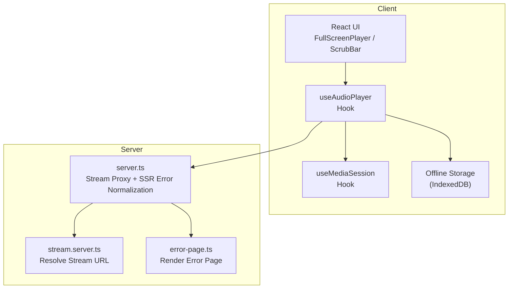
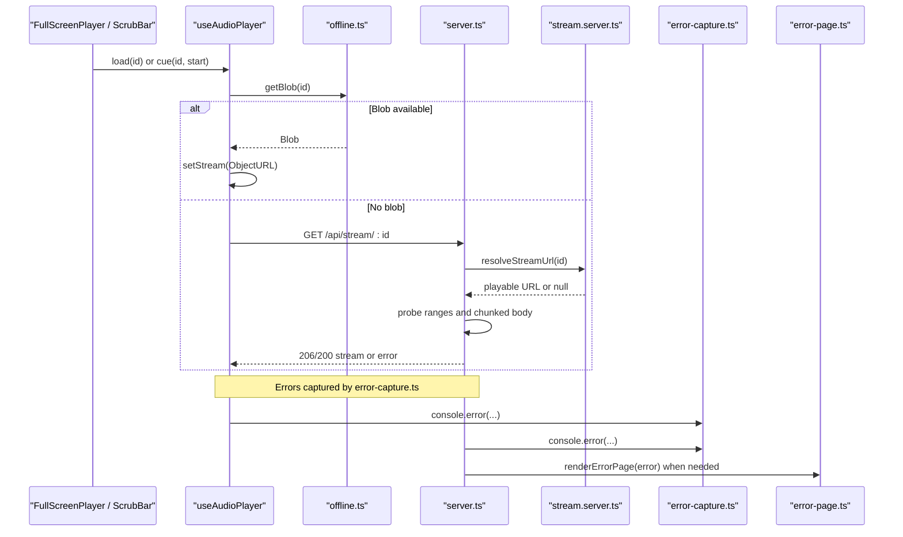
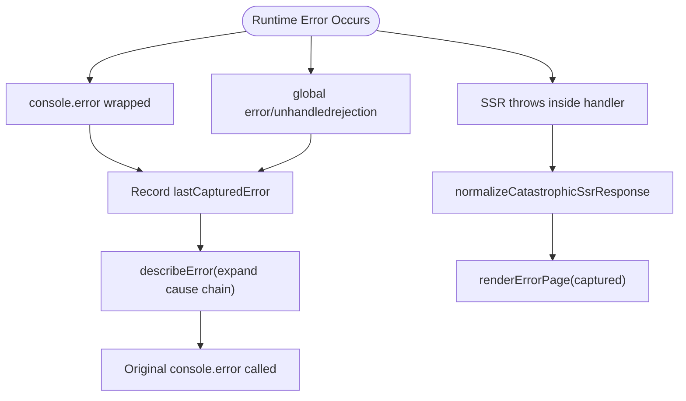
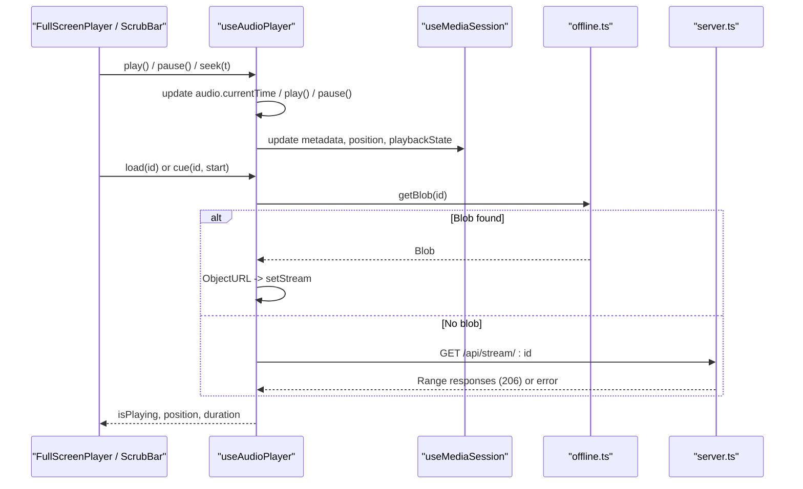
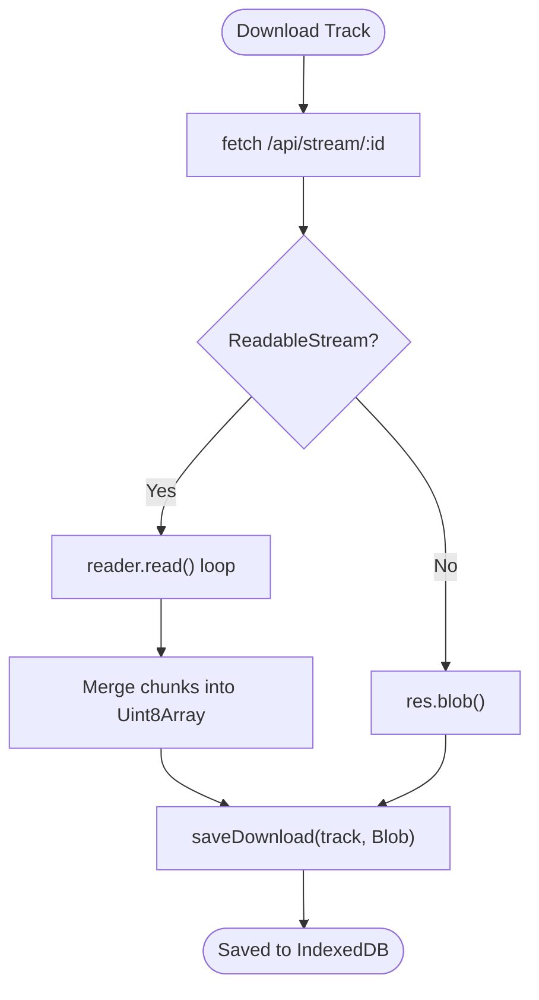
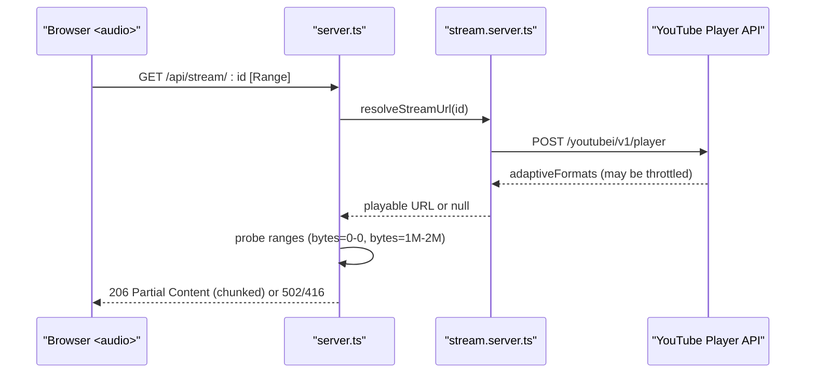
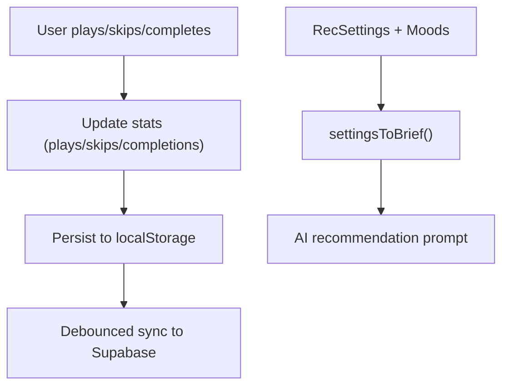
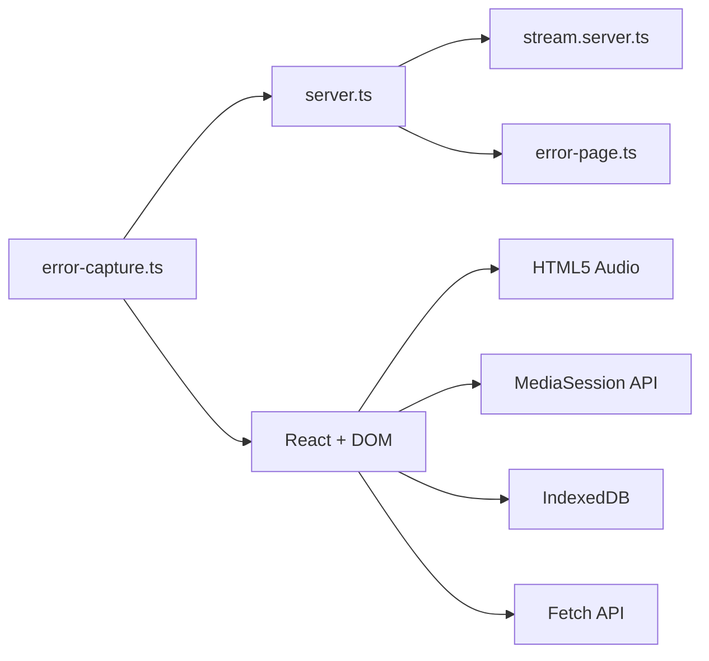

# Debugging & Profiling

<cite>
**Referenced Files in This Document**
- [error-capture.ts](file://src/lib/error-capture.ts)
- [lovable-error-reporting.ts](file://src/lib/lovable-error-reporting.ts)
- [ErrorBoundary.tsx](file://src/components/music/ErrorBoundary.tsx)
- [use-audio-player.ts](file://src/lib/use-audio-player.ts)
- [offline.ts](file://src/lib/offline.ts)
- [server.ts](file://src/server.ts)
- [stream.server.ts](file://src/lib/stream.server.ts)
- [error-page.ts](file://src/lib/error-page.ts)
- [FullScreenPlayer.tsx](file://src/components/music/ui/FullScreenPlayer.tsx)
- [ScrubBar.tsx](file://src/components/music/ScrubBar.tsx)
- [use-media-session.ts](file://src/lib/use-media-session.ts)
- [library.ts](file://src/lib/library.ts)
- [package.json](file://package.json)
</cite>

## Table of Contents
1. [Introduction](#introduction)
2. [Project Structure](#project-structure)
3. [Core Components](#core-components)
4. [Architecture Overview](#architecture-overview)
5. [Detailed Component Analysis](#detailed-component-analysis)
6. [Dependency Analysis](#dependency-analysis)
7. [Performance Considerations](#performance-considerations)
8. [Troubleshooting Guide](#troubleshooting-guide)
9. [Conclusion](#conclusion)
10. [Appendices](#appendices)

## Introduction
This document provides a comprehensive debugging and profiling guide for the YouTube Music Companion project. It covers:
- React component and custom hook debugging strategies
- Server-side error capture, logging, and recovery
- Client-side error tracking and reporting
- Performance profiling with browser tools and React DevTools
- Audio playback troubleshooting (network, streaming, offline)
- IndexedDB operations debugging
- Memory leak detection, bundle analysis, and bottleneck identification
- AI-powered features and recommendation algorithm debugging
- Real-time data synchronization issues
- Browser compatibility and deployment challenges

## Project Structure
The application is built on TanStack Start with a client-side React UI and a server entry that handles streaming and SSR error normalization. Key areas relevant to debugging:
- Error capture and reporting utilities
- Audio player hook and media session integration
- Offline storage via IndexedDB
- Server-side stream proxy and error handling
- UI components for playback controls

**Diagram sources**
- [server.ts:181-199](file://src/server.ts#L181-L199)
- [stream.server.ts:108-123](file://src/lib/stream.server.ts#L108-L123)
- [error-page.ts:1-41](file://src/lib/error-page.ts#L1-L41)
- [use-audio-player.ts:16-213](file://src/lib/use-audio-player.ts#L16-L213)
- [use-media-session.ts:13-83](file://src/lib/use-media-session.ts#L13-L83)
- [offline.ts:24-48](file://src/lib/offline.ts#L24-L48)
- [FullScreenPlayer.tsx:44-257](file://src/components/music/ui/FullScreenPlayer.tsx#L44-L257)
- [ScrubBar.tsx:14-145](file://src/components/music/ScrubBar.tsx#L14-L145)

**Section sources**
- [server.ts:181-199](file://src/server.ts#L181-L199)
- [stream.server.ts:108-123](file://src/lib/stream.server.ts#L108-L123)
- [error-page.ts:1-41](file://src/lib/error-page.ts#L1-L41)
- [use-audio-player.ts:16-213](file://src/lib/use-audio-player.ts#L16-L213)
- [use-media-session.ts:13-83](file://src/lib/use-media-session.ts#L13-L83)
- [offline.ts:24-48](file://src/lib/offline.ts#L24-L48)
- [FullScreenPlayer.tsx:44-257](file://src/components/music/ui/FullScreenPlayer.tsx#L44-L257)
- [ScrubBar.tsx:14-145](file://src/components/music/ScrubBar.tsx#L14-L145)

## Core Components
- Error capture and reporting:
  - Global console.error wrapper captures errors and expands cause chains; also listens to global error and unhandledrejection events.
  - Lovable error reporting utility logs runtime errors with context.
  - React ErrorBoundary catches render errors, shows user-friendly fallback, and logs details in development.
- Audio playback:
  - useAudioPlayer manages HTML5 audio lifecycle, network vs offline playback, seeking, volume, and error callbacks.
  - useMediaSession syncs OS lock-screen/media controls with app state.
- Offline storage:
  - IndexedDB wrapper for saving/retrieving downloaded tracks, listing, removing, clearing, and total size calculation.
- Server streaming:
  - server.ts proxies audio streams, handles range requests, probes upstream availability, and normalizes SSR errors into a rendered error page.
  - stream.server.ts resolves direct audio URLs from YouTube’s internal API with retries and probing.

**Section sources**
- [error-capture.ts:1-82](file://src/lib/error-capture.ts#L1-L82)
- [lovable-error-reporting.ts:1-9](file://src/lib/lovable-error-reporting.ts#L1-L9)
- [ErrorBoundary.tsx:1-97](file://src/components/music/ErrorBoundary.tsx#L1-L97)
- [use-audio-player.ts:16-213](file://src/lib/use-audio-player.ts#L16-L213)
- [use-media-session.ts:13-83](file://src/lib/use-media-session.ts#L13-L83)
- [offline.ts:58-147](file://src/lib/offline.ts#L58-L147)
- [server.ts:21-179](file://src/server.ts#L21-L179)
- [stream.server.ts:47-123](file://src/lib/stream.server.ts#L47-L123)

## Architecture Overview
The streaming and error-handling flow spans client hooks, server proxy, and error rendering.

**Diagram sources**
- [use-audio-player.ts:143-172](file://src/lib/use-audio-player.ts#L143-L172)
- [offline.ts:85-95](file://src/lib/offline.ts#L85-L95)
- [server.ts:102-179](file://src/server.ts#L102-L179)
- [stream.server.ts:108-123](file://src/lib/stream.server.ts#L108-L123)
- [error-capture.ts:52-82](file://src/lib/error-capture.ts#L52-L82)
- [error-page.ts:1-41](file://src/lib/error-page.ts#L1-L41)

## Detailed Component Analysis

### Error Capture and Reporting
- Global error capture:
  - Wraps console.error to expand Error objects and record last captured error with TTL.
  - Listens to global error and unhandledrejection to record uncaught exceptions.
- SSR error normalization:
  - Detects h3-swallowed errors and renders a friendly error page with captured stack traces.
- React error boundary:
  - Catches render-time errors, offers reload and recovery attempts, and logs detailed info in development.

**Diagram sources**
- [error-capture.ts:7-32](file://src/lib/error-capture.ts#L7-L32)
- [error-capture.ts:52-82](file://src/lib/error-capture.ts#L52-L82)
- [server.ts:21-46](file://src/server.ts#L21-L46)
- [error-page.ts:1-41](file://src/lib/error-page.ts#L1-L41)

**Section sources**
- [error-capture.ts:1-82](file://src/lib/error-capture.ts#L1-L82)
- [server.ts:21-46](file://src/server.ts#L21-L46)
- [error-page.ts:1-41](file://src/lib/error-page.ts#L1-L41)
- [ErrorBoundary.tsx:16-97](file://src/components/music/ErrorBoundary.tsx#L16-L97)
- [lovable-error-reporting.ts:6-9](file://src/lib/lovable-error-reporting.ts#L6-L9)

### Audio Playback Debugging
- useAudioPlayer:
  - Manages HTML5 audio element lifecycle, event listeners, autoplay policy, and error callbacks.
  - Supports offline playback via IndexedDB blobs and network playback via server stream proxy.
  - Handles seeking, duration updates, and cleanup on unmount.
- Media Session integration:
  - Syncs metadata, playback state, and position with OS media controls; maps actions like play/pause/seek.
- UI interactions:
  - FullScreenPlayer and ScrubBar provide seek controls and progress visualization.

**Diagram sources**
- [use-audio-player.ts:42-121](file://src/lib/use-audio-player.ts#L42-L121)
- [use-audio-player.ts:124-172](file://src/lib/use-audio-player.ts#L124-L172)
- [use-media-session.ts:20-80](file://src/lib/use-media-session.ts#L20-L80)
- [offline.ts:85-95](file://src/lib/offline.ts#L85-L95)
- [server.ts:102-179](file://src/server.ts#L102-L179)
- [FullScreenPlayer.tsx:69-76](file://src/components/music/ui/FullScreenPlayer.tsx#L69-L76)
- [ScrubBar.tsx:30-45](file://src/components/music/ScrubBar.tsx#L30-L45)

**Section sources**
- [use-audio-player.ts:16-213](file://src/lib/use-audio-player.ts#L16-L213)
- [use-media-session.ts:13-83](file://src/lib/use-media-session.ts#L13-L83)
- [FullScreenPlayer.tsx:44-257](file://src/components/music/ui/FullScreenPlayer.tsx#L44-L257)
- [ScrubBar.tsx:14-145](file://src/components/music/ScrubBar.tsx#L14-L145)

### IndexedDB Operations Debugging
- Open and version management:
  - Ensures object store exists; rejects if IndexedDB unavailable.
- Save/Get/List/Clear:
  - Wraps transactions with promise helpers; warns on quota issues; returns safe defaults on errors.
- Download pipeline:
  - Streams via server proxy with progress; merges chunks; stores final blob; handles timeouts and aborts.

**Diagram sources**
- [offline.ts:149-201](file://src/lib/offline.ts#L149-L201)
- [offline.ts:58-83](file://src/lib/offline.ts#L58-L83)
- [offline.ts:85-147](file://src/lib/offline.ts#L85-L147)

**Section sources**
- [offline.ts:24-48](file://src/lib/offline.ts#L24-L48)
- [offline.ts:58-147](file://src/lib/offline.ts#L58-L147)
- [offline.ts:149-201](file://src/lib/offline.ts#L149-L201)

### Server-Side Streaming and Error Handling
- Stream proxy:
  - Probes upstream for content-length and type; validates capped streams; honors Range headers; streams in bounded chunks.
- SSR error normalization:
  - Detects swallowed errors and renders an error page with captured stacks.

**Diagram sources**
- [server.ts:62-100](file://src/server.ts#L62-L100)
- [server.ts:102-179](file://src/server.ts#L102-L179)
- [stream.server.ts:47-123](file://src/lib/stream.server.ts#L47-L123)

**Section sources**
- [server.ts:21-179](file://src/server.ts#L21-L179)
- [stream.server.ts:47-123](file://src/lib/stream.server.ts#L47-L123)

### AI-Powered Features and Recommendations Debugging
- Behavioral signals:
  - Tracks plays, skips, completions per track; persists stats locally and syncs to Supabase when signed in.
- Brief generation:
  - Converts settings and moods into natural language prompts for AI recommendations.
- Data sync:
  - Debounced upsert of library data (likes, dislikes, history, playlists, settings, stats).

**Diagram sources**
- [library.ts:384-411](file://src/lib/library.ts#L384-L411)
- [library.ts:517-528](file://src/lib/library.ts#L517-L528)
- [library.ts:563-588](file://src/lib/library.ts#L563-L588)
- [library.ts:262-349](file://src/lib/library.ts#L262-L349)

**Section sources**
- [library.ts:384-411](file://src/lib/library.ts#L384-L411)
- [library.ts:517-528](file://src/lib/library.ts#L517-L528)
- [library.ts:563-588](file://src/lib/library.ts#L563-L588)
- [library.ts:262-349](file://src/lib/library.ts#L262-L349)

## Dependency Analysis
Key dependencies and their roles in debugging:
- React and DOM APIs:
  - Audio element events, MediaSession API, requestAnimationFrame for scrubbing.
- IndexedDB:
  - Offline storage for tracks; requires quota checks and transaction handling.
- Network:
  - Fetch-based streaming with Range headers; server-side retry and probing.
- SSR framework:
  - TanStack Start server entry; h3 behavior influences error capture strategy.

**Diagram sources**
- [use-audio-player.ts:16-213](file://src/lib/use-audio-player.ts#L16-L213)
- [use-media-session.ts:13-83](file://src/lib/use-media-session.ts#L13-L83)
- [offline.ts:24-48](file://src/lib/offline.ts#L24-L48)
- [server.ts:181-199](file://src/server.ts#L181-L199)
- [stream.server.ts:108-123](file://src/lib/stream.server.ts#L108-L123)
- [error-capture.ts:52-82](file://src/lib/error-capture.ts#L52-L82)

**Section sources**
- [use-audio-player.ts:16-213](file://src/lib/use-audio-player.ts#L16-L213)
- [use-media-session.ts:13-83](file://src/lib/use-media-session.ts#L13-L83)
- [offline.ts:24-48](file://src/lib/offline.ts#L24-L48)
- [server.ts:181-199](file://src/server.ts#L181-L199)
- [stream.server.ts:108-123](file://src/lib/stream.server.ts#L108-L123)
- [error-capture.ts:52-82](file://src/lib/error-capture.ts#L52-L82)

## Performance Considerations
- Browser Developer Tools:
  - Use Performance tab to record playback sessions; inspect long tasks during scrubbing and large downloads.
  - Check Network panel for Range requests and chunk sizes; verify 206 responses and content-length.
  - Monitor memory usage for object URLs; ensure revocation after playback changes.
- React DevTools:
  - Profile re-renders triggered by timeupdate and seek events; consider debouncing or throttling where appropriate.
  - Inspect component tree around FullScreenPlayer and ScrubBar for unnecessary updates.
- Audio-specific:
  - Validate autoplay policies; handle play() failures gracefully and inform users.
  - Ensure proper cleanup of event listeners and media session handlers on unmount.
- IndexedDB:
  - Watch for quota warnings; avoid storing excessively large blobs without eviction policies.
  - Measure download durations and chunk merge overhead; profile reader loops for bottlenecks.
- Bundle analysis:
  - Use Vite build output to analyze bundle size; identify heavy dependencies impacting startup and interactivity.

[No sources needed since this section provides general guidance]

## Troubleshooting Guide

### Common Development Issues
- Autoplay blocked:
  - Symptom: play() fails with a warning; user must interact first.
  - Action: Prompt user to tap play; log warnings and surface messages.
- CORS and streaming:
  - Symptom: Direct YouTube URLs fail due to missing CORS or throttled ranges.
  - Action: Use server proxy; verify Range support and chunked responses.
- Offline playback not working:
  - Symptom: getBlob returns null; playback falls back to network.
  - Action: Verify IndexedDB availability; check saveDownload success; inspect quota warnings.

**Section sources**
- [use-audio-player.ts:115-121](file://src/lib/use-audio-player.ts#L115-L121)
- [use-audio-player.ts:124-140](file://src/lib/use-audio-player.ts#L124-L140)
- [offline.ts:24-48](file://src/lib/offline.ts#L24-L48)
- [offline.ts:58-83](file://src/lib/offline.ts#L58-L83)

### Browser Compatibility Problems
- MediaSession API:
  - Symptom: Lock-screen controls do not update.
  - Action: Guard against missing navigator.mediaSession; log warnings on failed action handlers.
- IndexedDB:
  - Symptom: Offline features unavailable.
  - Action: Detect unsupported environments; degrade gracefully to online-only mode.

**Section sources**
- [use-media-session.ts:20-80](file://src/lib/use-media-session.ts#L20-L80)
- [offline.ts:24-48](file://src/lib/offline.ts#L24-L48)

### Deployment Challenges
- SSR errors:
  - Symptom: Generic 500 JSON response without stack traces.
  - Action: Rely on normalized error page; ensure error-capture is initialized early.
- Streaming reliability:
  - Symptom: Streams fail mid-playback or return truncated files.
  - Action: Validate upstream caps; enforce bounded ranges; handle 416 and 502 responses.

**Section sources**
- [server.ts:21-46](file://src/server.ts#L21-L46)
- [server.ts:102-179](file://src/server.ts#L102-L179)
- [error-page.ts:1-41](file://src/lib/error-page.ts#L1-L41)

### AI and Recommendation Debugging
- Incorrect recommendations:
  - Symptom: Suggestions ignore user preferences or recent behavior.
  - Action: Inspect stats and settings; validate brief generation; confirm sync to account.
- Sync failures:
  - Symptom: Preferences not reflected across devices.
  - Action: Check Supabase upsert results; debounce timers; handle cancellation flags.

**Section sources**
- [library.ts:384-411](file://src/lib/library.ts#L384-L411)
- [library.ts:563-588](file://src/lib/library.ts#L563-L588)
- [library.ts:262-349](file://src/lib/library.ts#L262-L349)

### Real-Time Data Synchronization
- Conflicts between local and cloud:
  - Symptom: Likes/history out of sync after sign-in.
  - Action: Review mergeById logic; ensure max limits and deduplication; verify write order.
- Debounce timing:
  - Symptom: Excessive network calls or delayed updates.
  - Action: Adjust timer intervals; cancel pending timers on unmount.

**Section sources**
- [library.ts:227-236](file://src/lib/library.ts#L227-L236)
- [library.ts:262-349](file://src/lib/library.ts#L262-L349)

## Conclusion
This guide outlines robust debugging and profiling practices tailored to the YouTube Music Companion project. By leveraging global error capture, React boundaries, server-side normalization, and careful audio/IndexedDB handling, you can quickly diagnose issues, optimize performance, and maintain a reliable user experience across browsers and deployment environments.

[No sources needed since this section summarizes without analyzing specific files]

## Appendices

### Quick Reference: Where to Look First
- Playback errors:
  - Check useAudioPlayer error callbacks and console warnings.
  - Inspect Network panel for Range requests and 206 responses.
- Offline issues:
  - Verify IndexedDB open and transaction success; review quota warnings.
- SSR errors:
  - Confirm error-capture initialization and normalized error pages.
- AI recommendations:
  - Validate stats, settings, and brief generation; check Supabase sync outcomes.

[No sources needed since this section provides general guidance]