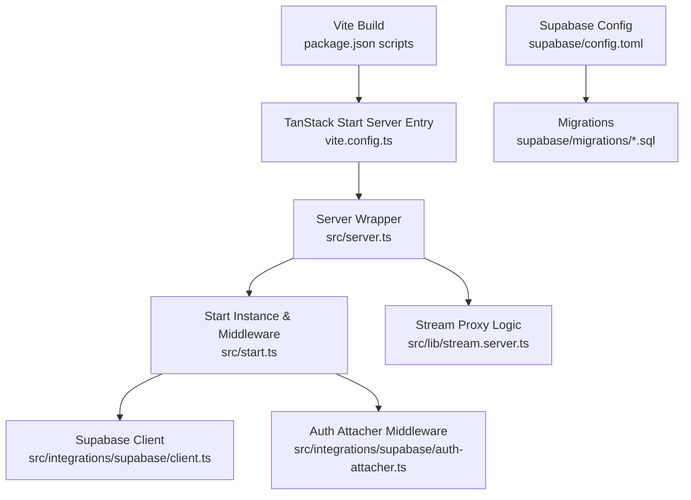
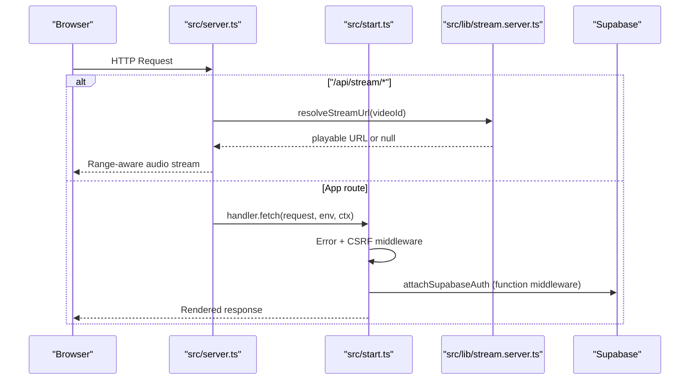
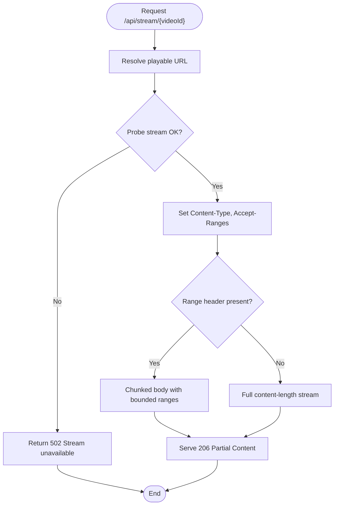
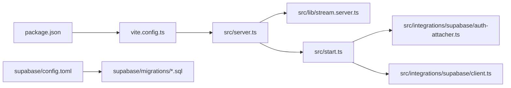

# Deployment Guide

<cite>
**Referenced Files in This Document**
- [package.json](file://package.json)
- [vite.config.ts](file://vite.config.ts)
- [README.md](file://README.md)
- [bunfig.toml](file://bunfig.toml)
- [tsconfig.json](file://tsconfig.json)
- [src/server.ts](file://src/server.ts)
- [src/start.ts](file://src/start.ts)
- [src/lib/stream.server.ts](file://src/lib/stream.server.ts)
- [src/integrations/supabase/client.ts](file://src/integrations/supabase/client.ts)
- [src/integrations/supabase/auth-attacher.ts](file://src/integrations/supabase/auth-attacher.ts)
- [supabase/config.toml](file://supabase/config.toml)
- [supabase/migrations/20260808085443_8253f78c-652e-4cb4-8772-8818ce90215c.sql](file://supabase/migrations/20260808085443_8253f78c-652e-4cb4-8772-8818ce90215c.sql)
- [supabase/migrations/20260808085506_fb5fd43f-6504-4c96-8335-2aeac753c924.sql](file://supabase/migrations/20260808085506_fb5fd43f-6504-4c96-8335-2aeac753c924.sql)
</cite>

## Table of Contents
1. Introduction
2. Project Structure
3. Core Components
4. Architecture Overview
5. Detailed Component Analysis
6. Dependency Analysis
7. Performance Considerations
8. Troubleshooting Guide
9. Conclusion
10. Appendices

## Introduction
This guide documents how to build, deploy, and operate the YouTube Music Companion application using Vite and TanStack Start. It covers environment configuration, Supabase database deployment and security policies, containerization strategies, CI/CD pipeline setup, monitoring and logging, performance tuning, caching and CDN configuration, scaling considerations, and troubleshooting with rollback procedures.

## Project Structure
The project is a TanStack Start app built with Vite. The server entry point is configured to use a custom server wrapper for error handling and streaming proxying. Supabase client integration and auth middleware are provided via generated files. Database schema and migrations are stored under supabase/.

**Diagram sources**
- [package.json:6-12](file://package.json#L6-L12)
- [vite.config.ts:9-15](file://vite.config.ts#L9-L15)
- [src/server.ts:181-198](file://src/server.ts#L181-L198)
- [src/start.ts:28-31](file://src/start.ts#L28-L31)
- [src/lib/stream.server.ts:108-122](file://src/lib/stream.server.ts#L108-L122)
- [src/integrations/supabase/client.ts:30-56](file://src/integrations/supabase/client.ts#L30-L56)
- [src/integrations/supabase/auth-attacher.ts:7-15](file://src/integrations/supabase/auth-attacher.ts#L7-L15)
- [supabase/config.toml:1-1](file://supabase/config.toml#L1-L1)
- [supabase/migrations/20260808085443_8253f78c-652e-4cb4-8772-8818ce90215c.sql:1-63](file://supabase/migrations/20260808085443_8253f78c-652e-4cb4-8772-8818ce90215c.sql#L1-L63)

**Section sources**
- [package.json:6-12](file://package.json#L6-L12)
- [vite.config.ts:9-15](file://vite.config.ts#L9-L15)
- [README.md:15-24](file://README.md#L15-L24)

## Core Components
- Build system: Vite with TanStack Start plugin; server entry points to src/server.ts.
- Runtime: TanStack Start instance with request and function middleware (error handling, CSRF protection, Supabase auth attachment).
- Streaming proxy: Server-side proxy that resolves YouTube audio streams and serves them with range support and chunked delivery.
- Supabase integration: Client initialization from environment variables, session persistence, and automatic bearer token injection for server functions.
- Database: Supabase schema with profiles and user_library tables, row-level security policies, triggers, and updated-at automation.

Key responsibilities:
- src/server.ts: Central fetch handler, stream proxy routing, SSR error normalization.
- src/start.ts: Create start instance, register middleware stack.
- src/lib/stream.server.ts: Resolve playable YouTube audio URLs and validate stream availability.
- src/integrations/supabase/client.ts: Environment-driven client creation and fetch header handling.
- src/integrations/supabase/auth-attacher.ts: Injects Supabase session token into server function calls.

**Section sources**
- [vite.config.ts:9-15](file://vite.config.ts#L9-L15)
- [src/server.ts:181-198](file://src/server.ts#L181-L198)
- [src/start.ts:28-31](file://src/start.ts#L28-L31)
- [src/lib/stream.server.ts:108-122](file://src/lib/stream.server.ts#L108-L122)
- [src/integrations/supabase/client.ts:30-56](file://src/integrations/supabase/client.ts#L30-L56)
- [src/integrations/supabase/auth-attacher.ts:7-15](file://src/integrations/supabase/auth-attacher.ts#L7-L15)

## Architecture Overview
The runtime processes requests through a layered middleware chain. The server wrapper intercepts requests, handles streaming proxy routes, then delegates to TanStack Start’s handler. Errors are normalized to HTML pages for SSR failures. Supabase auth tokens are attached to server function calls via middleware.

**Diagram sources**
- [src/server.ts:181-198](file://src/server.ts#L181-L198)
- [src/start.ts:28-31](file://src/start.ts#L28-L31)
- [src/lib/stream.server.ts:108-122](file://src/lib/stream.server.ts#L108-L122)
- [src/integrations/supabase/auth-attacher.ts:7-15](file://src/integrations/supabase/auth-attacher.ts#L7-L15)

## Detailed Component Analysis

### Build Process and Production Optimizations
- Scripts: Development, production build, development-mode build, preview, lint, format.
- Vite config: Uses @lovable.dev/vite-tanstack-config which includes TanStack devtools, React plugin, Tailwind, TypeScript paths, Nitro build target, environment variable injection, and error logging plugins. Server entry is set to src/server.ts.
- TypeScript: ES2022 target, strict mode, path alias @/* mapped to src/.

Production build steps:
- Run npm run build to produce optimized assets and server bundle.
- Use npm run build:dev for development-like build if needed.
- Preview locally with npm run preview to serve the built output.

Environment variables:
- VITE_* variables are injected at build time by Vite.
- SUPABASE_URL and SUPABASE_PUBLISHABLE_KEY are required at runtime for Supabase client initialization.

**Section sources**
- [package.json:6-12](file://package.json#L6-L12)
- [vite.config.ts:1-15](file://vite.config.ts#L1-L15)
- [tsconfig.json:1-31](file://tsconfig.json#L1-L31)
- [src/integrations/supabase/client.ts:30-56](file://src/integrations/supabase/client.ts#L30-L56)

### Asset Bundling and Code Splitting
- Vite performs automatic code splitting for routes and dynamic imports.
- The streaming resolution logic is dynamically imported in the server entry to reduce startup overhead.
- Static assets reside under public/ and are served as-is by the build output.

Optimization notes:
- Keep third-party dependencies minimal to reduce bundle size.
- Prefer lazy loading for heavy UI components where possible.
- Ensure images and media are optimized before inclusion.

**Section sources**
- [src/server.ts:110-112](file://src/server.ts#L110-L112)
- [public/manifest.json](file://public/manifest.json)

### Environment Configuration and Service Setup
Required environment variables:
- VITE_SUPABASE_URL: Supabase project URL used in the browser.
- SUPABASE_URL: Supabase project URL used on the server.
- VITE_SUPABASE_PUBLISHABLE_KEY: Publishable key for client-side Supabase access.
- SUPABASE_PUBLISHABLE_KEY: Publishable key for server-side Supabase access.

Runtime behavior:
- The Supabase client reads VITE_* on the client and process.env on the server, throwing an error if missing.
- New-style Supabase keys are handled by removing Authorization headers when they match the publishable key pattern and instead setting apikey.

Service configuration:
- Supabase project ID is defined in supabase/config.toml for CLI operations.

**Section sources**
- [src/integrations/supabase/client.ts:30-56](file://src/integrations/supabase/client.ts#L30-L56)
- [supabase/config.toml:1-1](file://supabase/config.toml#L1-L1)

### Supabase Database Deployment and Security Policies
Schema and policies:
- Tables: profiles (linked to auth.users), user_library (JSONB data per user).
- Row-Level Security enabled on both tables.
- Policies allow authenticated users to read profiles and manage their own library entries.
- Triggers update timestamps automatically and create profile records upon new user signup.
- Function execution permissions are revoked from PUBLIC, anon, and authenticated roles for security.

Migration management:
- Migrations are SQL files under supabase/migrations/.
- Apply migrations using the Supabase CLI against the configured project ID.

Security best practices:
- Enforce RLS policies strictly.
- Avoid granting excessive privileges to service roles beyond what is necessary.
- Rotate API keys regularly and restrict CORS origins in Supabase settings.

**Section sources**
- [supabase/migrations/20260808085443_8253f78c-652e-4cb4-8772-8818ce90215c.sql:1-63](file://supabase/migrations/20260808085443_8253f78c-652e-4cb4-8772-8818ce90215c.sql#L1-L63)
- [supabase/migrations/20260808085506_fb5fd43f-6504-4c96-8335-2aeac753c924.sql:1-2](file://supabase/migrations/20260808085506_fb5fd43f-6504-4c96-8335-2aeac753c924.sql#L1-L2)

### Streaming Proxy Implementation
The server proxies YouTube audio streams to bypass CORS and throttling constraints:
- Resolves playable audio URLs via internal player endpoints with multiple client configs.
- Probes URLs to ensure they stream correctly before serving.
- Serves content with proper Range headers and chunked delivery to support seeking and downloads.
- Rejects capped streams early to fail fast and avoid truncated playback.

**Diagram sources**
- [src/server.ts:102-179](file://src/server.ts#L102-L179)
- [src/lib/stream.server.ts:108-122](file://src/lib/stream.server.ts#L108-L122)

**Section sources**
- [src/server.ts:102-179](file://src/server.ts#L102-L179)
- [src/lib/stream.server.ts:108-122](file://src/lib/stream.server.ts#L108-L122)

### Monitoring and Logging
Error capture:
- Global console.error is wrapped to expand error chains and record the last captured error for recovery in SSR responses.
- Unhandled errors and promise rejections are recorded globally.
- SSR responses that swallow errors are normalized to HTML error pages with details.

Recommendations:
- Integrate a centralized logging service (e.g., cloud provider logs, structured log aggregation).
- Add application metrics collection (request latency, error rates) via your hosting platform’s observability tools.
- Configure alerting thresholds for error spikes and slow responses.

**Section sources**
- [src/server.ts:21-46](file://src/server.ts#L21-L46)
- [src/lib/error-capture.ts:1-82](file://src/lib/error-capture.ts#L1-L82)
- [src/lib/error-page.ts:1-41](file://src/lib/error-page.ts#L1-L41)

### Containerization Strategies
General guidance:
- Use a multi-stage Dockerfile:
  - Stage 1: Install dependencies and build the app using npm run build.
  - Stage 2: Serve the built output with a lightweight Node.js runtime compatible with TanStack Start/Nitro.
- Expose the appropriate port based on your hosting platform.
- Provide environment variables at runtime (Supabase URL and keys).
- Ensure static assets and server bundles are included in the final image.

[No sources needed since this section provides general guidance]

### CI/CD Pipeline Configuration
Recommended pipeline stages:
- Install dependencies with lockfile verification (bun.lock present; consider enforcing lockfile usage).
- Lint and type-check code.
- Build the app for production.
- Run tests if available.
- Deploy artifacts to your chosen platform.
- Apply Supabase migrations during deployment.

Security and reliability:
- Pin dependency versions and use lockfiles.
- Store secrets (environment variables) in your CI/CD secret store.
- Validate environment variables before deploying.

**Section sources**
- [package.json:6-12](file://package.json#L6-L12)
- [bunfig.toml:1-8](file://bunfig.toml#L1-L8)

### Scaling Considerations
- Stateless server: Ensure no in-memory state is retained across requests; rely on Supabase for persistence.
- Concurrency: Tune worker/process counts based on your hosting platform’s capabilities.
- Rate limiting: Implement rate limits for streaming endpoints to prevent abuse.
- Backpressure: The chunked streaming implementation already mitigates large payloads; monitor memory usage under load.

[No sources needed since this section provides general guidance]

### Caching Strategies and CDN Configuration
- Static assets: Enable long-term caching for hashed assets via your CDN or hosting provider.
- Streaming endpoint: Cache only short-lived metadata (e.g., resolved URLs) if safe; avoid caching raw streams due to variability and throttling.
- Browser cache: Leverage standard HTTP caching headers for non-stream resources.
- CDN: Configure origin rules to forward Range requests and preserve content-type headers for streaming.

[No sources needed since this section provides general guidance]

## Dependency Analysis
High-level dependency relationships:
- package.json defines scripts and dependencies for Vite, TanStack Start, Supabase, and UI libraries.
- vite.config.ts configures TanStack Start server entry and relies on shared Vite/TanStack plugins.
- src/server.ts depends on streaming logic and error handling utilities.
- src/start.ts wires middleware and integrates Supabase auth.
- Supabase client and auth attacher depend on environment variables and provide typed client access.

**Diagram sources**
- [package.json:6-12](file://package.json#L6-L12)
- [vite.config.ts:9-15](file://vite.config.ts#L9-L15)
- [src/server.ts:181-198](file://src/server.ts#L181-L198)
- [src/start.ts:28-31](file://src/start.ts#L28-L31)
- [src/integrations/supabase/auth-attacher.ts:7-15](file://src/integrations/supabase/auth-attacher.ts#L7-L15)
- [src/integrations/supabase/client.ts:30-56](file://src/integrations/supabase/client.ts#L30-L56)
- [supabase/config.toml:1-1](file://supabase/config.toml#L1-L1)
- [supabase/migrations/20260808085443_8253f78c-652e-4cb4-8772-8818ce90215c.sql:1-63](file://supabase/migrations/20260808085443_8253f78c-652e-4cb4-8772-8818ce90215c.sql#L1-L63)

**Section sources**
- [package.json:6-12](file://package.json#L6-L12)
- [vite.config.ts:9-15](file://vite.config.ts#L9-L15)
- [src/server.ts:181-198](file://src/server.ts#L181-L198)
- [src/start.ts:28-31](file://src/start.ts#L28-L31)

## Performance Considerations
- Build optimizations: Vite produces optimized bundles; ensure tree-shaking and minification are enabled by default.
- Streaming efficiency: Chunked delivery reduces memory pressure and supports seeking; tune chunk sizes based on network conditions.
- Error handling overhead: Normalizing SSR errors adds minimal overhead; keep error payloads concise.
- Dependency audit: Regularly review dependencies to remove unused packages and reduce bundle size.

[No sources needed since this section provides general guidance]

## Troubleshooting Guide
Common issues and resolutions:
- Missing Supabase environment variables: The client throws an error listing missing variables; verify VITE_SUPABASE_URL, SUPABASE_URL, VITE_SUPABASE_PUBLISHABLE_KEY, and SUPABASE_PUBLISHABLE_KEY are set.
- Stream unavailable: If upstream probing fails or streams are capped, the server returns 502; check video availability and region restrictions.
- SSR errors: h3-swallowed errors are normalized to HTML pages; inspect server logs and error capture output for stack traces.
- Authentication failures: Ensure attachSupabaseAuth middleware is registered and session tokens are present for server function calls.

Rollback procedures:
- Revert code changes to the last known good commit.
- Rebuild and redeploy the previous artifact.
- If database migrations caused issues, apply reverse migrations or restore from backups.
- Verify environment variables remain consistent across environments.

**Section sources**
- [src/integrations/supabase/client.ts:30-56](file://src/integrations/supabase/client.ts#L30-L56)
- [src/server.ts:102-179](file://src/server.ts#L102-L179)
- [src/server.ts:21-46](file://src/server.ts#L21-L46)
- [src/start.ts:28-31](file://src/start.ts#L28-L31)

## Conclusion
This deployment guide outlines how to build and deploy the YouTube Music Companion application using Vite and TanStack Start, configure Supabase, implement secure streaming proxies, and establish robust monitoring and CI/CD practices. Follow the environment setup, migration procedures, and performance recommendations to ensure reliable operation across development, staging, and production environments.

## Appendices

### Environment Variables Reference
- VITE_SUPABASE_URL: Supabase project URL for client builds.
- SUPABASE_URL: Supabase project URL for server runtime.
- VITE_SUPABASE_PUBLISHABLE_KEY: Publishable key for client-side Supabase access.
- SUPABASE_PUBLISHABLE_KEY: Publishable key for server-side Supabase access.

**Section sources**
- [src/integrations/supabase/client.ts:30-56](file://src/integrations/supabase/client.ts#L30-L56)

### Supabase Migration Commands
- Initialize Supabase CLI with project ID from supabase/config.toml.
- Push migrations to remote: supabase db push.
- Reset local DB to latest migrations: supabase db reset.
- Roll back specific migrations by applying inverse SQL or restoring from backup.

**Section sources**
- [supabase/config.toml:1-1](file://supabase/config.toml#L1-L1)
- [supabase/migrations/20260808085443_8253f78c-652e-4cb4-8772-8818ce90215c.sql:1-63](file://supabase/migrations/20260808085443_8253f78c-652e-4cb4-8772-8818ce90215c.sql#L1-L63)
- [supabase/migrations/20260808085506_fb5fd43f-6504-4c96-8335-2aeac753c924.sql:1-2](file://supabase/migrations/20260808085506_fb5fd43f-6504-4c96-8335-2aeac753c924.sql#L1-L2)