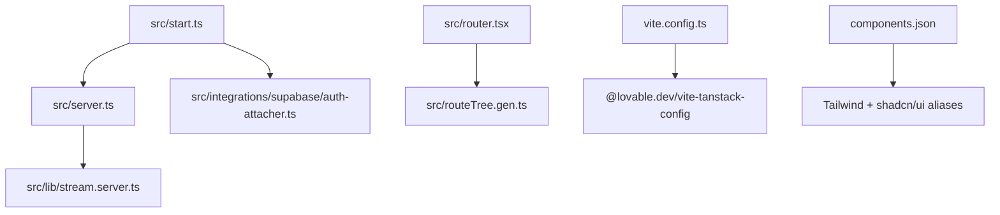
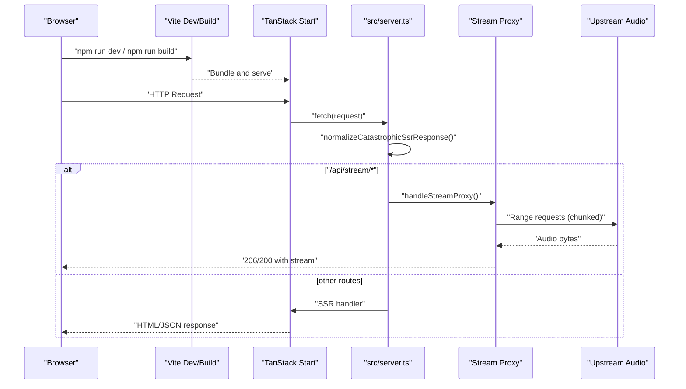
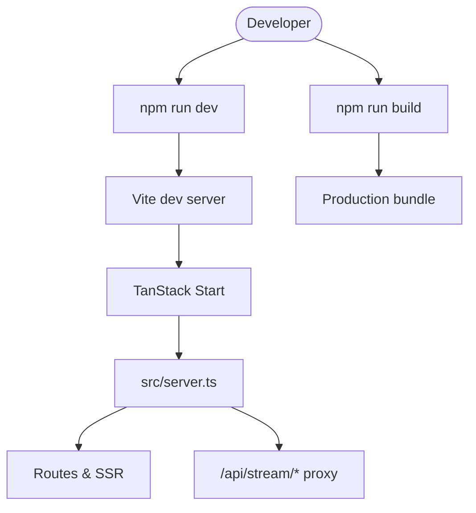
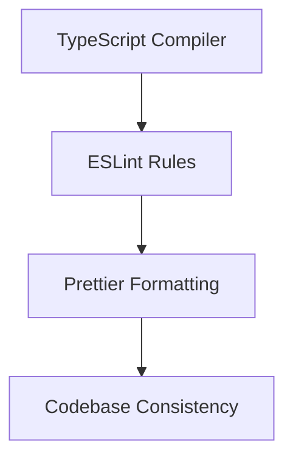
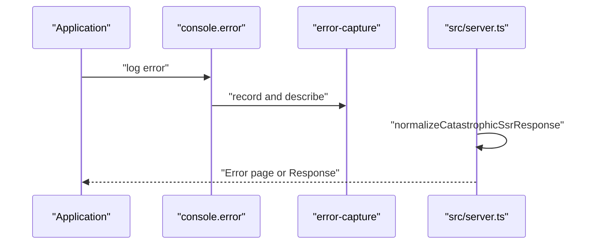
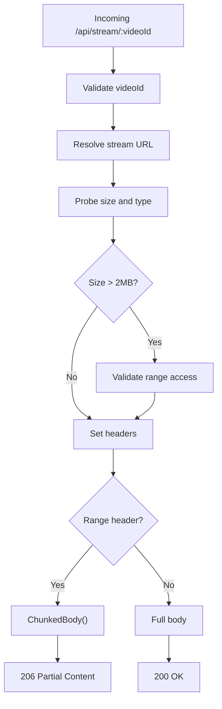
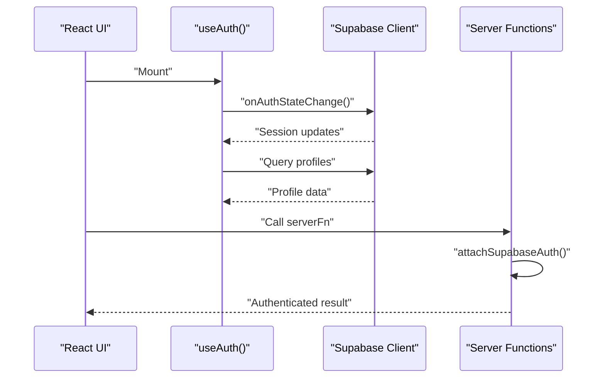
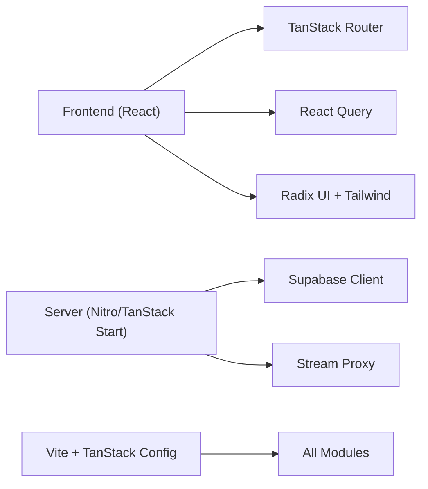

# Development Guide

<cite>
**Referenced Files in This Document**
- [package.json](file://package.json)
- [vite.config.ts](file://vite.config.ts)
- [tsconfig.json](file://tsconfig.json)
- [eslint.config.js](file://eslint.config.js)
- [.prettierrc](file://.prettierrc)
- [README.md](file://README.md)
- [src/start.ts](file://src/start.ts)
- [src/server.ts](file://src/server.ts)
- [src/router.tsx](file://src/router.tsx)
- [bunfig.toml](file://bunfig.toml)
- [components.json](file://components.json)
- [src/lib/utils.ts](file://src/lib/utils.ts)
- [src/lib/error-capture.ts](file://src/lib/error-capture.ts)
- [src/lib/auth.ts](file://src/lib/auth.ts)
- [src/integrations/supabase/client.ts](file://src/integrations/supabase/client.ts)
</cite>

## Table of Contents
1. [Introduction](#introduction)
2. [Project Structure](#project-structure)
3. [Core Components](#core-components)
4. [Architecture Overview](#architecture-overview)
5. [Detailed Component Analysis](#detailed-component-analysis)
6. [Dependency Analysis](#dependency-analysis)
7. [Performance Considerations](#performance-considerations)
8. [Troubleshooting Guide](#troubleshooting-guide)
9. [Conclusion](#conclusion)
10. [Appendices](#appendices)

## Introduction
This guide explains how to contribute to the YouTube Music Companion project. It covers development workflow, code organization conventions, build and dev server configuration using Vite and TanStack Start, code quality tooling (ESLint, Prettier, TypeScript), testing strategies, debugging and logging, deployment and environment configuration, monitoring considerations, contribution guidelines, and troubleshooting common issues.

## Project Structure
The project is a TanStack Start application with a React frontend, server entry for SSR and streaming proxy logic, Supabase integration, and a component library based on shadcn/ui and Tailwind CSS.

Key directories:
- src/components: Feature components under music and shared UI primitives under ui
- src/hooks: Custom hooks
- src/integrations/supabase: Supabase client and auth attacher
- src/lib: Shared utilities, server-side modules, audio player hooks, offline support, error handling
- src/routes: Route definitions and root layout
- public: Static assets including service worker and manifest

**Diagram sources**
- [src/start.ts:1-32](file://src/start.ts#L1-L32)
- [src/server.ts:1-198](file://src/server.ts#L1-L198)
- [vite.config.ts:1-16](file://vite.config.ts#L1-L16)
- [components.json:1-23](file://components.json#L1-L23)

**Section sources**
- [README.md:1-25](file://README.md#L1-L25)
- [package.json:1-92](file://package.json#L1-L92)
- [vite.config.ts:1-16](file://vite.config.ts#L1-L16)
- [components.json:1-23](file://components.json#L1-L23)

## Core Components
- Application bootstrap and middleware:
  - Server entry wraps TanStack Start’s server entry and adds error normalization and a streaming proxy route.
  - start.ts configures request and function middleware, including CSRF protection and Supabase auth attachment.
- Router and data layer:
  - router.tsx creates a TanStack Router instance with React Query client and routing options.
- Utilities and integrations:
  - lib/utils.ts provides a class name merging utility used across components.
  - integrations/supabase/client.ts initializes the Supabase client with environment-based configuration and fetch wrapper.
  - lib/auth.ts exposes a React hook for session state and profile management.

**Section sources**
- [src/start.ts:1-32](file://src/start.ts#L1-L32)
- [src/server.ts:1-198](file://src/server.ts#L1-L198)
- [src/router.tsx:1-17](file://src/router.tsx#L1-L17)
- [src/lib/utils.ts:1-7](file://src/lib/utils.ts#L1-L7)
- [src/integrations/supabase/client.ts:1-69](file://src/integrations/supabase/client.ts#L1-L69)
- [src/lib/auth.ts:1-70](file://src/lib/auth.ts#L1-L70)

## Architecture Overview
The runtime architecture centers around TanStack Start with Vite for bundling and dev server. The server entry handles both SSR and a streaming proxy for audio content. Middleware enforces CSRF and attaches Supabase context to server functions.

**Diagram sources**
- [src/server.ts:1-198](file://src/server.ts#L1-L198)
- [vite.config.ts:1-16](file://vite.config.ts#L1-L16)

## Detailed Component Analysis

### Build and Development Workflow
- Scripts:
  - Development server: runs Vite dev mode
  - Production build: builds optimized assets
  - Preview: serves the built output locally
  - Lint and format: ESLint and Prettier commands
- Vite configuration:
  - Uses @lovable.dev/vite-tanstack-config to include TanStack Start, React, Tailwind, path aliases, Nitro target, env injection, and plugins
  - Redirects server entry to src/server.ts for SSR error wrapping and custom server behavior

**Diagram sources**
- [package.json:6-13](file://package.json#L6-L13)
- [vite.config.ts:1-16](file://vite.config.ts#L1-L16)
- [src/server.ts:1-198](file://src/server.ts#L1-L198)

**Section sources**
- [package.json:1-92](file://package.json#L1-L92)
- [vite.config.ts:1-16](file://vite.config.ts#L1-L16)
- [README.md:15-25](file://README.md#L15-L25)

### Code Organization Conventions
- File naming:
  - Components: PascalCase .tsx files grouped by feature (music, ui)
  - Hooks: camelCase with use prefix
  - Libraries: descriptive names; server-only modules suffixed with .server.ts
  - Integrations: folder per provider (e.g., supabase)
- Aliases:
  - Path alias @/* maps to ./src/* via tsconfig
  - shadcn/ui aliases configured in components.json for components, utils, ui, lib, hooks
- Module boundaries:
  - Use *.server.ts for server-only modules to avoid importing server code in client bundles

**Section sources**
- [tsconfig.json:1-31](file://tsconfig.json#L1-L31)
- [components.json:1-23](file://components.json#L1-L23)
- [eslint.config.js:21-36](file://eslint.config.js#L21-L36)

### Code Quality Tools
- ESLint:
  - Extends recommended configs for JS and TypeScript
  - Enforces React hooks rules and React refresh plugin
  - Disallows server-only imports; encourages *.server.ts pattern
  - Integrates Prettier for formatting
- Prettier:
  - Print width 100, semicolons enabled, double quotes, trailing commas all
- TypeScript:
  - Strict mode enabled with additional strict checks
  - Target ES2022, JSX react-jsx, module resolution Bundler
  - Path alias @/* configured

**Diagram sources**
- [eslint.config.js:1-41](file://eslint.config.js#L1-L41)
- [.prettierrc:1-7](file://.prettierrc#L1-L7)
- [tsconfig.json:1-31](file://tsconfig.json#L1-L31)

**Section sources**
- [eslint.config.js:1-41](file://eslint.config.js#L1-L41)
- [.prettierrc:1-7](file://.prettierrc#L1-L7)
- [tsconfig.json:1-31](file://tsconfig.json#L1-L31)

### Testing Strategy
- Unit testing:
  - Use React Testing Library for component tests
  - Isolate side effects with mocks for Supabase and network calls
- Integration testing:
  - Test server functions and routes via TanStack Start test utilities or HTTP clients
  - Mock external services (Supabase, upstream streams) to validate flows
- Mock implementations:
  - Replace Supabase client methods with stubs for queries and auth events
  - Intercept fetch for upstream audio streams to simulate responses and errors

[No sources needed since this section provides general guidance]

### Debugging and Logging
- Error capture:
  - Global console.error wrapper records last error and expands cause chains
  - Server normalizes h3-swallowed SSR errors into readable HTML pages
- CSRF protection:
  - Ensures server functions are protected from cross-site requests
- Supabase auth attachment:
  - Attaches Supabase context to server functions for authenticated operations

**Diagram sources**
- [src/lib/error-capture.ts:1-82](file://src/lib/error-capture.ts#L1-L82)
- [src/server.ts:1-198](file://src/server.ts#L1-L198)
- [src/start.ts:1-32](file://src/start.ts#L1-L32)

**Section sources**
- [src/lib/error-capture.ts:1-82](file://src/lib/error-capture.ts#L1-L82)
- [src/server.ts:1-198](file://src/server.ts#L1-L198)
- [src/start.ts:1-32](file://src/start.ts#L1-L32)

### Streaming Proxy Logic
The server proxies audio streams to work around CORS and throttling constraints by:
- Probing upstream to determine size and MIME type
- Validating capped streams and rejecting unsupported ranges
- Serving chunked byte ranges with proper headers

**Diagram sources**
- [src/server.ts:47-178](file://src/server.ts#L47-L178)

**Section sources**
- [src/server.ts:47-178](file://src/server.ts#L47-L178)

### Authentication Flow
- Client-side auth state managed via a React hook that listens to Supabase auth changes and fetches profile data
- Server functions receive Supabase context through an attacher middleware

**Diagram sources**
- [src/lib/auth.ts:1-70](file://src/lib/auth.ts#L1-L70)
- [src/integrations/supabase/client.ts:1-69](file://src/integrations/supabase/client.ts#L1-L69)
- [src/start.ts:21-31](file://src/start.ts#L21-L31)

**Section sources**
- [src/lib/auth.ts:1-70](file://src/lib/auth.ts#L1-L70)
- [src/integrations/supabase/client.ts:1-69](file://src/integrations/supabase/client.ts#L1-L69)
- [src/start.ts:21-31](file://src/start.ts#L21-L31)

## Dependency Analysis
- Runtime dependencies include React, TanStack Router/Start/Query, Supabase, AI SDK, Radix UI primitives, Tailwind, and form libraries
- Dev dependencies include Vite, TypeScript, ESLint, Prettier, and Nitro for serverless targets
- Bun lockfile includes a supply-chain guard to prevent installing very recent packages without review

**Diagram sources**
- [package.json:14-70](file://package.json#L14-L70)
- [package.json:72-90](file://package.json#L72-L90)
- [bunfig.toml:1-8](file://bunfig.toml#L1-L8)

**Section sources**
- [package.json:1-92](file://package.json#L1-L92)
- [bunfig.toml:1-8](file://bunfig.toml#L1-L8)

## Performance Considerations
- Streaming chunks:
  - Use bounded range requests to avoid throttling and ensure seekability
  - Validate upstream capabilities early to fail fast on unsupported streams
- SSR error normalization:
  - Prevent generic 500 responses from hiding stack traces; render user-friendly error pages
- Bundle optimization:
  - Leverage Vite and TanStack Start optimizations; keep server-only code in *.server.ts to avoid client bundle bloat
- Environment guards:
  - Supply-chain guard prevents accidental installation of unreviewed package versions

[No sources needed since this section provides general guidance]

## Troubleshooting Guide
Common issues and resolutions:
- Missing Supabase environment variables:
  - Ensure SUPABASE_URL and SUPABASE_PUBLISHABLE_KEY are set; client throws a clear error if missing
- Streaming unavailable:
  - If upstream returns non-OK for range probes or caps beyond allowed sizes, the proxy responds with 502
- SSR swallowed errors:
  - Server normalizes h3-swallowed errors and renders error pages; check captured error logs for details
- CSRF failures:
  - Ensure server functions are called with correct origin and headers; CSRF middleware protects serverFn handlers

**Section sources**
- [src/integrations/supabase/client.ts:30-45](file://src/integrations/supabase/client.ts#L30-L45)
- [src/server.ts:113-148](file://src/server.ts#L113-L148)
- [src/server.ts:21-45](file://src/server.ts#L21-L45)
- [src/start.ts:21-26](file://src/start.ts#L21-L26)

## Conclusion
This guide outlined the development workflow, architecture, code quality standards, testing approaches, debugging techniques, and operational concerns for contributing to the YouTube Music Companion project. Follow the conventions and scripts described here to maintain consistency, reliability, and performance across the codebase.

## Appendices

### Environment Configuration
- Supabase client reads environment variables at runtime:
  - VITE_SUPABASE_URL and VITE_SUPABASE_PUBLISHABLE_KEY for client-side
  - SUPABASE_URL and SUPABASE_PUBLISHABLE_KEY for server-side fallback
- Ensure these variables are configured in your environment before running dev or building

**Section sources**
- [src/integrations/supabase/client.ts:30-45](file://src/integrations/supabase/client.ts#L30-L45)

### Contribution Guidelines
- Pull requests:
  - Keep changes focused; follow file naming and module structure conventions
  - Run lint and format scripts before committing
  - Add tests for new features and bug fixes where applicable
- Code review standards:
  - Adhere to ESLint and Prettier rules
  - Prefer server-only modules (*.server.ts) for server code
  - Validate streaming and auth flows with appropriate tests
- Release management:
  - Use production build script to generate optimized assets
  - Verify environment variables and streaming endpoints in staging before release

[No sources needed since this section provides general guidance]