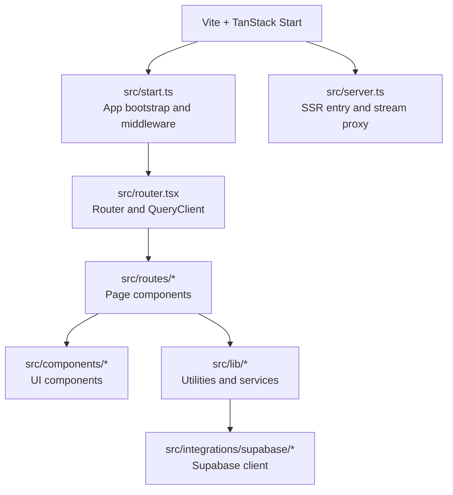
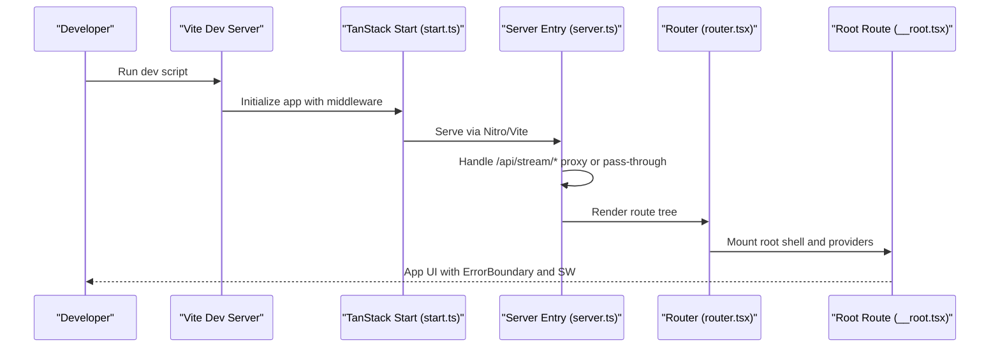
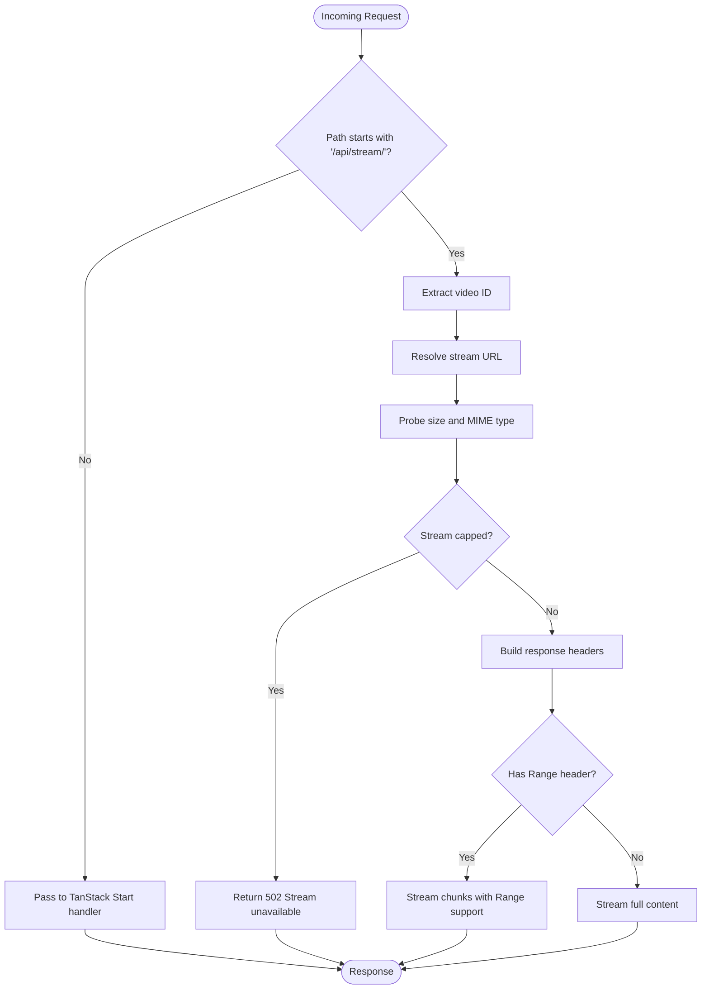
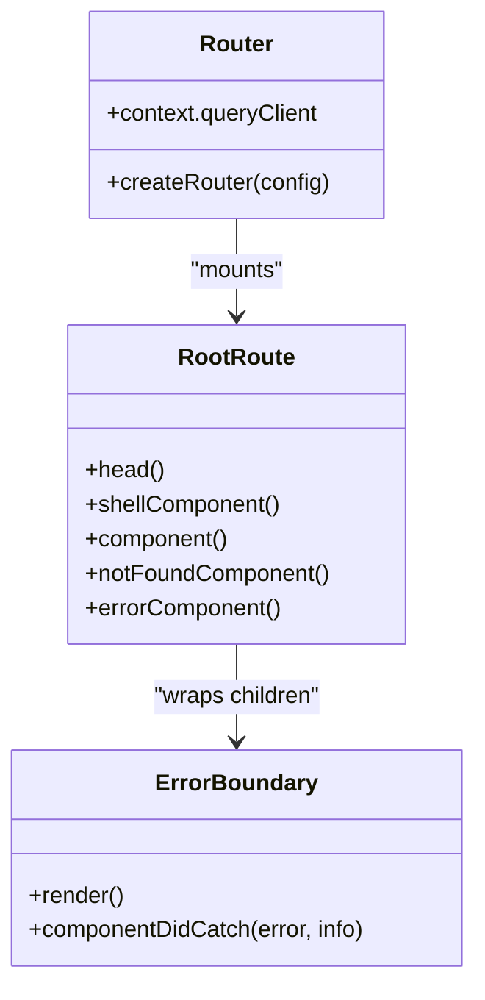
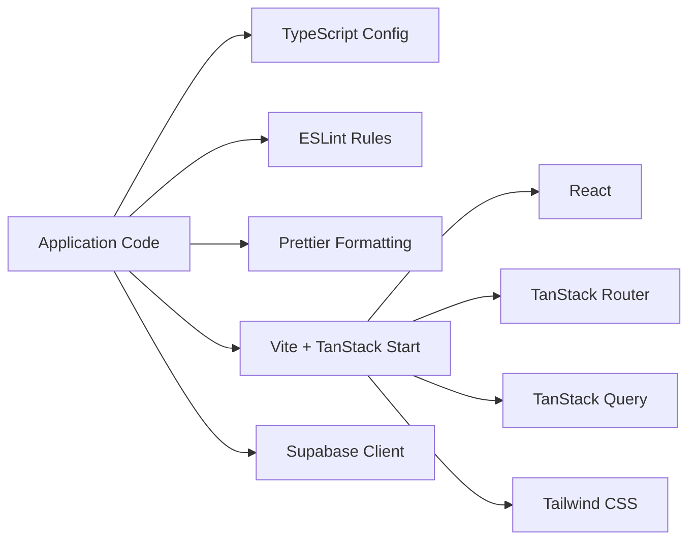

# Development Workflow

<cite>
**Referenced Files in This Document**
- [package.json](file://package.json)
- [vite.config.ts](file://vite.config.ts)
- [tsconfig.json](file://tsconfig.json)
- [eslint.config.js](file://eslint.config.js)
- [.prettierrc](file://.prettierrc)
- [bunfig.toml](file://bunfig.toml)
- [components.json](file://components.json)
- [README.md](file://README.md)
- [src/start.ts](file://src/start.ts)
- [src/server.ts](file://src/server.ts)
- [src/router.tsx](file://src/router.tsx)
- [src/routes/__root.tsx](file://src/routes/__root.tsx)
- [src/components/music/ErrorBoundary.tsx](file://src/components/music/ErrorBoundary.tsx)
- [src/lib/utils.ts](file://src/lib/utils.ts)
- [src/integrations/supabase/client.ts](file://src/integrations/supabase/client.ts)
</cite>

## Table of Contents
1. Introduction
2. Project Structure
3. Core Components
4. Architecture Overview
5. Detailed Component Analysis
6. Dependency Analysis
7. Performance Considerations
8. Troubleshooting Guide
9. Conclusion
10. Appendices

## Introduction
This document describes the complete development workflow for the YouTube Music Companion project. It covers local setup, daily development practices, Vite-based build system with TanStack Start integration, code organization conventions, Git workflow guidance, and tooling configuration (ESLint, Prettier, TypeScript). It also provides step-by-step instructions for common tasks such as adding features, running tests, and debugging issues.

## Project Structure
The project is a TanStack Start application built with Vite and React. The source tree is organized by feature areas:
- src/components: UI components grouped under music-specific and shared ui directories
- src/hooks: reusable hooks
- src/integrations: third-party integrations (e.g., Supabase)
- src/lib: server and client utilities, data fetching helpers, and domain logic
- src/routes: TanStack Start file-based routes
- Public assets: icons, manifest, service worker

**Diagram sources**
- [vite.config.ts:1-16](file://vite.config.ts#L1-L16)
- [src/start.ts:1-32](file://src/start.ts#L1-L32)
- [src/server.ts:1-198](file://src/server.ts#L1-L198)
- [src/router.tsx:1-17](file://src/router.tsx#L1-L17)
- [src/routes/__root.tsx:1-154](file://src/routes/__root.tsx#L1-L154)

**Section sources**
- [package.json:1-92](file://package.json#L1-L92)
- [vite.config.ts:1-16](file://vite.config.ts#L1-L16)
- [src/start.ts:1-32](file://src/start.ts#L1-L32)
- [src/server.ts:1-198](file://src/server.ts#L1-L198)
- [src/router.tsx:1-17](file://src/router.tsx#L1-L17)
- [src/routes/__root.tsx:1-154](file://src/routes/__root.tsx#L1-L154)

## Core Components
- Build and scripts: npm scripts define dev, build, preview, lint, and format commands.
- Vite config: uses @lovable.dev/vite-tanstack-config to provide TanStack Start, React, Tailwind, Nitro, environment injection, path aliases, and more. Server entry is redirected to src/server.ts.
- TypeScript: strict mode enabled with modern target and module settings; path alias @ maps to src.
- ESLint: recommended rules for JS/TS, React Hooks, React Refresh, and Prettier integration; disallows Next.js server-only import style in favor of *.server.ts modules.
- Prettier: consistent formatting with print width, semicolons, double quotes, and trailing commas.
- Bun safety: minimum release age guard for dependencies with explicit exceptions for Lovable packages.
- Shadcn/ui: component library configured with aliases for components, utils, ui, lib, and hooks.

**Section sources**
- [package.json:1-92](file://package.json#L1-L92)
- [vite.config.ts:1-16](file://vite.config.ts#L1-L16)
- [tsconfig.json:1-31](file://tsconfig.json#L1-L31)
- [eslint.config.js:1-41](file://eslint.config.js#L1-L41)
- [.prettierrc:1-7](file://.prettierrc#L1-L7)
- [bunfig.toml:1-8](file://bunfig.toml#L1-L8)
- [components.json:1-23](file://components.json#L1-L23)

## Architecture Overview
The runtime consists of:
- Vite dev server and build pipeline driven by TanStack Start plugin
- SSR server entry at src/server.ts that handles streaming proxy and error normalization
- App bootstrap at src/start.ts that registers request and function middleware (error handling, CSRF, Supabase auth attachment)
- Router and QueryClient initialization in src/router.tsx
- Root route in src/routes/__root.tsx providing HTML shell, meta tags, PWA service worker registration, and global error boundary

**Diagram sources**
- [vite.config.ts:1-16](file://vite.config.ts#L1-L16)
- [src/start.ts:1-32](file://src/start.ts#L1-L32)
- [src/server.ts:1-198](file://src/server.ts#L1-L198)
- [src/router.tsx:1-17](file://src/router.tsx#L1-L17)
- [src/routes/__root.tsx:1-154](file://src/routes/__root.tsx#L1-L154)

## Detailed Component Analysis

### Vite and TanStack Start Integration
- The Vite configuration delegates most setup to @lovable.dev/vite-tanstack-config, which includes TanStack Start, React, Tailwind, Nitro, env injection, path aliases, and dedupe plugins.
- The server entry is explicitly set to src/server.ts to wrap SSR errors and add a streaming proxy.

Key behaviors:
- Development: hot reload and fast refresh are provided by the underlying plugins.
- Build: optimized production builds via Vite/Nitro with environment variables injected.

**Section sources**
- [vite.config.ts:1-16](file://vite.config.ts#L1-L16)
- [package.json:1-92](file://package.json#L1-L92)

### Application Bootstrap and Middleware
- src/start.ts creates the TanStack Start instance and registers:
  - Function middleware to attach Supabase authentication context
  - Request middleware for centralized error handling and CSRF protection for server functions

Error handling strategy:
- Wraps requests in try/catch and returns a rendered error page on failures
- Preserves non-error responses and status codes

CSRF protection:
- Applied only to server functions to prevent cross-site request forgery

**Section sources**
- [src/start.ts:1-32](file://src/start.ts#L1-L32)

### Server Entry and Streaming Proxy
- src/server.ts performs:
  - Dynamic import of TanStack Start’s server entry
  - Normalization of catastrophic SSR errors into user-friendly pages
  - A streaming proxy for audio content at /api/stream/:videoId that:
    - Probes upstream size and MIME type
    - Enforces chunked range requests to work around throttling
    - Honors Range headers for seeking and full downloads
    - Returns appropriate HTTP status codes and headers

**Diagram sources**
- [src/server.ts:1-198](file://src/server.ts#L1-L198)

**Section sources**
- [src/server.ts:1-198](file://src/server.ts#L1-L198)

### Router and Root Route
- src/router.tsx initializes a QueryClient and creates the router with scroll restoration and default preload behavior.
- src/routes/__root.tsx defines the root route, including:
  - HTML head metadata and links
  - Service Worker registration for offline/PWA support
  - Global ErrorBoundary wrapping all child routes
  - QueryClientProvider for data fetching state

**Diagram sources**
- [src/router.tsx:1-17](file://src/router.tsx#L1-L17)
- [src/routes/__root.tsx:1-154](file://src/routes/__root.tsx#L1-L154)
- [src/components/music/ErrorBoundary.tsx:1-97](file://src/components/music/ErrorBoundary.tsx#L1-L97)

**Section sources**
- [src/router.tsx:1-17](file://src/router.tsx#L1-L17)
- [src/routes/__root.tsx:1-154](file://src/routes/__root.tsx#L1-L154)
- [src/components/music/ErrorBoundary.tsx:1-97](file://src/components/music/ErrorBoundary.tsx#L1-L97)

### Utilities and Integrations
- Utility function cn merges class names using clsx and tailwind-merge for composable styling.
- Supabase client is lazily created and exposed via a Proxy to ensure environment variables are available at first use. It injects apikey headers and supports new-style API keys.

**Section sources**
- [src/lib/utils.ts:1-7](file://src/lib/utils.ts#L1-L7)
- [src/integrations/supabase/client.ts:1-69](file://src/integrations/supabase/client.ts#L1-L69)

## Dependency Analysis
- Runtime dependencies include React, TanStack Router/Query/Start, Radix UI primitives, Tailwind CSS, and Supabase client.
- Development dependencies include Vite, TypeScript, ESLint with TypeScript and React plugins, and Prettier.
- Path alias @ points to src, enabling clean imports across the codebase.
- Bun lockfile and safety settings protect against very recent package versions, with explicit exceptions for Lovable tooling.

**Diagram sources**
- [package.json:1-92](file://package.json#L1-L92)
- [tsconfig.json:1-31](file://tsconfig.json#L1-L31)
- [eslint.config.js:1-41](file://eslint.config.js#L1-L41)
- [.prettierrc:1-7](file://.prettierrc#L1-L7)
- [bunfig.toml:1-8](file://bunfig.toml#L1-L8)

**Section sources**
- [package.json:1-92](file://package.json#L1-L92)
- [tsconfig.json:1-31](file://tsconfig.json#L1-L31)
- [eslint.config.js:1-41](file://eslint.config.js#L1-L41)
- [.prettierrc:1-7](file://.prettierrc#L1-L7)
- [bunfig.toml:1-8](file://bunfig.toml#L1-L8)

## Performance Considerations
- Use lazy loading for heavy modules where possible to reduce initial bundle size.
- Leverage TanStack Query caching and stale times to minimize redundant network calls.
- Keep components focused and avoid unnecessary re-renders; prefer memoization for expensive computations.
- For streaming audio, rely on the existing chunked proxy to handle large files efficiently and respect Range requests.
- Ensure images and static assets are optimized and served from the public directory.

[No sources needed since this section provides general guidance]

## Troubleshooting Guide
Common issues and resolutions:
- Missing environment variables for Supabase:
  - Ensure VITE_SUPABASE_URL and VITE_SUPABASE_PUBLISHABLE_KEY are set in your environment. The client will throw an error if they are missing.
- SSR errors not surfacing correctly:
  - The server normalizes certain swallowed errors into a user-friendly page; check logs and the error capture utility for details.
- Streaming playback fails:
  - Verify the upstream stream supports Range requests and is not capped beyond the allowed chunk size. The server returns 502 when streams are restricted.
- Build or dev server issues:
  - Confirm that Vite/TanStack Start plugins are not duplicated; do not manually add plugins already included by the Lovable config.

**Section sources**
- [src/integrations/supabase/client.ts:1-69](file://src/integrations/supabase/client.ts#L1-L69)
- [src/server.ts:1-198](file://src/server.ts#L1-L198)
- [vite.config.ts:1-16](file://vite.config.ts#L1-L16)

## Conclusion
This project uses a modern, opinionated stack centered around Vite and TanStack Start with strong tooling for TypeScript, linting, and formatting. The architecture separates concerns between server entry, routing, and UI components while providing robust error handling and streaming capabilities. Following the guidelines here will help you maintain consistency, improve productivity, and ship reliable updates.

[No sources needed since this section summarizes without analyzing specific files]

## Appendices

### Local Setup and Daily Development
- Prerequisites: Node.js and npm (as per README).
- Install dependencies and start the dev server:
  - npm i
  - npm run dev
- Build and preview:
  - npm run build
  - npm run preview
- Lint and format:
  - npm run lint
  - npm run format

**Section sources**
- [README.md:1-25](file://README.md#L1-L25)
- [package.json:1-92](file://package.json#L1-L92)

### Code Organization Conventions
- File naming:
  - Components: PascalCase .tsx files under src/components
  - Hooks: camelCase .ts/.tsx files under src/hooks
  - Utilities: lowercase with descriptive names under src/lib
  - Routes: file-based under src/routes following TanStack Start conventions
- Module structure:
  - Feature-scoped folders (e.g., music) group related components and panels
  - Shared UI primitives live under src/components/ui
- Aliases:
  - Use @/... for imports to keep paths clean and consistent

**Section sources**
- [components.json:1-23](file://components.json#L1-L23)
- [tsconfig.json:1-31](file://tsconfig.json#L1-L31)

### Git Workflow Guidelines
- Branching strategy:
  - Create feature branches from main (e.g., feature/add-playlist-panel)
  - Use descriptive branch names reflecting the work
- Commit messages:
  - Follow conventional commits (e.g., feat:, fix:, chore:)
  - Keep messages concise and meaningful
- Pull requests:
  - Link related issues
  - Include screenshots or recordings for UI changes
  - Ensure lint and build pass before review

[No sources needed since this section provides general guidance]

### Tooling Configuration Summary
- TypeScript strict mode enabled with modern targets and path aliases
- ESLint enforces recommended rules, React Hooks best practices, and integrates with Prettier
- Prettier standardizes formatting across the codebase
- Bun lockfile protects against overly fresh packages with explicit exceptions for Lovable tooling

**Section sources**
- [tsconfig.json:1-31](file://tsconfig.json#L1-L31)
- [eslint.config.js:1-41](file://eslint.config.js#L1-L41)
- [.prettierrc:1-7](file://.prettierrc#L1-L7)
- [bunfig.toml:1-8](file://bunfig.toml#L1-L8)

### Adding a New Feature
Steps:
1. Create a feature branch from main
2. Add components under src/components/<feature> and hooks under src/hooks
3. If adding a new page, create a route file under src/routes
4. Update router context or providers if necessary
5. Run lint and format checks
6. Test locally with npm run dev
7. Commit with a descriptive message and open a pull request

[No sources needed since this section provides general guidance]

### Running Tests
- No test runner is currently defined in the scripts.
- Recommended next steps:
  - Add a testing framework (e.g., Vitest) and configure it
  - Add unit tests for utilities and hooks
  - Add integration tests for routes and server functions
  - Update npm scripts to run tests and coverage

[No sources needed since this section provides general guidance]

### Debugging Issues
- Frontend errors:
  - Use the global ErrorBoundary to catch render-time errors and attempt recovery
- Server-side errors:
  - Inspect logs from the server entry and normalized error responses
- Network and streaming:
  - Check browser network tab for Range requests and status codes
  - Verify upstream stream availability and restrictions

**Section sources**
- [src/components/music/ErrorBoundary.tsx:1-97](file://src/components/music/ErrorBoundary.tsx#L1-L97)
- [src/server.ts:1-198](file://src/server.ts#L1-L198)