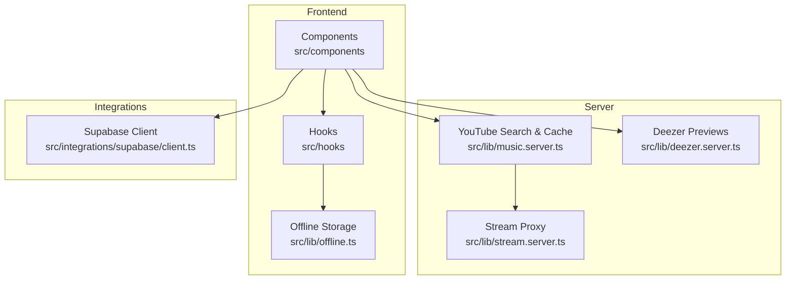
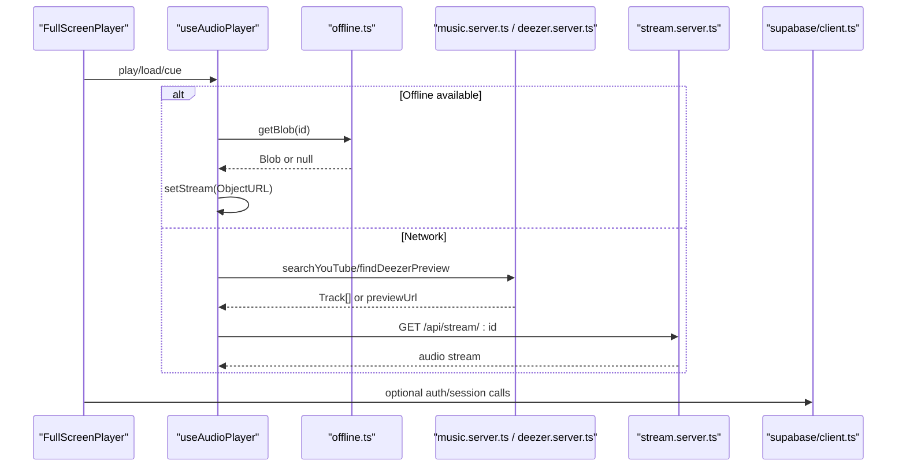
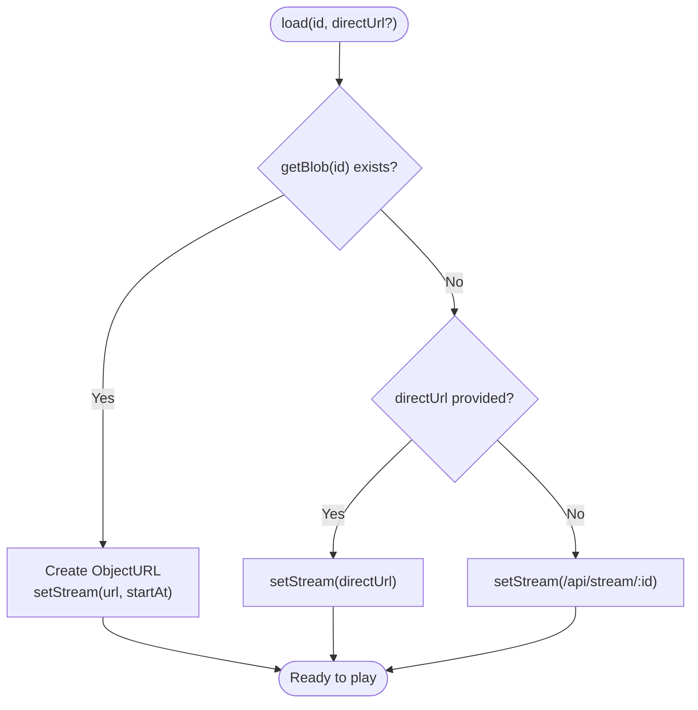
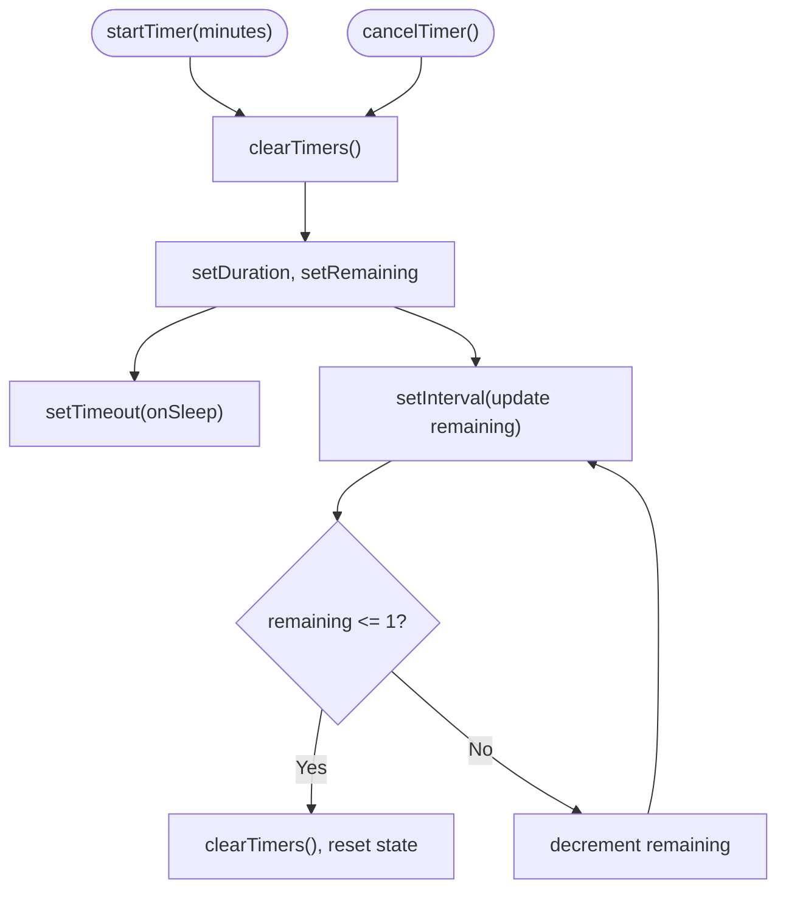
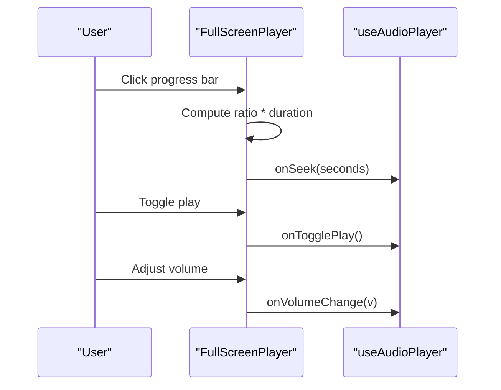
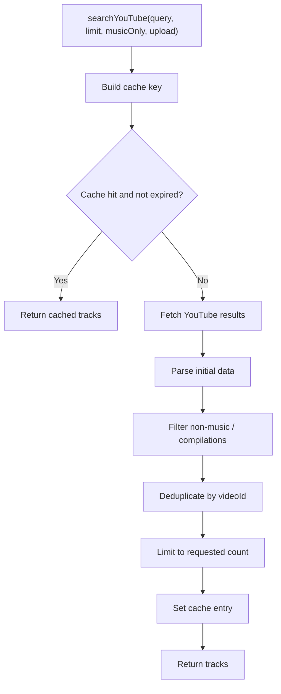
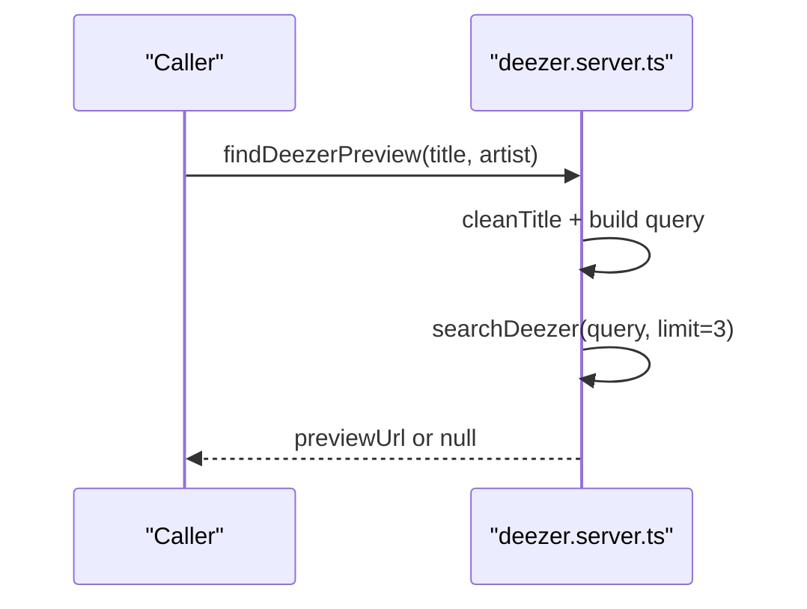
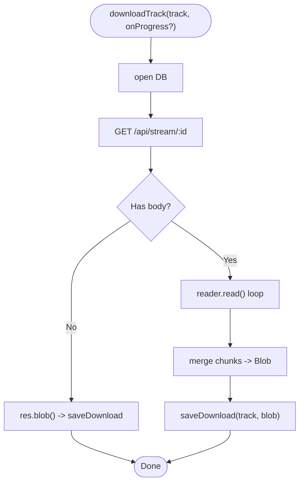
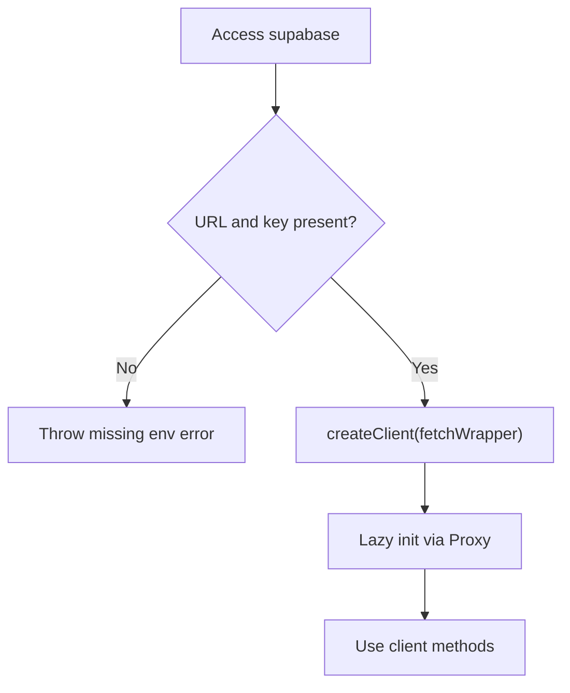
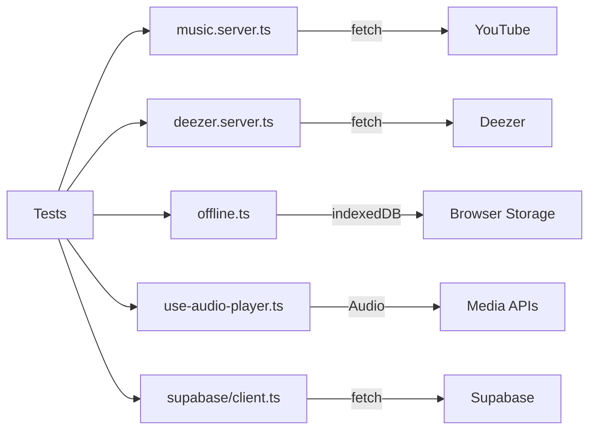

# Testing Strategy

<cite>
**Referenced Files in This Document**
- [package.json](file://package.json)
- [vite.config.ts](file://vite.config.ts)
- [README.md](file://README.md)
- [src/lib/use-audio-player.ts](file://src/lib/use-audio-player.ts)
- [src/hooks/useSleepTimer.ts](file://src/hooks/useSleepTimer.ts)
- [src/components/music/ui/FullScreenPlayer.tsx](file://src/components/music/ui/FullScreenPlayer.tsx)
- [src/lib/deezer.server.ts](file://src/lib/deezer.server.ts)
- [src/lib/music.server.ts](file://src/lib/music.server.ts)
- [src/lib/offline.ts](file://src/lib/offline.ts)
- [src/integrations/supabase/client.ts](file://src/integrations/supabase/client.ts)
</cite>

## Table of Contents
1. Introduction
2. Project Structure
3. Core Components
4. Architecture Overview
5. Detailed Component Analysis
6. Dependency Analysis
7. Performance Considerations
8. Troubleshooting Guide
9. Conclusion
10. Appendices

## Introduction
This document defines a comprehensive testing strategy for the YouTube Music Companion project. It covers unit testing patterns for React components, custom hooks, and utility functions; integration testing strategies for server functions, API integrations, and state management; mock implementations for external dependencies such as YouTube search, Deezer previews, and Supabase; and guidelines for testing audio playback, offline capabilities, and real-time features. It also includes test organization, naming conventions, coverage targets, examples of complex flows and edge cases, and considerations for performance, load, and browser compatibility testing.

## Project Structure
The application is built with TanStack Start (Vite-based), React, and TypeScript. Key areas relevant to testing:
- UI components under src/components/music/ui and src/components/ui
- Custom hooks under src/hooks
- Server-side utilities and integrations under src/lib
- Offline storage via IndexedDB in src/lib/offline.ts
- Supabase client configuration in src/integrations/supabase

**Diagram sources**
- [src/components/music/ui/FullScreenPlayer.tsx:1-257](file://src/components/music/ui/FullScreenPlayer.tsx#L1-L257)
- [src/lib/use-audio-player.ts:1-221](file://src/lib/use-audio-player.ts#L1-L221)
- [src/lib/offline.ts:1-201](file://src/lib/offline.ts#L1-L201)
- [src/lib/music.server.ts:1-248](file://src/lib/music.server.ts#L1-L248)
- [src/lib/deezer.server.ts:1-97](file://src/lib/deezer.server.ts#L1-L97)
- [src/integrations/supabase/client.ts:1-69](file://src/integrations/supabase/client.ts#L1-L69)

**Section sources**
- [package.json:1-92](file://package.json#L1-L92)
- [vite.config.ts:1-16](file://vite.config.ts#L1-L16)
- [README.md:1-25](file://README.md#L1-L25)

## Core Components
Focus areas for testing:
- Audio player hook: stateful behavior, events, offline vs network playback, error handling
- Sleep timer hook: timers, cleanup, formatting
- Full-screen player component: user interactions, accessibility attributes, derived values
- Server functions: YouTube search caching, Deezer preview resolution, stream proxy usage
- Offline storage: IndexedDB operations, quota checks, download progress
- Supabase client: environment validation, fetch wrapper behavior

Testing priorities:
- Unit tests for pure logic and small units (formatting, filtering, cache TTL)
- Hook tests for lifecycle, side effects, and event handlers
- Component tests for rendering, interactions, and accessibility
- Integration tests for server functions and external APIs
- Offline and media tests using controlled environments

**Section sources**
- [src/lib/use-audio-player.ts:1-221](file://src/lib/use-audio-player.ts#L1-L221)
- [src/hooks/useSleepTimer.ts:1-72](file://src/hooks/useSleepTimer.ts#L1-L72)
- [src/components/music/ui/FullScreenPlayer.tsx:1-257](file://src/components/music/ui/FullScreenPlayer.tsx#L1-L257)
- [src/lib/music.server.ts:1-248](file://src/lib/music.server.ts#L1-L248)
- [src/lib/deezer.server.ts:1-97](file://src/lib/deezer.server.ts#L1-L97)
- [src/lib/offline.ts:1-201](file://src/lib/offline.ts#L1-L201)
- [src/integrations/supabase/client.ts:1-69](file://src/integrations/supabase/client.ts#L1-L69)

## Architecture Overview
High-level data flow across layers:
- UI triggers actions (play, seek, like)
- Hooks coordinate playback and timers
- Server functions fetch or cache results from YouTube and Deezer
- Offline module persists blobs for playback without network
- Supabase client handles auth and persistence where used

**Diagram sources**
- [src/components/music/ui/FullScreenPlayer.tsx:1-257](file://src/components/music/ui/FullScreenPlayer.tsx#L1-L257)
- [src/lib/use-audio-player.ts:1-221](file://src/lib/use-audio-player.ts#L1-L221)
- [src/lib/offline.ts:1-201](file://src/lib/offline.ts#L1-L201)
- [src/lib/music.server.ts:1-248](file://src/lib/music.server.ts#L1-L248)
- [src/lib/deezer.server.ts:1-97](file://src/lib/deezer.server.ts#L1-L97)
- [src/integrations/supabase/client.ts:1-69](file://src/integrations/supabase/client.ts#L1-L69)

## Detailed Component Analysis

### Audio Player Hook (useAudioPlayer)
Key behaviors to test:
- Event binding and unbinding for play/pause/timeupdate/durationchange/loadedmetadata/ended/error
- Autoplay gating via wantPlayRef and user gesture constraints
- Offline playback path using IndexedDB blobs and Object URLs
- Stream URL selection (direct URL vs server proxy)
- Seek bounds enforcement and volume normalization
- Error messaging and recovery paths

**Diagram sources**
- [src/lib/use-audio-player.ts:103-172](file://src/lib/use-audio-player.ts#L103-L172)
- [src/lib/offline.ts:85-95](file://src/lib/offline.ts#L85-L95)

**Section sources**
- [src/lib/use-audio-player.ts:1-221](file://src/lib/use-audio-player.ts#L1-L221)

### Sleep Timer Hook (useSleepTimer)
Test focus:
- Starting and canceling timers
- Remaining time countdown updates
- Cleanup on unmount and when canceled
- Formatting remaining time correctly

**Diagram sources**
- [src/hooks/useSleepTimer.ts:22-56](file://src/hooks/useSleepTimer.ts#L22-L56)

**Section sources**
- [src/hooks/useSleepTimer.ts:1-72](file://src/hooks/useSleepTimer.ts#L1-L72)

### FullScreenPlayer Component
Test focus:
- Rendering with track data and controls
- Progress bar click-to-seek calculation
- Accessibility attributes (aria-* labels and roles)
- Derived progress percentage computation
- Interaction callbacks (play/pause, next/previous, like, volume)

**Diagram sources**
- [src/components/music/ui/FullScreenPlayer.tsx:64-76](file://src/components/music/ui/FullScreenPlayer.tsx#L64-L76)
- [src/components/music/ui/FullScreenPlayer.tsx:158-182](file://src/components/music/ui/FullScreenPlayer.tsx#L158-L182)
- [src/components/music/ui/FullScreenPlayer.tsx:184-245](file://src/components/music/ui/FullScreenPlayer.tsx#L184-L245)

**Section sources**
- [src/components/music/ui/FullScreenPlayer.tsx:1-257](file://src/components/music/ui/FullScreenPlayer.tsx#L1-L257)

### YouTube Search Server Function
Test focus:
- Query composition and filters (music-only, upload range)
- HTML parsing resilience and fallbacks
- In-memory LRU cache with TTL and eviction
- Non-music and compilation filtering
- Duration parsing and song-like heuristics

**Diagram sources**
- [src/lib/music.server.ts:52-75](file://src/lib/music.server.ts#L52-L75)
- [src/lib/music.server.ts:182-248](file://src/lib/music.server.ts#L182-L248)

**Section sources**
- [src/lib/music.server.ts:1-248](file://src/lib/music.server.ts#L1-L248)

### Deezer Preview Integration
Test focus:
- Query construction and cleaning of titles
- Timeout and error handling returning empty arrays
- Mapping response to normalized Track shape
- Fallback preview URL resolution

**Diagram sources**
- [src/lib/deezer.server.ts:76-97](file://src/lib/deezer.server.ts#L76-L97)
- [src/lib/deezer.server.ts:39-74](file://src/lib/deezer.server.ts#L39-L74)

**Section sources**
- [src/lib/deezer.server.ts:1-97](file://src/lib/deezer.server.ts#L1-L97)

### Offline Storage (IndexedDB)
Test focus:
- Database open and upgrade
- Save/get/list/remove/clear operations
- Quota estimation warnings
- Download with streaming reader and progress callback
- Error handling and timeouts

**Diagram sources**
- [src/lib/offline.ts:149-201](file://src/lib/offline.ts#L149-L201)
- [src/lib/offline.ts:58-95](file://src/lib/offline.ts#L58-L95)

**Section sources**
- [src/lib/offline.ts:1-201](file://src/lib/offline.ts#L1-L201)

### Supabase Client Integration
Test focus:
- Environment variable presence and error reporting
- Fetch wrapper that injects apikey header and handles new key formats
- Lazy initialization via Proxy
- Auth persistence settings

**Diagram sources**
- [src/integrations/supabase/client.ts:30-69](file://src/integrations/supabase/client.ts#L30-L69)

**Section sources**
- [src/integrations/supabase/client.ts:1-69](file://src/integrations/supabase/client.ts#L1-L69)

## Dependency Analysis
External dependencies and their test implications:
- YouTube search: scraping-based, requires mocking fetch responses and parsing robustness
- Deezer API: free endpoint with timeout and error handling; mock HTTP responses
- Supabase: environment-driven client; mock fetch wrapper and environment variables
- IndexedDB: asynchronous storage; use fake-indexeddb or similar for deterministic tests
- Media APIs: Audio element events; use jsdom + media mock libraries or manual stubbing

**Diagram sources**
- [src/lib/music.server.ts:182-248](file://src/lib/music.server.ts#L182-L248)
- [src/lib/deezer.server.ts:39-74](file://src/lib/deezer.server.ts#L39-L74)
- [src/lib/offline.ts:24-41](file://src/lib/offline.ts#L24-L41)
- [src/lib/use-audio-player.ts:22-85](file://src/lib/use-audio-player.ts#L22-L85)
- [src/integrations/supabase/client.ts:30-69](file://src/integrations/supabase/client.ts#L30-L69)

**Section sources**
- [src/lib/music.server.ts:1-248](file://src/lib/music.server.ts#L1-L248)
- [src/lib/deezer.server.ts:1-97](file://src/lib/deezer.server.ts#L1-L97)
- [src/lib/offline.ts:1-201](file://src/lib/offline.ts#L1-L201)
- [src/lib/use-audio-player.ts:1-221](file://src/lib/use-audio-player.ts#L1-L221)
- [src/integrations/supabase/client.ts:1-69](file://src/integrations/supabase/client.ts#L1-L69)

## Performance Considerations
- Cache effectiveness: verify YouTube search cache TTL and eviction behavior under repeated queries
- Memory leaks: ensure audio event listeners are removed and Object URLs revoked on unmount
- Large downloads: validate streaming download with progress updates and abort signals
- UI responsiveness: avoid blocking main thread during long operations; test async flows
- Coverage goals: aim for high branch coverage in server functions and hooks; prioritize critical paths like playback and offline storage

[No sources needed since this section provides general guidance]

## Troubleshooting Guide
Common issues and how to test them:
- Missing Supabase environment variables: assert error thrown with descriptive message
- Network failures: ensure server functions return safe defaults (empty arrays) on errors
- Playback blocked: test autoplay restrictions and error messages
- IndexedDB unavailable: handle unsupported environments gracefully
- Download timeouts: assert AbortError mapping to user-friendly errors

**Section sources**
- [src/integrations/supabase/client.ts:30-44](file://src/integrations/supabase/client.ts#L30-L44)
- [src/lib/deezer.server.ts:45-54](file://src/lib/deezer.server.ts#L45-L54)
- [src/lib/use-audio-player.ts:56-67](file://src/lib/use-audio-player.ts#L56-L67)
- [src/lib/offline.ts:24-41](file://src/lib/offline.ts#L24-L41)
- [src/lib/offline.ts:193-199](file://src/lib/offline.ts#L193-L199)

## Conclusion
Adopt a layered testing approach:
- Unit tests for pure functions and small modules
- Hook tests for lifecycle and side effects
- Component tests for interactions and accessibility
- Integration tests for server functions and external APIs
- Offline and media tests with controlled environments
Ensure robust mocks for YouTube, Deezer, Supabase, IndexedDB, and media APIs. Maintain clear naming conventions and coverage thresholds focused on critical user journeys.

[No sources needed since this section summarizes without analyzing specific files]

## Appendices

### Test Organization and Naming Conventions
- Place tests near source files:
  - src/components/**/__tests__/*.test.{ts,tsx}
  - src/hooks/**/*.test.{ts,tsx}
  - src/lib/**/*.test.{ts,tsx}
  - src/integrations/**/*.test.{ts,tsx}
- Naming:
  - describe("<Module>") blocks
  - it("should <behavior> when <condition>")
  - Group by feature: playback, offline, search, auth
- Assertions:
  - Prefer semantic queries and role-based assertions for components
  - For hooks, assert state transitions and side effects
  - For server functions, assert returned shapes and cache behavior

[No sources needed since this section provides general guidance]

### Mock Implementations
- YouTube search:
  - Mock fetch to return HTML snippets with expected structures
  - Validate parsing and filtering logic
- Deezer API:
  - Mock fetch responses with valid and invalid payloads
  - Assert timeout and error handling
- Supabase:
  - Mock environment variables and fetch wrapper
  - Verify lazy initialization and error paths
- IndexedDB:
  - Use fake-indexeddb or equivalent to simulate store operations
  - Test save/get/list/remove/clear and quota warnings
- Media APIs:
  - Stub Audio prototype or use a media mock library
  - Simulate events: play, pause, timeupdate, ended, error

[No sources needed since this section provides general guidance]

### Coverage Requirements
- Minimum line and branch coverage thresholds per layer:
  - Hooks: ≥ 90% lines, ≥ 85% branches
  - Components: ≥ 80% lines, ≥ 75% branches
  - Server functions: ≥ 90% lines, ≥ 85% branches
  - Offline storage: ≥ 90% lines, ≥ 85% branches
- Focus on critical paths:
  - Playback lifecycle and error handling
  - Offline availability and download progress
  - Search caching and filtering
  - Supabase environment validation

[No sources needed since this section provides general guidance]

### Complex User Flows and Edge Cases
- Play a track with offline fallback:
  - Ensure getBlob returns a blob and playback uses ObjectURL
- Network failure during playback:
  - Assert error callback and UI state updates
- Seek beyond duration:
  - Validate clamping to max duration
- Download large track:
  - Assert progress updates and timeout handling
- Like/unlike while playing:
  - Ensure no interruption to playback

[No sources needed since this section provides general guidance]

### Performance and Load Testing
- Stress test search cache:
  - Rapid repeated queries to verify TTL and eviction
- Simulate concurrent downloads:
  - Validate memory usage and progress accuracy
- Measure render performance:
  - Profile FullScreenPlayer interactions and animations

[No sources needed since this section provides general guidance]

### Browser Compatibility Testing
- Target modern browsers and mobile devices
- Validate media playback policies (autoplay, gestures)
- Confirm IndexedDB support and fallbacks
- Test responsive layouts and touch interactions

[No sources needed since this section provides general guidance]