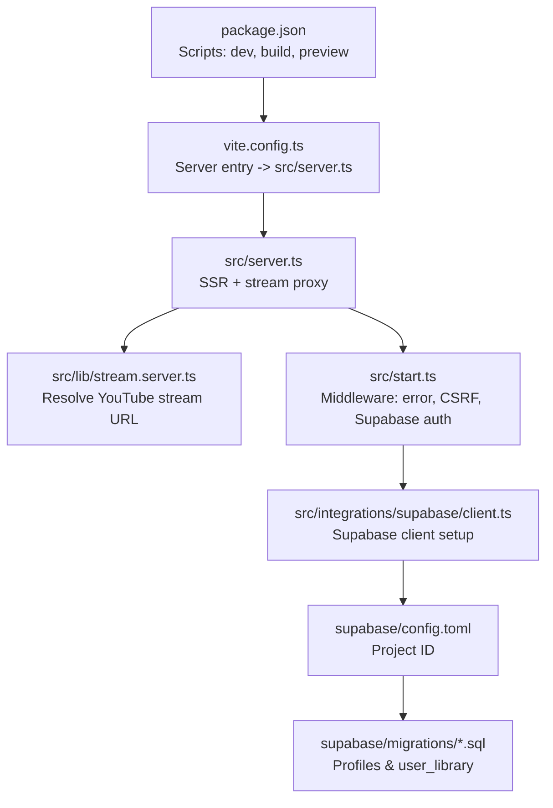
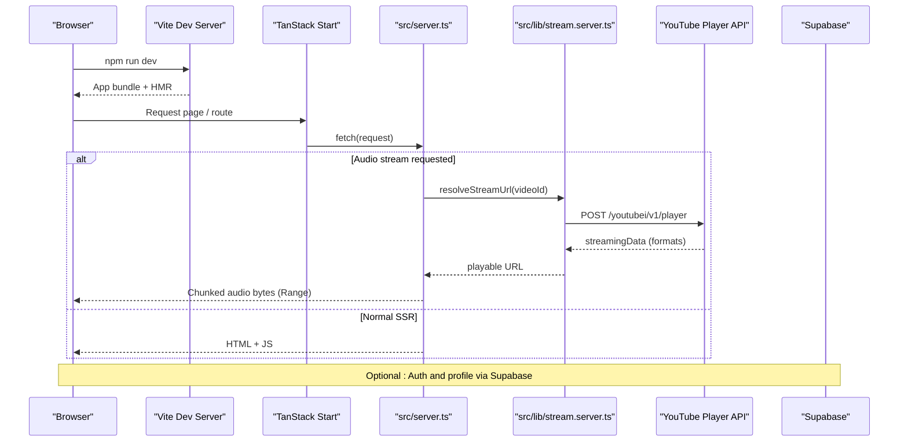
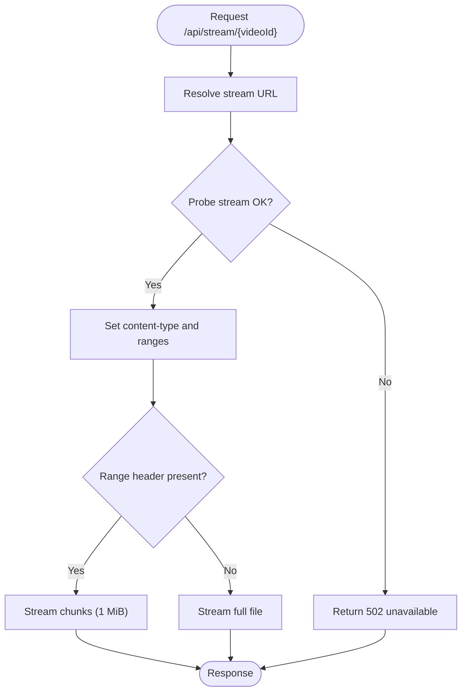
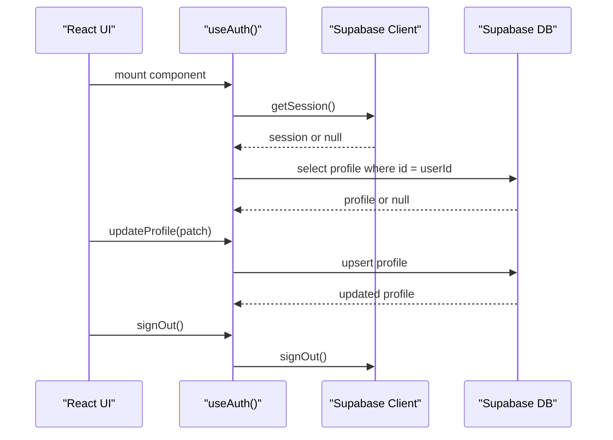

# Getting Started

<cite>
**Referenced Files in This Document**
- [package.json](file://package.json)
- [README.md](file://README.md)
- [vite.config.ts](file://vite.config.ts)
- [src/start.ts](file://src/start.ts)
- [src/server.ts](file://src/server.ts)
- [src/lib/stream.server.ts](file://src/lib/stream.server.ts)
- [src/integrations/supabase/client.ts](file://src/integrations/supabase/client.ts)
- [src/lib/auth.ts](file://src/lib/auth.ts)
- [supabase/config.toml](file://supabase/config.toml)
- [supabase/migrations/20260808085443_8253f78c-652e-4cb4-8772-8818ce90215c.sql](file://supabase/migrations/20260808085443_8253f78c-652e-4cb4-8772-8818ce90215c.sql)
- [supabase/migrations/20260808085506_fb5fd43f-6504-4c96-8335-2aeac753c924.sql](file://supabase/migrations/20260808085506_fb5fd43f-6504-4c96-8335-2aeac753c924.sql)
</cite>

## Table of Contents
1. Introduction
2. Project Structure
3. Core Components
4. Architecture Overview
5. Detailed Component Analysis
6. Dependency Analysis
7. Performance Considerations
8. Troubleshooting Guide
9. Conclusion
10. Appendices

## Introduction
This guide helps you set up and run the YouTube Music Companion application locally, understand its structure, and configure optional features like Supabase authentication. It covers installation, development workflow, building for production, and basic troubleshooting. The app is a React-based music companion built with TanStack Start and Vite, with server-side streaming support and optional Supabase integration for user profiles and library persistence.

## Project Structure
At a high level:
- src/components: UI components for music playback, layout, and shared UI primitives.
- src/lib: Server and client utilities (stream proxy, audio player hooks, media session integration, offline storage, error handling).
- src/integrations/supabase: Supabase client configuration and auth attachment middleware.
- supabase/migrations: Database schema and policies for profiles and user library.
- vite.config.ts: Build configuration that points to the custom server entry.
- package.json: Scripts for dev, build, preview, lint, and format.

**Diagram sources**
- [package.json:6-12](file://package.json#L6-L12)
- [vite.config.ts:9-15](file://vite.config.ts#L9-L15)
- [src/server.ts:180-198](file://src/server.ts#L180-L198)
- [src/lib/stream.server.ts:108-122](file://src/lib/stream.server.ts#L108-L122)
- [src/start.ts:28-31](file://src/start.ts#L28-L31)
- [src/integrations/supabase/client.ts:30-56](file://src/integrations/supabase/client.ts#L30-L56)
- [supabase/config.toml:1-1](file://supabase/config.toml#L1-L1)
- [supabase/migrations/20260808085443_8253f78c-652e-4cb4-8772-8818ce90215c.sql:1-63](file://supabase/migrations/20260808085443_8253f78c-652e-4cb4-8772-8818ce90215c.sql#L1-L63)

**Section sources**
- [package.json:6-12](file://package.json#L6-L12)
- [vite.config.ts:9-15](file://vite.config.ts#L9-L15)

## Core Components
- Development server and build pipeline via Vite and TanStack Start.
- Custom server entry that wraps SSR responses and proxies audio streams.
- Stream resolver that finds playable YouTube audio URLs and handles throttling.
- Supabase client initialization and auth state hook for user profiles.
- Migrations defining profiles and user library tables with row-level security.

Key responsibilities:
- src/server.ts: Handles SSR response normalization and proxies audio streams from YouTube by chunking requests to avoid throttling.
- src/lib/stream.server.ts: Resolves direct audio stream URLs using YouTube’s internal player API with retries and probing.
- src/start.ts: Registers request and function middleware (error handling, CSRF protection, Supabase auth attachment).
- src/integrations/supabase/client.ts: Creates a typed Supabase client, injects API keys, and configures auth persistence.
- src/lib/auth.ts: React hook to manage auth state and profile data.

**Section sources**
- [src/server.ts:21-57](file://src/server.ts#L21-L57)
- [src/server.ts:101-178](file://src/server.ts#L101-L178)
- [src/lib/stream.server.ts:14-45](file://src/lib/stream.server.ts#L14-L45)
- [src/lib/stream.server.ts:108-122](file://src/lib/stream.server.ts#L108-L122)
- [src/start.ts:6-31](file://src/start.ts#L6-L31)
- [src/integrations/supabase/client.ts:30-56](file://src/integrations/supabase/client.ts#L30-L56)
- [src/lib/auth.ts:12-69](file://src/lib/auth.ts#L12-L69)

## Architecture Overview
The runtime flow combines browser rendering, server-side functions, and external services:

**Diagram sources**
- [src/server.ts:180-198](file://src/server.ts#L180-L198)
- [src/lib/stream.server.ts:47-82](file://src/lib/stream.server.ts#L47-L82)
- [src/lib/stream.server.ts:108-122](file://src/lib/stream.server.ts#L108-L122)

## Detailed Component Analysis

### Installation and Environment Setup
- Prerequisites: Node.js and npm. Install Node.js using nvm if needed.
- Clone the repository and install dependencies:
  - git clone <repository-url>
  - cd <repository-name>
  - npm i
- Start the development server:
  - npm run dev
- Build for production:
  - npm run build
- Preview the production build locally:
  - npm run preview

Notes:
- The project uses Vite and TanStack Start; scripts are defined in package.json.
- The server entry is configured to use src/server.ts for SSR and streaming logic.

**Section sources**
- [README.md:15-24](file://README.md#L15-L24)
- [package.json:6-12](file://package.json#L6-L12)
- [vite.config.ts:9-15](file://vite.config.ts#L9-L15)

### Running the Development Server
- Run the dev server with hot module replacement enabled by default through Vite.
- Changes to components and routes will reload automatically in the browser.
- Use npm run dev to start the local development environment.

**Section sources**
- [package.json:6-12](file://package.json#L6-L12)

### Building for Production
- Build the app with optimized assets and server functions:
  - npm run build
- Preview the built output locally:
  - npm run preview

**Section sources**
- [package.json:6-12](file://package.json#L6-L12)

### Initial Configuration: Supabase Authentication
To enable Supabase features (profiles, user library):
- Create or connect a Supabase project and note your project URL and publishable key.
- Set environment variables:
  - VITE_SUPABASE_URL
  - VITE_SUPABASE_PUBLISHABLE_KEY
- The client reads these at runtime and throws a clear error if they are missing.
- Apply migrations to your Supabase project to create required tables and policies:
  - Profiles table with RLS policies
  - User library table with RLS policies
  - Triggers and functions to manage timestamps and new user onboarding
- Configure the Supabase project ID in supabase/config.toml if using local tooling.

Optional:
- If using Lovable Cloud Auth, ensure the integration is configured accordingly.

**Section sources**
- [src/integrations/supabase/client.ts:30-56](file://src/integrations/supabase/client.ts#L30-L56)
- [supabase/migrations/20260808085443_8253f78c-652e-4cb4-8772-8818ce90215c.sql:1-63](file://supabase/migrations/20260808085443_8253f78c-652e-4cb4-8772-8818ce90215c.sql#L1-L63)
- [supabase/config.toml:1-1](file://supabase/config.toml#L1-L1)

### Streaming and Audio Playback
- The server proxies YouTube audio streams to bypass CORS and handle throttled URLs by chunking requests.
- Stream resolution calls YouTube’s internal player API, selects an audio-only format, and probes the URL to ensure it plays.
- Range requests are supported so the browser can seek and show progress bars.

**Diagram sources**
- [src/server.ts:101-178](file://src/server.ts#L101-L178)
- [src/lib/stream.server.ts:108-122](file://src/lib/stream.server.ts#L108-L122)

**Section sources**
- [src/server.ts:47-57](file://src/server.ts#L47-L57)
- [src/server.ts:101-178](file://src/server.ts#L101-L178)
- [src/lib/stream.server.ts:14-45](file://src/lib/stream.server.ts#L14-L45)
- [src/lib/stream.server.ts:84-106](file://src/lib/stream.server.ts#L84-L106)
- [src/lib/stream.server.ts:108-122](file://src/lib/stream.server.ts#L108-L122)

### Authentication Flow
- The app attaches Supabase auth to server functions via middleware.
- Client-side, the Supabase client is created with environment variables and configured for session persistence and token refresh.
- The useAuth hook manages session state and profile data, including updates and sign-out.

**Diagram sources**
- [src/start.ts:28-31](file://src/start.ts#L28-L31)
- [src/integrations/supabase/client.ts:30-56](file://src/integrations/supabase/client.ts#L30-L56)
- [src/lib/auth.ts:12-69](file://src/lib/auth.ts#L12-L69)

**Section sources**
- [src/start.ts:28-31](file://src/start.ts#L28-L31)
- [src/integrations/supabase/client.ts:30-56](file://src/integrations/supabase/client.ts#L30-L56)
- [src/lib/auth.ts:12-69](file://src/lib/auth.ts#L12-L69)

## Dependency Analysis
Core runtime dependencies include:
- @tanstack/react-start and related router plugins for SSR and routing.
- @supabase/supabase-js for database and auth integration.
- react and react-dom for UI.
- vite and nitro for build and server targets.
- Tailwind CSS and Radix UI primitives for styling and accessible components.

Build-time configuration:
- vite.config.ts sets the server entry to src/server.ts and integrates TanStack Start and Nitro.

**Section sources**
- [package.json:14-70](file://package.json#L14-L70)
- [package.json:72-90](file://package.json#L72-L90)
- [vite.config.ts:9-15](file://vite.config.ts#L9-L15)

## Performance Considerations
- Streaming uses 1 MiB chunks to work around throttled URLs and supports range requests for seeking and progress.
- Stream resolution retries across multiple client configurations and probes URLs before returning them.
- SSR errors are normalized to render a friendly error page instead of JSON payloads.
- Avoid unnecessary re-renders by leveraging memoization and stable references in components (as implemented in the app).

[No sources needed since this section provides general guidance]

## Troubleshooting Guide
Common issues and resolutions:
- Missing Supabase environment variables:
  - Ensure VITE_SUPABASE_URL and VITE_SUPABASE_PUBLISHABLE_KEY are set. The client logs a clear error when they are missing.
- Stream unavailable:
  - If the upstream stream is capped or throttled, the server returns a 502. Try another track or check network conditions.
- SSR errors:
  - The server wraps responses to render an error page when h3 swallows exceptions. Check server logs for details.
- CSRF protection:
  - Server functions are protected by CSRF middleware; ensure requests originate from trusted contexts.

Debugging tips:
- Use browser developer tools to inspect network requests and audio streaming behavior.
- Check console logs for Supabase client errors and stream proxy messages.
- Validate migrations in your Supabase project to ensure tables and policies exist.

**Section sources**
- [src/integrations/supabase/client.ts:30-56](file://src/integrations/supabase/client.ts#L30-L56)
- [src/server.ts:21-45](file://src/server.ts#L21-L45)
- [src/server.ts:101-178](file://src/server.ts#L101-L178)
- [src/start.ts:6-31](file://src/start.ts#L6-L31)

## Conclusion
You now have the essentials to install, configure, and run the YouTube Music Companion locally. Use the development server for iterative changes, build for production when ready, and optionally enable Supabase for persistent user profiles and library data. The streaming layer ensures reliable playback by working around platform limitations, while middleware protects server functions and improves error handling.

[No sources needed since this section summarizes without analyzing specific files]

## Appendices

### Development Workflows
- Hot reloading: Enabled by Vite during development; edits to components and routes reload instantly.
- Debugging: Inspect network tab for stream requests and Supabase calls; review console logs for errors.
- Testing approaches:
  - Unit tests: Add tests for utility functions in src/lib using your preferred test runner.
  - Integration tests: Verify Supabase queries and stream resolution endpoints in a test environment.
  - E2E tests: Simulate user flows like search, play, and download using Playwright or Cypress.

[No sources needed since this section provides general guidance]