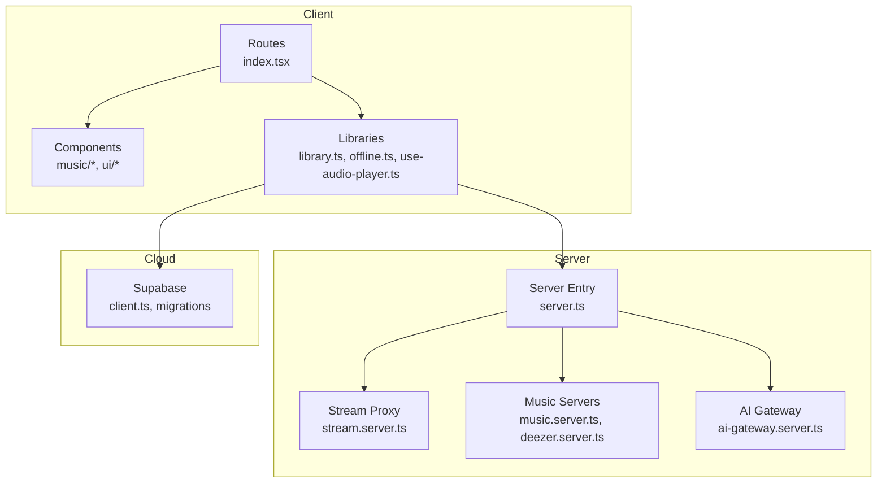
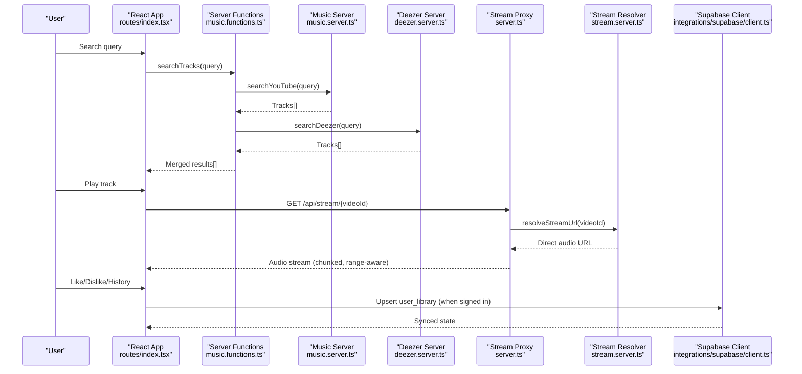
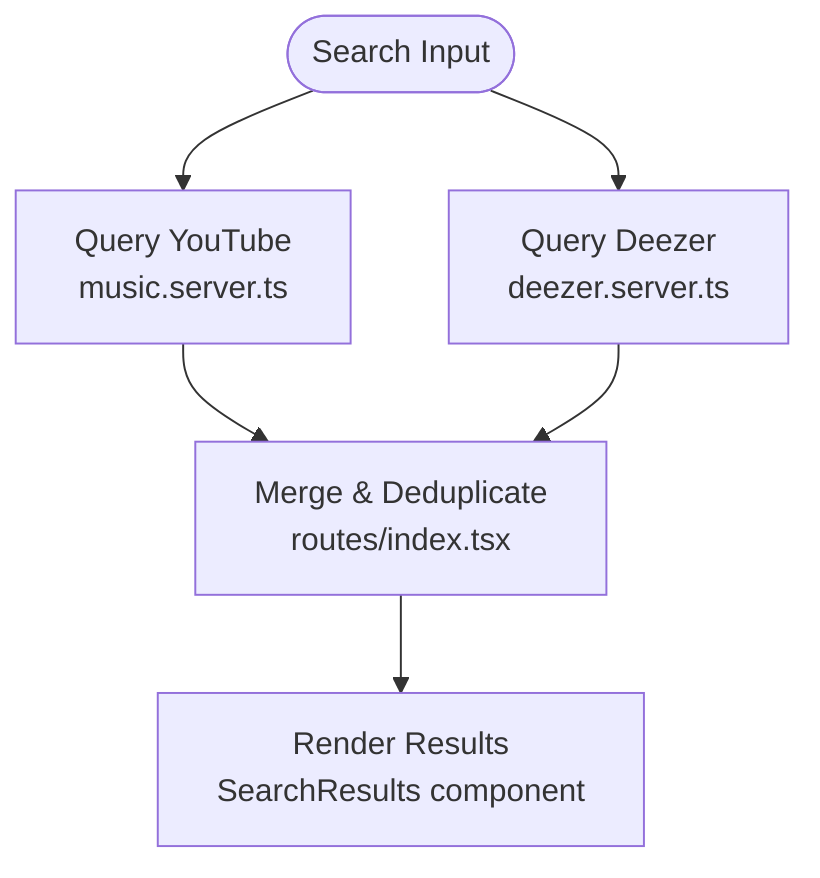
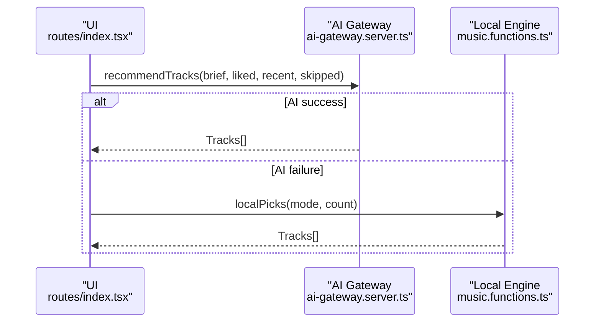
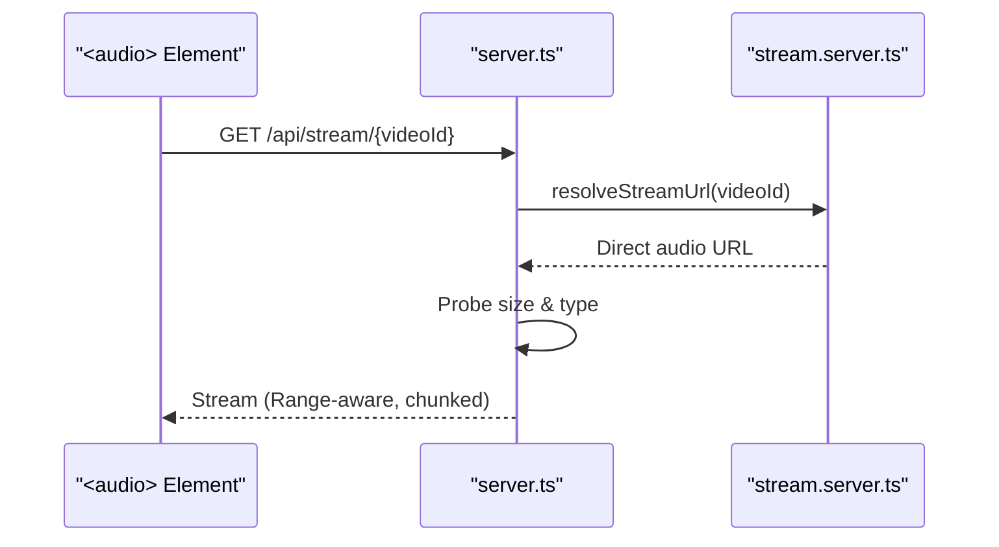
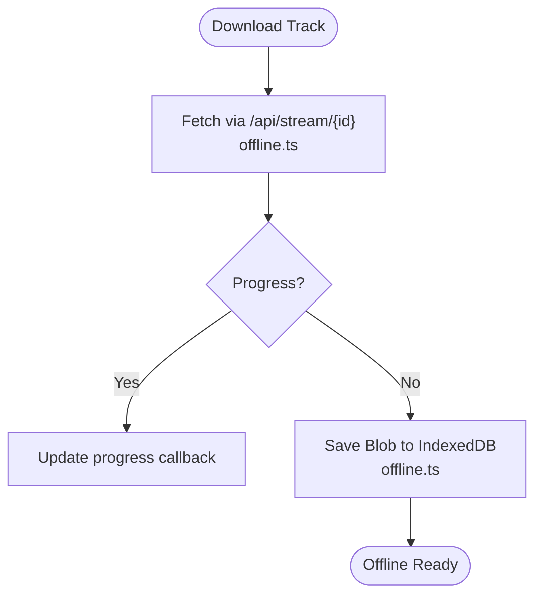
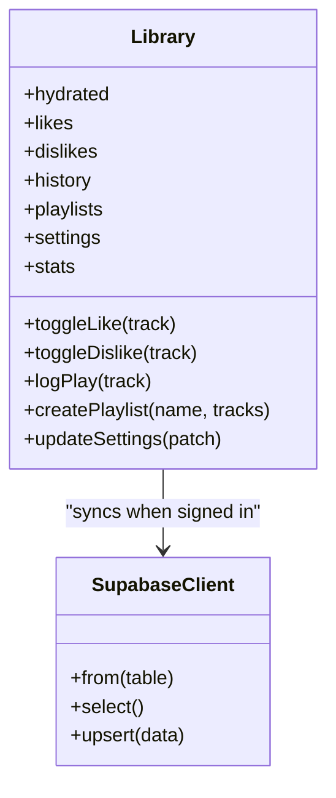
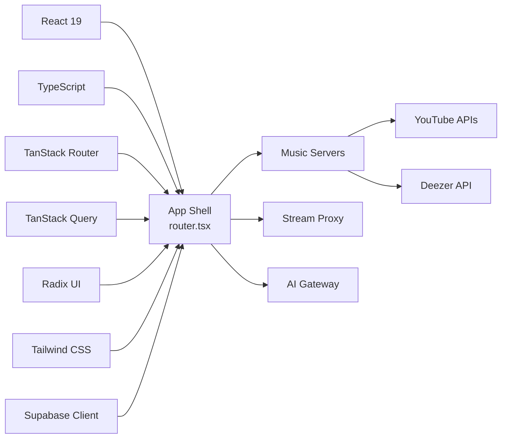

# Project Overview

<cite>
**Referenced Files in This Document**
- [README.md](file://README.md)
- [package.json](file://package.json)
- [src/start.ts](file://src/start.ts)
- [src/server.ts](file://src/server.ts)
- [src/router.tsx](file://src/router.tsx)
- [src/lib/music.server.ts](file://src/lib/music.server.ts)
- [src/lib/deezer.server.ts](file://src/lib/deezer.server.ts)
- [src/lib/stream.server.ts](file://src/lib/stream.server.ts)
- [src/lib/offline.ts](file://src/lib/offline.ts)
- [src/lib/library.ts](file://src/lib/library.ts)
- [src/lib/ai-gateway.server.ts](file://src/lib/ai-gateway.server.ts)
- [src/integrations/supabase/client.ts](file://src/integrations/supabase/client.ts)
- [src/routes/index.tsx](file://src/routes/index.tsx)
- [supabase/migrations/20260808085443_8253f78c-652e-4cb4-8772-8818ce90215c.sql](file://supabase/migrations/20260808085443_8253f78c-652e-4cb4-8772-8818ce90215c.sql)
</cite>

## Table of Contents
1. [Introduction](#introduction)
2. [Project Structure](#project-structure)
3. [Core Components](#core-components)
4. [Architecture Overview](#architecture-overview)
5. [Detailed Component Analysis](#detailed-component-analysis)
6. [Dependency Analysis](#dependency-analysis)
7. [Performance Considerations](#performance-considerations)
8. [Troubleshooting Guide](#troubleshooting-guide)
9. [Conclusion](#conclusion)

## Introduction
YouTube Music Companion is a music streaming application that aggregates content from multiple sources, primarily YouTube and Deezer, to deliver a unified music discovery experience. It provides AI-powered recommendations, robust library management (likes, dislikes, history, playlists), and offline playback via local storage. The app uses a local-first architecture: user data lives on the device first and syncs to Supabase when signed in, enabling seamless cross-device synchronization. A server-side stream proxy handles audio delivery from YouTube by bypassing CORS restrictions and throttling constraints, while Deezer previews are played directly as MP3 streams.

Conceptually, the app supports:
- Music discovery through search, mood-based mixes, new releases, and AI recommendations
- Library management for likes, dislikes, listening history, and playlists
- Offline listening by downloading tracks into IndexedDB for playback without a network connection
- Cross-device sync of library state via Supabase when authenticated

For beginners: think of it as a personal music hub where you can find songs, build playlists, get smart suggestions, and listen anywhere—even offline. For experienced developers: it’s a React 19 + TypeScript app built with TanStack Start, integrating Supabase for auth and cloud sync, with a custom server entry handling streaming and error normalization.

**Section sources**
- [README.md:1-25](file://README.md#L1-L25)
- [package.json:14-70](file://package.json#L14-L70)
- [src/start.ts:1-32](file://src/start.ts#L1-L32)
- [src/server.ts:47-178](file://src/server.ts#L47-L178)
- [src/lib/library.ts:237-339](file://src/lib/library.ts#L237-L339)

## Project Structure
The project follows a feature-oriented layout under src/:
- routes: Application pages and file-based routing (TanStack Router)
- components: UI components grouped by domain (music, ui)
- hooks: Custom React hooks
- integrations: Third-party integrations (Supabase client and auth attacher)
- lib: Core logic modules (music servers, streaming, offline storage, library state, AI gateway)
- supabase: Database migrations and configuration

**Diagram sources**
- [src/routes/index.tsx:155-196](file://src/routes/index.tsx#L155-L196)
- [src/server.ts:180-198](file://src/server.ts#L180-L198)
- [src/lib/stream.server.ts:108-123](file://src/lib/stream.server.ts#L108-L123)
- [src/lib/music.server.ts:154-214](file://src/lib/music.server.ts#L154-L214)
- [src/lib/deezer.server.ts:39-74](file://src/lib/deezer.server.ts#L39-L74)
- [src/integrations/supabase/client.ts:30-69](file://src/integrations/supabase/client.ts#L30-L69)

**Section sources**
- [src/router.tsx:1-17](file://src/router.tsx#L1-L17)
- [src/start.ts:1-32](file://src/start.ts#L1-L32)
- [src/server.ts:1-198](file://src/server.ts#L1-L198)

## Core Components
- Music discovery and search: Aggregates results from YouTube and Deezer, deduplicates, and presents them in a unified interface. Supports autocomplete suggestions and filters to prioritize music-only content.
- Recommendations engine: Combines AI-powered picks with a local fallback engine based on listening behavior, moods, genres, languages, and energy levels.
- Library management: Local-first storage of likes, dislikes, history, playlists, settings, and stats; optional Supabase sync for cross-device continuity.
- Streaming and playback: Uses a server-side stream proxy to fetch YouTube audio in chunks with range support; Deezer previews play directly as MP3 links.
- Offline playback: Downloads tracks via the stream proxy and stores blobs in IndexedDB for offline playback.

Key implementation highlights:
- Search merges YouTube and Deezer results, preferring YouTube but filling gaps with Deezer previews.
- Recommendations fall back to a local engine if AI is unavailable or returns no tracks.
- Playback resumes across sessions using saved queue and position; podcast episodes remember last positions.
- Offline downloads track progress and store metadata alongside audio blobs.

**Section sources**
- [src/routes/index.tsx:760-790](file://src/routes/index.tsx#L760-L790)
- [src/routes/index.tsx:633-650](file://src/routes/index.tsx#L633-L650)
- [src/lib/library.ts:237-339](file://src/lib/library.ts#L237-L339)
- [src/lib/stream.server.ts:108-123](file://src/lib/stream.server.ts#L108-L123)
- [src/lib/offline.ts:123-162](file://src/lib/offline.ts#L123-L162)

## Architecture Overview
The system combines client-side React components with server functions and a custom server entry. The start instance configures middleware for error handling and CSRF protection, and attaches Supabase authentication to server functions. The server entry normalizes SSR errors and intercepts stream proxy requests to handle YouTube audio streaming safely.

**Diagram sources**
- [src/routes/index.tsx:760-790](file://src/routes/index.tsx#L760-L790)
- [src/lib/music.server.ts:154-214](file://src/lib/music.server.ts#L154-L214)
- [src/lib/deezer.server.ts:39-74](file://src/lib/deezer.server.ts#L39-L74)
- [src/server.ts:101-178](file://src/server.ts#L101-L178)
- [src/lib/stream.server.ts:108-123](file://src/lib/stream.server.ts#L108-L123)
- [src/integrations/supabase/client.ts:30-69](file://src/integrations/supabase/client.ts#L30-L69)

## Detailed Component Analysis

### Music Discovery and Search
- YouTube search scrapes results with music-only filters and upload date filters, extracting video metadata and thumbnails.
- Deezer search returns direct preview URLs for quick playback without the stream proxy.
- Results are merged and deduplicated by title and artist, prioritizing YouTube results.

**Diagram sources**
- [src/lib/music.server.ts:154-214](file://src/lib/music.server.ts#L154-L214)
- [src/lib/deezer.server.ts:39-74](file://src/lib/deezer.server.ts#L39-L74)
- [src/routes/index.tsx:760-790](file://src/routes/index.tsx#L760-L790)

**Section sources**
- [src/lib/music.server.ts:154-214](file://src/lib/music.server.ts#L154-L214)
- [src/lib/deezer.server.ts:39-74](file://src/lib/deezer.server.ts#L39-L74)
- [src/routes/index.tsx:760-790](file://src/routes/index.tsx#L760-L790)

### Recommendations Engine
- AI-powered recommendations are generated via an OpenAI-compatible gateway provider configured for Lovable’s AI gateway.
- If AI fails or returns no tracks, the app falls back to a local engine that uses top artists, recent history, skipped labels, and tuning preferences to generate picks.
- Mixes include Discover, New Release, Explore, Podcasts, and Replay based on behavioral signals.

**Diagram sources**
- [src/lib/ai-gateway.server.ts:1-10](file://src/lib/ai-gateway.server.ts#L1-L10)
- [src/routes/index.tsx:633-650](file://src/routes/index.tsx#L633-L650)

**Section sources**
- [src/lib/ai-gateway.server.ts:1-10](file://src/lib/ai-gateway.server.ts#L1-L10)
- [src/routes/index.tsx:633-650](file://src/routes/index.tsx#L633-L650)

### Streaming and Stream Proxy
- The server entry intercepts requests to /api/stream/{videoId}, resolves a direct audio URL via the stream resolver, probes availability, and streams audio in 1 MiB chunks with Range support.
- This approach bypasses CORS issues and works around throttled URLs that reject open-ended ranges or large single requests.

**Diagram sources**
- [src/server.ts:101-178](file://src/server.ts#L101-L178)
- [src/lib/stream.server.ts:108-123](file://src/lib/stream.server.ts#L108-L123)

**Section sources**
- [src/server.ts:47-178](file://src/server.ts#L47-L178)
- [src/lib/stream.server.ts:1-123](file://src/lib/stream.server.ts#L1-L123)

### Offline Playback
- Offline storage uses IndexedDB to save downloaded tracks as blobs with metadata (track info, size, saved timestamp).
- Downloading streams audio via the stream proxy, reports progress, and persists the blob for offline playback.
- Utilities list, remove, and clear downloads, and compute total stored size.

**Diagram sources**
- [src/lib/offline.ts:123-162](file://src/lib/offline.ts#L123-L162)

**Section sources**
- [src/lib/offline.ts:1-162](file://src/lib/offline.ts#L1-L162)

### Library Management and Sync
- Local-first library stores likes, dislikes, history, playlists, settings, and stats in localStorage with helpers for reading/writing.
- When signed in, the app pulls account data from Supabase and merges it with local data; changes are debounced and upserted to the cloud.
- Database schema includes profiles and user_library tables with row-level security policies.

**Diagram sources**
- [src/lib/library.ts:237-339](file://src/lib/library.ts#L237-L339)
- [src/integrations/supabase/client.ts:30-69](file://src/integrations/supabase/client.ts#L30-L69)
- [supabase/migrations/20260808085443_8253f78c-652e-4cb4-8772-8818ce90215c.sql:20-33](file://supabase/migrations/20260808085443_8253f78c-652e-4cb4-8772-8818ce90215c.sql#L20-L33)

**Section sources**
- [src/lib/library.ts:105-142](file://src/lib/library.ts#L105-L142)
- [src/lib/library.ts:237-339](file://src/lib/library.ts#L237-L339)
- [supabase/migrations/20260808085443_8253f78c-652e-4cb4-8772-8818ce90215c.sql:1-63](file://supabase/migrations/20260808085443_8253f78c-652e-4cb4-8772-8818ce90215c.sql#L1-L63)

## Dependency Analysis
- Client dependencies include React 19, TanStack Router, TanStack Query, Radix UI primitives, Tailwind CSS, and Supabase JS client.
- Server-side integration uses TanStack Start for server functions and middleware, with a custom server entry handling streaming and error normalization.
- External services: YouTube (search and player API), Deezer (search and previews), Lovable AI gateway (recommendations), Supabase (auth and cloud sync).

**Diagram sources**
- [package.json:14-70](file://package.json#L14-L70)
- [src/router.tsx:1-17](file://src/router.tsx#L1-L17)
- [src/lib/music.server.ts:154-214](file://src/lib/music.server.ts#L154-L214)
- [src/lib/deezer.server.ts:39-74](file://src/lib/deezer.server.ts#L39-L74)
- [src/lib/ai-gateway.server.ts:1-10](file://src/lib/ai-gateway.server.ts#L1-L10)

**Section sources**
- [package.json:14-70](file://package.json#L14-L70)
- [src/router.tsx:1-17](file://src/router.tsx#L1-L17)

## Performance Considerations
- Streaming uses 1 MiB chunks to respect upstream throttling and enable seeking; this reduces memory pressure and improves reliability.
- Range requests allow efficient playback and downloads; probing ensures only viable streams are served.
- Debounced syncing to Supabase avoids excessive writes during rapid interactions.
- Local-first storage minimizes network calls and keeps the UI responsive even offline.
- Merging and deduplicating search results prevents redundant work and reduces rendering load.

[No sources needed since this section provides general guidance]

## Troubleshooting Guide
Common issues and resolutions:
- Stream unavailable: The stream proxy may return 502 if upstream streams are capped or throttled; try another source or mix.
- Multiple song failures: The player auto-skips once on error; after two consecutive failures, playback stops and prompts the user to choose another mix.
- Missing environment variables: Supabase client requires VITE_SUPABASE_URL and VITE_SUPABASE_PUBLISHABLE_KEY; missing keys throw an error at runtime.
- Error page rendering: The server entry normalizes SSR errors and renders a consistent error page; check console logs for captured errors.

**Section sources**
- [src/server.ts:21-45](file://src/server.ts#L21-L45)
- [src/server.ts:180-198](file://src/server.ts#L180-L198)
- [src/integrations/supabase/client.ts:30-44](file://src/integrations/supabase/client.ts#L30-L44)
- [src/routes/index.tsx:497-512](file://src/routes/index.tsx#L497-L512)

## Conclusion
YouTube Music Companion delivers a comprehensive music experience by combining multi-source aggregation, AI-driven recommendations, robust library management, and offline playback. Its local-first architecture ensures fast, reliable performance and seamless cross-device sync when authenticated. The server-side stream proxy enables smooth playback of YouTube content while respecting platform constraints. Whether you’re discovering new music, curating playlists, or listening offline, the app balances convenience with powerful customization.

[No sources needed since this section summarizes without analyzing specific files]