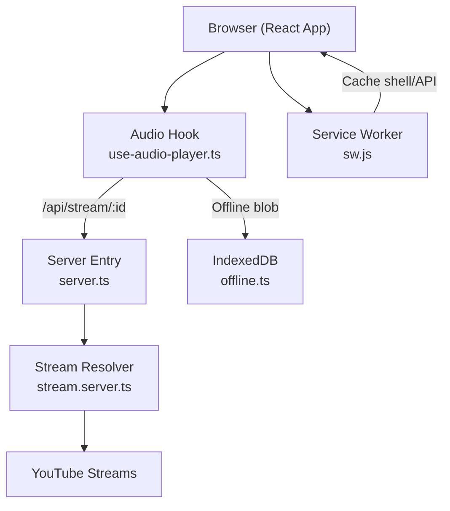
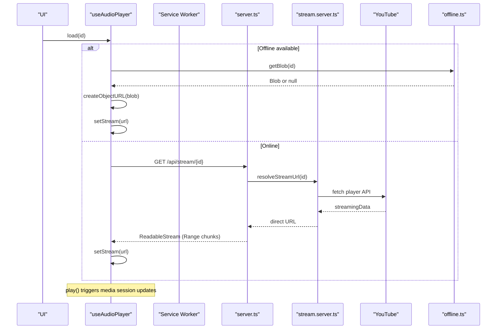
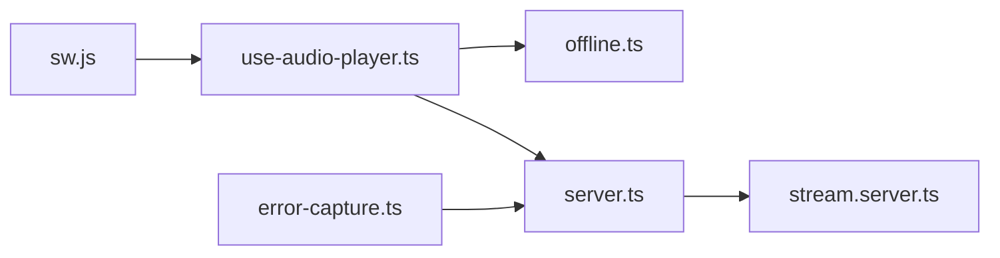

# Troubleshooting & FAQ

<cite>
**Referenced Files in This Document**
- [use-audio-player.ts](file://src/lib/use-audio-player.ts)
- [offline.ts](file://src/lib/offline.ts)
- [stream.server.ts](file://src/lib/stream.server.ts)
- [server.ts](file://src/server.ts)
- [ErrorBoundary.tsx](file://src/components/music/ErrorBoundary.tsx)
- [error-capture.ts](file://src/lib/error-capture.ts)
- [error-page.ts](file://src/lib/error-page.ts)
- [sw.js](file://public/sw.js)
- [music.functions.ts](file://src/lib/music.functions.ts)
- [use-media-session.ts](file://src/lib/use-media-session.ts)
</cite>

## Table of Contents
1. Introduction
2. Project Structure
3. Core Components
4. Architecture Overview
5. Detailed Component Analysis
6. Dependency Analysis
7. Performance Considerations
8. Troubleshooting Guide
9. Conclusion
10. Appendices

## Introduction
This document provides comprehensive troubleshooting and frequently asked questions for the YouTube Music Companion application. It focuses on common issues such as audio playback problems, network connectivity issues, offline sync conflicts, and browser compatibility problems. It also includes step-by-step solutions for frequent errors with specific error messages, debugging techniques using browser developer tools, logging analysis, performance profiling methods, known limitations and workarounds, and guidance for reporting bugs effectively.

## Project Structure
The application is a React-based web app with a server entry that proxies audio streams from YouTube via a same-origin endpoint. Key areas relevant to troubleshooting:
- Audio playback uses an HTML5 <audio> element backed by a custom hook.
- Offline playback relies on IndexedDB blobs downloaded through the same-origin stream proxy.
- The server resolves direct audio URLs and serves them in bounded byte ranges to bypass throttling and CORS restrictions.
- A service worker caches the app shell and API responses while bypassing caching for large audio streams.
- Error boundaries and global error capture help surface runtime issues.

**Diagram sources**
- [use-audio-player.ts:103-170](file://src/lib/use-audio-player.ts#L103-L170)
- [server.ts:101-177](file://src/server.ts#L101-L177)
- [stream.server.ts:108-122](file://src/lib/stream.server.ts#L108-L122)
- [offline.ts:123-161](file://src/lib/offline.ts#L123-L161)
- [sw.js:33-75](file://public/sw.js#L33-L75)

**Section sources**
- [use-audio-player.ts:1-221](file://src/lib/use-audio-player.ts#L1-L221)
- [server.ts:1-198](file://src/server.ts#L1-L198)
- [stream.server.ts:1-122](file://src/lib/stream.server.ts#L1-L122)
- [offline.ts:1-162](file://src/lib/offline.ts#L1-L162)
- [sw.js:1-82](file://public/sw.js#L1-L82)

## Core Components
- Audio player hook: Manages playback state, seeks, volume, and chooses between offline blobs or streaming via /api/stream.
- Offline storage: Uses IndexedDB to store and retrieve audio blobs; supports download progress and total size calculations.
- Stream resolver: Resolves ad-free audio URLs from YouTube’s internal player API and probes them before use.
- Server proxy: Serves audio in bounded byte ranges, handles Range requests, and detects capped streams early.
- Service worker: Caches app shell and API responses; bypasses caching for audio streams to avoid quota issues.
- Error handling: Global error capture and UI error boundary to surface and recover from runtime errors.

**Section sources**
- [use-audio-player.ts:16-212](file://src/lib/use-audio-player.ts#L16-L212)
- [offline.ts:24-161](file://src/lib/offline.ts#L24-L161)
- [stream.server.ts:47-122](file://src/lib/stream.server.ts#L47-L122)
- [server.ts:47-177](file://src/server.ts#L47-L177)
- [sw.js:1-82](file://public/sw.js#L1-L82)
- [ErrorBoundary.tsx:13-71](file://src/components/music/ErrorBoundary.tsx#L13-L71)
- [error-capture.ts:1-82](file://src/lib/error-capture.ts#L1-L82)

## Architecture Overview
Playback flow involves resolving a direct audio URL, serving it through a same-origin proxy that handles range requests, and playing via the HTML5 audio element. Offline playback falls back to IndexedDB blobs when available.

**Diagram sources**
- [use-audio-player.ts:142-170](file://src/lib/use-audio-player.ts#L142-L170)
- [server.ts:101-177](file://src/server.ts#L101-L177)
- [stream.server.ts:108-122](file://src/lib/stream.server.ts#L108-L122)
- [offline.ts:68-77](file://src/lib/offline.ts#L68-L77)
- [use-media-session.ts:20-76](file://src/lib/use-media-session.ts#L20-L76)

## Detailed Component Analysis

### Audio Playback Issues
Common symptoms:
- “This song is unavailable. Skipping...” appears during playback.
- “Playback blocked. Tap play to resume.” after attempting autoplay.
- No sound despite visible controls; seeking fails.

Root causes and resolutions:
- Network or stream resolution failure: The server may not find a playable URL due to region blocks, age restrictions, or throttled links. Retry logic exists but can still fail.
- Autoplay policy: Browsers block autoplay without user interaction; the hook warns and prompts the user to tap play.
- Offline blob corruption or missing: If the blob is absent or invalid, playback falls back to online; if both fail, playback stops.

Steps to diagnose:
- Open DevTools Console and look for warnings like “[MelodyMap] play() failed” or offline playback failures.
- Check the Network tab for /api/stream requests and their status codes (206 for partial content, 404/502 for failures).
- Verify IndexedDB has a valid blob for offline playback under the “tracks” object store.

Mitigations:
- Ensure user interaction precedes autoplay.
- If offline playback fails, clear downloads and re-download the track.
- For region-restricted or age-restricted tracks, expect playback to be unavailable.

**Section sources**
- [use-audio-player.ts:56-67](file://src/lib/use-audio-player.ts#L56-L67)
- [use-audio-player.ts:115-120](file://src/lib/use-audio-player.ts#L115-L120)
- [use-audio-player.ts:123-140](file://src/lib/use-audio-player.ts#L123-L140)
- [server.ts:109-111](file://src/server.ts#L109-L111)
- [stream.server.ts:108-122](file://src/lib/stream.server.ts#L108-L122)

### Network Connectivity and Streaming Problems
Symptoms:
- Requests to /api/stream return 404 (“Stream not found”) or 502 (“Stream unavailable”).
- Slow buffering or stalls during playback.
- Downloads fail with HTTP errors.

Causes:
- YouTube stream resolution fails across client configs or returns non-playable formats.
- Throttled or capped streams detected by probing; some videos only allow limited bytes.
- Network interruptions or restrictive firewalls blocking YouTube endpoints.

Resolutions:
- Retry playback later; the resolver retries multiple times with different client configurations.
- Avoid large open-ended range requests; the server splits into 1 MiB chunks to mitigate throttling.
- For downloads, ensure sufficient bandwidth and retry; check Content-Length availability for progress.

Diagnostics:
- Inspect Network panel for Range headers and response codes.
- Look for logs like “[stream-proxy] chunk ... -> status” indicating upstream failures.
- Confirm service worker is not intercepting audio streams (it intentionally bypasses them).

**Section sources**
- [server.ts:61-81](file://src/server.ts#L61-L81)
- [server.ts:113-148](file://src/server.ts#L113-L148)
- [stream.server.ts:96-106](file://src/lib/stream.server.ts#L96-L106)
- [sw.js:39-48](file://public/sw.js#L39-L48)

### Offline Sync Conflicts
Symptoms:
- Downloaded songs do not play offline.
- Storage usage grows unexpectedly.
- Duplicate or stale entries in offline list.

Causes:
- IndexedDB unavailable or corrupted database.
- Blob retrieval failures or incomplete downloads.
- Service worker cache vs. IndexedDB separation: streams are not cached; only app shell/API are.

Resolutions:
- Clear all downloads and re-download problematic tracks.
- Verify IndexedDB presence and permissions in DevTools Application tab.
- Use listDownloads and totalDownloadSize to audit storage.

Diagnostics:
- Check for “IndexedDB unavailable” errors in console.
- Validate blob types and sizes; ensure content-type is appropriate for audio playback.

**Section sources**
- [offline.ts:24-38](file://src/lib/offline.ts#L24-L38)
- [offline.ts:68-77](file://src/lib/offline.ts#L68-L77)
- [offline.ts:85-115](file://src/lib/offline.ts#L85-L115)
- [offline.ts:123-161](file://src/lib/offline.ts#L123-L161)
- [sw.js:33-75](file://public/sw.js#L33-L75)

### Browser Compatibility Issues
Symptoms:
- Media controls not syncing with OS lock screen or system tray.
- Autoplay blocked repeatedly.
- Unexpected behavior in older browsers.

Causes:
- MediaSession API unsupported or partially supported.
- Autoplay policies vary by browser and require user gestures.
- Some features rely on modern Web APIs (IndexedDB, ReadableStream).

Resolutions:
- Provide explicit user interactions to start playback.
- Gracefully degrade when MediaSession actions are unsupported.
- Test on target browsers; fallbacks exist for unsupported actions.

Diagnostics:
- Check for exceptions around MediaSession action handlers.
- Validate navigator.mediaSession presence and capabilities.

**Section sources**
- [use-media-session.ts:20-76](file://src/lib/use-media-session.ts#L20-L76)
- [use-audio-player.ts:115-120](file://src/lib/use-audio-player.ts#L115-L120)

### Error Boundaries and Runtime Errors
Symptoms:
- UI shows “Something went wrong” with options to reload or recover.
- SSR errors result in a generic error page.

Causes:
- Unhandled component render errors.
- Server-side rendering failures swallowed by the framework.

Resolutions:
- Use the “Reload app” button to reset state.
- In development, inspect the component stack shown in the error boundary.
- Review captured errors via global error capture for deeper context.

Diagnostics:
- Open DevTools Console for “[MelodyMap] Render error” logs.
- Check server logs for h3-swallowed errors and captured stacks.

**Section sources**
- [ErrorBoundary.tsx:13-71](file://src/components/music/ErrorBoundary.tsx#L13-L71)
- [error-capture.ts:52-81](file://src/lib/error-capture.ts#L52-L81)
- [server.ts:21-36](file://src/server.ts#L21-L36)
- [error-page.ts:1-31](file://src/lib/error-page.ts#L1-L31)

## Dependency Analysis
Key dependencies and relationships:
- useAudioPlayer depends on offline storage and server stream proxy.
- Server proxy depends on stream resolver to obtain direct URLs.
- Service worker interacts with network and caches but bypasses audio streams.
- Error capture integrates with server entry to recover swallowed errors.

**Diagram sources**
- [use-audio-player.ts:103-170](file://src/lib/use-audio-player.ts#L103-L170)
- [offline.ts:68-77](file://src/lib/offline.ts#L68-L77)
- [server.ts:101-177](file://src/server.ts#L101-L177)
- [stream.server.ts:108-122](file://src/lib/stream.server.ts#L108-L122)
- [sw.js:33-75](file://public/sw.js#L33-L75)
- [error-capture.ts:52-81](file://src/lib/error-capture.ts#L52-L81)

**Section sources**
- [use-audio-player.ts:1-221](file://src/lib/use-audio-player.ts#L1-L221)
- [offline.ts:1-162](file://src/lib/offline.ts#L1-L162)
- [server.ts:1-198](file://src/server.ts#L1-L198)
- [stream.server.ts:1-122](file://src/lib/stream.server.ts#L1-L122)
- [sw.js:1-82](file://public/sw.js#L1-L82)
- [error-capture.ts:1-82](file://src/lib/error-capture.ts#L1-L82)

## Performance Considerations
- Memory leaks: Object URLs created for offline playback must be revoked when replaced or on unmount to prevent memory growth.
- Slow loading times: Large initial payloads or repeated stream resolution can delay playback; prefer offline playback for frequently accessed tracks.
- Audio buffering: Bounded Range requests mitigate throttling; ensure stable network and avoid excessive concurrent streams.
- IndexedDB operations: Batch operations and proper transaction handling reduce overhead; monitor storage quotas.

Recommendations:
- Revoke object URLs promptly and avoid retaining references.
- Preload metadata and cue tracks to reduce perceived latency.
- Monitor memory usage in DevTools Performance tab during long sessions.
- Limit concurrent downloads and queue them to avoid overwhelming the network.

[No sources needed since this section provides general guidance]

## Troubleshooting Guide

### Common Errors and Resolutions
- “This song is unavailable. Skipping...”
  - Cause: Stream resolution failed or track restricted.
  - Resolution: Retry later; try another device or region; consider downloading when available.

- “Playback blocked. Tap play to resume.”
  - Cause: Autoplay policy prevents automatic playback.
  - Resolution: Interact with the UI to start playback explicitly.

- “Download failed (status)”
  - Cause: Network error or upstream stream unavailable.
  - Resolution: Retry download; check network connectivity; verify server logs for upstream failures.

- “Stream not found” or “Stream unavailable”
  - Cause: YouTube did not provide a playable URL or capped stream.
  - Resolution: Wait and retry; if persistent, the track may be region-restricted or age-restricted.

- “IndexedDB unavailable”
  - Cause: Browser does not support IndexedDB or permissions blocked.
  - Resolution: Enable storage permissions; use a modern browser; clear site data if corrupted.

- “Too many requests — try again shortly.”
  - Cause: AI recommendation service rate limiting.
  - Resolution: Retry after a short delay; reduce request frequency.

- “AI credits are exhausted — add credits to keep generating picks.”
  - Cause: External AI provider billing limits reached.
  - Resolution: Add credits or disable AI-dependent features temporarily.

**Section sources**
- [use-audio-player.ts:56-67](file://src/lib/use-audio-player.ts#L56-L67)
- [use-audio-player.ts:115-120](file://src/lib/use-audio-player.ts#L115-L120)
- [offline.ts:123-161](file://src/lib/offline.ts#L123-L161)
- [server.ts:109-111](file://src/server.ts#L109-L111)
- [music.functions.ts:105-110](file://src/lib/music.functions.ts#L105-L110)
- [music.functions.ts:212-217](file://src/lib/music.functions.ts#L212-L217)

### Debugging Techniques
- Browser Developer Tools:
  - Console: Look for “[MelodyMap]” prefixed logs and warnings about playback failures.
  - Network: Inspect /api/stream requests, Range headers, and response codes; confirm streaming chunks.
  - Application: Check IndexedDB for offline blobs and service worker caches for app shell/API.
  - Performance: Record timelines to identify slow tasks and memory spikes.

- Logging Analysis:
  - Global error capture expands Error objects and records last captured errors for recovery.
  - Server logs include “[stream-proxy]” messages for chunk-level failures.

- Profiling Methods:
  - Use Performance tab to profile playback startup and seek operations.
  - Monitor memory usage during long listening sessions to detect leaks.

**Section sources**
- [error-capture.ts:52-81](file://src/lib/error-capture.ts#L52-L81)
- [server.ts:61-81](file://src/server.ts#L61-L81)
- [use-audio-player.ts:115-120](file://src/lib/use-audio-player.ts#L115-L120)

### Known Limitations and Workarounds
- Region-restricted or age-restricted videos cannot be streamed.
- Some streams are capped at ~1 MiB; playback may fail for longer tracks.
- Autoplay requires user interaction on most browsers.
- Offline playback depends on successful downloads and sufficient storage.

Workarounds:
- Use a VPN or different network if region restrictions apply.
- Prefer shorter tracks or accept limited playback for capped streams.
- Always initiate playback via user gesture.
- Manage offline storage regularly; clear and re-download problematic tracks.

**Section sources**
- [stream.server.ts:108-122](file://src/lib/stream.server.ts#L108-L122)
- [server.ts:131-148](file://src/server.ts#L131-L148)
- [use-audio-player.ts:115-120](file://src/lib/use-audio-player.ts#L115-L120)
- [offline.ts:123-161](file://src/lib/offline.ts#L123-L161)

### Frequently Asked Questions
- Why does playback sometimes stop mid-song?
  - Likely due to capped streams or network interruptions; the server detects capped streams early and may reject them.

- Can I play music fully offline?
  - Yes, if you have previously downloaded the track; otherwise, playback requires a connection.

- Why are recommendations unavailable?
  - AI services may be rate-limited or out of credits; retry later or configure the required environment key.

- How do I clear offline storage?
  - Use the provided functions to list and remove downloads; clear IndexedDB via browser settings if necessary.

- Does the app cache audio files automatically?
  - No; audio streams bypass service worker caching to avoid quota issues. Offline downloads are stored in IndexedDB.

**Section sources**
- [server.ts:131-148](file://src/server.ts#L131-L148)
- [offline.ts:85-115](file://src/lib/offline.ts#L85-L115)
- [music.functions.ts:105-110](file://src/lib/music.functions.ts#L105-L110)
- [sw.js:39-48](file://public/sw.js#L39-L48)

### Reporting Bugs Effectively
Include the following diagnostic information:
- Steps to reproduce the issue.
- Browser and version used.
- Console logs containing “[MelodyMap]” messages.
- Network log excerpts for /api/stream requests (headers and status codes).
- IndexedDB contents for offline playback issues (track IDs, blob sizes).
- Whether the issue occurs online, offline, or both.

To gather diagnostics:
- Open DevTools Console and copy all logs related to playback and streaming.
- Export Network timeline for the affected session.
- Inspect Application > IndexedDB for offline data anomalies.
- Check server logs for upstream chunk failures and stream resolution outcomes.

**Section sources**
- [error-capture.ts:52-81](file://src/lib/error-capture.ts#L52-L81)
- [server.ts:61-81](file://src/server.ts#L61-L81)
- [offline.ts:85-115](file://src/lib/offline.ts#L85-L115)

## Conclusion
This guide consolidates common issues, resolutions, and debugging practices for the YouTube Music Companion application. By leveraging the built-in error capture, server-side stream proxy, offline storage, and service worker strategies, most playback and connectivity problems can be diagnosed and mitigated. When encountering persistent issues, collect detailed diagnostics and report them with the recommended information to expedite resolution.

[No sources needed since this section summarizes without analyzing specific files]

## Appendices

### Quick Reference: Error Messages and Actions
- “This song is unavailable. Skipping...” → Retry playback; check region restrictions.
- “Playback blocked. Tap play to resume.” → Interact with UI to start playback.
- “Download failed (status)” → Retry download; verify network and server logs.
- “Stream not found” / “Stream unavailable” → Retry; track may be restricted or capped.
- “IndexedDB unavailable” → Enable storage; use modern browser; clear corrupted data.
- “Too many requests” / “Credits exhausted” → Retry later; adjust configuration.

**Section sources**
- [use-audio-player.ts:56-67](file://src/lib/use-audio-player.ts#L56-L67)
- [use-audio-player.ts:115-120](file://src/lib/use-audio-player.ts#L115-L120)
- [offline.ts:123-161](file://src/lib/offline.ts#L123-L161)
- [server.ts:109-111](file://src/server.ts#L109-L111)
- [music.functions.ts:105-110](file://src/lib/music.functions.ts#L105-L110)
- [music.functions.ts:212-217](file://src/lib/music.functions.ts#L212-L217)