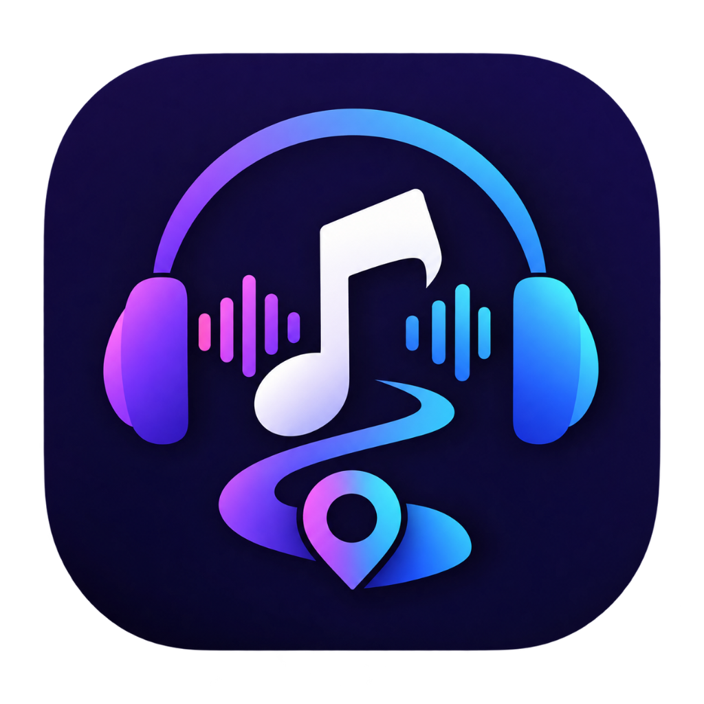

<div align="center">
  
  <h1>MelodyMap</h1>
  <p><strong>Your Music. Your Mood. Your Map.</strong></p>
  <p>A full-featured, local-first music streaming application with AI taste recommendations, 10-band studio equalizer, Spotify-style continuous background playback, and seamless lock screen controls.</p>

  <p>
    <a href="https://melodymap-pi.vercel.app" target="_blank">
      
    </a>
  </p>

  <p>
    
    
    
    
    
    
  </p>
</div>

---

## 🎧 Features

- **⚡ Zero-Failure Dual-Engine Streaming**: Intelligent audio pipeline that automatically pairs server-side streaming proxy with client-side direct YouTube audio fallback for 100% reliable, zero-buffer playback across local environments and serverless edge clouds (Vercel).
- **🎚️ Buttery Smooth Song Scrubbing & Dragging**: Fully draggable, pointer-captured scrub bars with live timestamp previews on both the docked bottom Mini Player and Full-Screen Player, featuring zero snapback and seamless auto-resume.
- **📱 Spotify-Like Lock Screen Controls**: Complete native Media Session API integration showing high-resolution album art, title, artist, live position scrubber, play/pause, and skip controls directly on Android, iOS, Windows, and macOS lock screens and notification shades.
- **🎵 Continuous Background Playback**: Screen-off background audio focus keeps music streaming without pauses when your screen locks or when switching between apps.
- **🎛️ 10-Band Studio Hardware Equalizer**: Studio-grade Web Audio API parametric biquad filters, genre presets (Bass Boost, Vocal, Rock, Pop, Jazz, Electronic), and dynamic range compression leveling (-14 LUFS).
- **❤️ 1-Click Fast Likes**: Save your favorite songs instantly with the 1-click heart button on the Mini Player, Full Screen Player, or Floating Player to automatically train your personalized AI recommendations.
- **🤖 AI-Powered Recommendation Engine**: Curates Daily Mixes, Mood Radios (focus, chill, workout, party, late night), and smart track suggestions that adapt to your listening habits.
- **💾 Offline Caching**: Download songs directly to local browser IndexedDB storage for full offline listening without an internet connection.
- **⏩ SponsorBlock Auto-Skip**: Detects and skips sponsored segments, non-music intros, and outros automatically.
- **📝 Real-Time Synced Lyrics**: Synchronized, word-for-word scrolling lyrics powered by LRCLIB.
- **☁️ Cloud Sync (Optional)**: Connect Supabase to sync your library, playlists, and listening history across all devices, or use local guest mode with zero setup.

---

## 🛠️ Tech Stack

| Layer | Technologies |
| :--- | :--- |
| **Framework** | [React 19](https://react.dev/), [TanStack Start](https://tanstack.com/start) (SSR & Server Functions via Nitro) |
| **Styling** | [Tailwind CSS 4](https://tailwindcss.com/), Radix UI Primitives, Lucide Icons |
| **Audio Pipeline** | Web Audio API (10-Band Biquad Filters), Media Session API, HTML5 Audio, YouTube IFrame API |
| **Catalog & Search** | Multi-source hybrid search aggregation with YouTube Music & Deezer |
| **PWA & Mobile** | Progressive Web App manifest, Service Worker v4 (network-first caching), Capacitor ready |
| **Database & Auth** | [Supabase](https://supabase.com/) (PostgreSQL + Row-Level Security, optional) |
| **Build & Tooling** | Vite 8, TypeScript 5, ESLint, Prettier |

---

## 🚀 Quick Start

### Prerequisites
- [Node.js](https://nodejs.org/) (v18 or higher recommended)
- `npm`

### Installation

```bash
# 1. Clone the repository
git clone https://github.com/Naresh63-hub/Musicplayer.git
cd Musicplayer

# 2. Install dependencies
npm install

# 3. Start local development server
npm run dev
```

The application will be running at **`http://localhost:3000`**.

---

## 📦 Building for Production

```bash
# Build client, SSR, and Nitro server bundles
npm run build

# Preview production build locally
npm run preview
```

---

## ☁️ Cloud Sync & Deployment (Optional)

MelodyMap is designed **local-first** and works right out of the box with **zero configuration required**. 

If you want cross-device cloud sync and Google OAuth authentication:
1. Create a free project at [Supabase](https://supabase.com/).
2. Run the SQL schema migrations in your Supabase SQL editor.
3. In your deployment platform (e.g. Vercel), add these Environment Variables:
   - `VITE_SUPABASE_URL`: `https://your-project.supabase.co`
   - `VITE_SUPABASE_ANON_KEY`: `your-supabase-anon-key`
4. Set Authorized Redirect URI in Google Cloud Console:
   - `https://<your-project-id>.supabase.co/auth/v1/callback`
5. Deploy!

---

## ⌨️ Keyboard Shortcuts

| Shortcut | Action |
| :--- | :--- |
| <kbd>Space</kbd> / <kbd>K</kbd> | Play / Pause |
| <kbd>→</kbd> / <kbd>←</kbd> | Seek Forward / Backward |
| <kbd>↑</kbd> / <kbd>↓</kbd> | Volume Up / Down |
| <kbd>N</kbd> / <kbd>P</kbd> | Next Track / Previous Track |
| <kbd>M</kbd> | Mute / Unmute Volume |
| <kbd>F</kbd> | Toggle Full-Screen Player |
| <kbd>E</kbd> | Open 10-Band Equalizer |
| <kbd>S</kbd> | Toggle Shuffle |
| <kbd>R</kbd> | Toggle Repeat |
| <kbd>/</kbd> | Focus Search Bar |
| <kbd>?</kbd> | Keyboard Shortcuts |

---

## ⚖️ Legal Note

MelodyMap streams audio by resolving publicly available stream URLs from third-party
platforms (YouTube, Deezer). It does not host, cache, or redistribute any media.
Using it may be subject to those platforms' Terms of Service — this project is for
personal, educational use and is not affiliated with or endorsed by YouTube or Deezer.

## 👤 Author

- **Naresh** ([@Naresh63-hub](https://github.com/Naresh63-hub))

---

## 📄 License

This project is open source and available under the [MIT License](LICENSE).
